# Pulso

> Multi-source news, structured public opinion, and personalized discovery without personalizing the facts.

Pulso is an experimental mobile platform that organizes multiple news publications into shared events and transforms public discussion into structured **Perspectives**, recurring arguments and counterpoints.

Instead of treating each publication as a separate feed item or organizing discussion as an endless comment section, Pulso is built around two ideas:

1. **Stories** consolidate coverage of the same event from multiple sources.
2. **The Pulse** structures how participating users position themselves and why.

> **News is the entry point. Understanding collective opinion is the product.**

---

## Product preview

<p align="center">
  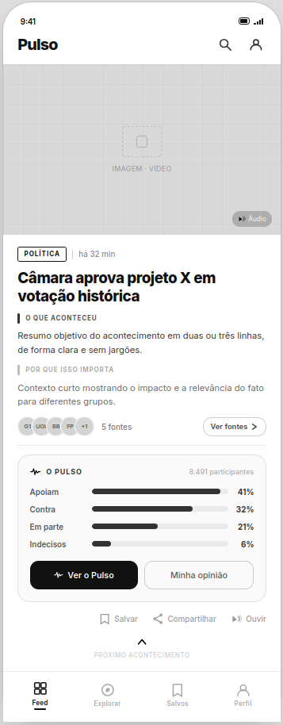
  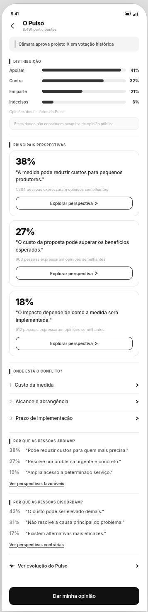
  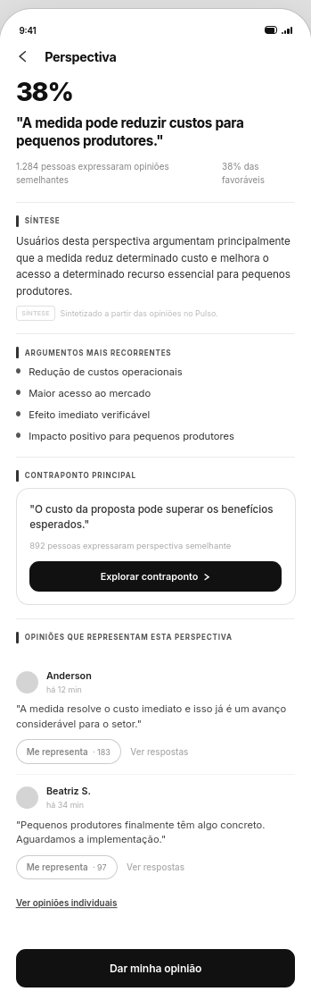
</p>

<p align="center">
  <sub>Low-fidelity wireframes. Visual design is still evolving.</sub>
</p>

More screens and UX decisions are documented in [`docs/ux`](docs/ux/README.md).

---

## Why Pulso?

Digital news consumption has a few recurring problems:

- several publications repeat coverage of the same event;
- headlines often provide little context;
- comparing multiple sources requires additional effort;
- factual information and opinion are frequently mixed;
- public discussion becomes fragmented across comment sections;
- popular reactions are easier to find than recurring arguments;
- relevant counterpoints can disappear under engagement-driven ranking;
- personalized feeds can narrow discovery without making that behavior clear.

Pulso approaches these problems by organizing information around **events**, preserving source access and structuring community discussion semantically.

---

## How it works

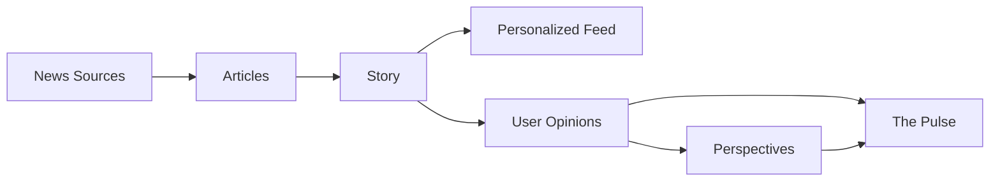

The platform has three main logical engines:

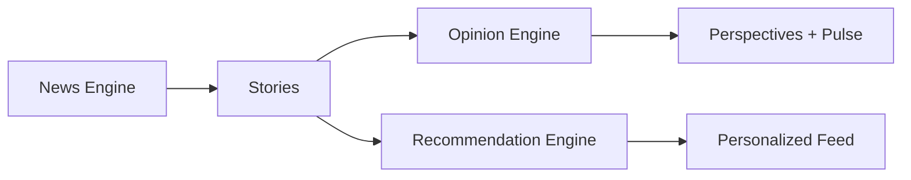

These engines are logical domain components of the same application. They are **not independent microservices**.

---

## News Engine

The News Engine turns individual publications into event-level Stories.

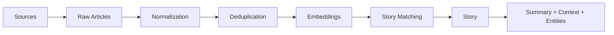

A fundamental domain rule is:

> **Article != Story**

An `Article` represents one publication from one source.

A `Story` represents the event described by one or more Articles.

Original sources remain accessible and support the factual layer of the Story.

See [ADR-0003](docs/adr/0003-article-not-equal-story.md).

---

## Opinion Engine

Pulso does not treat public discussion as a traditional chronological comment section.

Users publish an **Opinion** containing their current position and main argument.

Semantically related Opinions can then be organized into **Perspectives**.

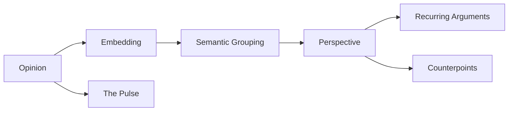

Another fundamental rule is:

> **Opinion != Perspective**

An `Opinion` is human-authored content.

A `Perspective` is a system-derived representation of recurring reasoning across multiple Opinions.

Individual Opinions remain available for transparency and nuance.

See [ADR-0006](docs/adr/0006-opinion-not-equal-perspective.md).

---

## The Pulse

The Pulse provides a structured view of how participating users currently position themselves around a Story.

Initial positions are:

```text
SUPPORT
OPPOSE
PARTIAL
UNDECIDED
```

The distribution follows a simple invariant:

> **One user, one active position, per Story.**

Replies, Perspective memberships and `Represents me` interactions do not create additional votes.


The Pulse describes **participating Pulso users**. It is not a statistically representative public opinion poll.

See [ADR-0007](docs/adr/0007-pulse-counts-unique-users.md).

---

## `Represents me`

Pulso avoids using a generic Like as the primary signal for arguments.

`Represents me` means:

> This argument adequately represents my view on this point.

A user may identify with several Perspectives while still contributing only one active position to the Pulse.

```text
Position
    ≠
Perspective
    ≠
Representation
```

---

## AI principles

AI and NLP are used to help:

- generate embeddings;
- identify semantic similarity;
- cluster Articles into Stories;
- cluster Opinions into Perspectives;
- extract entities and topics;
- summarize source-backed information;
- synthesize recurring arguments;
- identify possible counterpoints.

The core rule is:

> **Sources support the information. AI organizes, relates and summarizes it.**

AI-generated output is derived data.

It is not an independent factual source.

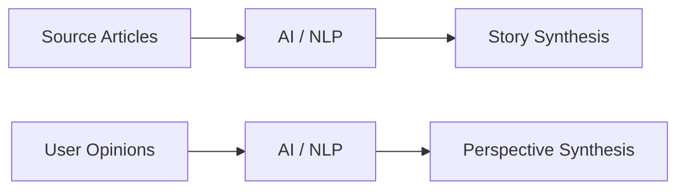

Original Articles and Opinions remain authoritative inputs.

See [ADR-0004](docs/adr/0004-ai-is-not-a-source.md).

---

## Recommendation principles

Pulso personalizes **discovery**, not the factual representation of an event.

Different users may receive different Story rankings:

```text
User A feed != User B feed
```

but when they open the same Story:

```text
Story X for User A = Story X for User B
```

The Recommendation Engine may influence:

- which Stories enter the feed;
- Story ordering;
- exploration;
- topic diversity.

It must not rewrite:

- Story facts;
- Story summaries according to user beliefs;
- source evidence;
- Pulse percentages;
- community Perspectives.

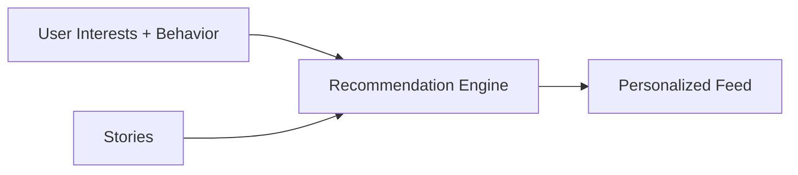

See [ADR-0008](docs/adr/0008-recommend-stories-not-truth.md).

---

## Architecture

Pulso starts as a **modular monolith with background workers**.

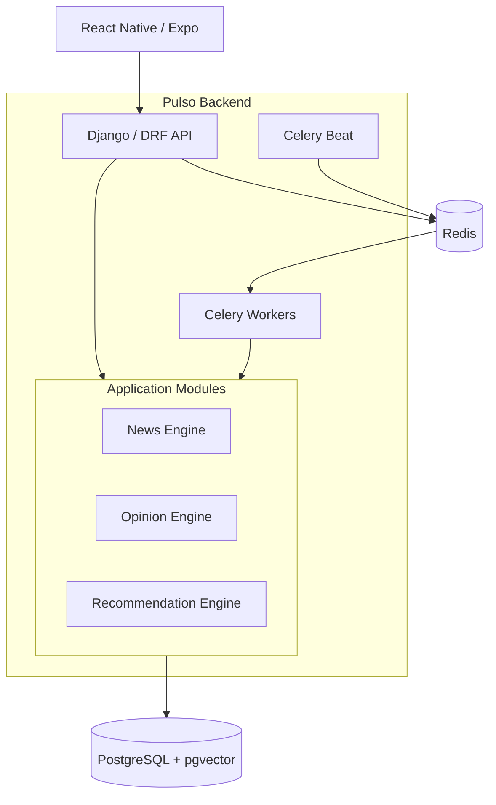

The API, workers and scheduler may execute as separate runtime processes while sharing the same application codebase and domain modules.

Heavy or retryable processing is moved outside the HTTP request lifecycle.

See:

- [ADR-0001 — Modular Monolith with Background Workers](docs/adr/0001-modular-monolith-with-workers.md)
- [ADR-0005 — Asynchronous Processing with Celery](docs/adr/0005-asynchronous-processing-with-celery.md)

---

## Data

PostgreSQL is the primary persistent datastore.

[`pgvector`](https://github.com/pgvector/pgvector) provides vector storage and similarity search without requiring a separate vector database during the initial architecture.

Vector use cases include:

- Article → Story similarity;
- Opinion → Perspective similarity;
- Story recommendation;
- user-interest representations.

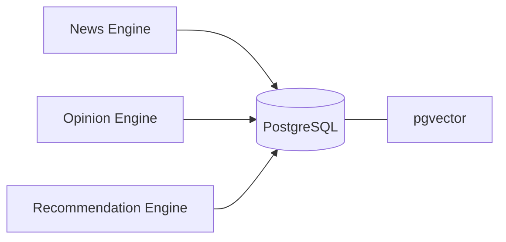

See [ADR-0002](docs/adr/0002-postgresql-pgvector.md).

---

## Technology direction

### Mobile

- React Native
- Expo
- TypeScript

### Backend

- Python
- Django
- Django REST Framework

### Data

- PostgreSQL
- pgvector
- Redis

### Background processing

- Celery
- Celery Beat

### AI / NLP

The architecture is designed to support local and external implementations through explicit application boundaries.

Initial experimentation is expected to include open-source embedding and NLP models.

### Infrastructure

- Docker
- Docker Compose
- GitHub Actions

The project follows a **free-first** approach: local development should not require paid infrastructure or mandatory commercial AI APIs.

---

## Architecture decisions

Major architectural and domain decisions are documented as ADRs.

| ADR | Decision |
| --- | --- |
| [ADR-0001](docs/adr/0001-modular-monolith-with-workers.md) | Modular Monolith with Background Workers |
| [ADR-0002](docs/adr/0002-postgresql-pgvector.md) | PostgreSQL with pgvector |
| [ADR-0003](docs/adr/0003-article-not-equal-story.md) | Article != Story |
| [ADR-0004](docs/adr/0004-ai-is-not-a-source.md) | AI Is Not a Source of Truth |
| [ADR-0005](docs/adr/0005-asynchronous-processing-with-celery.md) | Asynchronous Processing with Celery |
| [ADR-0006](docs/adr/0006-opinion-not-equal-perspective.md) | Opinion != Perspective |
| [ADR-0007](docs/adr/0007-pulse-counts-unique-users.md) | Pulse Counts Unique Users |
| [ADR-0008](docs/adr/0008-recommend-stories-not-truth.md) | Recommendation Personalizes Discovery, Not Truth |
| [ADR-0009](docs/adr/0009-jwt-mobile-authentication.md) | JWT Bearer Authentication for the Mobile API |
| [ADR-0010](docs/adr/0010-article-identity-and-deduplication.md) | Article Identity and Deduplication |

ADRs describe **why** these decisions were made, which alternatives were considered and the conditions under which they may be revisited.

---

## Continuous integration

Every pull request and every push to `master` runs three GitHub Actions
checks, defined in [`.github/workflows/ci.yml`](.github/workflows/ci.yml)
and reusing the same commands documented in
[`backend/README.md`](backend/README.md) and
[`mobile/README.md`](mobile/README.md):

| Check name | What it runs |
| --- | --- |
| `backend` | Ruff lint/format, Django system checks (dev and isolated test settings), migration-drift check, and the full pytest suite against a real disposable PostgreSQL/pgvector and Redis |
| `worker-smoke` | Compose configuration validation, then the real-broker Celery smoke check (`pytest -m celery_smoke`) against a separately running worker process, not eager/local execution |
| `mobile` | `expo-doctor`, ESLint, Prettier, TypeScript and the Jest suite, from the committed lockfile |

These are the exact names to reference from **Settings → Branches → Branch
protection rules → Require status checks to pass** when enabling required
checks on `master` — a repository-settings change this workflow itself
never makes. All three run with `permissions: contents: read`, use only
disposable local services and the repository's own public example
configuration (no repository secrets, no paid service), and are bounded by
a per-job `timeout-minutes` plus each step's own internal bounds (Compose
`--wait-timeout`, the smoke test's own per-call result timeout).

---

## Local development

**[`docs/development.md`](docs/development.md)** is the single walkthrough
for running the whole Foundation locally from a clean checkout — backend,
PostgreSQL/pgvector, Redis, the Celery worker, optional Beat, the mobile
shell, quality/test commands, troubleshooting, and the issue → branch →
PR contribution workflow. `backend/README.md` and `mobile/README.md`
remain the detailed per-stack references it links out to.

---

## UX documentation

The current interaction model and low-fidelity wireframes are available in:

[`docs/ux/README.md`](docs/ux/README.md)

The main exploration flow is:

```text
Feed
  ↓
Story
  ↓
The Pulse
  ↓
Perspective
  ↓
Arguments
  ↓
Counterpoint
  ↓
Individual Opinions
```

Opinion publication follows:

```text
Story
  ↓
Give my Opinion
  ↓
Position
  ↓
Argument
  ↓
Publish
```

---

## Project status

> **Current stage: Product design and architecture**

Pulso is currently defining and validating:

- domain boundaries;
- architectural decisions;
- UX flows;
- MVP scope;
- infrastructure foundations.

The wireframes represent the current product hypothesis and are not final visual design.

The repository should not be interpreted as a production-ready application at this stage.

---

## Roadmap

### Phase 0 — Foundation

- repository structure;
- backend bootstrap;
- mobile bootstrap;
- PostgreSQL + pgvector;
- Redis;
- Docker Compose;
- authentication foundation;
- CI;
- linting and tests.

### Phase 1 — News Core

- Source ingestion;
- RSS/API adapters;
- RawArticle persistence;
- Article normalization;
- deduplication.

### Phase 2 — Story Engine

- embeddings;
- semantic similarity;
- Article → Story grouping;
- Topics and Entities;
- source-grounded summaries.

### Phase 3 — Mobile Feed

- Story feed;
- Story details;
- source access;
- bookmarks;
- FeedImpressions.

### Phase 4 — Opinion Core

- positions;
- Opinions;
- replies;
- moderation;
- `Represents me`.

### Phase 5 — Opinion Engine

- Opinion embeddings;
- semantic Perspective grouping;
- recurring arguments;
- counterpoints;
- Pulse aggregation.

### Phase 6 — Recommendation

- interest profile;
- behavioral signals;
- semantic ranking;
- exploration;
- diversity.

### Phase 7 — Pulse Evolution

- position history;
- Pulse snapshots;
- evolution views.

### Phase 8 — Production / Demo

- observability;
- deployment;
- performance validation;
- public demo.

---

## MVP

The MVP should allow a user to:

1. create an account and select interests;
2. receive a feed organized by multi-source Stories;
3. understand what happened and inspect original sources;
4. open the Pulse for a Story;
5. explore Perspectives and counterpoints;
6. publish a position and argument;
7. see Opinions organized into recurring Perspectives;
8. use `Represents me`;
9. receive progressively personalized Story discovery.

The automated path should support:

```text
Article
   ↓
Story
   ↓
Opinion
   ↓
Perspective
   ↓
Pulse
```

without requiring mandatory manual editorial intervention.

---


## Core invariants

```text
Article != Story

Opinion != Perspective

Position != Perspective

AI != Source

One user = one active position per Story

"Represents me" != vote

Recommendation != factual personalization
```

These constraints are intentional parts of the product and domain model, not implementation accidents.

---

## License

License information will be added before the first public release.