# ADR-0001 — Modular Monolith with Background Workers

- **Status:** Accepted
- **Date:** 2026-09-14
- **Decision owners:** Pulso maintainers

## Context

Pulso contains multiple areas with distinct responsibilities:

- news ingestion and normalization;
- article deduplication;
- Story clustering;
- NLP and AI processing;
- public opinion processing;
- Perspective generation;
- recommendation;
- moderation;
- notifications.

Some workloads are request-driven, while others are computationally expensive, asynchronous or scheduled.

Examples include:

- polling RSS feeds and external APIs;
- generating embeddings;
- semantic similarity calculations;
- clustering Articles into Stories;
- clustering Opinions into Perspectives;
- generating source-grounded summaries;
- rebuilding Perspectives;
- recalculating the Pulse;
- updating recommendation signals.

The system therefore needs clear domain boundaries and asynchronous processing without introducing unnecessary distributed-system complexity during its initial development.

Pulso is currently a new product with:

- a small development team;
- no demonstrated need for independent service scaling;
- no established production traffic patterns;
- a free-first infrastructure requirement;
- a strong requirement for local development and reproducibility.

Starting with microservices would introduce concerns such as service discovery, distributed tracing, network failure handling, multiple deployments, inter-service authentication and distributed data consistency before the product has demonstrated a concrete need for them.

At the same time, executing all workloads synchronously inside HTTP requests would make expensive or long-running operations directly affect API latency and reliability.

---

## Decision

Pulso will initially be implemented as a:

> **Modular Monolith with Background Workers**

The backend will remain a single application codebase with explicit module boundaries.

The main domain capabilities remain logical components inside the monolith:

- News Engine;
- Opinion Engine;
- Recommendation Engine;
- Accounts;
- Moderation;
- Notifications.

The engines are **not independent microservices**.

They are logical domain components that share the same application codebase and primary persistence infrastructure.

---

## Runtime model

The application runs through multiple runtime processes while remaining part of the same application architecture.

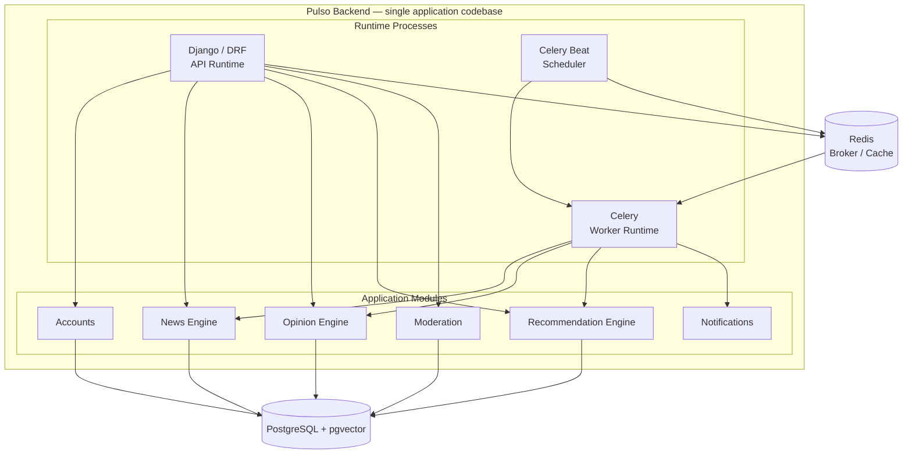

HTTP-facing operations remain in the API runtime.

Long-running, scheduled or computationally intensive operations are delegated to background workers.

Initial asynchronous processing uses **Celery**, with **Redis** as the task broker.

---

## Module boundaries

Modules expose explicit application interfaces.

A module must not directly manipulate another module's internal implementation details.

### Dependency direction

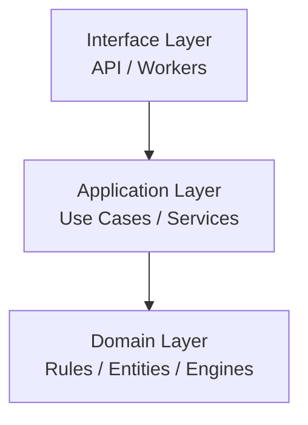

The dependency direction always points toward the domain.

### Infrastructure isolation

Infrastructure concerns are accessed through abstractions when appropriate.

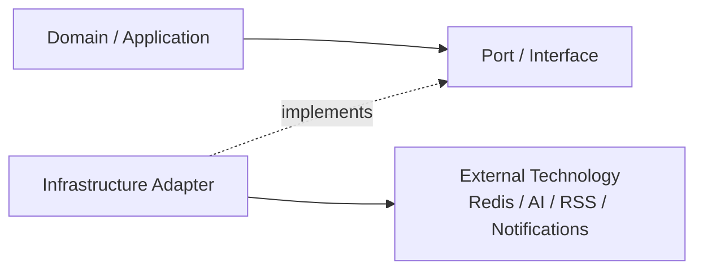

Domain logic must not require direct knowledge of:

- Django REST Framework;
- Celery;
- Redis;
- external AI providers;
- RSS libraries;
- notification providers.

Celery tasks act primarily as execution adapters that invoke application services rather than containing core domain rules themselves.

---

## Background processing

The distinction between synchronous and asynchronous execution is part of the architecture.

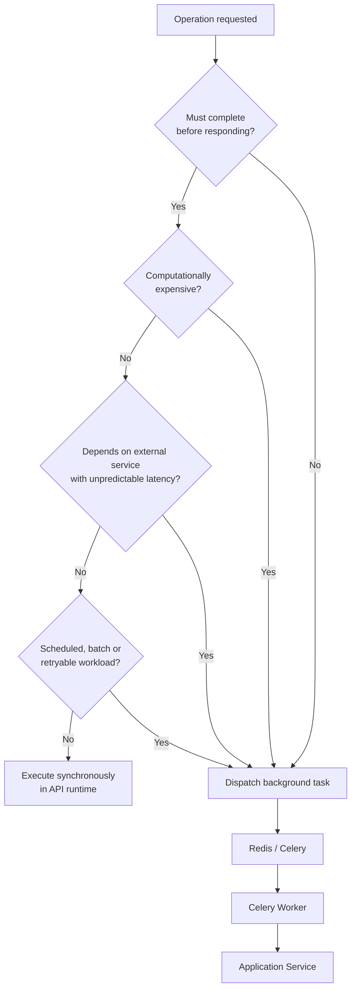

Typical asynchronous workloads include:

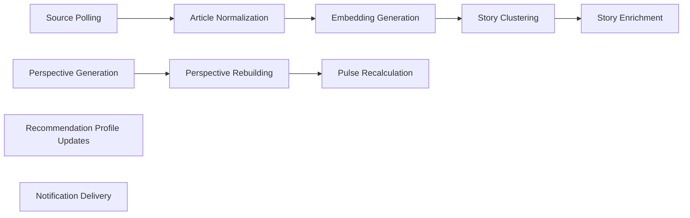

Operations required to immediately satisfy an HTTP request remain synchronous unless there is a concrete reason to delegate them.

---

## Data ownership

The initial architecture uses a single PostgreSQL database.

Domain boundaries represent **logical ownership**, not independent physical databases.

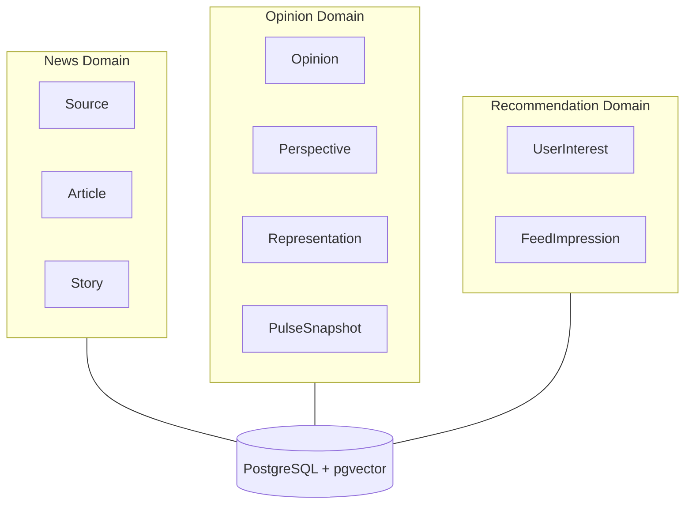

The database is shared physically while ownership remains separated logically.

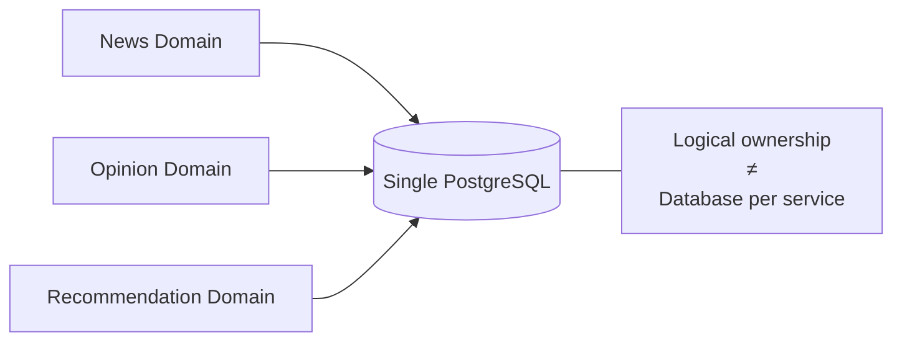

A future architectural decision may introduce stronger physical isolation when operational requirements justify it.

Database-per-service is explicitly out of scope for the initial architecture.

---

## Alternatives considered

### Alternative A — Microservices from the beginning

Each major capability could be implemented as an independently deployed service.

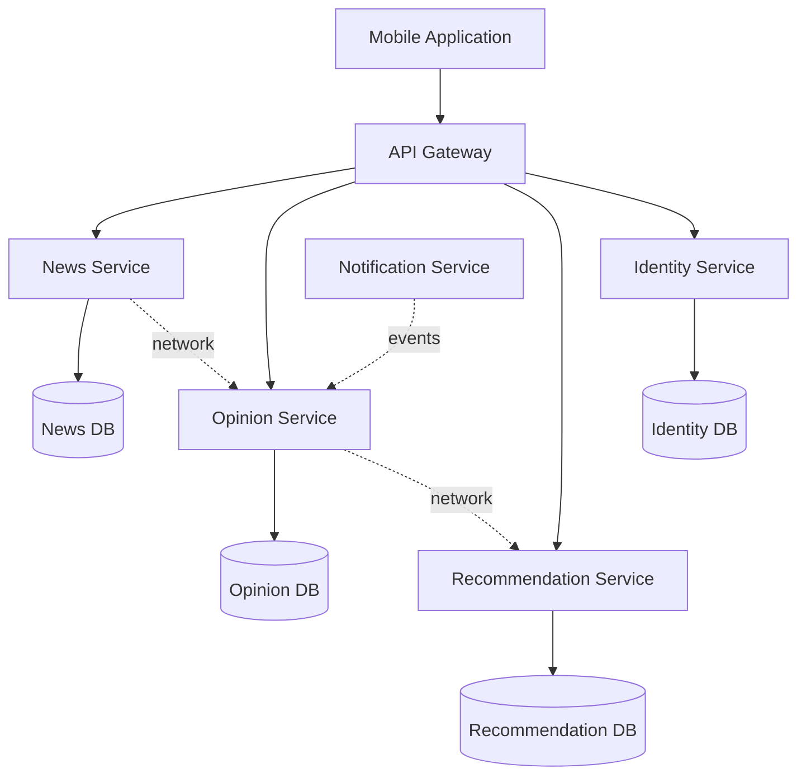

#### Advantages

- independent deployment;
- independent scaling;
- stronger runtime isolation;
- technology choices per service;
- explicit network boundaries.

#### Reasons for rejection

The initial product does not yet have evidence that these benefits outweigh the additional complexity.

This approach would require managing:

- service discovery;
- distributed tracing;
- network failures;
- API compatibility between services;
- distributed authentication;
- deployment orchestration;
- duplicated infrastructure;
- eventual consistency across services;
- more complex local development.

The architecture should not pay these costs before a concrete requirement exists.

---

### Alternative B — Traditional synchronous monolith

All processing could happen inside the API runtime.

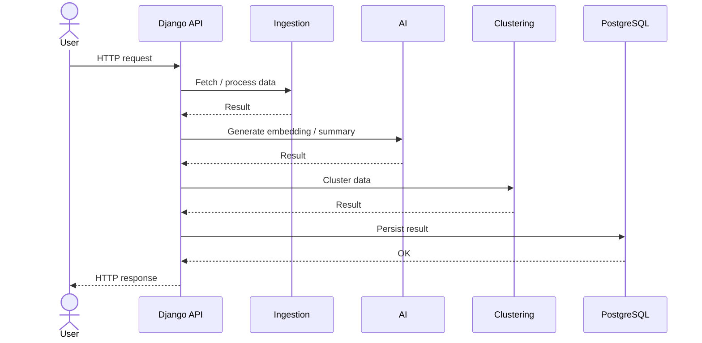

#### Advantages

- simplest deployment model;
- minimal infrastructure;
- straightforward debugging.

#### Reasons for rejection

Several Pulso workloads have unpredictable execution time and external dependencies.

The sequence above directly couples API response latency to ingestion, AI processing and clustering.

A failure or slowdown in those workloads would affect the user-facing request path.

---

### Alternative C — Modular Monolith without background workers

Domain boundaries could remain explicit while all execution occurs in the API process.

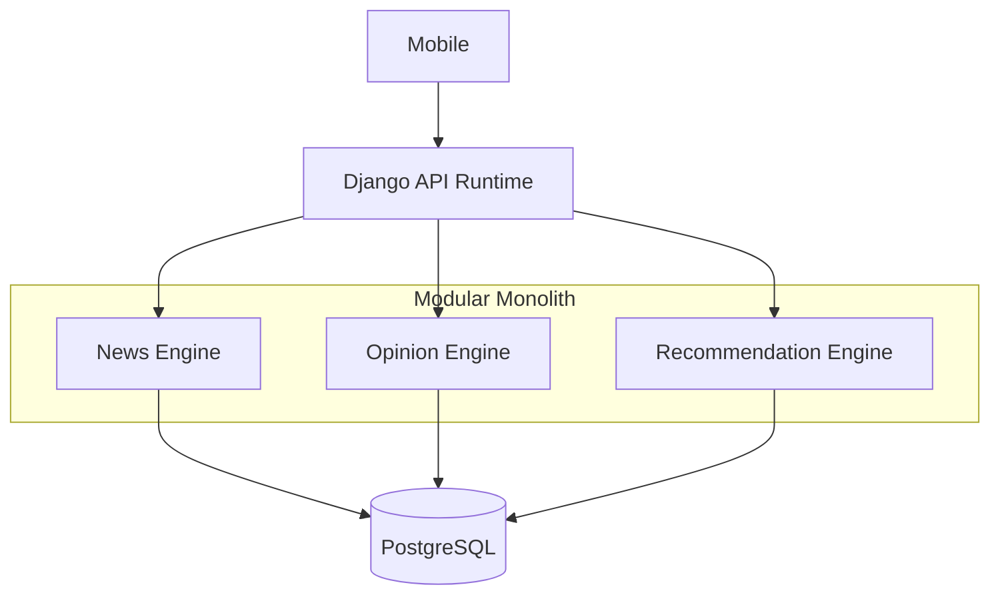

#### Advantages

- preserves domain boundaries;
- avoids queue infrastructure.

#### Reasons for rejection

This alternative does not address the different execution characteristics of Pulso's workloads.

The distinction between synchronous user operations and asynchronous processing is considered fundamental to the system.

---

## Decision comparison

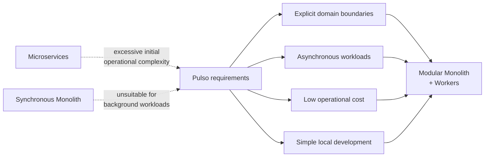

---

## Consequences

### Positive

- lower infrastructure complexity than microservices;
- easier local development;
- simpler deployments;
- easier transactions inside domain workflows;
- lower operational cost;
- suitable for the free-first requirement;
- explicit domain boundaries remain possible;
- asynchronous workloads do not block HTTP requests;
- workers can be scaled separately from the API runtime;
- the architecture can evolve incrementally.

### Negative

- all domains initially share the same deployment lifecycle;
- strong module boundaries depend partially on engineering discipline;
- modules share the same primary database;
- a poorly designed module can affect other parts of the monolith;
- independent scaling of specific domain components is limited compared with microservices;
- worker and API code must remain compatible because they share application modules.

---

## Architectural risks

The primary risk is allowing the modular monolith to degrade into an unstructured monolith.

### Undesired coupling

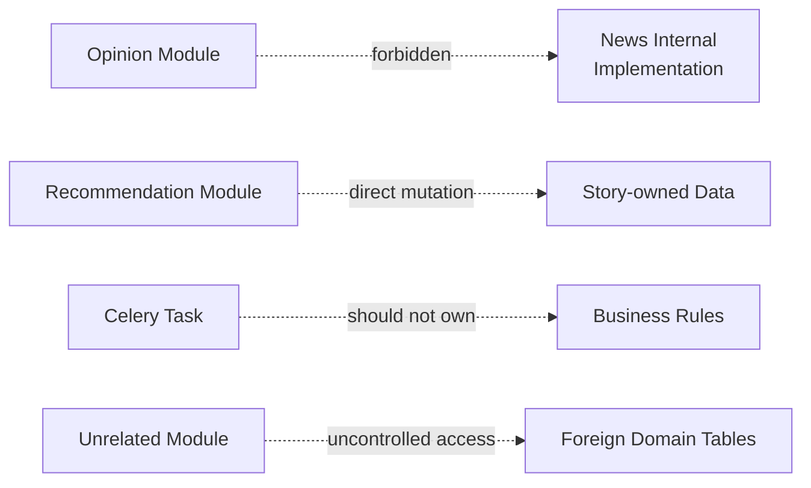

### Boundary enforcement

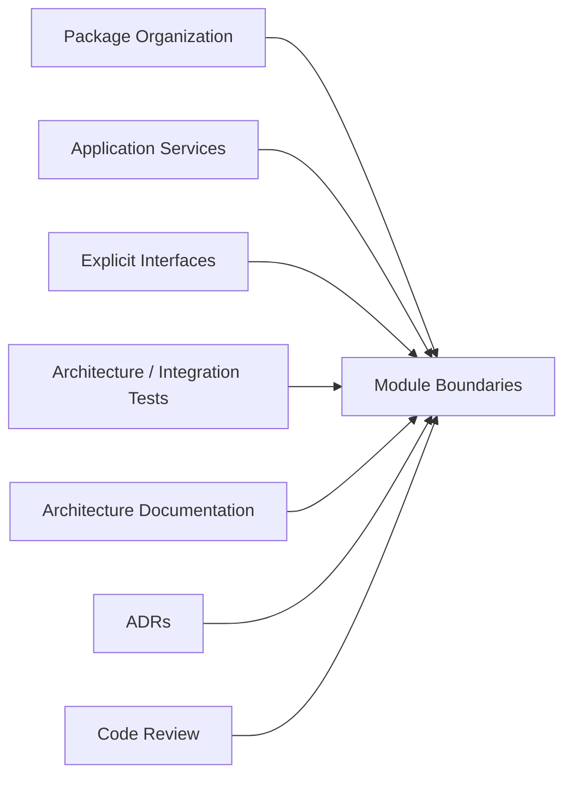

---

## Deployment implications

API, workers and scheduler may use the same application image or codebase while executing different commands.

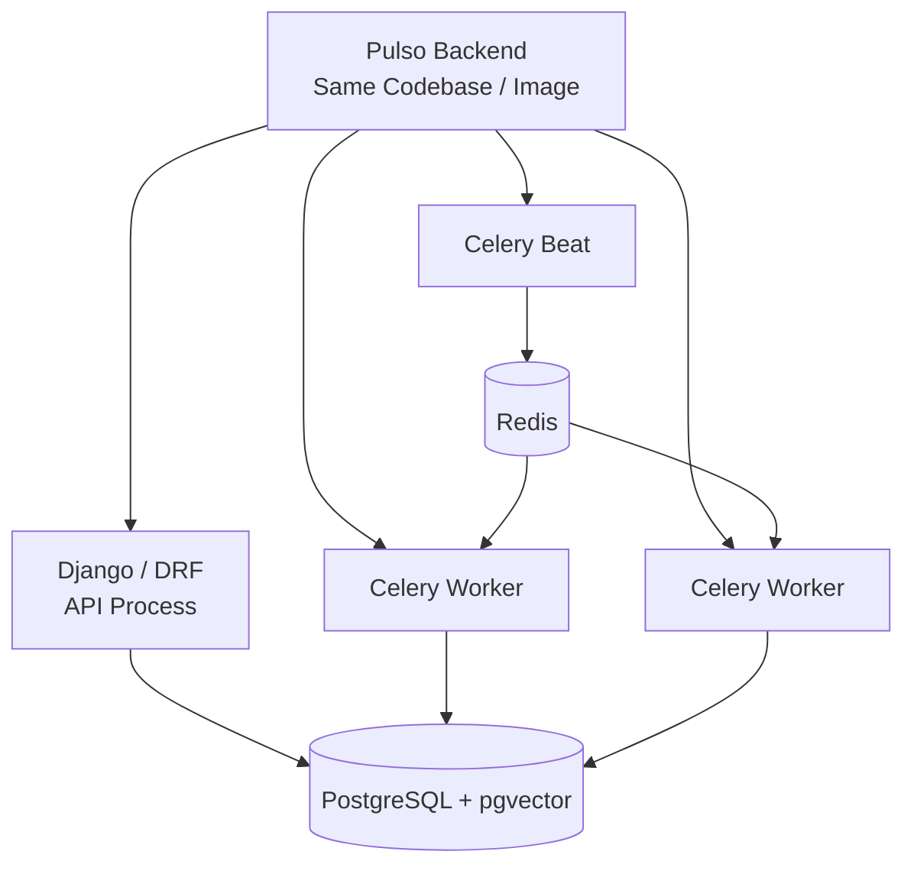

These are separate **runtime processes**, not separate domain services.

The distinction is:

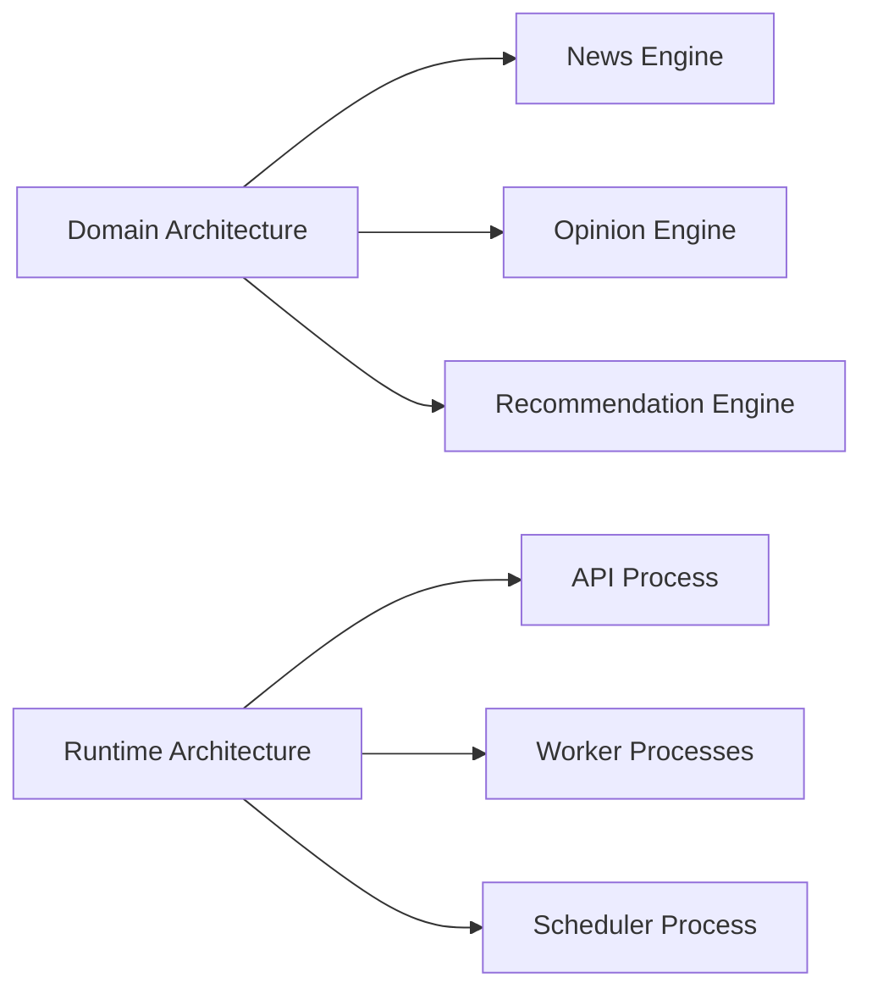

A logical Engine does not imply an independently deployed service.

---

## Evolution criteria

This decision does not prohibit future microservices.

Extraction must be driven by demonstrated operational requirements.

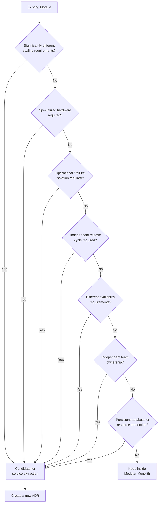

The existence of a logical Engine alone is **not** sufficient justification for creating a microservice.

---

## Non-goals

This ADR does not define:

- the internal design of the News Engine;
- the internal design of the Opinion Engine;
- the recommendation algorithm;
- the final deployment provider;
- the AI model or provider;
- database schema details;
- the event consistency strategy;
- the final queue topology.

Those decisions are documented separately when necessary.

---

## Decision summary

Pulso starts with a **modular monolith** to preserve simple deployment and explicit domain boundaries.

Background workers isolate asynchronous and computationally expensive processing from the HTTP lifecycle.

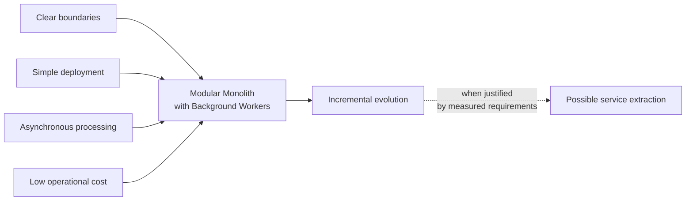

The architecture deliberately favors evolutionary distribution over premature distribution.