# ADR-0002 — PostgreSQL with pgvector for Relational and Vector Data

- **Status:** Accepted
- **Date:** 2026-09-14
- **Decision owners:** Pulso maintainers
- **Related:** [ADR-0001 — Modular Monolith with Background Workers](0001-modular-monolith-with-workers.md)

## Context

Pulso combines traditional relational data with semantic representations produced by embedding models.

The main relational concepts include:

- users;
- news sources;
- Articles;
- Stories;
- Topics;
- Entities;
- Opinions;
- Perspectives;
- Representations;
- Pulse snapshots;
- feed impressions;
- user interests.

At the same time, multiple parts of the system require vector similarity operations.

Initial use cases include:

- grouping semantically related Articles into Stories;
- comparing new Articles with existing Stories;
- grouping similar Opinions into Perspectives;
- finding Perspectives related to a new Opinion;
- identifying semantically related Perspectives and counterpoints;
- representing user interests as vectors;
- ranking Stories according to semantic affinity with a user;
- finding semantically related content.

Conceptually:

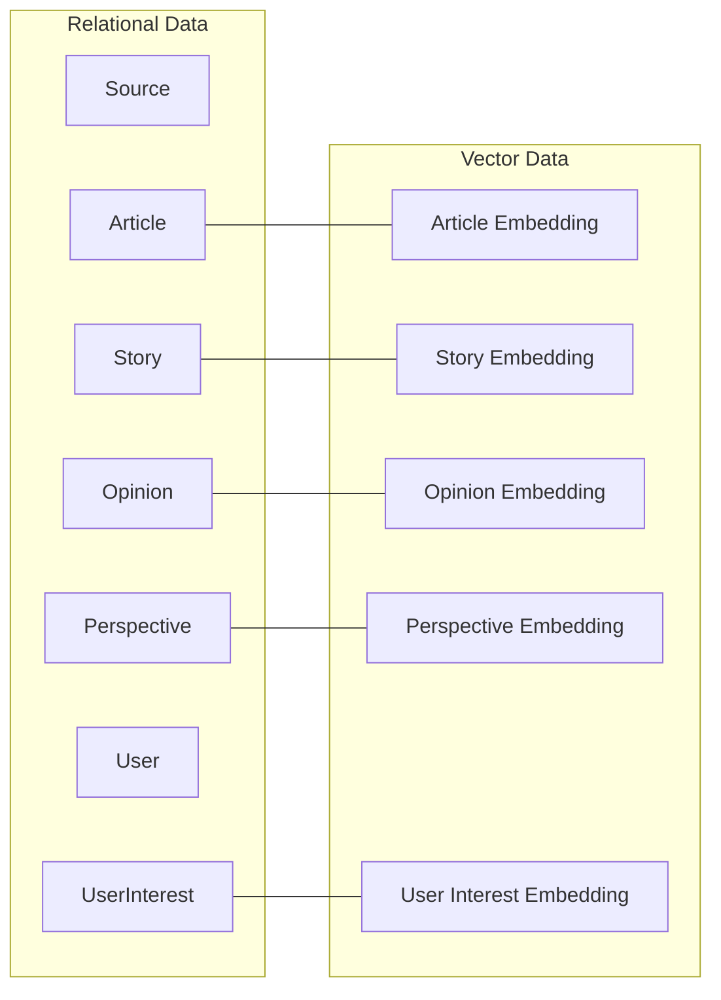

These vectors are not independent from the relational domain.

For example, an `Opinion` embedding only has meaning together with:

- the original Opinion;
- the user who created it;
- the associated Story;
- its declared position;
- its Perspective assignments.

Similarly, a `Story` embedding is associated with:

- Articles;
- Sources;
- Topics;
- Entities;
- timestamps;
- publication status.

Using separate persistence systems from the beginning would therefore introduce additional synchronization and operational concerns before the workload demonstrates a need for independent vector infrastructure.

Pulso also has a **free-first** requirement and should remain easy to execute locally.

---

## Decision

Pulso will use:

> **PostgreSQL as the primary database, with pgvector for vector storage and similarity search.**

PostgreSQL remains the authoritative persistent datastore.

The `pgvector` extension adds vector capabilities to the same database used by the relational model.

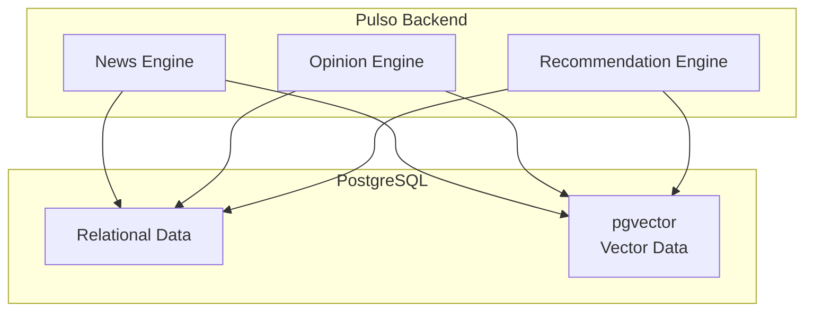

A dedicated vector database will **not** be introduced in the initial architecture.

---

## Why PostgreSQL

Pulso already requires a relational database for:

- referential integrity;
- transactions;
- constraints;
- user-generated content;
- relationships between Articles and Stories;
- relationships between Opinions and Perspectives;
- moderation data;
- recommendation signals;
- historical snapshots.

PostgreSQL provides these capabilities while remaining:

- open source;
- mature;
- widely supported;
- easy to run locally;
- compatible with Docker;
- suitable for the modular monolith architecture.

Adding pgvector allows semantic data to remain close to the relational data it describes.

---

## Vector use cases

### News Engine

Embeddings help identify whether a new Article belongs to an existing Story.

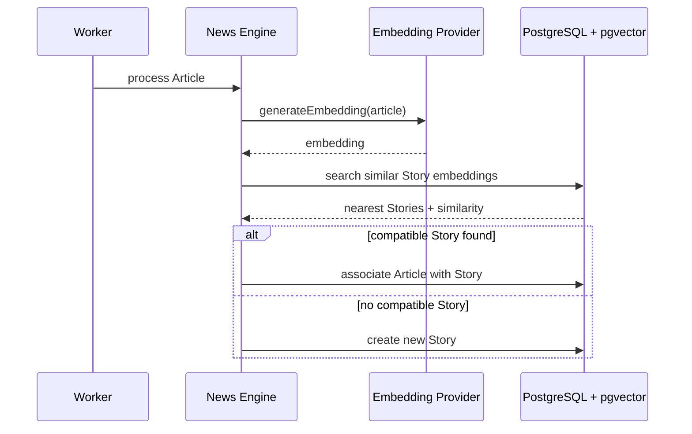

---

### Opinion Engine

Embeddings help associate a new Opinion with an existing Perspective or identify the need for a new one.

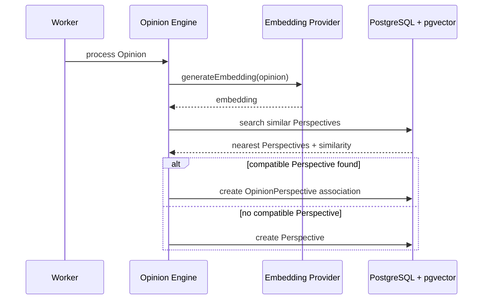

---

### Recommendation Engine

Story embeddings can be compared with a representation of user interests.

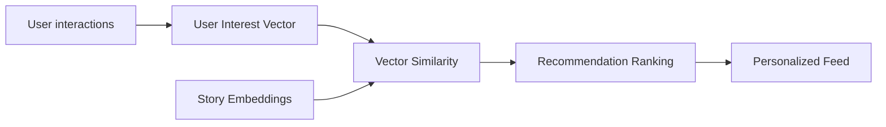

Vector similarity is one ranking signal and does not define the complete recommendation score.

Other signals may include:

- recency;
- topic affinity;
- engagement;
- exploration;
- diversity.

---

## Similarity model

The initial semantic use cases are expected to use **cosine similarity** where compatible with the selected embedding model.

Conceptually:

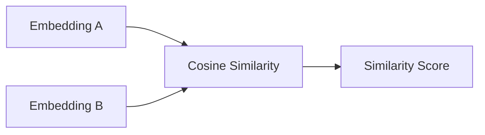

The exact:

- embedding model;
- vector dimension;
- similarity threshold;
- clustering strategy;

are not defined by this ADR.

Those values must be validated experimentally for each use case.

---

## Query model

Vector search remains combined with relational filtering.

For example, Perspective search may require both semantic and domain constraints.

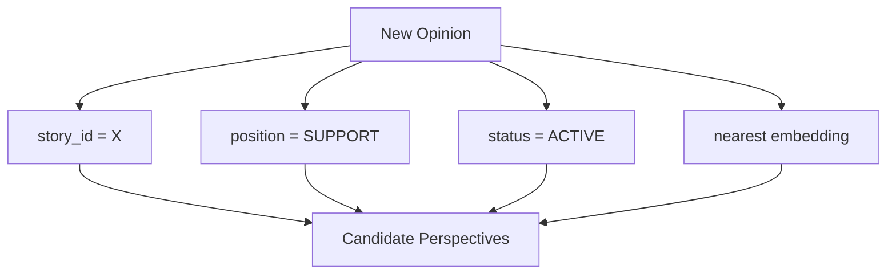

This is an important reason for keeping vector and relational data in the same database initially.

The application should be able to express queries similar to:

```sql
SELECT ...
FROM perspectives
WHERE story_id = :story_id
  AND position = :position
  AND status = 'ACTIVE'
ORDER BY embedding <=> :opinion_embedding
LIMIT :candidate_limit;
```

The exact query and schema may evolve during implementation.

---

## Indexing strategy

The architecture does not require approximate nearest-neighbor indexes from the first implementation.

The initial strategy is:

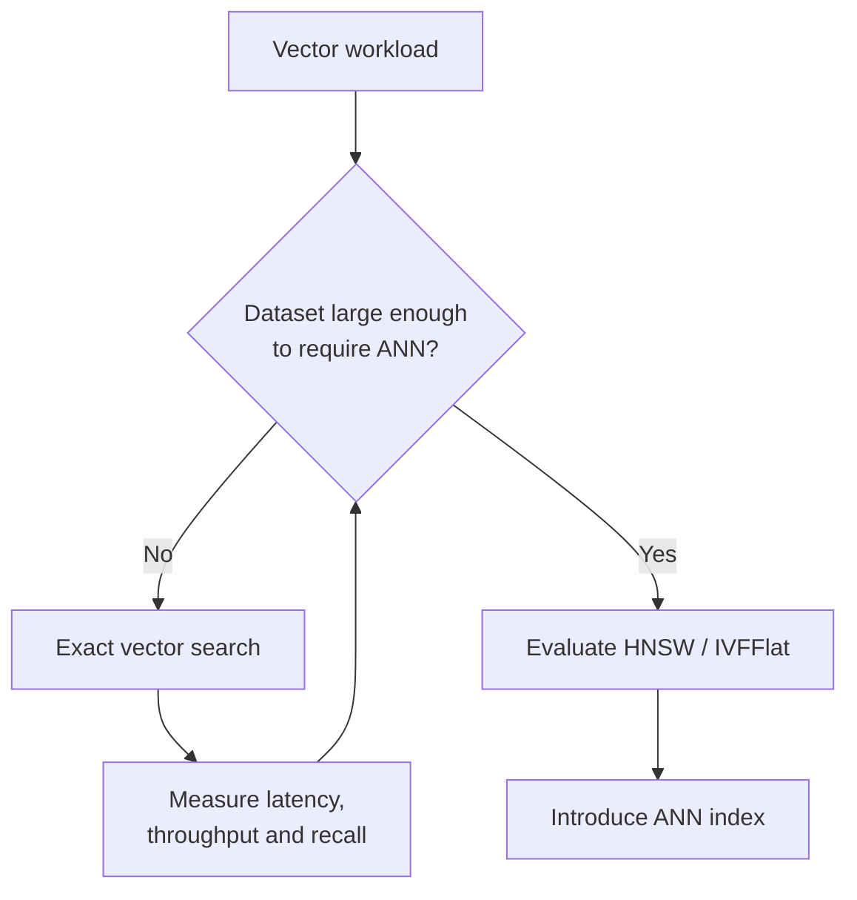

For small datasets, exact nearest-neighbor search may provide sufficient performance while keeping behavior predictable.

When measurements justify approximate search, pgvector indexes such as:

- HNSW;
- IVFFlat;

may be evaluated.

The index type must be selected using measured workload characteristics rather than assumed scale.

---

## Embedding lifecycle

Embeddings are derived data.

They can be regenerated from their authoritative source.

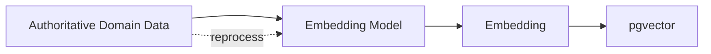

Examples:

```text
Article      → Article embedding
Story        → Story embedding
Opinion      → Opinion embedding
Perspective  → Perspective embedding
User signals → User interest embedding
```

The original domain data remains authoritative.

An embedding must never replace the underlying content.

---

## Embedding model versioning

Vectors generated by different embedding models are not assumed to be directly comparable.

The system must retain enough metadata to identify how an embedding was produced.

Conceptually:

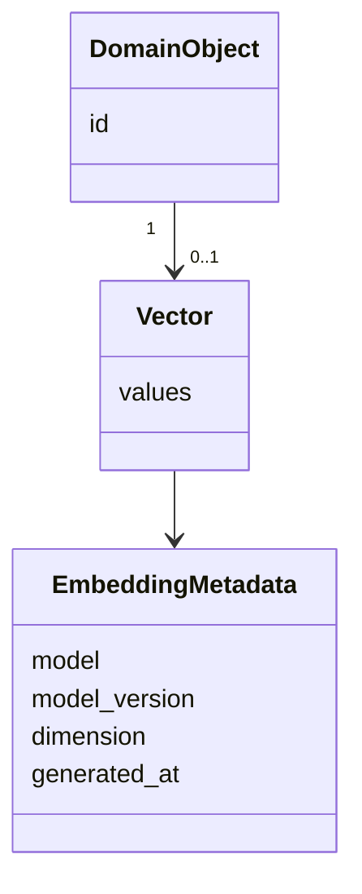

When an embedding model changes, affected vectors may require reprocessing.

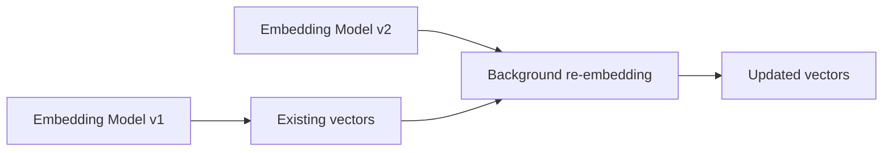

Re-embedding should be executed asynchronously through background workers.

The exact persistence model for embedding metadata is outside the scope of this ADR.

---

## Data ownership

PostgreSQL remains a single physical database during the initial architecture.

Vector storage follows the same logical ownership boundaries defined by the domain.

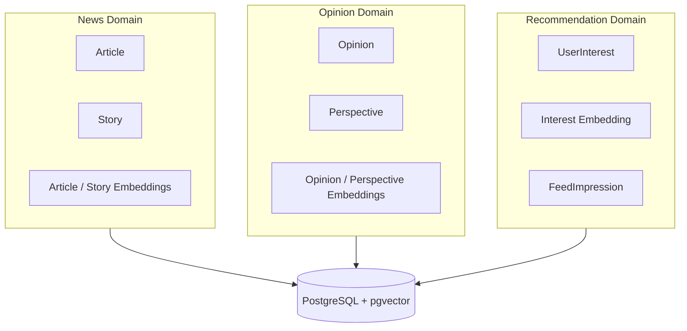

The existence of a shared physical database does not remove logical ownership.

For example:

- the Opinion Engine must not directly modify News-owned Story facts;
- the Recommendation Engine may read Story embeddings without owning Story persistence;
- embedding generation must respect the same module boundaries as other domain operations.

---

## Local development

The local environment must support the complete vector workflow without a managed external service.

Conceptually:

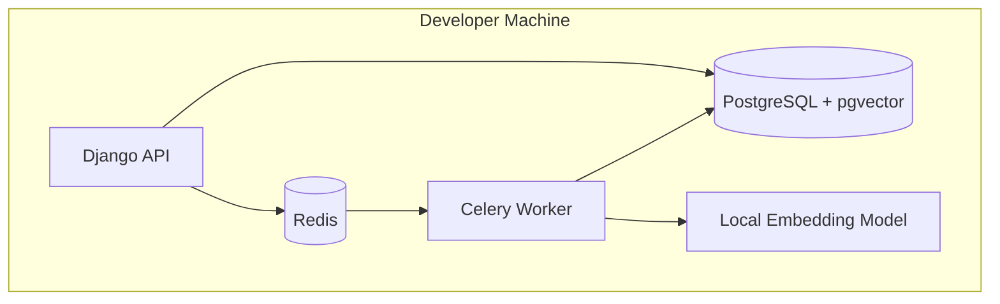

The pgvector extension is enabled in PostgreSQL:

```sql
CREATE EXTENSION IF NOT EXISTS vector;
```

The project should provide this setup automatically through its development infrastructure or database migrations/bootstrap process.

---

## Alternatives considered

### Alternative A — Dedicated vector database

A specialized vector database could be introduced from the beginning.

Examples include:

- Qdrant;
- Milvus;
- Weaviate;
- Pinecone;
- other vector-oriented systems.

Conceptually:

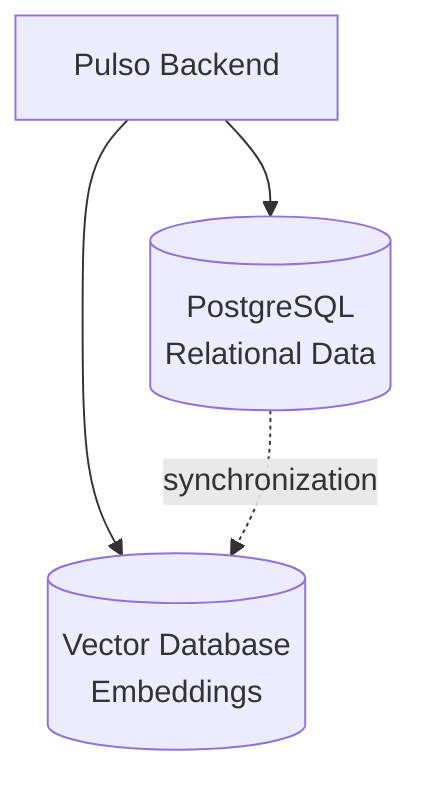

#### Advantages

- specialized vector search infrastructure;
- independent vector workload scaling;
- advanced vector-native features;
- stronger workload isolation;
- may perform better for very large vector datasets.

#### Reasons for rejection

The initial Pulso workload does not demonstrate a requirement for independent vector infrastructure.

Introducing another datastore would add:

- additional deployment infrastructure;
- data synchronization;
- consistency concerns;
- additional backup strategy;
- additional monitoring;
- another failure mode;
- more complex local development;
- more operational knowledge;
- possible managed-service cost.

Many Pulso vector queries also require relational filtering, making proximity between vector and relational data useful.

A specialized vector database may be reconsidered when measured requirements justify it.

---

### Alternative B — PostgreSQL without pgvector

Vectors could be stored outside PostgreSQL or semantic operations could initially be performed entirely in application memory.

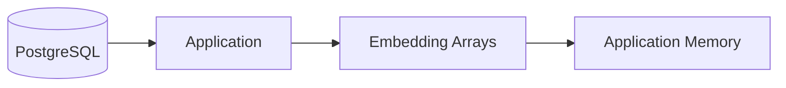

#### Advantages

- no PostgreSQL extension;
- minimal database-specific vector functionality.

#### Reasons for rejection

This approach would move similarity processing into application code and require loading candidate vectors into memory.

It would provide weaker support for:

- vector indexing;
- nearest-neighbor queries;
- relational filtering combined with similarity;
- efficient growth of the dataset.

pgvector provides these capabilities while preserving the existing PostgreSQL operational model.

---

### Alternative C — Search engine for semantic retrieval

A search engine such as Elasticsearch or OpenSearch could hold searchable documents and vector representations.

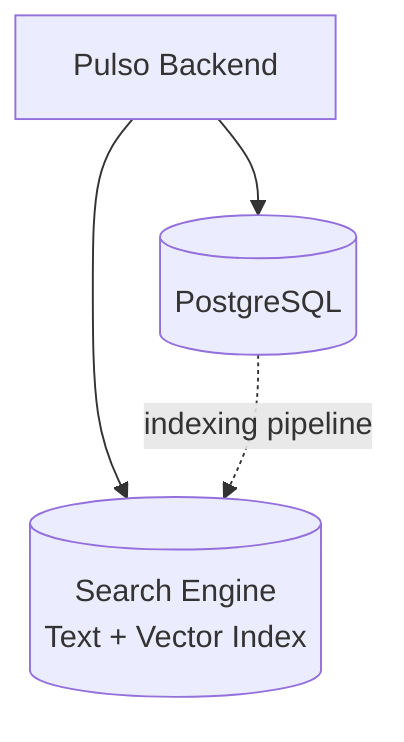

#### Advantages

- mature full-text search;
- hybrid text/vector search capabilities;
- dedicated search infrastructure;
- independent indexing and scaling.

#### Reasons for rejection

A dedicated search engine is not currently required by the MVP.

Adding one would introduce another distributed data copy and operational component.

If future requirements include advanced full-text or hybrid search at a scale that PostgreSQL cannot reasonably support, this alternative may be reconsidered in a separate ADR.

---

## Decision comparison

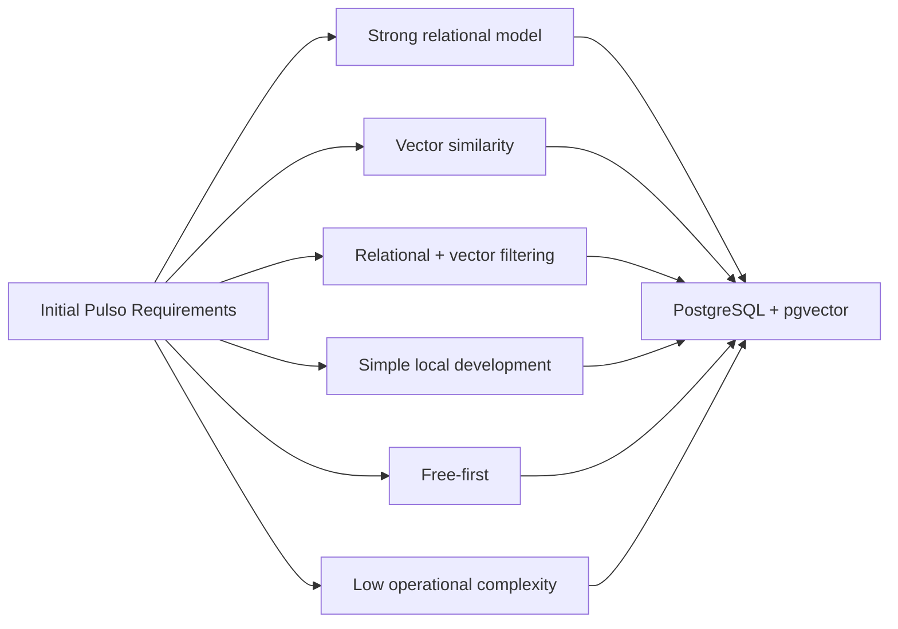

---

## Consequences

### Positive

- one primary persistence technology;
- vectors remain close to relational domain data;
- relational filters can be combined with semantic similarity;
- no additional vector database infrastructure;
- simple local development;
- compatible with the free-first requirement;
- existing PostgreSQL backup and operational processes include vector data;
- transactional workflows remain easier to manage;
- supports exact and approximate nearest-neighbor search;
- reduces synchronization concerns between relational and vector stores.

### Negative

- vector workloads share resources with transactional workloads;
- large vector indexes may increase memory and storage requirements;
- heavy similarity queries may affect PostgreSQL performance;
- PostgreSQL must be configured with the pgvector extension;
- vector scaling is tied to PostgreSQL during the initial architecture;
- embedding dimension and model changes require migration or reprocessing considerations;
- specialized vector databases may provide features not available through pgvector.

---

## Risks

### Database workload contention

Vector queries may eventually compete with transactional workloads.

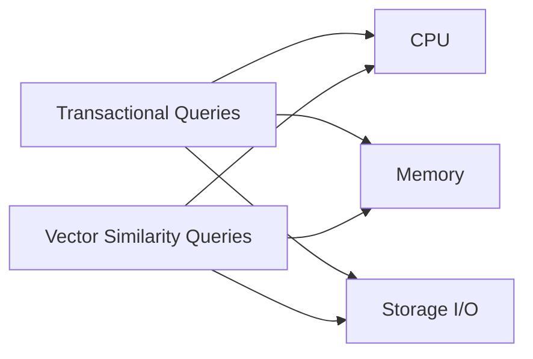

This risk should be addressed through measurement before introducing additional infrastructure.

Possible mitigations include:

- query optimization;
- indexes;
- candidate filtering;
- caching;
- read replicas when appropriate;
- workload-specific PostgreSQL tuning;
- moving vector search to dedicated infrastructure if justified.

---

### Embedding model replacement

Changing an embedding model may invalidate comparison with existing vectors.

Mitigation:

- record embedding model metadata;
- version embeddings;
- reprocess vectors asynchronously;
- avoid comparing vectors generated by incompatible models.

---

### Premature approximate indexing

Approximate indexes may improve latency while affecting recall and operational complexity.

Mitigation:

> Start with the simplest search strategy that satisfies measured requirements and introduce ANN indexes only after benchmarks justify them.

---

## Extraction criteria

Using pgvector initially does not mean Pulso must use it forever.

A dedicated vector/search system may become a candidate when there is evidence of:

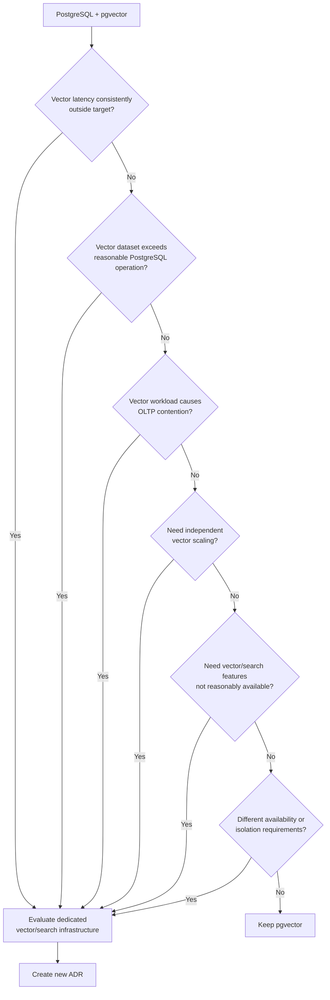

Any extraction must be justified by measurements and documented in a new ADR.

The mere presence of embeddings is **not** sufficient justification for introducing a dedicated vector database.

---

## Observability implications

Vector operations should expose metrics that make future architectural decisions measurable.

Initial relevant metrics include:

```text
vector_query_duration
embedding_generation_duration
vectors_generated
vector_query_candidates
story_similarity_query_duration
perspective_similarity_query_duration
recommendation_similarity_query_duration
vector_index_size
reembedding_jobs
reembedding_failures
```

The exact metric names may change during implementation.

---

## Non-goals

This ADR does not define:

- the final embedding model;
- vector dimensions;
- Story clustering thresholds;
- Opinion clustering thresholds;
- the recommendation formula;
- the Perspective clustering algorithm;
- the final ANN index;
- full-text search architecture;
- the physical schema for embedding metadata;
- production PostgreSQL sizing.

These decisions require implementation evidence or separate ADRs.

---

## Decision summary

Pulso requires both relational consistency and semantic similarity.

PostgreSQL already satisfies the system's relational requirements, while pgvector adds the vector operations required by the News, Opinion and Recommendation Engines.

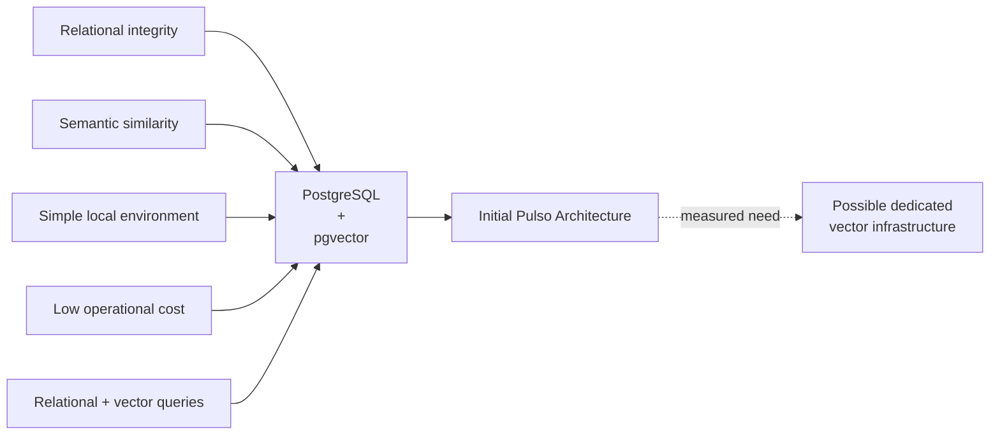

The architecture favors a **single operational datastore with vector capabilities** until real workload characteristics demonstrate the need for specialized vector infrastructure.