# ADR-0003 — Article != Story

- **Status:** Accepted
- **Date:** 2026-09-14
- **Decision owners:** Pulso maintainers
- **Related:**
  - [ADR-0001 — Modular Monolith with Background Workers](0001-modular-monolith-with-workers.md)
  - [ADR-0002 — PostgreSQL with pgvector for Relational and Vector Data](0002-postgresql-pgvector.md)

## Context

News platforms commonly organize content around individual publications.

A publisher produces an article, and that article becomes the unit displayed to the user.

Pulso follows a different product model.

The main unit consumed by the user is not a publication from one source.

It is the underlying **event or ongoing occurrence** described by multiple publications.

For example, several sources may publish independently about the same event:

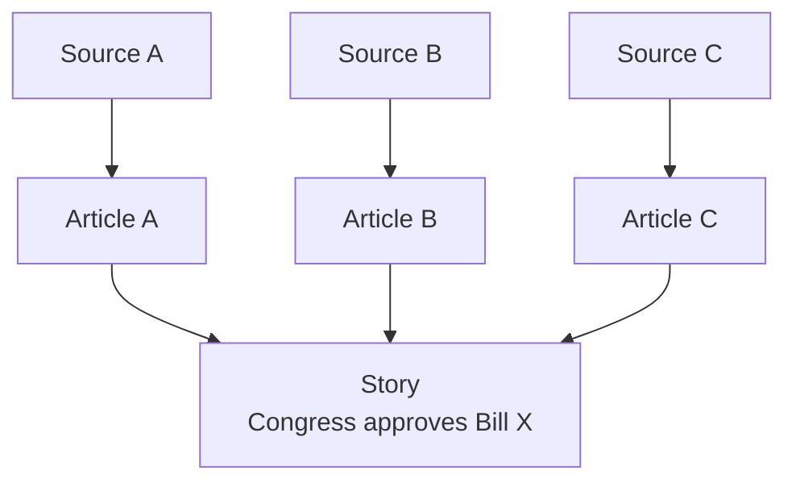

The individual publications remain important because they provide:

- provenance;
- source attribution;
- original text;
- publication timestamp;
- author information;
- source-specific framing;
- evidence for factual synthesis.

However, displaying each publication independently would reproduce one of the problems Pulso is intended to address:

> multiple pieces of content describing substantially the same event.

Pulso therefore requires two separate domain concepts:

- `Article`: a publication produced by a specific source;
- `Story`: a consolidated representation of an event described by one or more Articles.

---

## Decision

Pulso will model `Article` and `Story` as separate domain entities.

> **Article != Story**

An `Article` represents a publication.

A `Story` represents an event.

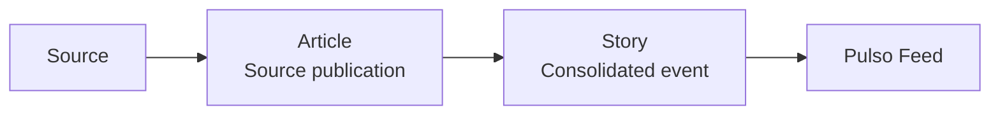

The feed is organized primarily around `Story`, not `Article`.

Articles remain accessible as the source material supporting a Story.

---

## Domain meaning

### Article

An `Article` represents content collected from an external source.

Typical attributes include:

```text
id
source_id
external_id
url
title
content
published_at
author
image_url
normalized_content
fingerprint
embedding
created_at
```

Its identity is associated with the publication itself.

Examples:

```text
Reuters publishes article A
Folha publishes article B
BBC publishes article C
```

These are three different Articles even when they describe the same event.

---

### Story

A `Story` represents an event reconstructed from one or more Articles.

Typical attributes include:

```text
id
title
summary
context
published_at
embedding
status
source_count
language
created_at
updated_at
```

Its identity represents the event rather than any individual publication.

For example:

```text
Article A ─┐
Article B ─┼──→ Story: "Congress approves Bill X"
Article C ─┘
```

---

## Relationship

The relationship between Articles and Stories must be explicit.

Conceptually:

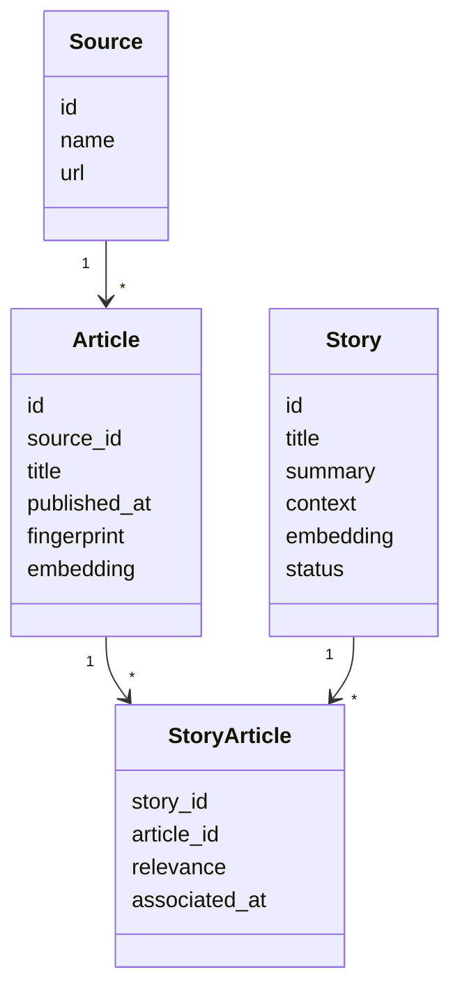

The persistence implementation may use a join table or equivalent association model.

A many-to-many relationship is allowed because a publication may contain information relevant to more than one event.

The initial implementation may impose stricter rules if empirical data shows that they are sufficient, but the conceptual model must not assume that an Article and a Story are the same entity.

---

## Lifecycle differences

Article and Story have different lifecycles.

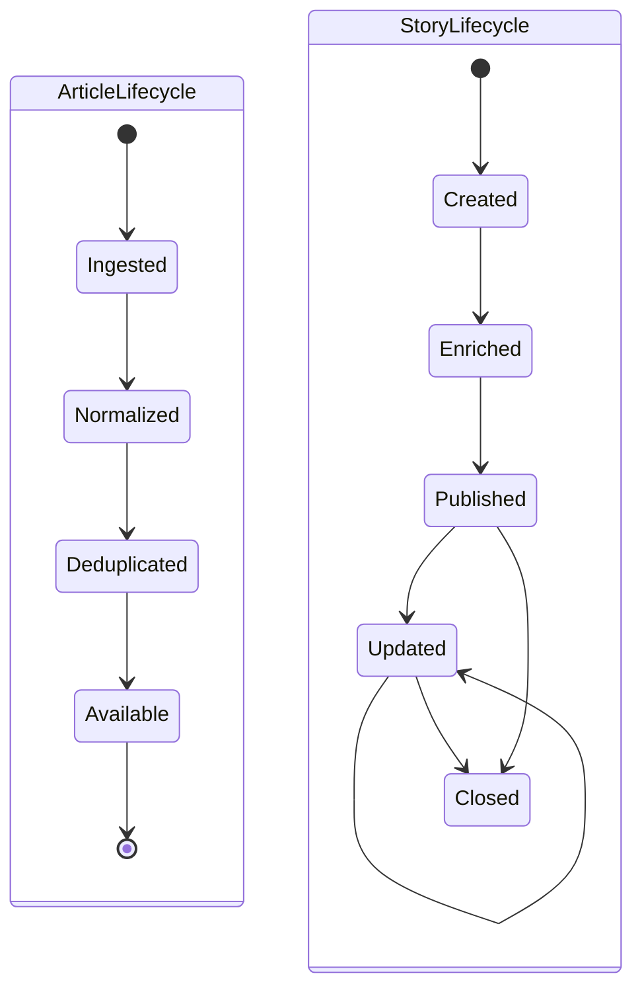

An Article is usually a historical record of a publication.

A Story can evolve as additional information becomes available.

For example:

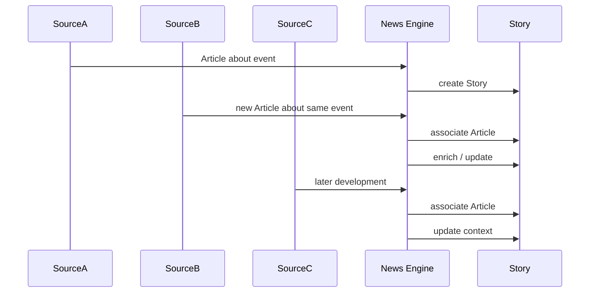

This difference in lifecycle is one of the primary reasons the entities must remain separate.

---

## News processing model

The News Engine transforms source publications into consolidated Stories.


Deduplication and Story clustering are distinct operations.

---

## Deduplication != Story clustering

Two Articles may be duplicates without merely being related.

Two Articles may also describe the same Story without being duplicates.

These concepts must not be conflated.

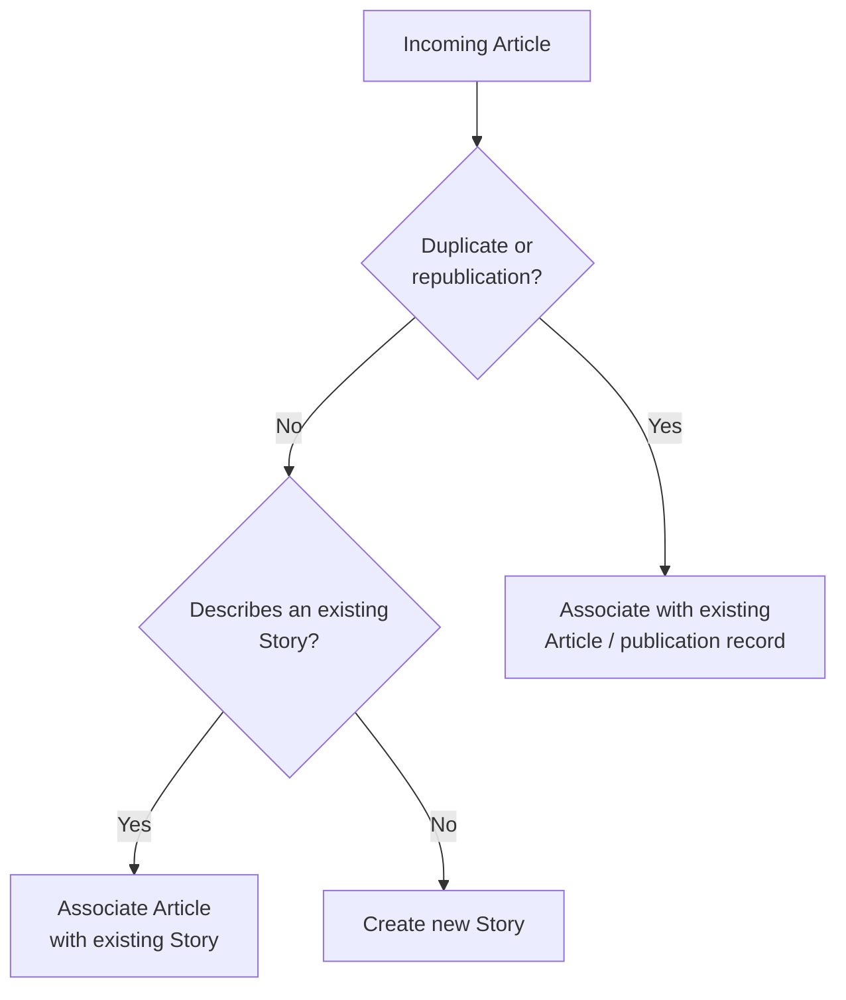

Example:

```text
Article A:
"Congress approves Bill X"

Article B:
"Congress approves Bill X"
```

If B is a syndicated or identical republication of A, it may be a duplicate.

However:

```text
Article A:
"Congress approves Bill X after 8-hour session"

Article B:
"Bill X passes with 312 votes"

Article C:
"Government reacts to approval of Bill X"
```

These publications are different Articles but may belong to the same Story.

---

## Story creation

A Story can initially be created from a single Article.

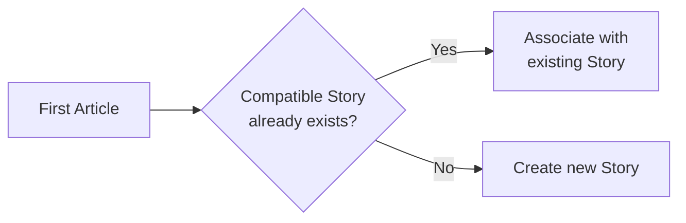

The distinction does not require multiple sources to exist before a Story can be created.

A Story may begin with:

```text
1 Article
```

and later evolve into:

```text
5 Articles
4 Sources
1 Story
```

---

## Story updates

New Articles may provide:

- additional facts;
- corrections;
- new entities;
- updated numbers;
- consequences;
- reactions;
- later developments.

The Story may therefore be recomputed or enriched.

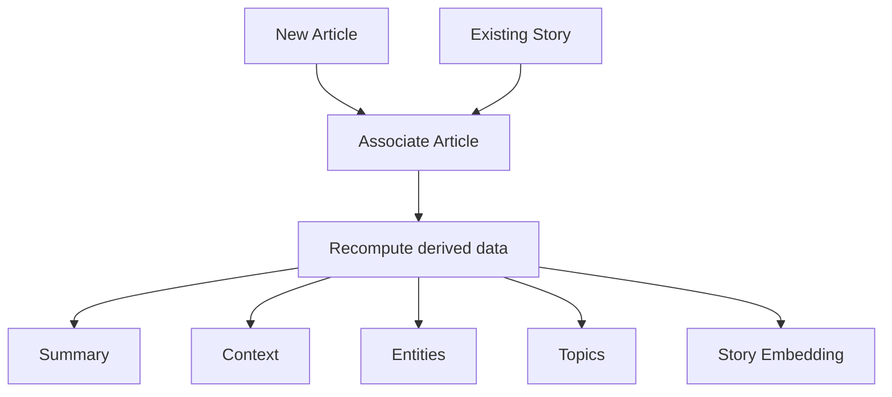

Updates to derived Story data must preserve traceability to the Articles used as inputs.

---

## Factual traceability

A Story does not become an independent factual source.

Its factual content is derived from associated Articles.

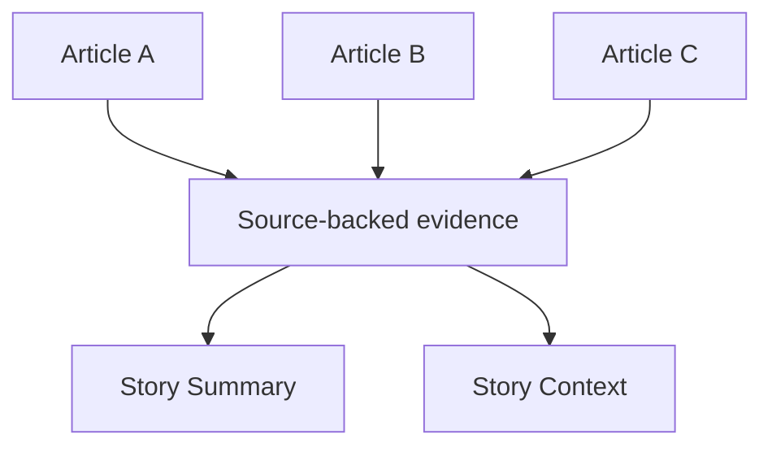

The relationship can be expressed as:

```text
Sources
   ↓
Articles
   ↓
Story synthesis
```

and not:

```text
AI
 ↓
Story facts
```

The Story layer organizes information but does not replace source provenance.

---

## Impact on the user experience

Users consume a Story first and access Articles as supporting sources.

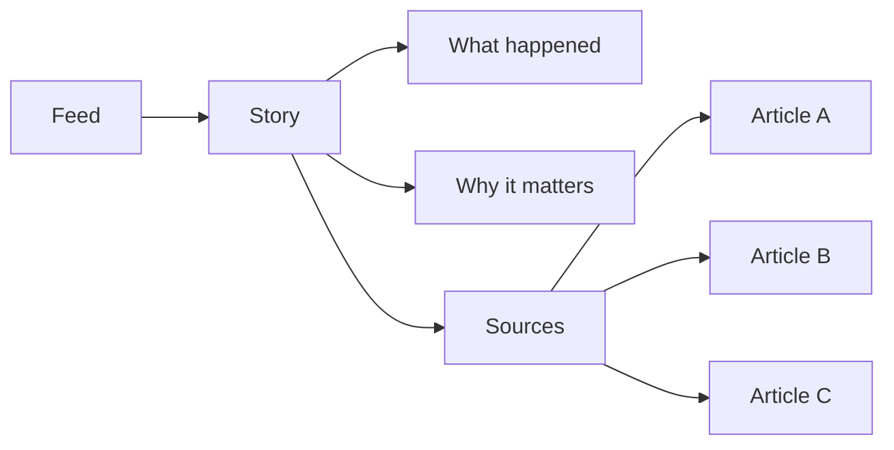

This allows the interface to reduce repetition without hiding the original publications.

---

## Impact on the Opinion Engine

Opinions are attached to the Story rather than to individual Articles.

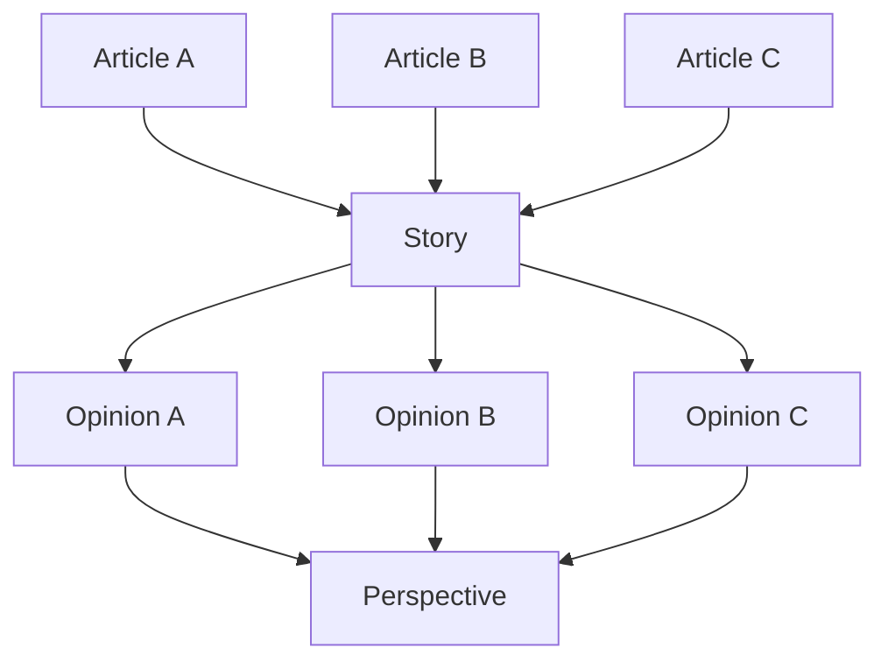

This is important because the public discussion should represent reactions to the underlying event rather than fragmenting discussion across multiple publications describing that event.

---

## Impact on recommendation

Recommendation operates primarily on Stories.

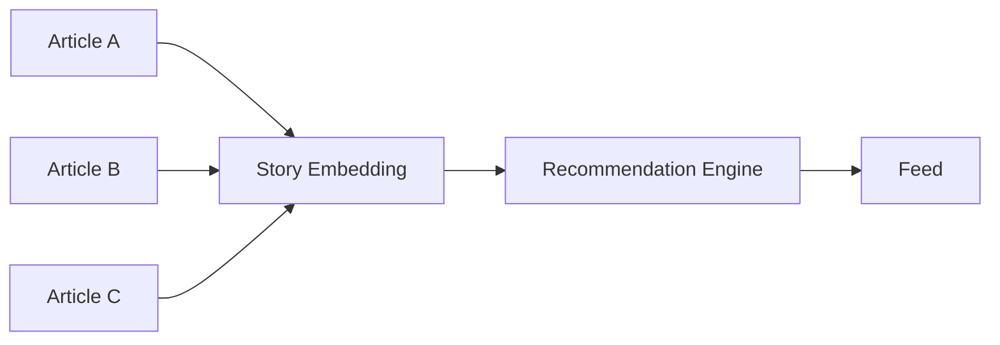

Without this separation, multiple publications about the same event could occupy several positions in the feed and artificially amplify one event.

For example:

```text
Without Story aggregation:

1. Source A — Event X
2. Source B — Event X
3. Source C — Event X
4. Source D — Event Y
```

With Story aggregation:

```text
1. Story X — 3 sources
2. Story Y — 1 source
```

This makes Story aggregation part of both the domain model and the recommendation strategy.

---

## Alternatives considered

### Alternative A — Article as the primary feed unit

The simplest model would expose Articles directly to the user.

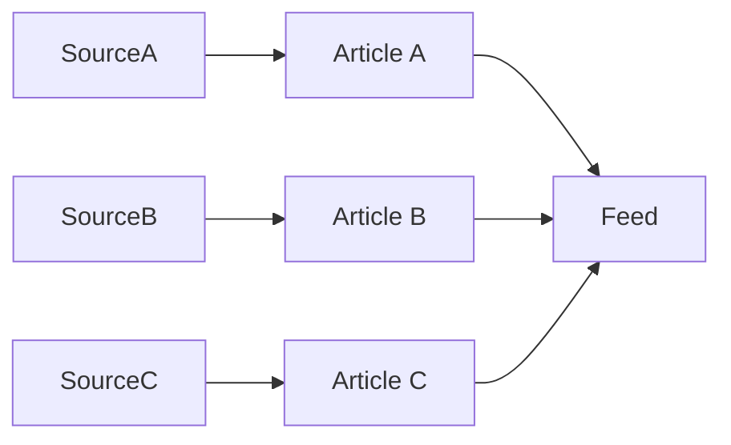

#### Advantages

- simpler data model;
- simpler ingestion pipeline;
- no Story clustering;
- no Story lifecycle;
- direct relationship between source and feed item.

#### Reasons for rejection

This model would preserve several problems Pulso is intended to solve:

- repetitive coverage of the same event;
- fragmented discussion;
- duplicated recommendation signals;
- no consolidated context;
- difficulty comparing sources;
- multiple feed items representing the same occurrence.

It would effectively make Pulso a news aggregator rather than an event-oriented information platform.

---

### Alternative B — Store Story fields directly on Article

An Article could contain derived fields such as:

```text
article.summary
article.context
article.topic
article.entities
```

and act simultaneously as publication and consolidated event.

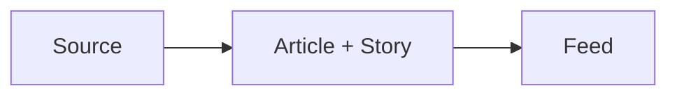

#### Advantages

- fewer entities;
- simpler persistence;
- no association table.

#### Reasons for rejection

This model combines two concepts with different:

- identities;
- lifecycles;
- provenance;
- update behavior;
- recommendation semantics.

It would also make multi-source synthesis difficult because the consolidated event would implicitly belong to one source publication.

---

### Alternative C — One Article belongs to exactly one Story

A strict one-to-many relationship could be enforced.

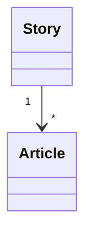

#### Advantages

- simpler persistence;
- easier queries;
- easier clustering assignment;
- no join entity required.

#### Reasons for not making this a domain invariant

Real publications may describe multiple relevant developments.

For example, one Article may simultaneously cover:

```text
a bill being approved
+
a minister resigning
+
a market reaction
```

Whether these belong to one or multiple Stories depends on the product's event granularity.

Therefore:

> one Article → one Story

may be used as an implementation simplification initially, but it will not be treated as a permanent domain invariant.

---

## Decision comparison

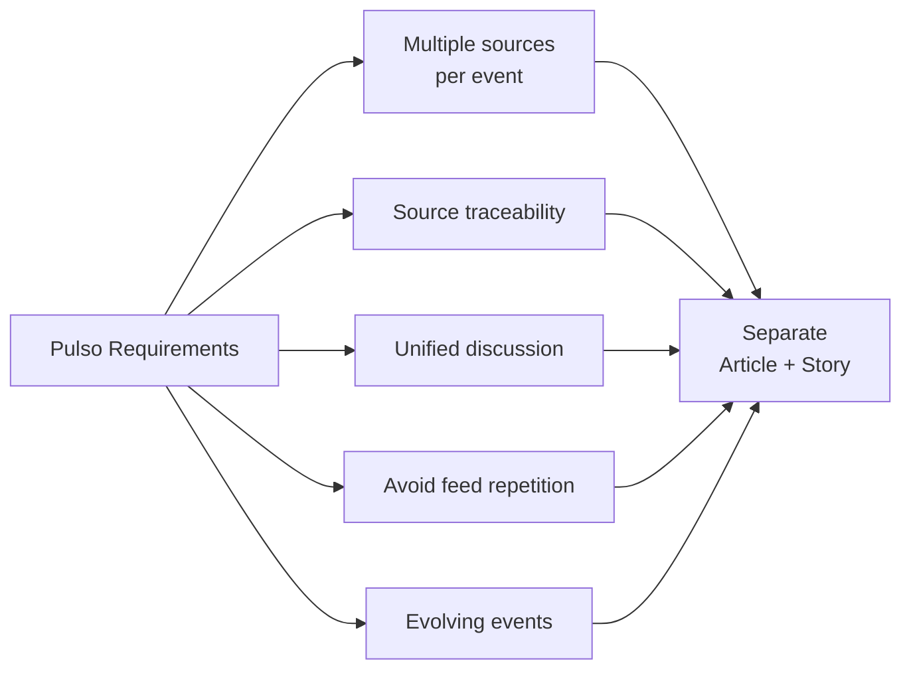

---

## Consequences

### Positive

- multiple sources can describe the same event;
- feed duplication is reduced;
- public discussion is consolidated around the event;
- source provenance remains explicit;
- Story summaries can use multiple sources;
- Stories can evolve independently from individual publications;
- recommendation operates on event-level semantics;
- Article ingestion remains independent from Story presentation;
- Story clustering can be improved without rewriting source data.

### Negative

- the data model becomes more complex;
- Story clustering is required;
- incorrect clustering may merge unrelated Articles;
- missed clustering may create duplicate Stories;
- Story lifecycle management becomes necessary;
- updates may require recomputing summaries and embeddings;
- Article-to-Story associations may need reprocessing;
- evaluation datasets are required to measure clustering quality.

---

## Risks

### False merge

Different events may be incorrectly grouped into the same Story.

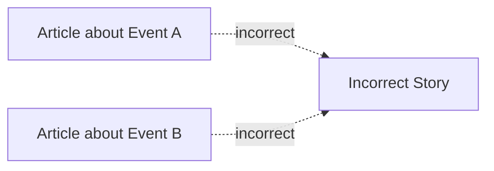

Possible mitigations include:

- semantic similarity;
- temporal proximity;
- entity overlap;
- topic constraints;
- threshold tuning;
- evaluation datasets;
- reprocessing support.

---

### False split

Articles describing the same event may be assigned to separate Stories.

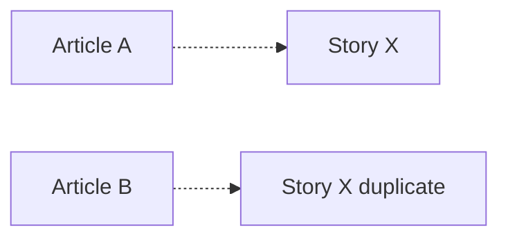

Possible mitigations include:

- duplicate Story detection;
- Story embeddings;
- periodic cluster reconciliation;
- merge operations;
- evaluation metrics.

---

### Story drift

A long-running Story may accumulate Articles until it represents several distinct events.

Example:

```text
Election campaign
       ↓
Election result
       ↓
Government formation
       ↓
First policy decision
```

Treating all developments as one Story would eventually reduce semantic coherence.

The News Engine must therefore consider:

- temporal boundaries;
- event granularity;
- semantic distance;
- major factual transitions.

The exact splitting strategy is outside the scope of this ADR.

---

## Reprocessing

Article-to-Story classification is derived information and must be reprocessable.

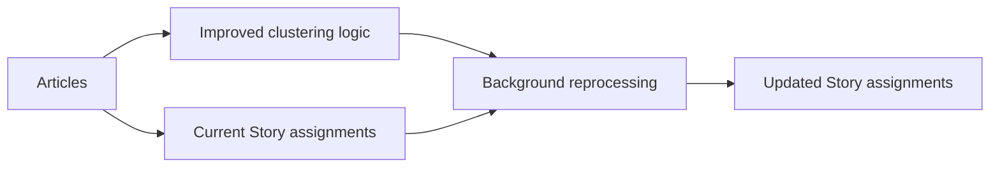

Reprocessing must not require rewriting or losing original Article content.

This is one reason the association between Article and Story is modeled independently.

---

## Observability implications

The News Engine should expose metrics that allow Story clustering behavior to be evaluated.

Initial metrics include:

```text
articles_ingested
articles_deduplicated
stories_created
articles_per_story
sources_per_story
story_match_duration
story_match_similarity
unmatched_articles
story_merges
story_splits
story_reprocessing_jobs
story_reprocessing_failures
```

Quality metrics should eventually include labeled evaluation data for:

```text
precision of Article → Story assignment
recall of Article → Story assignment
false merge rate
false split rate
```

Exact metric names may evolve during implementation.

---

## Architectural invariants

This ADR establishes the following invariants:

```text
Article != Story

Article represents a publication.

Story represents an event.

A Story may exist with one or more Articles.

A Story does not replace source provenance.

Facts presented by a Story must remain traceable to source Articles.

Opinions belong primarily to Stories, not Articles.

Recommendation operates primarily on Stories.

Article → Story assignment is derived and may be recalculated.
```

---

## Evolution criteria

The separation between Article and Story is considered a domain decision rather than an infrastructure optimization.

Unlike decisions such as database technology or deployment topology, it is not expected to disappear merely because the system scales.

However, the exact aggregation model may evolve.

Possible future concepts include:

```mermaid
flowchart TB
    Topic["Topic"]
    Event["Event / Story"]
    Update["Story Update"]
    Article["Article"]

    Topic --> Event
    Event --> Update
    Article --> Event
    Article --> Update
```

For example:

```text
Topic
  ↓
Story
  ↓
StoryUpdate
  ↓
Article evidence
```

Such changes must preserve the central distinction between:

> source publication

and

> consolidated event representation.

---

## Non-goals

This ADR does not define:

- the final Story clustering algorithm;
- similarity thresholds;
- the final embedding model;
- Story merge and split algorithms;
- the exact Article-to-Story cardinality in persistence;
- StoryUpdate behavior;
- summary generation prompts;
- source credibility scoring;
- fact-checking;
- conflicting-source resolution;
- editorial ranking between sources.

These decisions require implementation evidence or separate ADRs.

---

## Decision summary

Pulso is organized around **events**, not individual publications.

Articles provide source material and provenance.

Stories provide the consolidated unit consumed, discussed and recommended by the platform.

```mermaid
flowchart LR
    Sources["Sources"]

    Articles["Articles<br/>Publications"]

    Story["Story<br/>Event"]

    News["Structured News"]

    Opinion["Public Discussion"]

    Recommendation["Recommendation"]

    Sources --> Articles
    Articles --> Story

    Story --> News
    Story --> Opinion
    Story --> Recommendation
```

The fundamental model is:

```text
Source
   ↓
Article
   ↓
Story
```

not:

```text
Source
   ↓
Article = Story
```

This separation enables multi-source aggregation, source traceability, structured public discussion and event-level recommendation.