# ADR-0004 — AI Is Not a Source of Truth

- **Status:** Accepted
- **Date:** 2026-09-14
- **Decision owners:** Pulso maintainers
- **Related:**
  - [ADR-0002 — PostgreSQL with pgvector for Relational and Vector Data](0002-postgresql-pgvector.md)
  - [ADR-0003 — Article != Story](0003-article-not-equal-story.md)

## Context

Pulso uses AI and NLP capabilities in multiple parts of the system.

Initial use cases include:

- semantic similarity;
- embedding generation;
- Story clustering;
- entity extraction;
- topic classification;
- factual summarization;
- context extraction;
- Opinion clustering;
- Perspective generation;
- recurring argument extraction;
- counterpoint identification;
- recommendation support.

These capabilities are useful because Pulso needs to transform large volumes of unstructured text into structured information.

However, generative and probabilistic models may:

- hallucinate facts;
- introduce unsupported numbers;
- merge unrelated claims;
- omit important uncertainty;
- reinterpret source language;
- create nonexistent quotations;
- overstate agreement between sources;
- transform an opinion into a factual statement.

Pulso is explicitly designed to distinguish:

```text
FACTUAL INFORMATION

from

COMMUNITY OPINION

from

SYSTEM-GENERATED SYNTHESIS
```

Allowing AI-generated output to become an independent source of factual information would violate that distinction.

The system therefore requires a clear rule governing the role of AI-generated content.

---

## Decision

Pulso adopts the following principle:

> **Sources support the information. AI organizes, relates and summarizes it.**

AI-generated output is treated as **derived data**, not as authoritative source material.

For factual content:


The valid direction is:

```text
Sources
   ↓
Articles
   ↓
AI-assisted processing
   ↓
Story synthesis
```

The following model is explicitly rejected:


AI may reorganize, summarize or relate evidence.

It must not independently establish factual truth.

---

## Source hierarchy

Pulso distinguishes between source material and derived representations.

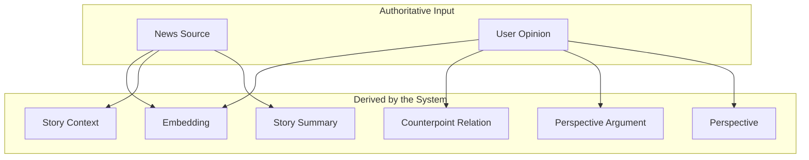

There are two main provenance chains:

```text
News sources
    ↓
Articles
    ↓
Story-derived content
```

and:

```text
User opinions
    ↓
Opinion clusters
    ↓
Perspective-derived content
```

A Perspective is not a factual news source.

A Story summary is not an original news source.

Both are system-generated representations of underlying inputs.

---

## News Engine rule

All factual Story synthesis must be grounded in Articles associated with that Story.

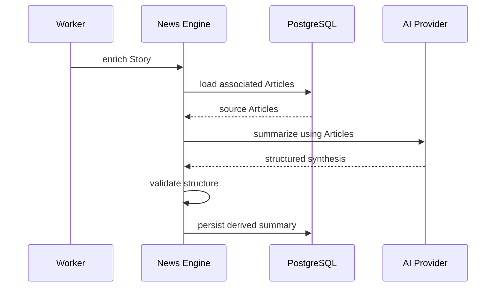

The model receives the source material as input.

It does not receive permission to fill factual gaps using its own general knowledge.

---

## Grounding requirement

Factual generation must follow this relationship:

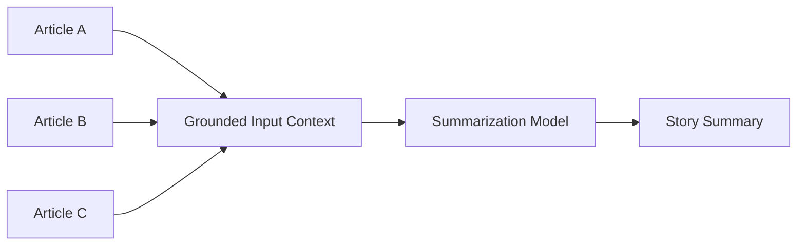

The output should contain only claims supportable by the provided inputs.

Whenever feasible, the system should preserve traceability between the synthesis and the inputs used to generate it.

---

## Opinion Engine rule

The same principle applies to Perspectives.

A Perspective is a derived synthesis of user Opinions.

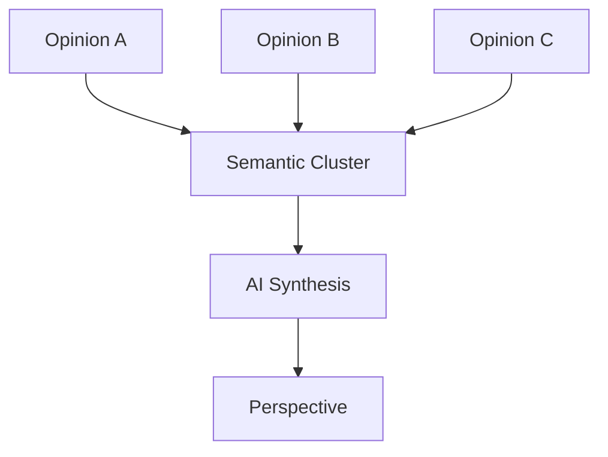

The Perspective must not introduce arguments that do not exist in the underlying Opinions.

The valid relationship is:

```text
Opinions
   ↓
semantic grouping
   ↓
system synthesis
   ↓
Perspective
```

A Perspective must never be presented as if it were a direct quotation from a user.

---

## Human content vs generated synthesis

Pulso must preserve the distinction between authored and generated content.

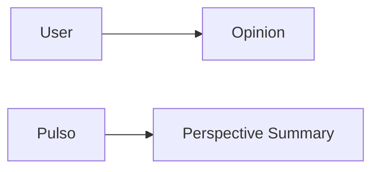

The interface must not blur these two concepts.

An individual Opinion is:

> content authored by a user.

A Perspective is:

> content synthesized by the system from a group of Opinions.

---

## Generated content labeling

System-generated synthesis should be identifiable in the interface.

Examples include:

- Story summaries;
- Story context;
- Perspective summaries;
- recurring argument summaries;
- generated counterpoint explanations.

Conceptually:

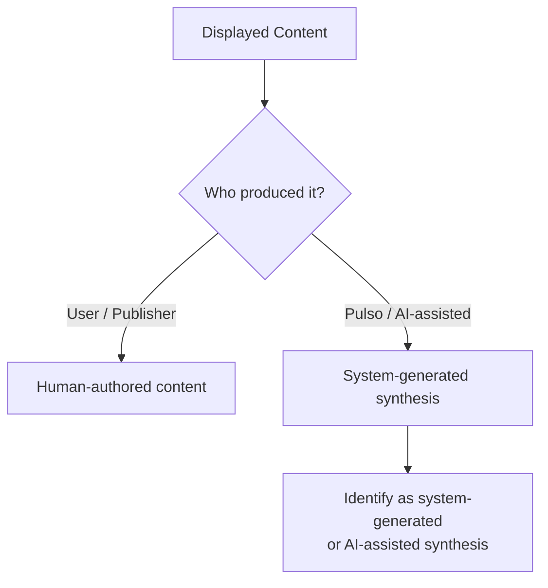

The exact UI wording may evolve, but provenance must remain understandable.

---

## Structured generation

Where AI produces data consumed by application logic, Pulso should prefer structured output over unrestricted text.

Example:

```json
{
  "title": "",
  "summary": "",
  "context": "",
  "topics": [],
  "entities": [],
  "key_points": []
}
```

For Perspective synthesis:

```json
{
  "title": "",
  "summary": "",
  "recurring_arguments": [],
  "confidence": 0.0
}
```

Structured output improves:

- validation;
- observability;
- testing;
- fallback handling;
- schema evolution;
- provenance tracking.

Structured output does **not** make a generation factually correct by itself.

Grounding is still required.

---

## Generation validation

AI output should pass validation before becoming visible or affecting derived domain state.

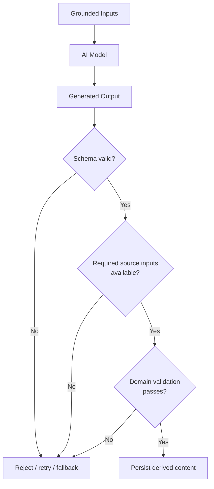

Validation may include:

- schema validation;
- required fields;
- length constraints;
- input references;
- domain invariants;
- unsupported output detection;
- confidence checks where meaningful.

The exact validation strategy is defined during implementation.

---

## Unsupported factual claims

A model must not introduce factual claims that cannot be supported by the provided source material.

Examples of prohibited behavior include:

```text
Creating numbers absent from the sources

Inventing quotations

Adding dates not present in the evidence

Assuming motivations

Creating causal relationships not supported by the inputs

Presenting one source's opinion as established fact

Claiming consensus when sources disagree
```

When the evidence is insufficient, the preferred behavior is:

```text
omit the claim
```

rather than:

```text
complete the missing information from model knowledge
```

---

## Conflicting sources

AI must not silently resolve disagreement between sources as if one version were unquestionably true.

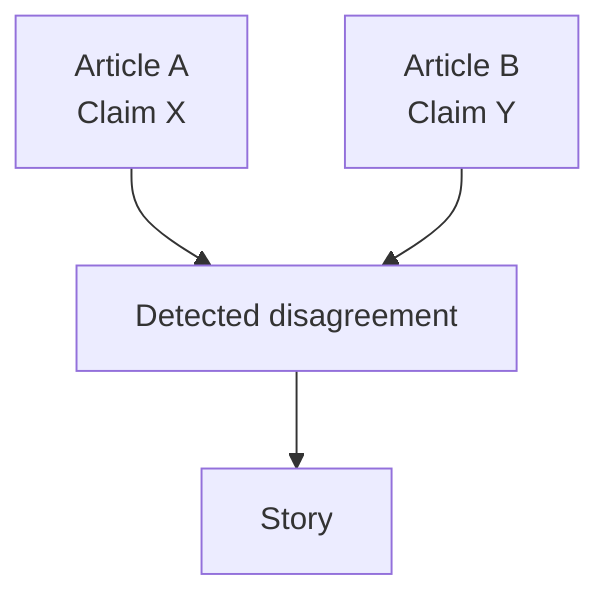

When relevant disagreement exists, the system should preserve that uncertainty or contradiction.

A generated summary should not fabricate consensus.

The exact strategy for conflict representation is outside the scope of this ADR.

---

## Model knowledge

General knowledge encoded in an LLM must not be treated as a Pulso source.

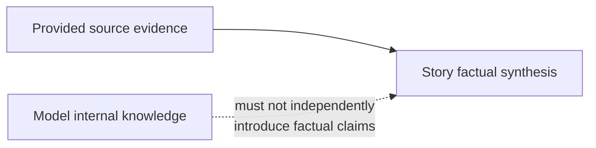

Models may use their linguistic capabilities to:

- compress;
- rewrite;
- classify;
- extract;
- organize.

They must not use latent knowledge as an untracked factual source for Story content.

---

## Provenance

Derived content should retain enough metadata to explain how it was produced.

Conceptually:

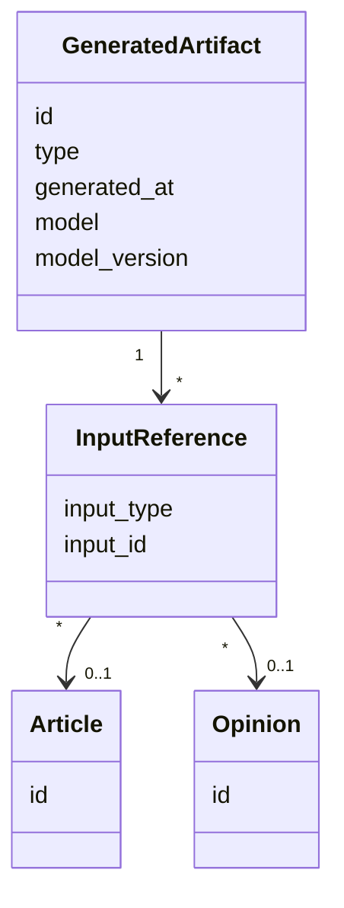

This does not require every sentence to initially have claim-level citations.

The architecture must, however, preserve the set of inputs used to create the synthesis.

---

## Reprocessing

AI-generated artifacts are derived and must be replaceable.

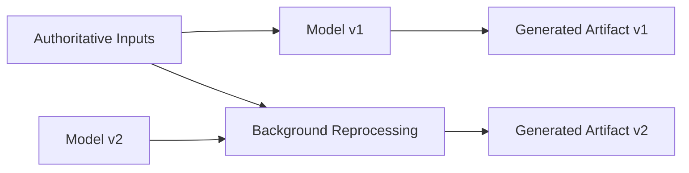

Changing:

- model;
- prompt;
- extraction strategy;
- validation logic;

may require derived artifacts to be regenerated.

The underlying Articles and Opinions remain unchanged.

---

## Provider independence

This ADR defines AI behavior, not a specific provider.

The domain must not depend directly on a particular model vendor.

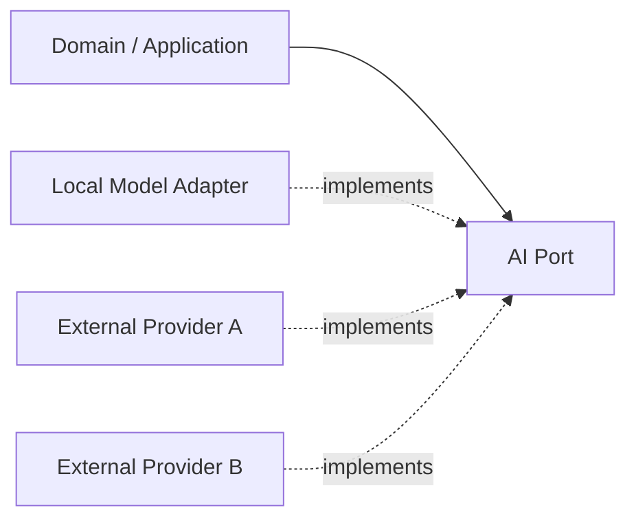

Relevant abstractions may include:

```text
EmbeddingProvider
StorySummarizationProvider
PerspectiveSummarizationProvider
ClassificationProvider
EntityExtractionProvider
```

Provider selection is documented separately.

---

## Failure behavior

AI failure must not necessarily make the underlying domain object unavailable.

For example:

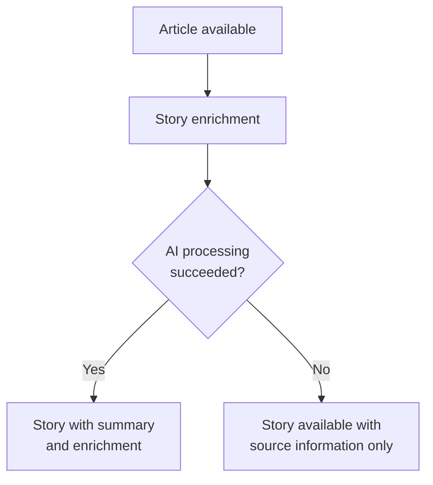

Where possible, the system should degrade gracefully.

Examples:

```text
Story exists without generated context

Opinion exists before Perspective assignment

Sources remain accessible even if summarization fails
```

AI enrichment should not become an unnecessary single point of failure for core source data.

---

## Alternatives considered

### Alternative A — Treat AI output as trusted content

Generated content could be persisted and displayed without source-grounding requirements.


#### Advantages

- simpler prompts;
- less provenance infrastructure;
- easier generation;
- richer outputs;
- model can fill missing context.

#### Reasons for rejection

This conflicts directly with Pulso's product principles.

It introduces risks such as:

- hallucinations;
- untraceable facts;
- invented quotations;
- false consensus;
- loss of source provenance;
- inability to distinguish generated knowledge from sourced knowledge.

Pulso is explicitly intended to organize source-backed information rather than replace it with model-generated narratives.

---

### Alternative B — Do not use generative AI

Pulso could restrict AI usage to deterministic NLP or embeddings.


#### Advantages

- lower hallucination risk;
- easier deterministic testing;
- simpler provenance model.

#### Reasons for rejection

Generative models can provide useful capabilities for:

- concise summarization;
- context synthesis;
- Perspective summaries;
- recurring argument synthesis.

The risk is better addressed through grounding, validation and traceability than by prohibiting generation entirely.

---

### Alternative C — Human editorial review for every generated artifact

All AI-generated summaries could require manual approval.

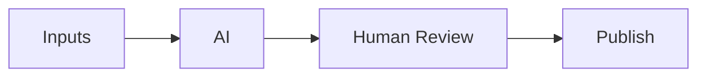

#### Advantages

- strong editorial oversight;
- potential quality improvement;
- human correction of model errors.

#### Reasons for rejection

Pulso is intended to operate primarily as an automated system.

Mandatory human review would:

- limit scalability;
- create operational overhead;
- prevent autonomous local/demo execution;
- conflict with the portfolio project's automation goals.

Human moderation or review may still be used for exceptional cases.

---

## Decision comparison

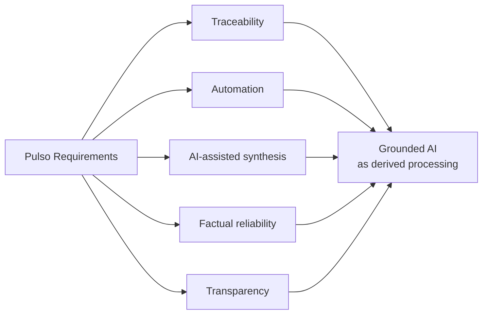

---

## Consequences

### Positive

- factual provenance remains explicit;
- source material remains authoritative;
- AI models can be replaced or improved;
- generated artifacts can be reprocessed;
- user Opinions remain distinct from system synthesis;
- Story and Perspective generation follow the same provenance principle;
- model hallucinations have less opportunity to become authoritative data;
- generated content can be audited;
- the UI can clearly distinguish authored and synthesized content.

### Negative

- generation pipelines become more complex;
- source inputs must be preserved;
- provenance metadata must be stored;
- validation becomes necessary;
- prompts must be more constrained;
- generated output may be less rich than unrestricted model generation;
- reprocessing infrastructure may be required;
- source conflict handling remains a difficult problem.

---

## Risks

### Hallucination despite grounding

Grounding reduces but does not eliminate hallucination.


Mitigation includes:

- constrained prompts;
- structured output;
- validation;
- traceability;
- evaluation datasets;
- fallback behavior.

---

### Loss of nuance

Summarization may remove uncertainty or minority details.

Mitigation includes:

- preserve original sources;
- preserve original Opinions;
- expose source and Opinion drill-down;
- evaluate summarization quality;
- avoid presenting synthesis as exhaustive.

---

### Generated Perspective misrepresentation

A Perspective may inaccurately summarize the Opinions assigned to it.

Mitigation includes:

- keep Opinion-to-Perspective associations;
- expose representative Opinions;
- measure cluster coherence;
- reprocess Perspectives;
- label Perspective summaries as system-generated.

---

### Provenance without semantic proof

Knowing which inputs produced a summary does not guarantee that every generated sentence is supported by them.

This ADR requires input-level provenance initially.

Claim-level citation and entailment verification may be introduced later.

---

## Observability implications

AI processing should expose enough metrics to evaluate quality and reliability.

Initial metrics may include:

```text
ai_processing_duration
ai_request_failures
story_summary_generation_failures
perspective_generation_failures
structured_output_validation_failures
reprocessing_jobs
reprocessing_failures
fallback_usage
generated_artifacts
```

Quality evaluation should eventually include datasets for:

```text
factual consistency
summary faithfulness
Perspective faithfulness
argument extraction quality
counterpoint quality
```

AI quality must not be evaluated exclusively through anecdotal manual inspection.

---

## Architectural invariants

This ADR establishes the following invariants:

```text
AI is not a factual source.

Story factual synthesis derives from Articles.

Perspective synthesis derives from Opinions.

Generated content must not be presented as direct human authorship.

Original source material remains authoritative.

Original Opinions remain authoritative human contributions.

AI-generated artifacts are derived and replaceable.

Model internal knowledge is not a Pulso source.

Generated factual content must be grounded in provided source material.

A model failure must not corrupt or replace authoritative inputs.
```

---

## Non-goals

This ADR does not define:

- the final AI provider;
- the final language model;
- prompt templates;
- embedding models;
- model temperature;
- token budgets;
- claim-level citation architecture;
- automated fact-checking;
- source credibility scoring;
- final hallucination detection technique;
- final conflict-resolution strategy;
- human moderation workflow.

These decisions require implementation evidence or separate ADRs.

---

## Decision summary

Pulso uses AI as a processing layer between authoritative inputs and derived representations.

```mermaid
flowchart LR
    Sources["News Sources"]
    Opinions["User Opinions"]

    AI["AI / NLP Processing"]

    Story["Story Synthesis"]
    Perspective["Perspective Synthesis"]

    Sources --> AI
    Opinions --> AI

    AI --> Story
    AI --> Perspective
```

The core principle is:

> **Sources support the information. AI organizes, relates and summarizes it.**

For the News Engine:

```text
Articles
   ↓
AI-assisted processing
   ↓
Story synthesis
```

For the Opinion Engine:

```text
Opinions
   ↓
AI-assisted processing
   ↓
Perspective synthesis
```

AI-generated output is useful, but it remains **derived, traceable and replaceable**.

It never becomes an independent source of truth.