# ADR-0005 — Asynchronous Processing with Celery

- **Status:** Accepted
- **Date:** 2026-09-14
- **Decision owners:** Pulso maintainers
- **Related:**
  - [ADR-0001 — Modular Monolith with Background Workers](0001-modular-monolith-with-workers.md)
  - [ADR-0002 — PostgreSQL with pgvector for Relational and Vector Data](0002-postgresql-pgvector.md)
  - [ADR-0004 — AI Is Not a Source of Truth](0004-ai-is-not-a-source.md)

## Context

ADR-0001 establishes that Pulso will use a **Modular Monolith with Background Workers**.

This creates the need for an execution mechanism capable of running workloads outside the HTTP request lifecycle.

Pulso contains several operations that should not execute synchronously during user-facing requests.

Examples include:

- polling RSS feeds and external APIs;
- Article normalization;
- deduplication processing;
- embedding generation;
- Story matching and clustering;
- Story enrichment;
- entity extraction;
- topic classification;
- source-grounded summarization;
- Opinion embedding generation;
- Opinion-to-Perspective assignment;
- Perspective rebuilding;
- Pulse recalculation;
- recommendation profile updates;
- notifications;
- periodic maintenance and reprocessing.

These workloads may have one or more of the following characteristics:

- high or unpredictable execution time;
- dependence on external systems;
- transient failures;
- need for retries;
- scheduled execution;
- batch processing;
- CPU-intensive or model-intensive computation;
- tolerance for eventual completion.

Executing them directly inside an HTTP request would couple API availability and response latency to background processing.

Pulso therefore requires a task execution mechanism that is:

- compatible with Python and Django;
- open source;
- suitable for local development;
- capable of retries;
- capable of scheduled tasks;
- observable;
- simple enough for the initial architecture;
- compatible with the free-first constraint.

---

## Decision

Pulso will initially use:

> **Celery for background task execution, with Redis as the message broker.**

Celery workers execute asynchronous application commands outside the Django request lifecycle.

Celery Beat may be used for scheduled jobs.

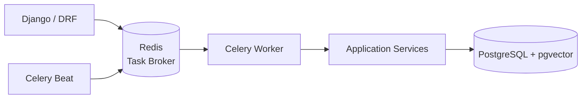

Celery is an infrastructure mechanism.

It does not own business rules.

---

## Architectural role

Celery belongs to the infrastructure/runtime layer.

The intended dependency direction is:

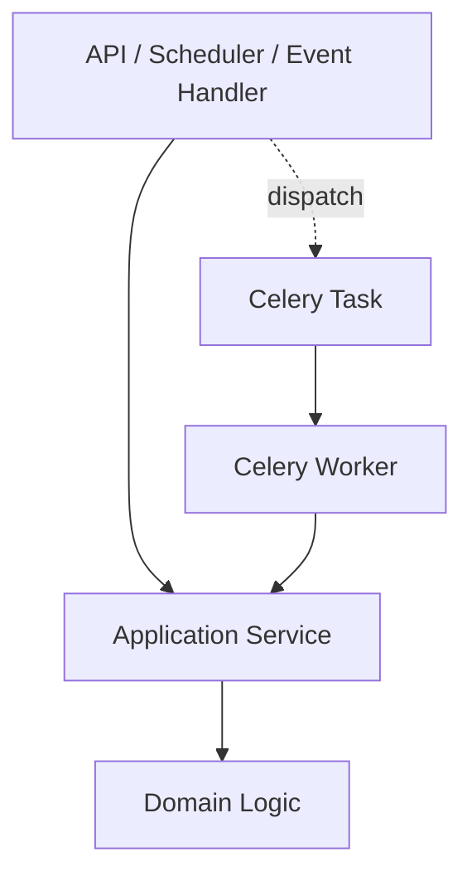

A Celery task should primarily:

1. receive identifiers or small task parameters;
2. invoke an application service;
3. handle execution-specific concerns;
4. report failure or completion.

It should not implement domain rules directly.

---

## Task boundary

The preferred task structure is:

```text
Task
  ↓
Application Service
  ↓
Domain
  ↓
Repository / Port
```

and not:

```text
Task
  ↓
Business rules
  ↓
Direct database manipulation
```

For example:

```python
@shared_task
def process_opinion(opinion_id):
    opinion_processing_service.process(opinion_id)
```

is preferred over embedding the entire Opinion Engine workflow inside the Celery task itself.

Conceptually:

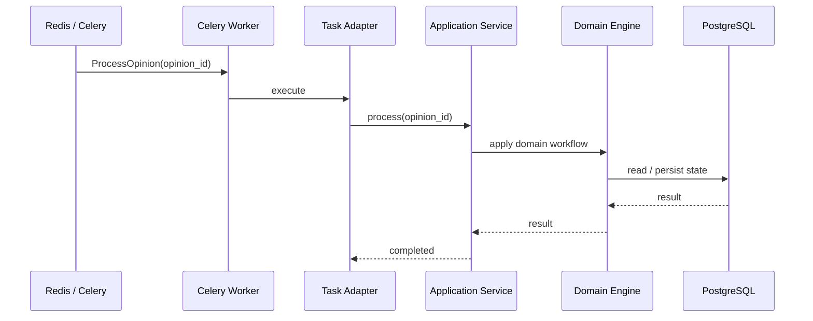

---

## Synchronous vs asynchronous execution

Not every operation should become a Celery task.

The application should distinguish user-facing commands from background workloads.

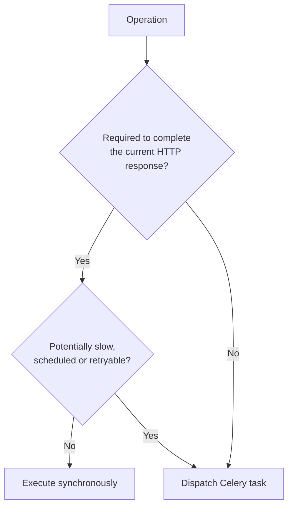

Examples of operations that normally remain synchronous:

```text
Create account
Authenticate
Read Story
Read Pulse
Save bookmark
Persist new Opinion
Create Representation
Return current feed
```

Examples of operations that normally execute asynchronously:

```text
Generate embedding
Cluster Article
Enrich Story
Generate Perspective
Rebuild Perspective
Recalculate Pulse
Recompute UserInterest
Poll source
Send notification
```

An HTTP command may persist the authoritative user action synchronously and defer derived processing.

---

## Example — Opinion publication

Publishing an Opinion should not require Perspective generation to finish before responding to the user.

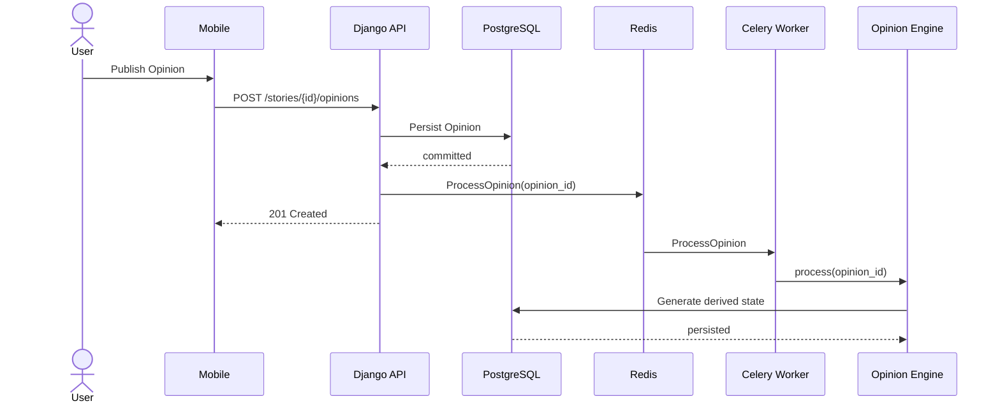

The original Opinion becomes available independently from the completion of:

- embedding generation;
- Perspective assignment;
- Perspective synthesis;
- Pulse recalculation.

This creates intentional **eventual consistency** for derived state.

---

## Example — News ingestion

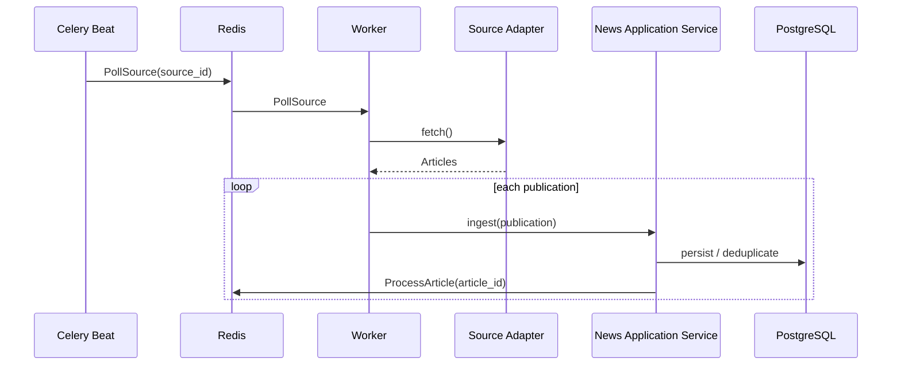

The ingestion workflow may fan out into additional background tasks rather than creating one long-running task that owns the complete pipeline.

---

## Task granularity

Tasks should represent meaningful units of work.

Avoid both extremes:

```text
One gigantic task
that executes the complete pipeline
```

and:

```text
Hundreds of extremely small tasks
with unnecessary queue overhead
```

A reasonable initial decomposition is:

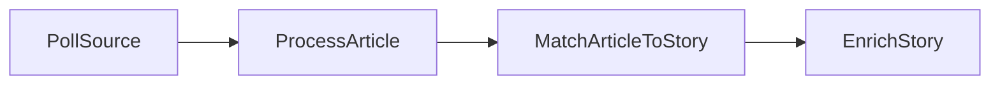

For Opinions:

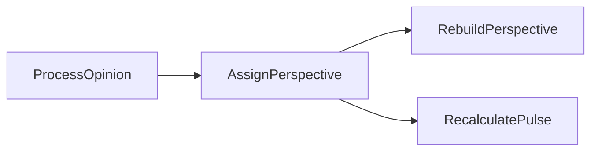

The exact task decomposition may evolve based on observability and operational behavior.

---

## Idempotency

Background tasks may execute more than once.

This can happen because of:

- retries;
- worker crashes;
- visibility/acknowledgement behavior;
- manual replay;
- operational recovery.

Pulso therefore assumes:

> **Celery tasks may be delivered or executed more than once.**

Tasks that modify persistent state must be idempotent whenever practical.

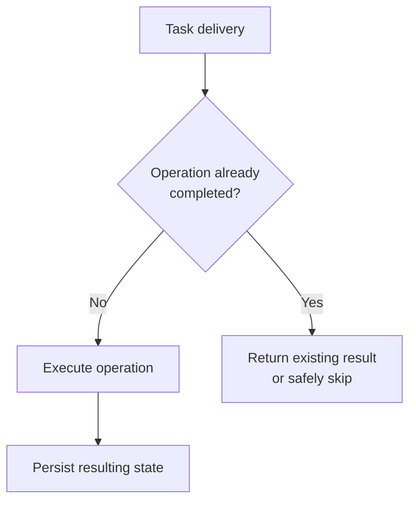

Examples:

```text
PollSource(source_id, window)
ProcessArticle(article_id)
GenerateStoryEmbedding(story_id)
ProcessOpinion(opinion_id)
RecalculatePulse(story_id)
```

must be safe to retry without creating duplicate domain objects or duplicate votes.

---

## Domain identity over task identity

Celery task IDs must not become domain identifiers.

For example:

```text
Celery task ID
```

is execution metadata.

It must not replace:

```text
Article ID
Story ID
Opinion ID
Perspective ID
```

Domain state remains identified through domain entities persisted in PostgreSQL.

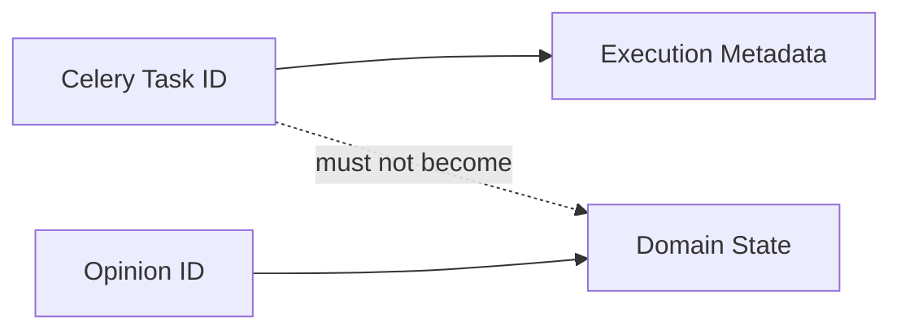

---

## Source of truth

Redis and Celery do not become authoritative persistence systems.

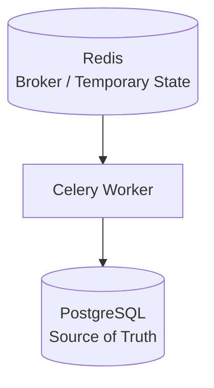

PostgreSQL remains the persistent source of truth for domain state.

Redis may contain:

- queued messages;
- temporary processing state;
- cache entries;
- scheduling-related data.

Loss of Redis data must not redefine the authoritative business state.

---

## Task parameters

Tasks should preferentially receive identifiers instead of large serialized domain objects.

Preferred:

```text
ProcessArticle(article_id)

ProcessOpinion(opinion_id)

RecalculatePulse(story_id)
```

Avoid:

```text
ProcessOpinion(
    complete_user_object,
    complete_story_object,
    full_opinion_payload,
    perspective_list,
    ...
)
```

Benefits include:

- smaller messages;
- reduced serialization problems;
- fresher state when execution begins;
- easier retries;
- clearer task contracts.

---

## Retry strategy

Transient failures should be retried when appropriate.

Examples include:

- network timeout;
- temporary external API failure;
- temporary AI provider failure;
- temporary connection error.

Permanent failures should not be retried indefinitely.

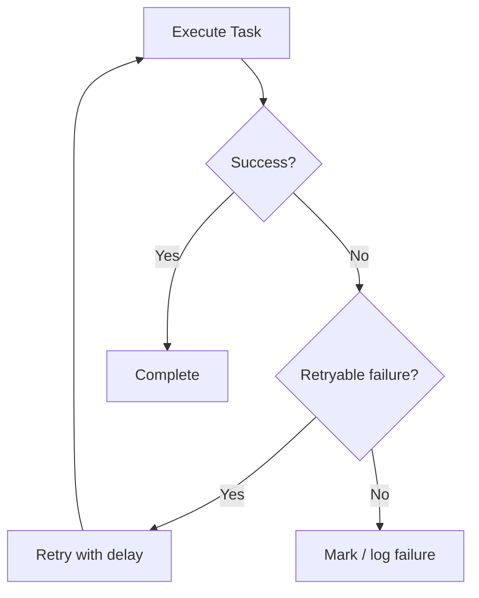

Retry policies may include:

- bounded attempts;
- exponential backoff;
- jitter;
- provider-specific retry rules.

The exact retry configuration is workload-specific.

---

## Poison tasks and permanent failures

A task must not retry forever when the input itself is invalid or processing is deterministically failing.

Examples:

```text
unsupported Article payload

deleted Opinion

invalid domain state

malformed provider response

unsupported model output
```

The system should eventually transition the workload to an observable failure state.

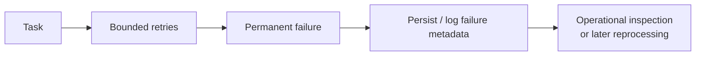

The initial architecture does not require a dedicated dead-letter queue, but failed tasks must remain diagnosable.

A DLQ or equivalent mechanism may be introduced later if operational evidence justifies it.

---

## Transaction boundary

A common workflow is:

```text
persist domain state
        +
dispatch background task
```

These are two different operations.

The task must not execute before the database transaction that created its input is committed.

Incorrect:

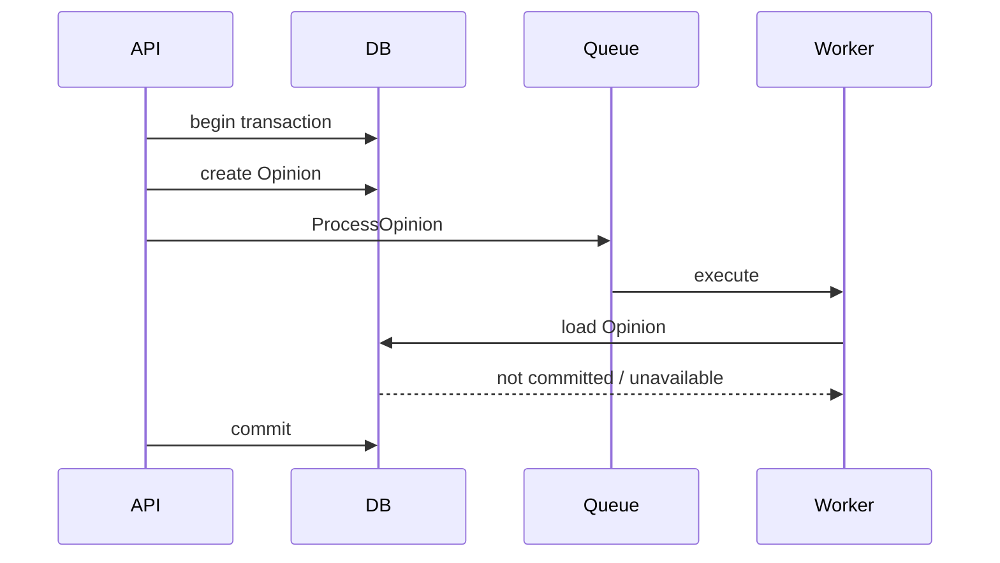

Preferred:

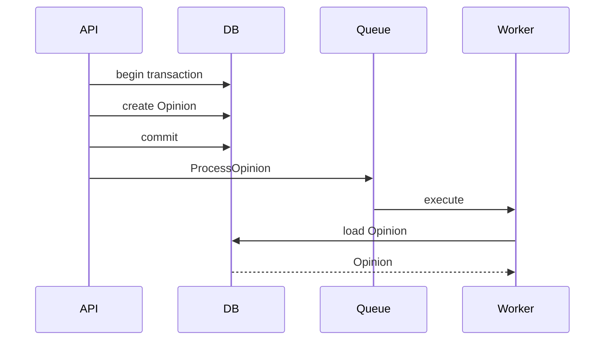

The initial Django implementation should dispatch tasks after a successful transaction commit, for example using transaction commit hooks where appropriate.

---

## Database + broker delivery gap

Dispatching after commit prevents workers from observing uncommitted state, but it does not provide atomicity between PostgreSQL and Redis.

A failure may occur here:

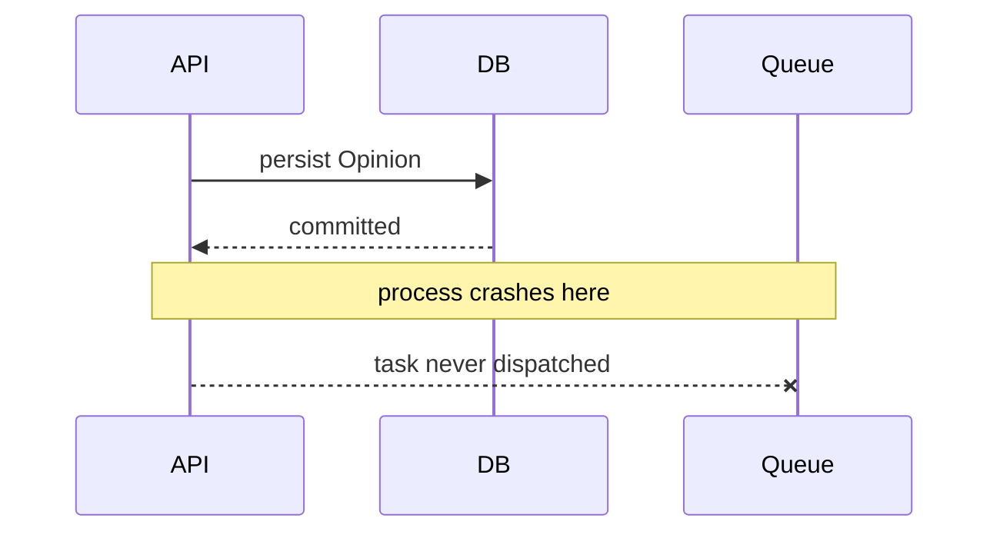

This creates a possible delivery gap:

```text
database committed
+
task not published
```

For the initial MVP, this risk is accepted.

Mitigations may include:

- periodic reconciliation jobs;
- explicit processing status fields;
- manual replay;
- operational monitoring.

If stronger delivery guarantees become necessary, Pulso should evaluate a **Transactional Outbox Pattern** in a separate ADR.

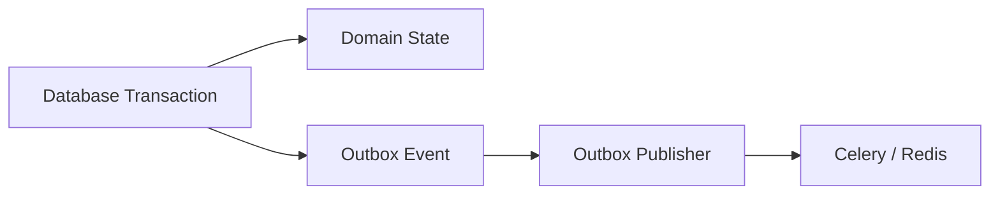

The Outbox Pattern is not required by this ADR.

---

## Task chaining

Celery supports chains, groups and chords.

Pulso will not make complex Celery workflow primitives part of the domain model.

Preferred:

```text
domain/application workflow
        ↓
dispatch next meaningful task
```

rather than encoding the system architecture entirely as Celery canvas structures.

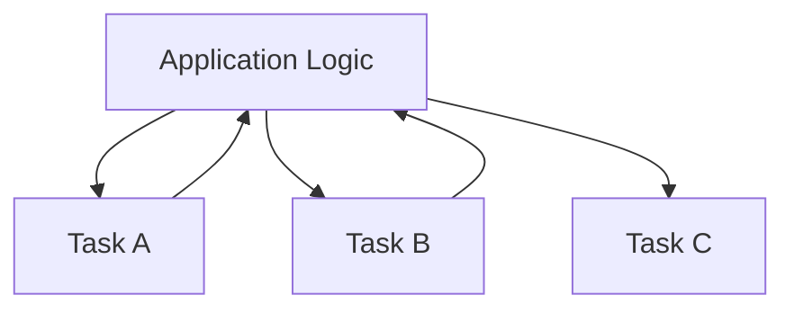

This keeps orchestration understandable outside Celery itself.

Celery chains or groups may still be used when they provide a clear implementation benefit.

---

## Scheduling

Periodic workloads may be triggered through Celery Beat.

Examples include:

```text
Poll active news sources

Reconcile unprocessed Articles

Reconcile unprocessed Opinions

Refresh stale Perspectives

Recalculate selected recommendation profiles

Cleanup temporary processing state
```

Conceptually:

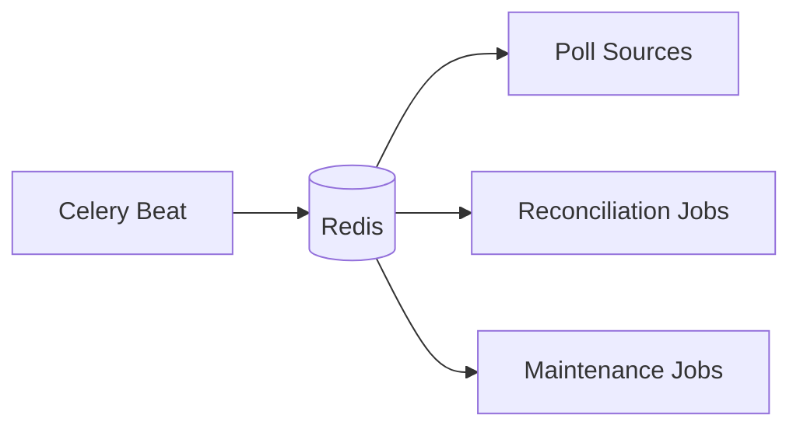

Scheduled jobs must remain idempotent.

---

## Queue topology

The first implementation may use a simple queue topology.

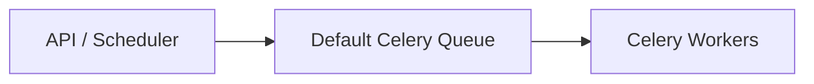

The architecture may later introduce workload-specific queues.

For example:

```mermaid
flowchart TB
    Producers["Task Producers"]

    NewsQ["news"]
    OpinionQ["opinion"]
    AIQ["ai"]
    NotificationsQ["notifications"]

    NewsWorkers["News Workers"]
    OpinionWorkers["Opinion Workers"]
    AIWorkers["AI Workers"]
    NotificationWorkers["Notification Workers"]

    Producers --> NewsQ
    Producers --> OpinionQ
    Producers --> AIQ
    Producers --> NotificationsQ

    NewsQ --> NewsWorkers
    OpinionQ --> OpinionWorkers
    AIQ --> AIWorkers
    NotificationsQ --> NotificationWorkers
```

Queue separation should be introduced only when there is a concrete operational reason such as:

- different concurrency requirements;
- resource isolation;
- expensive AI workloads;
- latency-sensitive tasks;
- independent scaling.

The final queue topology is outside the scope of this ADR.

---

## Worker scaling

Although Pulso is a modular monolith, worker runtimes can scale independently from the API runtime.

```mermaid
flowchart TB
    Code["Same Pulso Backend Codebase"]

    API["API Runtime<br/>x N"]

    Worker1["Celery Worker<br/>x N"]
    AIWorker["AI Worker<br/>x N"]

    Code --> API
    Code --> Worker1
    Code --> AIWorker
```

This is process-level scaling.

It does not imply domain-level microservices.

---

## AI workload isolation

AI and NLP jobs may eventually require different worker characteristics.

Examples include:

- higher memory usage;
- CPU-intensive embedding generation;
- GPU access;
- lower concurrency;
- longer task execution.

If required, Celery routing may isolate these workloads.

```mermaid
flowchart LR
    Broker["Celery Broker"]

    GeneralQ["General Queue"]
    AIQ["AI Queue"]

    GeneralWorker["General Worker"]
    AIWorker["AI Worker<br/>CPU / GPU optimized"]

    Broker --> GeneralQ
    Broker --> AIQ

    GeneralQ --> GeneralWorker
    AIQ --> AIWorker
```

This remains compatible with the modular monolith because the workers continue using the same application modules.

---

## Result handling

Celery's task result storage must not become the business state of the system.

For example:

```text
Perspective generated
```

is represented by persisted Perspective state in PostgreSQL.

It must not depend on querying:

```text
AsyncResult(task_id)
```

to determine whether the Perspective exists.

```mermaid
flowchart LR
    Task["Celery Task"]

    DB["PostgreSQL Domain State"]

    Result["Celery Execution Result"]

    Task --> DB
    Task --> Result

    DB --> Truth["Business truth"]

    Result --> Ops["Execution / operational information"]
```

Task execution results are operational metadata, not domain state.

---

## Cancellation

Celery task revocation is not considered a reliable domain rollback mechanism.

If a domain operation needs cancellation semantics, cancellation must be modeled explicitly in domain/application state.

For example:

```text
processing_status = CANCELLED
```

rather than depending solely on:

```text
celery revoke(task_id)
```

Workers should inspect relevant domain state where cancellation matters.

---

## Observability

Asynchronous execution must be observable.

Initial worker metrics should include:

```text
queue_depth
task_started
task_completed
task_failed
task_retried
task_duration
task_wait_time
worker_utilization
```

Domain-specific asynchronous metrics may include:

```text
articles_pending_processing
stories_pending_enrichment
opinions_pending_processing
perspectives_pending_rebuild
pulse_recalculation_duration
embedding_generation_duration
```

Logs should include correlation identifiers when available:

```text
request_id
task_id
job_name
user_id
article_id
story_id
opinion_id
perspective_id
```

Not every field applies to every task.

---

## Error isolation

A failed background job should not unnecessarily make unrelated application functionality unavailable.

```mermaid
flowchart LR
    API["API"]

    Story["Story already persisted"]

    Task["Enrichment Task"]

    Failure["AI Provider Failure"]

    API --> Story

    Story --> Task
    Task -. fails .-> Failure

    Story --> Available["Story remains available"]
```

Examples:

```text
Story can exist before enrichment completes.

Opinion can exist before Perspective assignment completes.

Sources remain accessible if summarization fails.

Pulse may temporarily expose the latest valid snapshot.
```

---

## Alternatives considered

### Alternative A — Django synchronous execution

All operations could run inside HTTP requests.

#### Advantages

- no queue infrastructure;
- simpler debugging;
- fewer runtime processes.

#### Reasons for rejection

This would couple API latency and reliability to:

- AI providers;
- embeddings;
- external feeds;
- clustering;
- large batches.

It conflicts with ADR-0001.

---

### Alternative B — RQ

Redis Queue could provide a simpler Redis-backed job system.

```mermaid
flowchart LR
    Django["Django"]
    Redis[("Redis")]
    RQ["RQ Worker"]

    Django --> Redis
    Redis --> RQ
```

#### Advantages

- simple mental model;
- Redis-native;
- easy Python integration;
- lower initial complexity.

#### Reasons for not selecting

Pulso anticipates requirements such as:

- scheduled jobs;
- routing;
- retries;
- multiple worker pools;
- workload-specific queues;
- richer task execution controls.

Celery provides these capabilities within an established Django ecosystem.

RQ remains a viable alternative if Celery complexity proves unjustified.

---

### Alternative C — Dramatiq

Dramatiq provides a modern Python background processing model.

#### Advantages

- simpler API than Celery in some scenarios;
- retries and middleware support;
- Redis compatibility;
- Python-focused.

#### Reasons for not selecting

Celery currently provides a broader ecosystem and familiar integration with Django for the expected Pulso workloads.

This is not considered an irreversible decision.

---

### Alternative D — Managed cloud queues

A cloud provider could be used for queueing and task execution.

Examples include provider-specific message queues and serverless workers.

#### Advantages

- managed infrastructure;
- built-in scalability;
- operational integrations.

#### Reasons for rejection

This conflicts with the initial goals of:

- provider independence;
- free-first development;
- complete local execution;
- low infrastructure complexity.

Managed infrastructure may be evaluated for production deployment later.

---

## Decision comparison

```mermaid
flowchart LR
    Requirements["Pulso Requirements"]

    Python["Python / Django integration"]
    Retry["Retries"]
    Schedule["Scheduled execution"]
    Routing["Worker / queue routing"]
    Local["Local execution"]
    Free["Open source / free-first"]

    Celery["Celery + Redis"]

    Requirements --> Python
    Requirements --> Retry
    Requirements --> Schedule
    Requirements --> Routing
    Requirements --> Local
    Requirements --> Free

    Python --> Celery
    Retry --> Celery
    Schedule --> Celery
    Routing --> Celery
    Local --> Celery
    Free --> Celery
```

---

## Consequences

### Positive

- expensive work does not block HTTP requests;
- native fit with the Python/Django stack;
- retry support;
- scheduled execution;
- worker concurrency;
- task routing;
- multiple worker pools are possible;
- local execution is straightforward;
- Redis already serves useful infrastructure roles;
- compatible with modular monolith architecture;
- workloads can scale independently at process level.

### Negative

- introduces Redis as runtime infrastructure;
- adds eventual consistency;
- debugging spans multiple processes;
- task delivery can produce duplicate execution;
- database and broker commits are not atomic by default;
- task orchestration can become difficult if abused;
- workers require operational monitoring;
- API and worker code versions must remain compatible.

---

## Risks

### Business logic leaking into tasks

Risk:

```text
Celery tasks become the application layer.
```

Mitigation:

```text
Task
 ↓
Application Service
 ↓
Domain
```

---

### Duplicate execution

Risk:

```text
Task executes twice
 ↓
duplicate Story / Perspective / notification
```

Mitigation:

- idempotent commands;
- uniqueness constraints;
- status checks;
- deterministic domain identifiers where appropriate.

---

### Lost dispatch

Risk:

```text
Database commit succeeds
 ↓
process crashes
 ↓
Celery task is never published
```

Mitigation initially:

- reconciliation;
- processing-status queries;
- monitoring.

Future option:

- Transactional Outbox Pattern.

---

### Queue backlog

Risk:

```mermaid
flowchart LR
    Producer["Task production"]
    Queue["Growing backlog"]
    Workers["Worker capacity"]

    Producer --> Queue
    Queue --> Workers
```

Mitigation:

- queue-depth metrics;
- worker scaling;
- workload-specific routing;
- rate control;
- batch optimization.

---

### Long-running AI jobs

Risk:

AI workloads monopolize general-purpose workers.

Mitigation:

```text
AI-specific queues
+
worker concurrency limits
+
specialized worker pools
```

when measured requirements justify them.

---

## Architectural invariants

This ADR establishes the following rules:

```text
Celery is infrastructure, not domain logic.

Tasks invoke application services.

PostgreSQL remains the domain source of truth.

Redis is not authoritative persistence.

Tasks may execute more than once.

Persistent task effects should be idempotent.

Tasks should usually receive entity identifiers.

User-created authoritative data is persisted before derived processing.

Task dispatch should occur after successful database commit.

Derived state may be eventually consistent.

Celery result metadata does not represent business state.

Worker processes may scale independently without becoming microservices.
```

---

## Evolution criteria

Celery may be reconsidered if evidence shows that it no longer satisfies the system's needs.

```mermaid
flowchart TD
    Celery["Celery + Redis"]

    Throughput{"Unable to meet<br/>required throughput?"}

    Guarantees{"Need stronger messaging<br/>delivery guarantees?"}

    Streaming{"Need event streaming<br/>rather than task execution?"}

    Operations{"Operational complexity<br/>becomes excessive?"}

    Polyglot{"Workers need significant<br/>multi-language support?"}

    Keep["Keep Celery"]
    Candidate["Evaluate alternative"]
    ADR["Create new ADR"]

    Celery --> Throughput

    Throughput -- Yes --> Candidate
    Throughput -- No --> Guarantees

    Guarantees -- Yes --> Candidate
    Guarantees -- No --> Streaming

    Streaming -- Yes --> Candidate
    Streaming -- No --> Operations

    Operations -- Yes --> Candidate
    Operations -- No --> Polyglot

    Polyglot -- Yes --> Candidate
    Polyglot -- No --> Keep

    Candidate --> ADR
```

Possible future alternatives may include:

- dedicated messaging infrastructure;
- event streaming;
- workflow engines;
- managed queues;
- specialized processing services.

Any replacement must be justified by measured requirements.

---

## Non-goals

This ADR does not define:

- the final queue topology;
- exact worker counts;
- exact concurrency settings;
- production Redis topology;
- final retry counts;
- exact timeout values;
- dead-letter queue implementation;
- Transactional Outbox implementation;
- event streaming architecture;
- workflow orchestration platform;
- production autoscaling strategy.

These decisions depend on implementation and operational evidence.

---

## Decision summary

Pulso needs asynchronous processing for workloads that should not block user-facing requests.

Celery provides the execution model required by the initial Python/Django architecture, while Redis provides the task broker.

```mermaid
flowchart LR
    HTTP["HTTP Request"]

    Persist["Persist authoritative state"]

    Response["Respond to user"]

    Queue["Celery Task"]

    Worker["Background Worker"]

    Derived["Derived Processing"]

    DB[("PostgreSQL")]

    HTTP --> Persist
    Persist --> DB

    Persist --> Response
    Persist --> Queue

    Queue --> Worker
    Worker --> Derived
    Derived --> DB
```

The fundamental rule is:

> **Persist authoritative state synchronously, process expensive derived state asynchronously.**

Celery is used to execute background application work.

It does not become the domain model, the source of truth or a substitute for explicit application boundaries.