# ADR-0006 — Opinion != Perspective

- **Status:** Accepted
- **Date:** 2026-09-14
- **Decision owners:** Pulso maintainers
- **Related:**
  - [ADR-0002 — PostgreSQL with pgvector for Relational and Vector Data](0002-postgresql-pgvector.md)
  - [ADR-0004 — AI Is Not a Source of Truth](0004-ai-is-not-a-source.md)
  - [ADR-0005 — Asynchronous Processing with Celery](0005-asynchronous-processing-with-celery.md)

## Context

Pulso does not organize public discussion as a traditional comment section.

A conventional model is usually:

```text
Story
  ↓
Comments
  ↓
Likes
  ↓
Replies
```

This structure preserves individual contributions but makes it difficult to understand a discussion when hundreds or thousands of comments exist.

Pulso needs to answer questions such as:

- What are the main arguments in this discussion?
- Which different viewpoints exist inside the same declared position?
- How many people express similar reasoning?
- Which arguments oppose or qualify each other?
- Where is the disagreement actually concentrated?
- Which individual opinions support a synthesized viewpoint?

Individual Opinions alone are insufficient to provide this structure.

At the same time, automatically generated groupings must not replace or overwrite what users actually wrote.

Pulso therefore requires two distinct concepts:

- `Opinion`: content explicitly authored by a user;
- `Perspective`: a system-derived representation of multiple semantically related Opinions.

---

## Decision

Pulso will model `Opinion` and `Perspective` as separate domain concepts.

> **Opinion != Perspective**

An `Opinion` is authoritative user-generated content.

A `Perspective` is derived system-generated content.

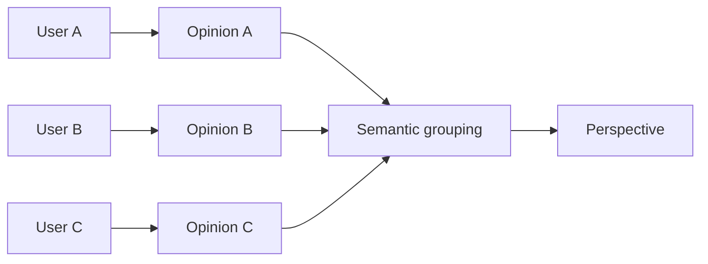

The Perspective summarizes a recurring argument.

It does not become the original content of any user.

---

## Domain meaning

### Opinion

An `Opinion` represents the explicit contribution of a user regarding a Story.

Conceptually:

```text
Opinion
├── user
├── story
├── position
├── content
├── embedding
├── status
├── created_at
└── updated_at
```

An Opinion belongs to a user.

It preserves:

- authorship;
- original wording;
- declared position;
- publication timestamp;
- moderation state.

The Opinion remains authoritative even if Perspective assignments are later recalculated.

---

### Perspective

A `Perspective` represents a semantically coherent argument shared by a group of Opinions.

Conceptually:

```text
Perspective
├── story
├── position
├── title
├── summary
├── embedding
├── opinion_count
├── confidence
├── status
├── generated_at
└── updated_at
```

A Perspective is:

- derived;
- recalculable;
- system-generated;
- based on a set of Opinions;
- not directly authored by a user.

---

## Position != Perspective

A position represents the user's declared orientation toward the Story.

Initial examples include:

```text
SUPPORT
OPPOSE
PARTIAL
UNDECIDED
```

A Perspective represents **why** the user holds that position.

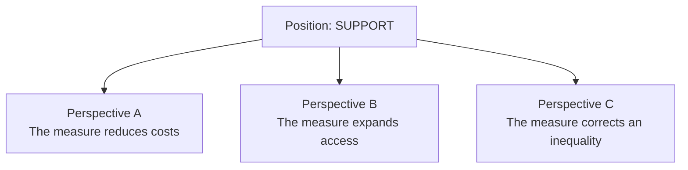

Multiple Perspectives may exist under the same position.

Therefore:

```text
Position != Perspective
```

and:

```text
SUPPORT
```

does not mean:

```text
all supporting users share the same reasoning
```

---

## Example

Consider three users publishing:

```text
User A:
"This policy will increase public spending too much."

User B:
"The government will have to spend significantly more."

User C:
"The cost of implementing this measure seems excessive."
```

These remain three independent Opinions.

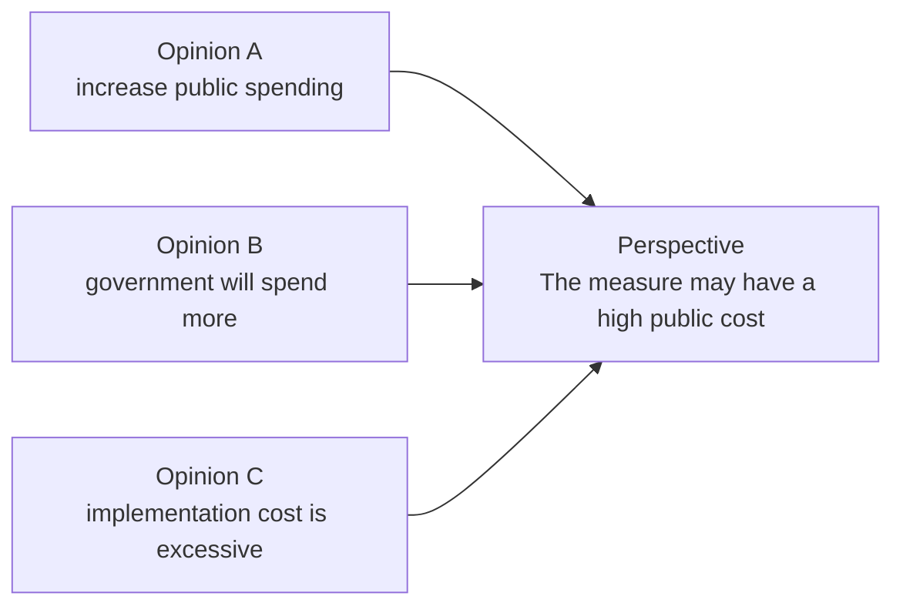

The Perspective:

> The measure may have a high public cost.

is a synthesized representation of the recurring argument.

It must not be displayed as if User A, B or C wrote that exact sentence.

---

## Explicit association model

The relationship between Opinion and Perspective is modeled explicitly.

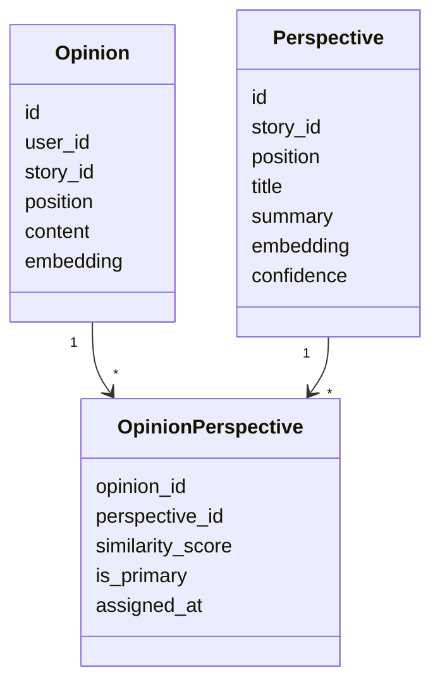

The association is not embedded directly into the Opinion as irreversible state.

This allows Perspective assignments to be recalculated.

---

## Why use an association entity

Perspective clustering is derived behavior.

A new:

- embedding model;
- similarity threshold;
- clustering strategy;
- Perspective structure;

may change the assignment of existing Opinions.

Therefore:

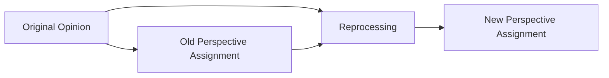

The original Opinion remains unchanged.

Only the derived association changes.

---

## One Opinion may relate to multiple Perspectives

An Opinion may express more than one argument.

For example:

```text
"I support the measure because it expands access,
but I am concerned about the implementation cost."
```

This Opinion contains at least two relevant ideas.

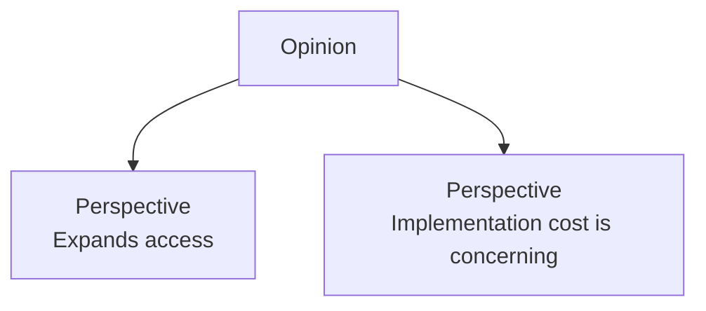

The domain therefore does not require a permanent one-Opinion-to-one-Perspective invariant.

One association may be marked as primary when useful:

```text
is_primary = true
```

The initial implementation may simplify assignment if needed, but the conceptual model supports multiple Perspective memberships.

---

## Opinion lifecycle

An Opinion is user-owned content.

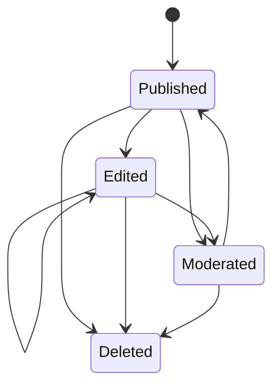

Editing an Opinion may require derived processing to run again.

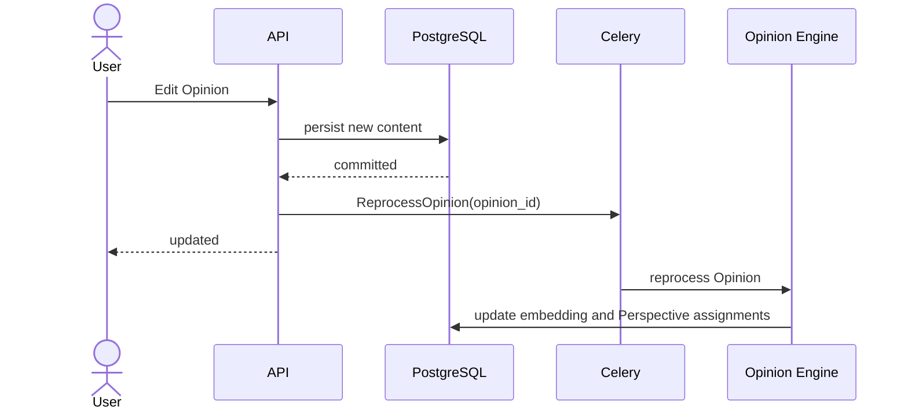

---

## Perspective lifecycle

Perspectives have a different lifecycle because they are derived aggregates.

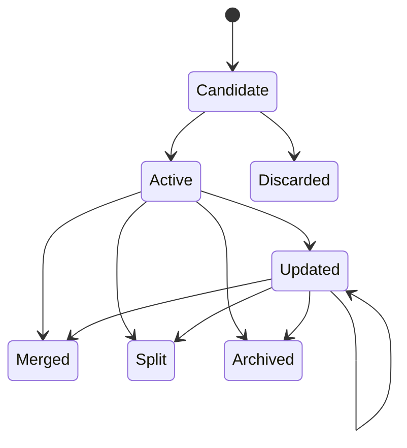

A Perspective may change even when no individual Opinion changes.

For example, new Opinions may:

- strengthen the cluster;
- shift its semantic center;
- reveal sub-perspectives;
- create the need for a split;
- make two Perspectives similar enough to merge.

---

## Opinion Engine processing

The Opinion Engine transforms authoritative Opinions into derived Perspectives.

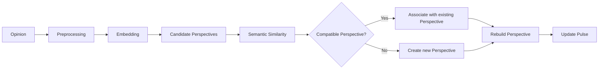

This processing is asynchronous according to ADR-0005.

---

## Perspective synthesis

Perspective summaries must be derived only from their associated Opinions.

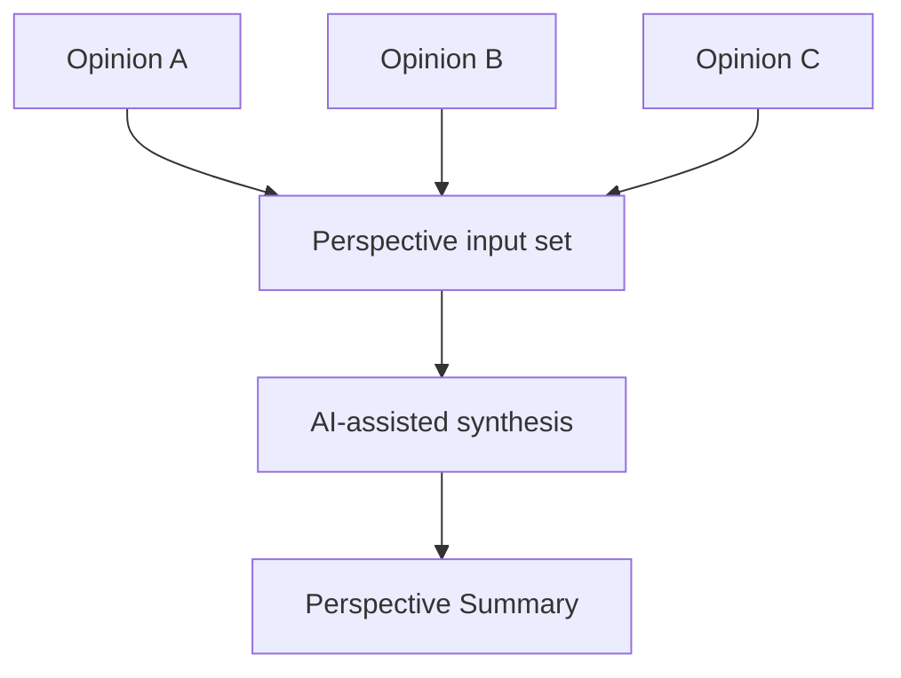

This follows ADR-0004:

> AI is not a source of truth.

For Perspectives, the authoritative inputs are the original Opinions.

---

## Perspective traceability

A user must be able to navigate from a Perspective to individual Opinions that contributed to it.

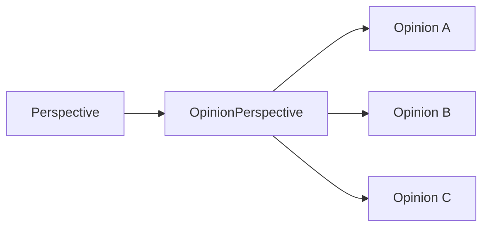

This preserves:

- authorship;
- transparency;
- explainability;
- access to nuance;
- auditability of synthesis.

---

## Representative Opinions

A Perspective may expose individual Opinions that are representative of the cluster.

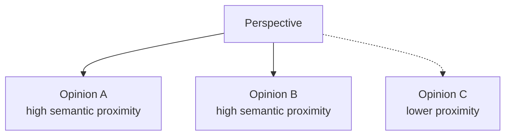

Selection criteria may include:

- semantic proximity;
- moderation state;
- clarity;
- recency;
- representativeness.

The exact ranking algorithm is outside the scope of this ADR.

Representative Opinions are still original user content.

---

## Arguments

A Perspective may contain multiple recurring arguments.

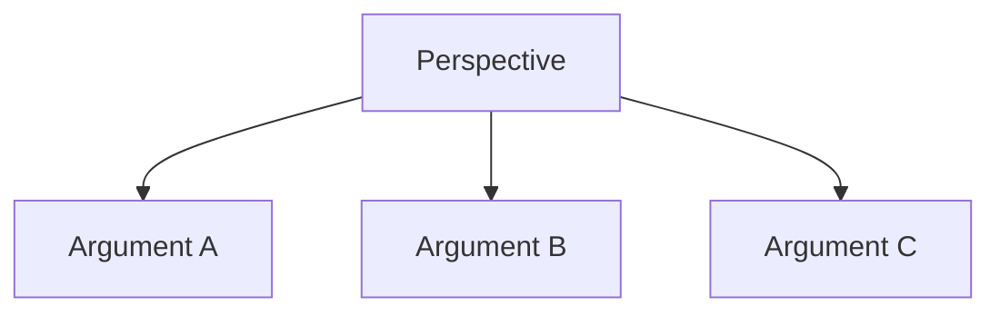

A `PerspectiveArgument` is also derived data.

It does not replace the Opinions that support it.

---

## Counterpoints

Perspectives may have explicit semantic relationships.

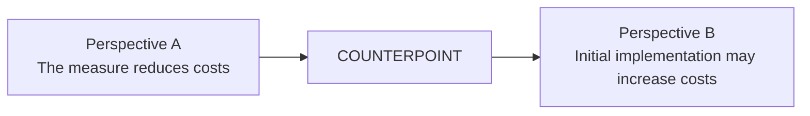

Possible relation types include:

```text
COUNTERPOINT
QUALIFICATION
COMPLEMENT
```

The initial product focuses primarily on `COUNTERPOINT`.

---

## Public discussion model

The resulting discussion model becomes:

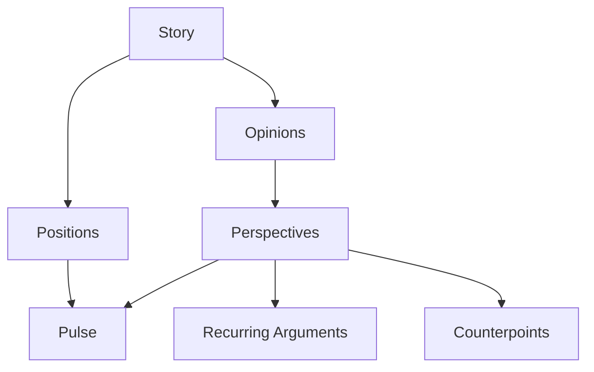

This differs intentionally from:

```text
Story
  ↓
Comments
  ↓
Likes
```

---

## User experience implications

The Perspective becomes the primary social navigation unit.

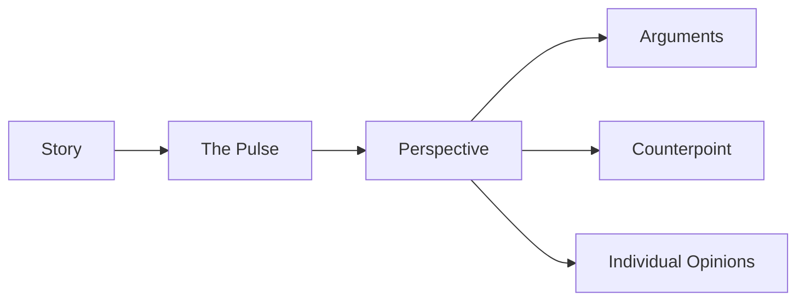

Individual Opinions remain available but become a more granular layer.

---

## "Represents me"

A user may indicate that an Opinion or Perspective represents their view.

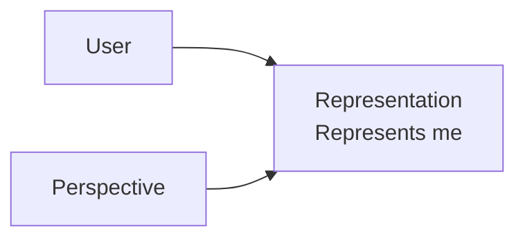

This action measures argument representativeness.

It does not:

- create a new Opinion;
- change the user's active position;
- create an additional vote in the Pulse distribution.

The exact semantics of Representation are further constrained by ADR-0007.

---

## Authorship boundary

The system must preserve the distinction between human authorship and generated synthesis.

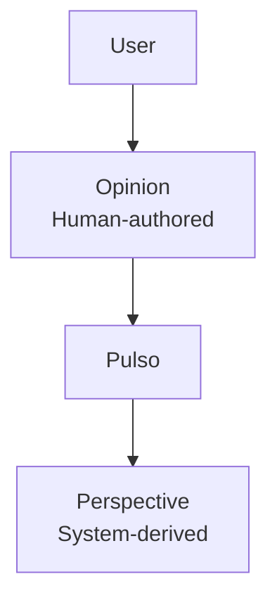

The UI must never visually imply:

```text
Perspective summary = quotation from a user
```

unless the displayed content is actually a quoted Opinion.

---

## Moderation implications

Moderation applies primarily to authoritative human content.

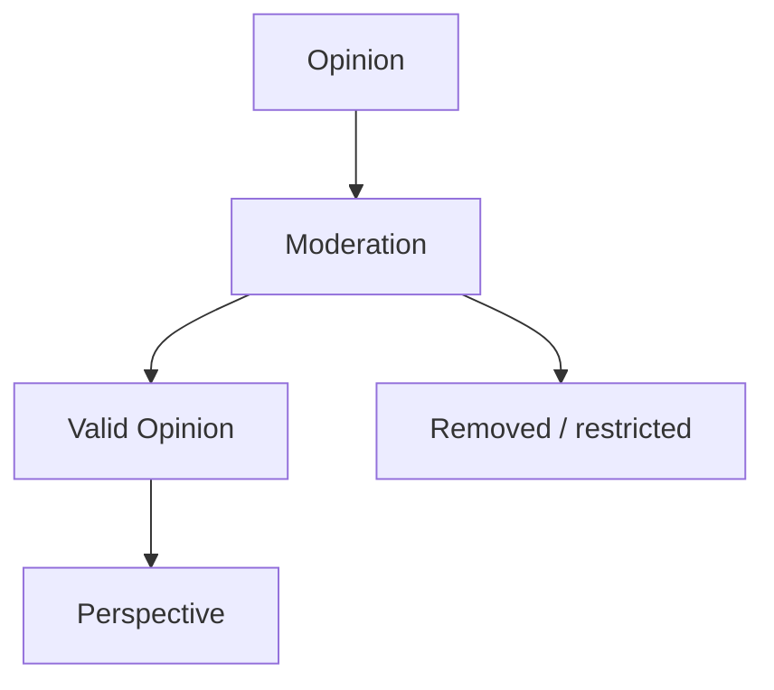

Removed or invalid Opinions should not continue contributing to active Perspective synthesis when domain rules indicate they should be excluded.

A Perspective may therefore require rebuilding after moderation changes.

---

## Deletion implications

If a user deletes an Opinion:

```mermaid
sequenceDiagram
    actor User
    participant API
    participant DB as PostgreSQL
    participant Queue as Celery
    participant Engine as Opinion Engine

    User->>API: Delete Opinion

    API->>DB: mark / delete Opinion
    DB-->>API: committed

    API->>Queue: RebuildAffectedPerspectives

    API-->>User: deleted

    Queue->>Engine: rebuild clusters / Perspective

    Engine->>DB: update Perspective memberships
    Engine->>DB: recalculate aggregates
```

Derived Perspective state must not preserve deleted content as active evidence when the product's deletion policy requires removal.

---

## Eventual consistency

An Opinion may exist before Perspective processing finishes.

```mermaid
stateDiagram-v2
    [*] --> OpinionPublished

    OpinionPublished --> Processing

    Processing --> PerspectiveAssigned
    Processing --> ProcessingFailed

    ProcessingFailed --> Processing

    PerspectiveAssigned --> [*]
```

This is expected behavior.

The system may temporarily expose:

```text
Opinion published
Perspective pending
```

rather than blocking publication until semantic processing finishes.

---

## Alternatives considered

### Alternative A — Opinion is the only social entity

The product could expose only individual Opinions.

```mermaid
flowchart TB
    Story["Story"]

    OpinionA["Opinion A"]
    OpinionB["Opinion B"]
    OpinionC["Opinion C"]

    Story --> OpinionA
    Story --> OpinionB
    Story --> OpinionC
```

#### Advantages

- simpler domain model;
- no clustering;
- no Perspective lifecycle;
- no derived association model;
- lower AI processing cost.

#### Reasons for rejection

This would reproduce a traditional comment section.

Users would still need to manually inspect large volumes of Opinions to understand:

- recurring reasoning;
- dominant arguments;
- counterpoints;
- disagreement structure.

It would remove one of Pulso's main product differentiators.

---

### Alternative B — Replace Opinions with Perspectives

Users could directly publish Perspectives rather than individual Opinions.

```mermaid
flowchart LR
    User["User"]

    Perspective["Perspective"]

    User --> Perspective
```

#### Advantages

- simpler aggregation;
- no semantic grouping required;
- explicit structured input.

#### Reasons for rejection

A Perspective represents collective meaning rather than one person's authored content.

Allowing users to author Perspectives directly would blur:

- individual authorship;
- collective synthesis;
- system-generated representation.

It would also prevent the Opinion Engine from discovering unexpected recurring arguments.

---

### Alternative C — Store perspective_id directly on Opinion

An Opinion could contain:

```text
perspective_id
```

instead of using an explicit association entity.

```mermaid
classDiagram
    class Opinion {
        perspective_id
    }

    class Perspective

    Perspective "1" --> "*" Opinion
```

#### Advantages

- simpler schema;
- simpler queries;
- easier initial implementation.

#### Reasons for rejection

This would make Perspective assignment appear more permanent than it actually is.

It would also make it harder to support:

- reprocessing;
- multiple Perspective associations;
- similarity metadata;
- primary vs secondary membership;
- cluster algorithm changes.

An explicit association better represents the derived nature of membership.

---

### Alternative D — User-selected Perspective categories

Users could choose a predefined argument category when publishing.

Example:

```text
Why do you support this?

○ Cost
○ Access
○ Rights
○ Security
```

#### Advantages

- no semantic clustering required;
- deterministic categories;
- easy aggregation.

#### Reasons for rejection

Predefined categories constrain discussion to arguments anticipated by the product.

Pulso should allow recurring Perspectives to emerge from actual user contributions.

Optional structured factors may still be collected, but they do not replace semantic Perspective discovery.

---

## Decision comparison

```mermaid
flowchart LR
    Requirements["Pulso Discussion Requirements"]

    Authorship["Preserve individual authorship"]
    Structure["Structure large discussions"]
    Discovery["Discover recurring arguments"]
    Traceability["Trace synthesis to Opinions"]
    Reprocess["Allow semantic reprocessing"]

    Model["Opinion + Perspective"]

    Requirements --> Authorship
    Requirements --> Structure
    Requirements --> Discovery
    Requirements --> Traceability
    Requirements --> Reprocess

    Authorship --> Model
    Structure --> Model
    Discovery --> Model
    Traceability --> Model
    Reprocess --> Model
```

---

## Consequences

### Positive

- original user contributions remain preserved;
- public discussion can be understood at a higher semantic level;
- Perspectives can evolve independently from Opinions;
- recurring arguments become visible;
- counterpoints can be modeled explicitly;
- system synthesis remains traceable;
- clustering strategies can be changed;
- Perspective assignments can be reprocessed;
- individual Opinions remain available for inspection;
- the product differentiates itself from traditional comment sections.

### Negative

- the domain model becomes more complex;
- semantic clustering is required;
- Perspective lifecycle management is necessary;
- derived state may be temporarily stale;
- cluster quality must be evaluated;
- incorrect clustering may misrepresent users;
- Perspective summaries require validation;
- reprocessing infrastructure is required;
- moderation changes may require Perspective rebuilds.

---

## Risks

### Incorrect clustering

Opinions with different meaning may be grouped together.

```mermaid
flowchart LR
    OpinionA["Opinion A"]
    OpinionB["Opinion B"]

    Wrong["Incorrect Perspective"]

    OpinionA -. incorrect .-> Wrong
    OpinionB -. incorrect .-> Wrong
```

Mitigations include:

- semantic similarity thresholds;
- position constraints;
- Story constraints;
- evaluation datasets;
- representative Opinion inspection;
- reprocessing.

---

### Excessive fragmentation

Semantically similar Opinions may create too many Perspectives.

```mermaid
flowchart LR
    OpinionA --> P1["Perspective A"]
    OpinionB --> P2["Perspective B"]
    OpinionC --> P3["Perspective C"]
```

Mitigations include:

- cluster merging;
- threshold tuning;
- minimum support criteria;
- periodic reconciliation.

---

### Minority perspective suppression

A Perspective with few Opinions may still represent a meaningful argument.

Popularity alone must not determine whether a Perspective is relevant.

The product should distinguish:

```text
representativeness
```

from:

```text
validity or importance
```

Low-volume Perspectives must not automatically disappear solely because they are minority views.

---

### Generated summary distortion

The Perspective summary may fail to accurately represent the Opinions in the cluster.

Mitigations include:

- source Opinion traceability;
- system-generated labeling;
- representative Opinions;
- evaluation datasets;
- regeneration support;
- confidence thresholds.

---

## Observability implications

The Opinion Engine should expose metrics such as:

```text
opinions_created
opinions_pending_processing
opinions_processed
perspectives_created
perspectives_updated
opinions_per_perspective
perspective_assignment_duration
perspective_similarity_score
unassigned_opinions
perspective_rebuilds
perspective_merges
perspective_splits
perspective_processing_failures
```

Quality evaluation should eventually include:

```text
cluster coherence
cluster separation
assignment precision
assignment recall
Perspective summary faithfulness
minority Perspective retention
```

Exact metric names may evolve.

---

## Architectural invariants

This ADR establishes the following invariants:

```text
Opinion != Perspective.

Opinion is human-authored content.

Perspective is system-derived content.

Opinion authorship must be preserved.

Perspective must remain traceable to Opinions.

A Perspective must never be presented as a direct user quotation.

Perspective membership is derived and recalculable.

Reprocessing Perspective membership must not rewrite the original Opinion.

Position != Perspective.

Multiple Perspectives may exist for the same position.

One Opinion may conceptually relate to more than one Perspective.

Removing or invalidating Opinions may require Perspective rebuilding.
```

---

## Evolution criteria

The exact clustering architecture may evolve.

Possible future approaches include:

```text
incremental nearest-cluster assignment

centroid-based clustering

density-based clustering

batch re-clustering

hierarchical Perspectives

argument graphs
```

Conceptually:

```mermaid
flowchart TB
    Opinions["Opinions"]

    Clustering["Clustering Strategy"]

    Perspectives["Perspectives"]

    Arguments["Arguments"]

    Relations["Perspective Relations"]

    Opinions --> Clustering
    Clustering --> Perspectives

    Perspectives --> Arguments
    Perspectives --> Relations
```

Changing the clustering implementation must preserve:

- Opinion authorship;
- source Opinions;
- Perspective traceability;
- the distinction between authoritative and derived content.

A new ADR should be created if the semantic model itself changes substantially.

---

## Non-goals

This ADR does not define:

- the final Opinion clustering algorithm;
- similarity thresholds;
- the final embedding model;
- minimum Perspective size;
- Perspective ranking;
- representative Opinion ranking;
- Perspective merge strategy;
- Perspective split strategy;
- final counterpoint algorithm;
- Perspective expiration rules;
- moderation policy;
- public visibility rules for Opinion history.

These decisions require implementation evidence or separate ADRs.

---

## Decision summary

Pulso separates individual expression from collective synthesis.

```mermaid
flowchart LR
    User["User"]

    Opinion["Opinion<br/>Human-authored"]

    Processing["Semantic Processing"]

    Perspective["Perspective<br/>System-derived"]

    Pulse["Structured Discussion"]

    User --> Opinion
    Opinion --> Processing
    Processing --> Perspective
    Perspective --> Pulse
```

The fundamental relationship is:

```text
User
  ↓
Opinion
  ↓
semantic grouping
  ↓
Perspective
  ↓
Pulse
```

not:

```text
User
  ↓
Perspective
```

and not:

```text
Story
  ↓
Comments only
```

An Opinion preserves what a person actually said.

A Perspective helps explain what groups of people are saying in common.

Keeping these concepts separate allows Pulso to structure public discussion without erasing authorship, provenance or individual nuance.