# ADR-0007 — Pulse Counts Unique Users

- **Status:** Accepted
- **Date:** 2026-09-14
- **Decision owners:** Pulso maintainers
- **Related:**
  - [ADR-0003 — Article != Story](0003-article-not-equal-story.md)
  - [ADR-0005 — Asynchronous Processing with Celery](0005-asynchronous-processing-with-celery.md)
  - [ADR-0006 — Opinion != Perspective](0006-opinion-not-equal-perspective.md)

## Context

Pulso presents a structured view of how participating users position themselves regarding a Story.

Initial positions include:

```text
SUPPORT
OPPOSE
PARTIAL
UNDECIDED
```

For example:

```text
Support      42%
Oppose       31%
Partial      19%
Undecided     8%
```

This distribution is called the **Pulse**.

However, users may perform several actions related to the same Story:

- publish an Opinion;
- edit that Opinion;
- change their position;
- reply to other Opinions;
- express several arguments;
- be associated with multiple Perspectives;
- select "Represents me" on one or more Perspectives;
- interact repeatedly with the discussion.

If the Pulse were calculated from the number of Opinions, comments, Perspective memberships or interactions, highly active users could influence the distribution multiple times.

For example:

```text
User A
├── publishes Opinion
├── writes 4 replies
├── represents 3 Perspectives
└── changes position twice
```

must not become:

```text
10 votes
```

The Pulse is intended to describe the distribution of **participating users' current positions**, not the volume of content or engagement generated by each user.

A counting invariant is therefore required.

---

## Decision

Pulso will calculate the Pulse using:

> **one active position per unique user per Story.**

For a given Story, each eligible user contributes at most one unit to the Pulse distribution.

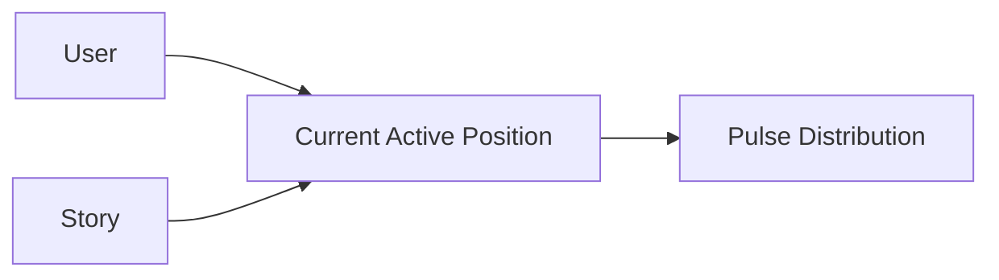

The fundamental counting key is conceptually:

```text
(user_id, story_id)
```

and not:

```text
opinion_id
```

or:

```text
interaction_id
```

---

## Counting invariant

For each Story:

```text
one user
+
one current active position
=
one Pulse participant
```

Conceptually:

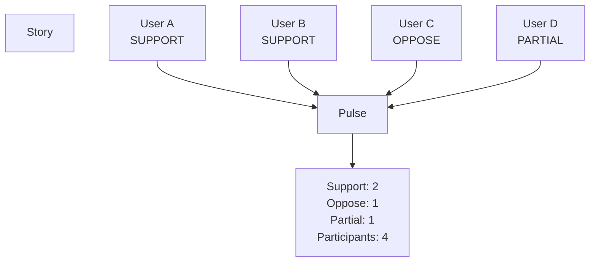

Each user appears only once in the active distribution.

---

## Distribution calculation

For a Story:

```text
support_count
oppose_count
partial_count
undecided_count
```

are counts of unique eligible users whose **current active position** corresponds to each category.

The participant count is:

```text
participant_count =
    support_count
  + oppose_count
  + partial_count
  + undecided_count
```

A percentage is calculated as:

```text
position_count / participant_count * 100
```

For example:

```text
SUPPORT      = 420
OPPOSE       = 310
PARTIAL      = 190
UNDECIDED     = 80
------------------
PARTICIPANTS = 1000
```

produces:

```text
Support      42%
Oppose       31%
Partial      19%
Undecided     8%
```

---

## What counts

The Pulse counts the user's current declared position toward the Story.


The active Opinion is the primary source of the user's declared position.

The exact persistence representation may evolve, but the invariant remains:

> A user cannot contribute more than one active position to the same Story.

---

## What does not count as an additional vote

The following actions must not increase a user's weight in the Pulse:

```text
publishing replies

editing an Opinion

being assigned to multiple Perspectives

selecting "Represents me"

bookmarking a Story

sharing a Story

opening sources

reading the Story multiple times

feed impressions

likes or equivalent engagement signals

multiple recommendation interactions
```

Conceptually:

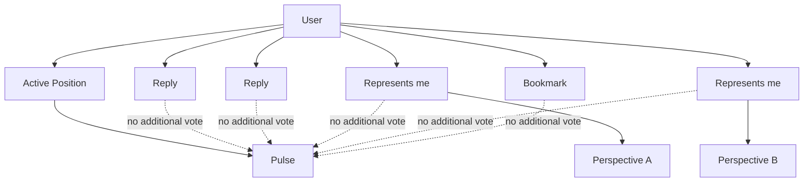

---

## Opinion != vote count

ADR-0006 establishes that an Opinion is human-authored content.

This ADR adds another distinction:

> **Opinion count != Pulse participant count**

Even if the system later supports multiple authored contributions related to the same Story, the Pulse remains based on unique users.

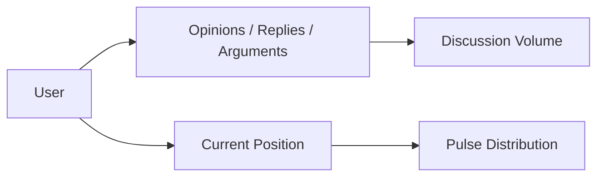

Discussion activity and Pulse distribution are different metrics.

---

## Position change

A user may change their position over time.

For example:

```text
SUPPORT
   ↓
PARTIAL
   ↓
OPPOSE
```

The Pulse must reflect only the user's **latest active position**.

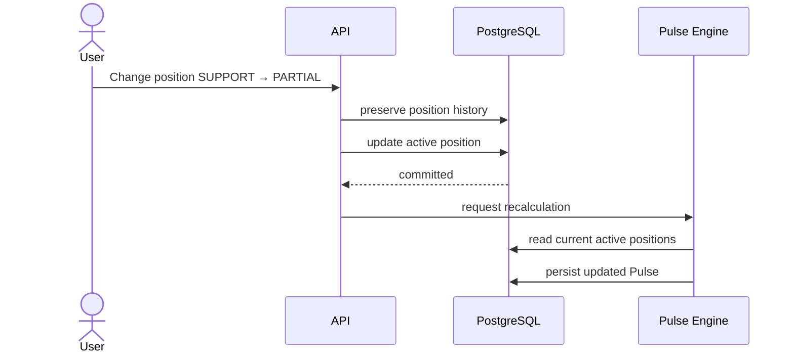

The user must not remain counted in both categories.

Incorrect:

```text
SUPPORT +1
PARTIAL +1
```

Correct:

```text
SUPPORT -1
PARTIAL +1
```

---

## Position history

Changing the current position must not require destroying historical information.

Conceptually:

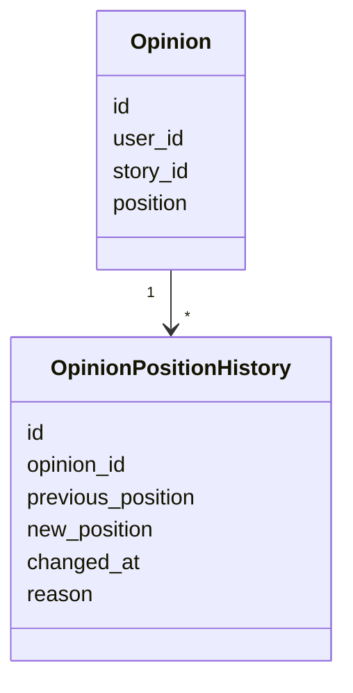

The active state and historical state have different purposes:

```text
Current active position
        ↓
Current Pulse


Position history
        ↓
Evolution analysis
```

Historical positions must not be counted simultaneously in the current Pulse.

---

## Example of position history

Suppose a user evolves through:

```text
09:00 SUPPORT
12:00 PARTIAL
18:00 OPPOSE
```

The current Pulse at 18:01 counts:

```text
OPPOSE = 1
```

not:

```text
SUPPORT = 1
PARTIAL = 1
OPPOSE = 1
```

Historical analysis may still reconstruct the evolution.


---

## "Represents me" is not a vote

Pulso provides a separate social action:

> **Represents me**

Its meaning is:

> This argument adequately represents my view on this point.

This action refers to an argument or Perspective.

It does not redefine the user's position toward the Story.

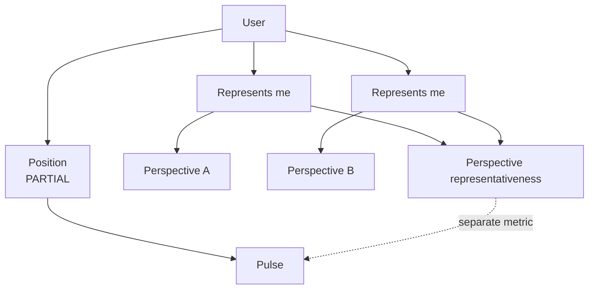

A user may represent multiple Perspectives without increasing their Pulse weight.

---

## Position and Perspective are orthogonal

A user's active position answers:

> Where do I currently stand regarding this Story?

A Representation answers:

> Which arguments describe my reasoning?

For example:

```text
Position:
PARTIAL

Represents me:
✓ The policy expands access
✓ Implementation costs are concerning
✓ Local governments may lack capacity
```

This user still contributes:

```text
PARTIAL = +1
```

to the Pulse.

Not:

```text
PARTIAL = +3
```

---

## Perspective size != Pulse size

A Perspective may report how many Opinions or users are associated with it.

That number has a different semantic meaning from the Pulse.

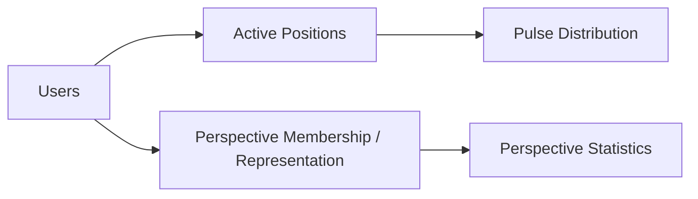

Therefore:

```text
Perspective support
```

and:

```text
Pulse position distribution
```

must not be treated as interchangeable statistics.

---

## Replies

Replies participate in discussion but do not contribute additional Pulse positions.

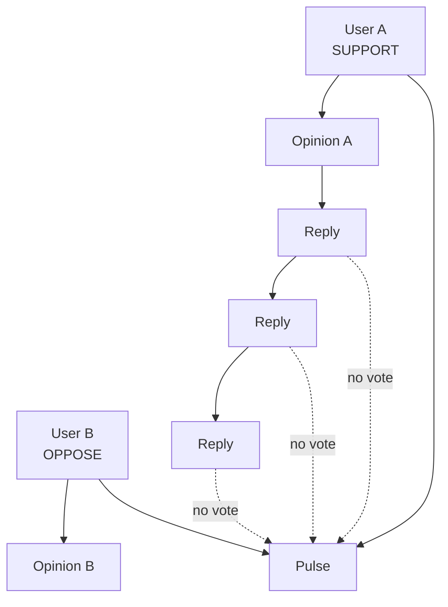

The number of replies measures conversational activity, not positional support.

---

## User with no declared position

A user who reads or interacts with a Story without declaring a position is not included in the Pulse denominator.

For example:

```text
10,000 users viewed the Story

1,250 users declared a position
```

The Pulse denominator is:

```text
1,250
```

not:

```text
10,000
```

Conceptually:

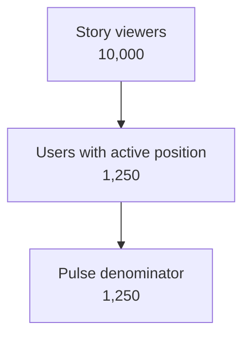

The interface should make this distinction understandable.

---

## UNDECIDED participation

`UNDECIDED` is an explicit position, not the absence of one.

A user who selects:

```text
I am still forming an opinion
```

is intentionally participating in the Pulse.

Therefore:

```text
UNDECIDED
```

is included in:

```text
participant_count
```

while:

```text
no position declared
```

is not.

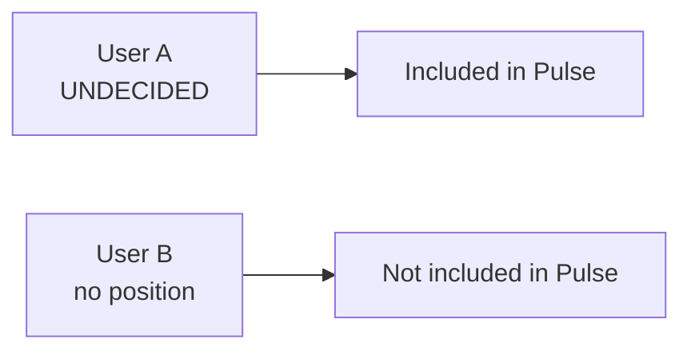

---

## Deletion and invalidation

If the user's active Opinion is deleted or becomes ineligible for the Pulse, the user must no longer contribute that active position unless another valid active position exists.

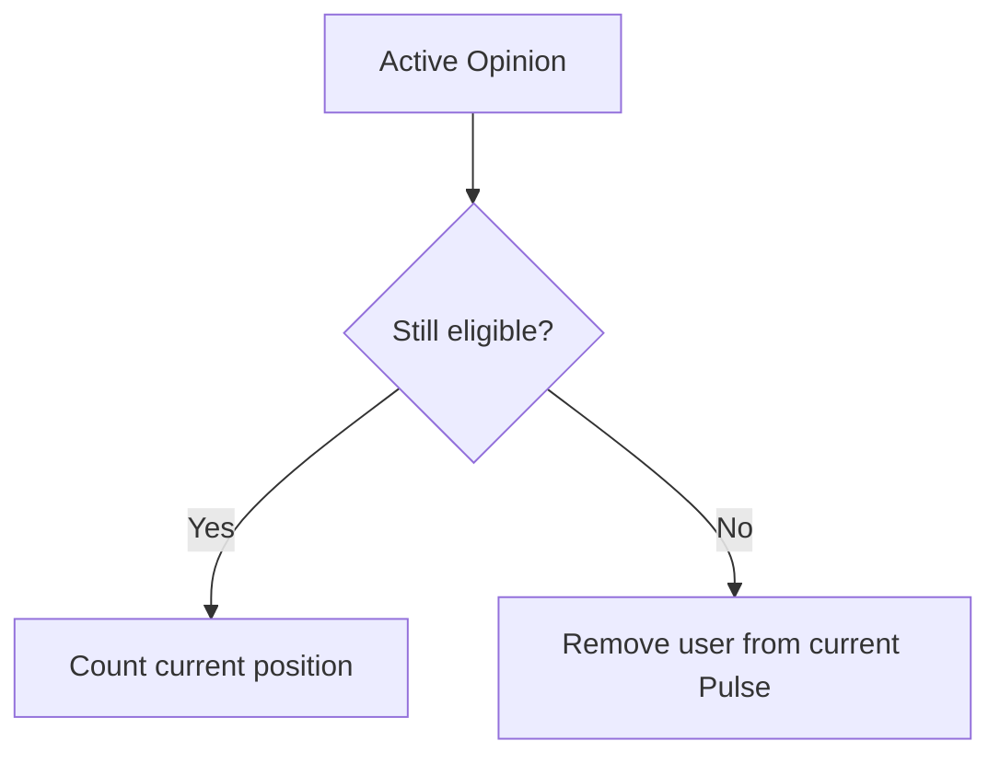

Possible causes include:

- user deletion;
- Opinion deletion;
- moderation state;
- invalidated content;
- domain-specific privacy rules.

The exact moderation policy is outside this ADR.

---

## Moderation

Moderation may affect whether an Opinion remains eligible for the Pulse.

However, the implementation must distinguish between:

```text
content visibility
```

and:

```text
position eligibility
```

where product rules require that distinction.

For example, hiding offensive text does not automatically imply that every related aggregate must be manipulated in the same way.

The final moderation policy must explicitly define whether a moderated Opinion:

- remains counted;
- becomes excluded;
- becomes temporarily suspended.

This ADR only requires that whatever policy is adopted still respects:

> at most one eligible active position per user per Story.

---

## PulseSnapshot

Pulso stores historical snapshots of the distribution.

Conceptually:

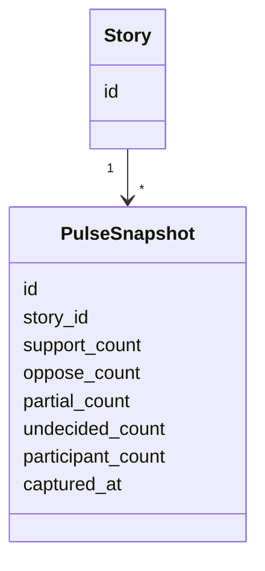

A snapshot represents the aggregate distribution at a particular moment.

Example:

```text
10:00
Support: 55
Oppose: 20
Partial: 15
Undecided: 10

18:00
Support: 48
Oppose: 27
Partial: 17
Undecided: 8
```

---

## Pulse evolution

Snapshots make it possible to observe how the community distribution changes.

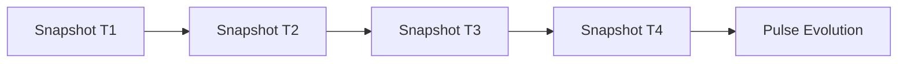

These changes may result from:

- new participants;
- users changing positions;
- Opinions becoming eligible or ineligible.

Historical snapshots are aggregates.

They do not replace individual position history.

---

## Current state vs historical state

Pulso maintains two related but distinct concepts.

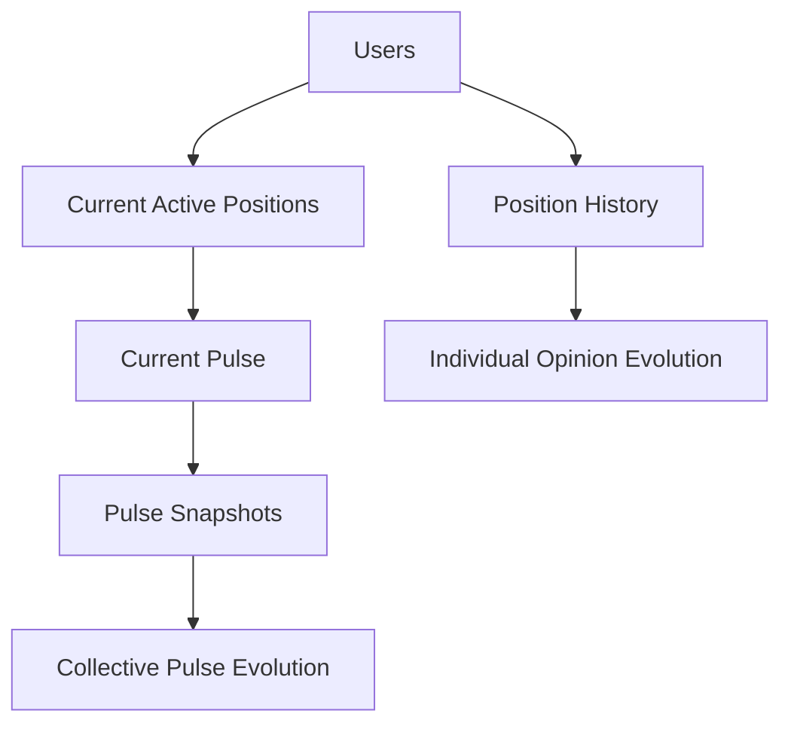

This allows the system to answer different questions:

```text
What does the community currently think?

How has the community distribution changed?

How has this user's position changed?
```

without mixing their semantics.

---

## Recalculation model

The Pulse is derived state.

It may be recalculated from authoritative active positions.


Because the Pulse can be reconstructed, aggregate counters must not become the only source of truth.

The authoritative basis remains the eligible active position for each:

```text
(user_id, story_id)
```

---

## Incremental update vs full recalculation

The implementation may optimize updates incrementally.

For example:

```text
SUPPORT → OPPOSE
```

may produce:

```text
support_count -= 1
oppose_count += 1
```

However, the architecture must preserve the ability to recompute the aggregate from source state.

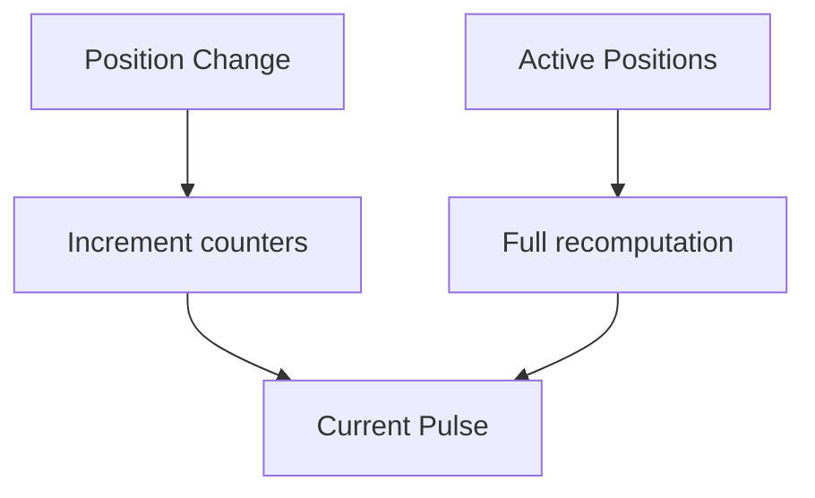

This protects against aggregate drift.

---

## Asynchronous processing

According to ADR-0005, expensive or derived updates may occur asynchronously.

A position change may therefore temporarily produce:

```text
Opinion position updated
Pulse recalculation pending
```

Conceptually:

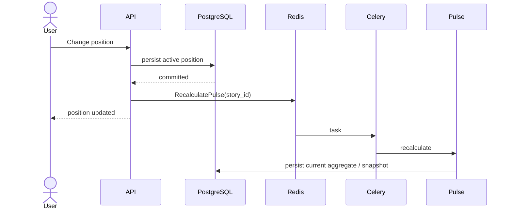

The active position is authoritative.

The Pulse aggregate is derived.

---

## Concurrency

Concurrent updates must not allow the same user to contribute multiple active positions for the same Story.

For example:

```mermaid
sequenceDiagram
    actor User
    participant RequestA
    participant RequestB
    participant DB

    User->>RequestA: SUPPORT
    User->>RequestB: OPPOSE

    RequestA->>DB: update position
    RequestB->>DB: update position

    DB-->>RequestA: committed
    DB-->>RequestB: committed

    Note over DB: exactly one final active position
```

The persistence layer should enforce appropriate uniqueness or transactional constraints.

Conceptually:

```text
UNIQUE active position
ON (user_id, story_id)
```

The exact schema depends on the final Opinion persistence model.

---

## Public meaning of the Pulse

The Pulse represents:

> the distribution of current declared positions among eligible Pulso users who chose to participate in that Story.

It does **not** represent:

```text
the opinion of the entire population

a statistically representative survey

the opinion of all readers

the opinion of all citizens

scientific polling
```

This distinction is essential.

```mermaid
flowchart LR
    Participants["Participating Pulso users"]

    Pulse["Pulse"]

    Population["General population"]

    Participants --> Pulse

    Population -. cannot be inferred directly .-> Pulse
```

The UI and documentation must avoid language that implies scientific representativeness unless a future methodology actually supports such a claim.

---

## Why this matters

Consider the following Story:

```text
User A
Position: SUPPORT
Replies: 15
Representations: 4

User B
Position: OPPOSE
Replies: 1

User C
Position: OPPOSE
Replies: 0
```

Counting interactions would produce a distorted signal.

For example:

```text
User A activity = 20
User B activity = 2
User C activity = 1
```

But the Pulse must report:

```text
SUPPORT = 1
OPPOSE = 2
```

Therefore:

```text
Support = 33.3%
Oppose = 66.7%
```

Activity intensity does not increase voting weight.

---

## Alternatives considered

### Alternative A — Count Opinions

Each Opinion could count as one unit.

```mermaid
flowchart LR
    Opinions["Opinions"]

    Aggregate["Count by position"]

    Pulse["Pulse"]

    Opinions --> Aggregate
    Aggregate --> Pulse
```

#### Advantages

- simple implementation;
- directly tied to published content;
- easy aggregation.

#### Reasons for rejection

If users can generate multiple pieces of content, highly active users would have disproportionate influence.

It would confuse:

```text
amount of content
```

with:

```text
number of participants
```

This conflicts with the meaning of the Pulse.

---

### Alternative B — Count interactions

Likes, replies, Representations and other engagement signals could affect the position distribution.

#### Advantages

- captures engagement intensity;
- creates a dynamic social signal.

#### Reasons for rejection

Engagement does not represent an additional participant.

This would favor:

- highly active users;
- viral Perspectives;
- users who interact frequently.

It would also make the Pulse difficult to interpret.

Engagement may influence recommendation or Perspective statistics, but not the base positional distribution.

---

### Alternative C — Count Perspective memberships

The size of Perspectives could determine the Pulse.

```mermaid
flowchart LR
    Opinions["Opinions"]
    Perspectives["Perspectives"]
    Pulse["Pulse"]

    Opinions --> Perspectives
    Perspectives --> Pulse
```

#### Advantages

- integrates semantic clustering directly into aggregate opinion;
- may expose argument-level distribution.

#### Reasons for rejection

One Opinion may relate to multiple Perspectives.

Perspective memberships are derived and recalculable.

Using them as votes could therefore:

- double-count users;
- make Pulse values change after clustering changes;
- couple positional distribution to AI behavior.

The user's declared position must remain independent from Perspective clustering.

---

### Alternative D — Count only SUPPORT and OPPOSE

The system could reduce the Pulse to a binary distribution.

```text
SUPPORT
OPPOSE
```

#### Advantages

- simpler visualization;
- simpler aggregation;
- easier comparison.

#### Reasons for rejection

Public opinion is not necessarily binary.

Pulso explicitly supports:

```text
PARTIAL
UNDECIDED
```

to preserve uncertainty and mixed positions.

Forcing all users into binary categories would remove meaningful information.

---

## Decision comparison

```mermaid
flowchart LR
    Requirements["Pulse Requirements"]

    EqualWeight["Equal participant weight"]
    Position["Declared position"]
    Changes["Position changes"]
    MultipleActions["Multiple interactions"]
    AIIndependent["Independent from clustering"]
    Evolution["Historical evolution"]

    Decision["One active position<br/>per user per Story"]

    Requirements --> EqualWeight
    Requirements --> Position
    Requirements --> Changes
    Requirements --> MultipleActions
    Requirements --> AIIndependent
    Requirements --> Evolution

    EqualWeight --> Decision
    Position --> Decision
    Changes --> Decision
    MultipleActions --> Decision
    AIIndependent --> Decision
    Evolution --> Decision
```

---

## Consequences

### Positive

- every participating user has equal weight in the Pulse;
- active users cannot inflate the distribution through repeated interactions;
- Perspective clustering cannot directly manipulate the position distribution;
- "Represents me" remains semantically distinct from voting;
- position changes can be represented accurately;
- historical evolution can be reconstructed;
- the Pulse has a clear denominator;
- current state can be recomputed from authoritative positions;
- engagement metrics remain separate from public-position metrics.

### Negative

- current and historical positions require explicit state management;
- position changes require aggregate updates;
- moderation and deletion policies must define Pulse eligibility;
- asynchronous recalculation may temporarily produce stale aggregates;
- snapshots require additional storage;
- concurrency must be handled carefully;
- the UI must communicate the denominator clearly;
- percentages may be misinterpreted as representative polling if not properly labeled.

---

## Risks

### Double counting

A defect could allow the same user to appear in more than one position.

Mitigation:

- database constraints;
- deterministic aggregation;
- tests;
- periodic recomputation.

---

### Aggregate drift

Incrementally maintained counters may diverge from actual active positions.

Mitigation:

```text
periodic full recalculation
+
reconciliation
+
invariant tests
```

---

### Misinterpretation as scientific polling

Users may interpret:

```text
62% support
```

as:

```text
62% of the general population supports this
```

when it actually means:

```text
62% of participating eligible Pulso users
who declared a position on this Story
```

Mitigation:

- clear UI wording;
- expose participant count;
- avoid unsupported population claims;
- document methodology.

---

### Small sample distortion

A Story with:

```text
3 participants
```

may show:

```text
67% support
```

which visually appears more significant than the sample justifies.

The interface should therefore expose participant count alongside percentages.

Possible future UX may include minimum-sample indicators.

The exact presentation rule is outside this ADR.

---

### Coordinated participation

Unique-user counting prevents one account from contributing multiple positions, but does not itself prevent:

- multiple fake accounts;
- coordinated campaigns;
- bot activity;
- brigading.

Those are trust, abuse and moderation problems and require separate mechanisms.

This ADR does not claim that unique-user counting alone guarantees representative or manipulation-resistant results.

---

## Observability implications

Relevant metrics include:

```text
pulse_participants
pulse_support_count
pulse_oppose_count
pulse_partial_count
pulse_undecided_count

position_changes
position_changes_by_story

pulse_recalculations
pulse_recalculation_duration
pulse_recalculation_failures

pulse_snapshot_created

pulse_reconciliation_mismatches
```

Integrity monitoring should verify:

```text
support
+ oppose
+ partial
+ undecided
=
participant_count
```

and:

```text
no eligible user appears in more than one
active position for the same Story
```

---

## Testing implications

Tests should explicitly cover:

```text
User publishes first Opinion
→ participant count increases by 1

User edits Opinion text
→ participant count does not change

User replies multiple times
→ participant count does not change

User selects "Represents me"
→ participant count does not change

User represents multiple Perspectives
→ participant count does not change

User changes SUPPORT → OPPOSE
→ SUPPORT decreases by 1
→ OPPOSE increases by 1
→ participant count remains unchanged

User selects UNDECIDED
→ included in participant count

User reads without declaring position
→ not included

Eligible Opinion is removed
→ user removed from current Pulse

Reprocessing Perspectives
→ Pulse position distribution does not change
```

These should be treated as domain-level invariant tests.

---

## Architectural invariants

This ADR establishes the following invariants:

```text
The Pulse counts unique users, not content objects.

A user contributes at most one active position per Story.

The counting identity is conceptually (user_id, story_id).

Only the current eligible position contributes to the current Pulse.

Historical positions do not count simultaneously.

Position changes move the user between buckets.

Replies do not create additional Pulse weight.

Perspective memberships do not create additional Pulse weight.

"Represents me" does not create additional Pulse weight.

Recommendation interactions do not create additional Pulse weight.

UNDECIDED is an explicit participating position.

No declared position means the user is not in the denominator.

Pulse aggregates are derived and recalculable.

PulseSnapshot records aggregate state over time.

The Pulse describes participating Pulso users, not the general population.
```

---

## Evolution criteria

The basic one-user-one-current-position invariant is considered a domain rule.

It is not expected to change simply because the system scales.

Future work may introduce additional aggregate dimensions, for example:

```text
Perspective representativeness

argument prevalence

confidence intervals

participation trends

regional distribution

time-based cohorts
```

Conceptually:

```mermaid
flowchart TB
    Users["Participating Users"]

    Position["Current Position"]
    Perspective["Represented Perspectives"]
    History["Position History"]

    Pulse["Pulse Distribution"]
    Arguments["Argument Distribution"]
    Evolution["Pulse Evolution"]

    Users --> Position
    Users --> Perspective
    Users --> History

    Position --> Pulse
    Perspective --> Arguments
    History --> Evolution
```

These aggregates must remain semantically distinct.

Any future weighted-voting or sampling methodology would require a new ADR because it would change the meaning of the Pulse itself.

---

## Non-goals

This ADR does not define:

- identity verification;
- bot detection;
- anti-brigading mechanisms;
- demographic weighting;
- scientific sampling;
- survey methodology;
- geographic weighting;
- Perspective ranking;
- recommendation weighting;
- moderation eligibility policy;
- minimum sample size for display;
- exact percentage rounding rules;
- final visualization of the Pulse.

These decisions require separate product, moderation or architectural decisions.

---

## Decision summary

The Pulse measures the distribution of **current declared positions among unique participating users**.

```mermaid
flowchart LR
    User["Unique User"]

    Position["One Current Position"]

    Aggregate["Aggregate by Story"]

    Pulse["Pulse"]

    User --> Position
    Position --> Aggregate
    Aggregate --> Pulse
```

The core rule is:

> **One user, one active position, per Story.**

Therefore:

```text
Opinions
Replies
Perspective memberships
"Represents me"
Bookmarks
Engagement
```

do not create additional votes.

A position change replaces the user's previous contribution in the current distribution while preserving historical information.

The Pulse is a community participation signal, not a measure of content volume and not a statistically representative poll of the general population.