# ADR-0008 — Recommendation Personalizes Discovery, Not Truth

- **Status:** Accepted
- **Date:** 2026-09-14
- **Decision owners:** Pulso maintainers
- **Related:**
  - [ADR-0003 — Article != Story](0003-article-not-equal-story.md)
  - [ADR-0004 — AI Is Not a Source of Truth](0004-ai-is-not-a-source.md)
  - [ADR-0006 — Opinion != Perspective](0006-opinion-not-equal-perspective.md)
  - [ADR-0007 — Pulse Counts Unique Users](0007-pulse-counts-unique-users.md)

## Context

Pulso provides a personalized feed.

Different users may have different interests, reading patterns and levels of engagement with topics.

The Recommendation Engine may therefore consider signals such as:

- semantic similarity with user interests;
- topics followed or selected by the user;
- previous Story interactions;
- source consultation;
- bookmarks;
- Opinion participation;
- explicit negative feedback;
- recency;
- exploration;
- diversity.

Personalization is useful because the complete set of available Stories may be much larger than what a user can reasonably consume.

However, personalization introduces an important product and architectural risk.

If recommendation logic influences not only **which Stories are shown**, but also:

- which facts appear inside a Story;
- which sources are omitted;
- the Pulse distribution;
- which Perspectives are considered relevant;
- how the Story summary is generated;
- how public disagreement is represented;

then two users may effectively receive different representations of the same event.

For example:

```text
User A
supports the proposal

User B
opposes the proposal
```

must not result in:

```text
User A sees a Story that emphasizes only supporting facts

User B sees a Story that emphasizes only opposing facts
```

Pulso therefore requires a strict boundary between:

```text
personalized discovery
```

and:

```text
shared representation of a Story
```

---

## Decision

Pulso will personalize **which Stories are recommended and how they are ranked**.

It will not personalize the factual reality represented inside those Stories.

> **Recommendation personalizes discovery, not truth.**

Conceptually:

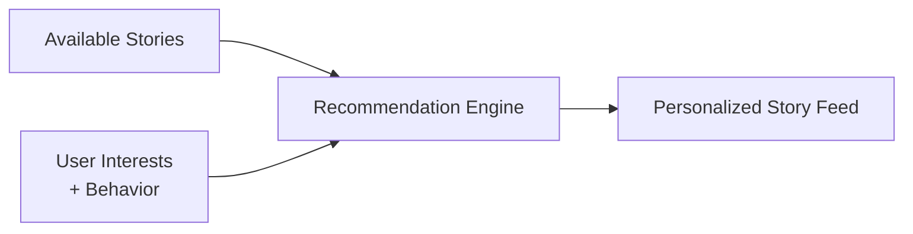

Once a Story is selected, its shared content remains governed by the News and Opinion domains.

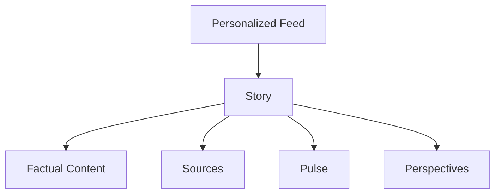

The Recommendation Engine chooses:

```text
which Story
```

and:

```text
in which order
```

It does not choose:

```text
which version of reality the user receives.
```

---

## Recommendation scope

The Recommendation Engine owns ranking and discovery decisions.

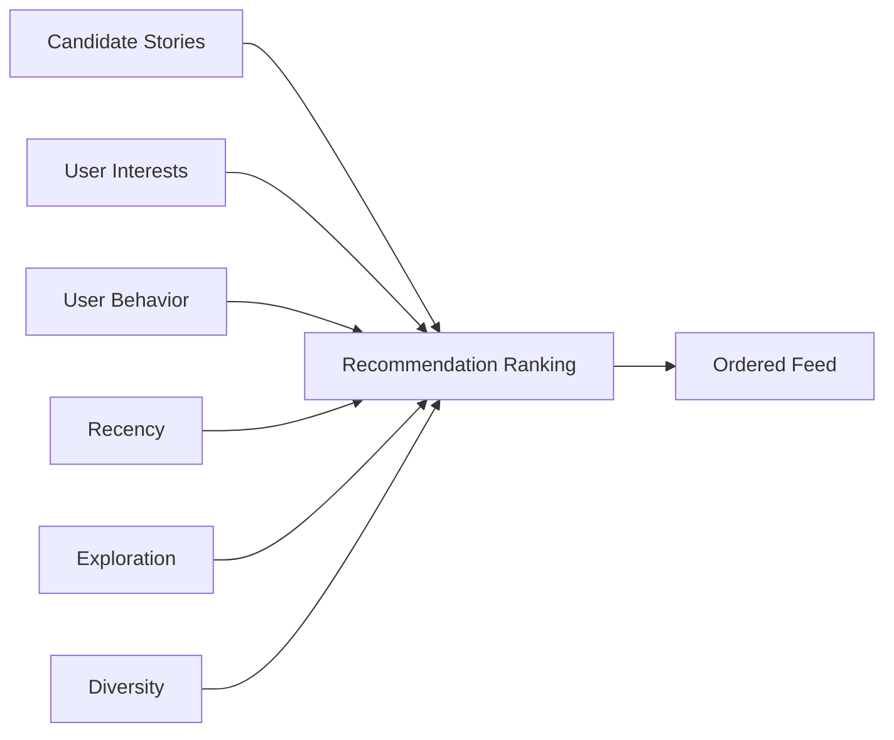

It may determine:

- Story eligibility for a personalized feed;
- Story score;
- Story order;
- exploration candidates;
- topic diversity;
- recency contribution;
- semantic affinity.

It does not own the factual content of a Story.

---

## Personalized vs shared state

The architecture distinguishes personalized state from shared domain state.

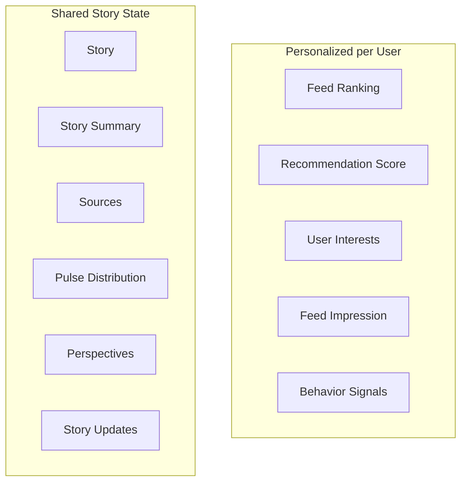

Two users may receive:

```text
different Stories
different Story ordering
different recommendation scores
```

while receiving the same shared representation when opening the same Story.

---

## Same Story, same factual layer

For the same Story:

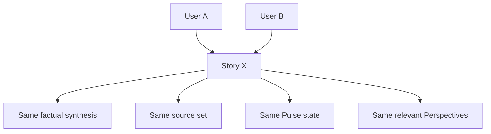

Personalization must not cause:

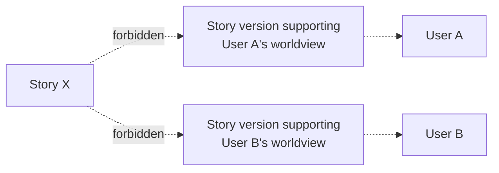

---

## Story remains the recommendation unit

ADR-0003 establishes:

> `Article != Story`

The Recommendation Engine therefore operates primarily on Stories rather than individual Articles.

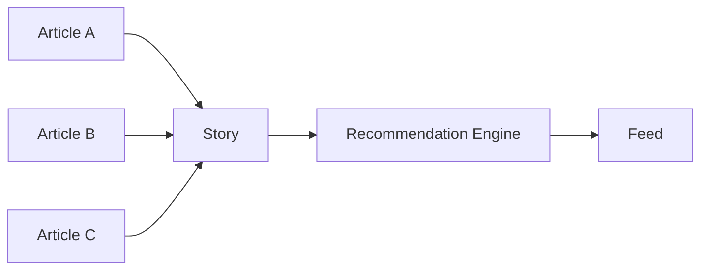

This prevents multiple publications about the same event from independently occupying several positions in the personalized feed.

The system may still use Article-level information as recommendation features, but the primary user-facing recommendation unit is the Story.

---

## Recommendation does not select factual claims

The Recommendation Engine must not operate at the level of individual factual claims inside a Story.

Invalid model:

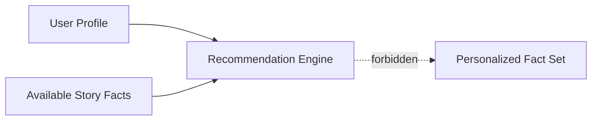

Valid model:

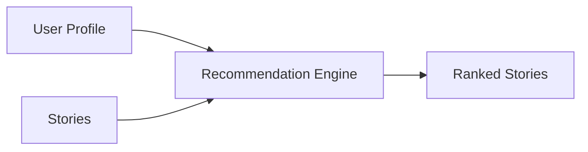

Factual synthesis belongs to the News Engine.

---

## Recommendation does not alter Story summaries

Story summaries are derived from source Articles according to ADR-0004.


The user's recommendation profile must not participate in this synthesis.

Invalid:

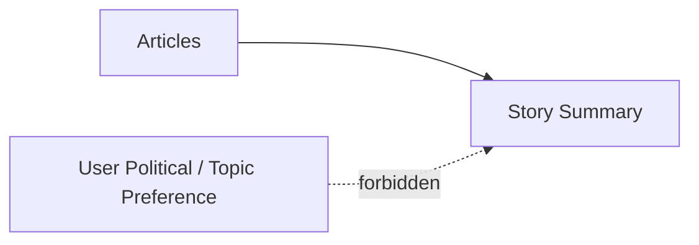

Recommendation preferences may decide whether the Story appears in the feed.

They must not decide how the factual Story is written for that user.

---

## Recommendation does not alter the Pulse

ADR-0007 establishes that the Pulse represents current declared positions among participating users.

The Recommendation Engine may read the Pulse as contextual information if a future ranking strategy justifies it.

It must not rewrite it.

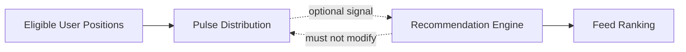

For the same Pulse snapshot:

```text
User A sees:
Support 42%
Oppose 31%
Partial 19%
Undecided 8%

User B sees:
Support 42%
Oppose 31%
Partial 19%
Undecided 8%
```

not personalized distributions.

---

## Recommendation does not redefine Perspectives

ADR-0006 establishes that Perspectives are derived from Opinions.

The Recommendation Engine must not generate a different set of Perspectives based on what a particular user prefers to hear.

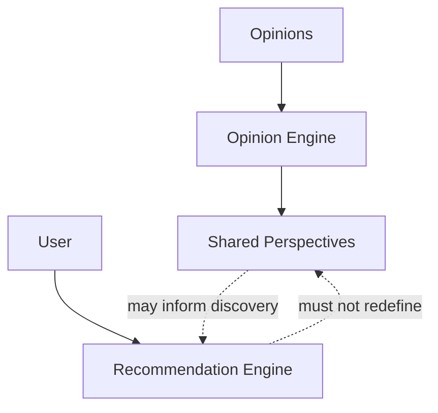

Perspective existence and synthesis belong to the Opinion Engine.

---

## Perspective presentation

Personalization may influence limited presentation decisions where the underlying discussion remains intact.

For example, the interface may eventually highlight:

```text
a Perspective close to the user's view
```

together with:

```text
a relevant counterpoint
```

However, recommendation must not systematically suppress relevant disagreement.

Conceptually:

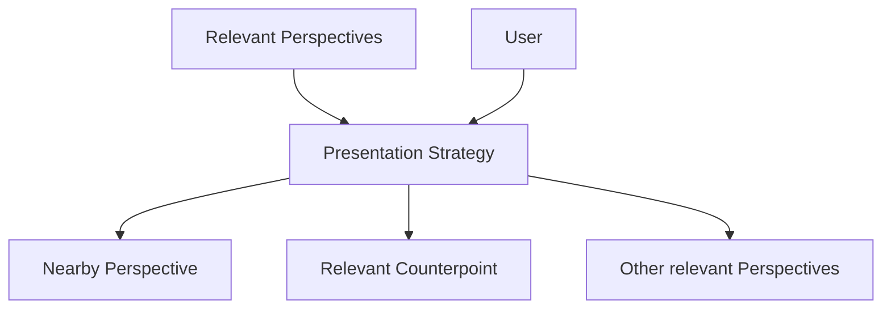

The goal is understanding the discussion, not maximizing agreement with the user.

---

## Counterpoint preservation

Pulso explicitly supports exploring counterpoints.

A recommendation or presentation strategy must not create a filter where users only encounter arguments aligned with their previous behavior.

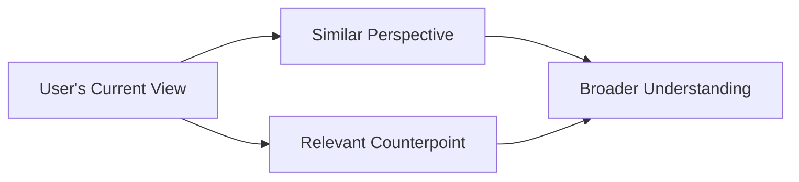

This does not require artificial numerical balance between every Perspective.

It requires that personalization not intentionally erase relevant disagreement merely because it may reduce engagement.

---

## Recommendation signals

Initial ranking may combine several categories of signals.

Conceptually:

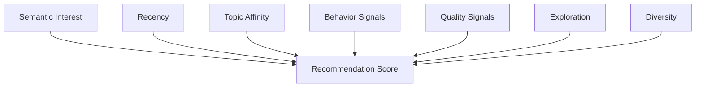

A conceptual ranking model may resemble:

```text
score =
    semantic interest
  + recency
  + topic affinity
  + engagement
  + quality
  + exploration
  + diversity adjustments
```

This ADR does not define final weights.

Weights must be experimentally evaluated.

---

## Behavioral signals

Behavior may help infer user interests.

Examples include:

```text
opening a Story

reading deeply

opening a source

bookmarking

sharing

publishing an Opinion

explicitly selecting "not interested"

quickly skipping
```

Conceptually:


Behavioral signals influence discovery.

They do not alter the semantic meaning of Stories already created.

---

## Opinion signals and recommendation

Publishing an Opinion may be a strong signal that the Story or topic is relevant to the user.

However:

```text
position = OPPOSE
```

must not automatically mean:

```text
show only Stories supporting OPPOSE
```

Likewise:

```text
position = SUPPORT
```

must not mean:

```text
hide challenging information.
```

The Recommendation Engine should infer:

```text
interest in the Story / topic
```

separately from:

```text
agreement with a particular conclusion.
```

---

## Interest != agreement

This distinction is an architectural principle.

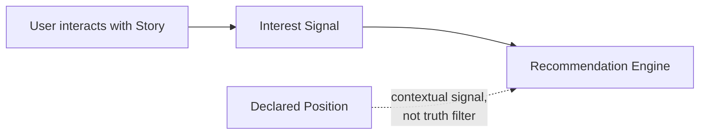

A user may frequently read content they disagree with.

The system must not assume:

```text
consumption = endorsement
```

or:

```text
position = desired factual framing
```

---

## Exploration

A purely exploitative recommender could repeatedly show only content close to previously observed interests.

Pulso therefore allows an explicit exploration component.

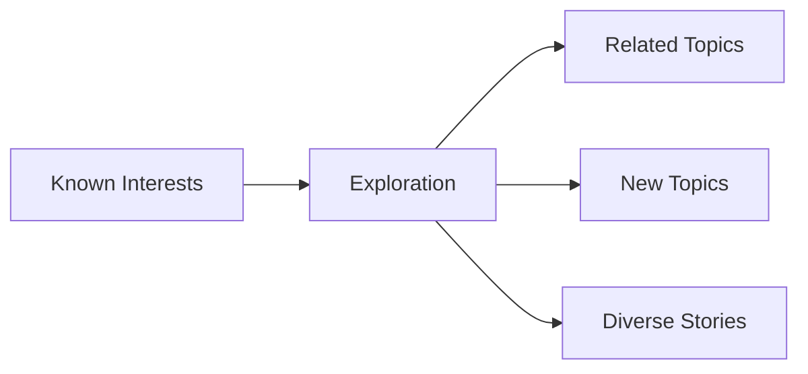

Exploration helps:

- discover new topics;
- reduce over-specialization;
- collect better preference signals;
- prevent the feed from becoming static.

The exact exploration rate is outside the scope of this ADR.

---

## Diversity

Diversity may be introduced as a ranking or re-ranking constraint.

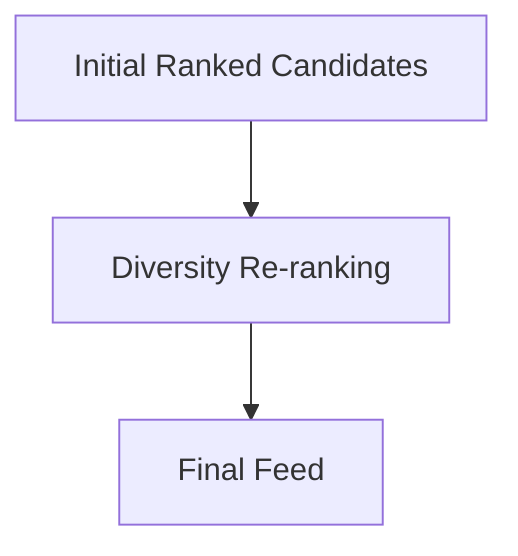

Possible dimensions include:

- topics;
- entities;
- Story recency;
- source coverage;
- exploration vs exploitation.

Diversity is intended to improve information discovery.

It must not fabricate balance or modify Story facts.

---

## FeedImpression

Recommendation quality cannot be evaluated only from positive interactions.

Pulso must distinguish:

```text
Story was never shown
```

from:

```text
Story was shown and ignored
```

`FeedImpression` records exposure.

Conceptually:

```mermaid
classDiagram
    class User {
        id
    }

    class Story {
        id
    }

    class FeedImpression {
        user_id
        story_id
        position
        shown_at
        duration
        opened
        interacted
    }

    User "1" --> "*" FeedImpression
    Story "1" --> "*" FeedImpression
```

This provides context for behavioral signals.

---

## Why impressions matter

Consider:

```text
Story A
never shown
```

versus:

```text
Story B
shown 10 times
never opened
```

These are not equivalent.

```mermaid
flowchart LR
    A["Story A<br/>never shown"]

    B["Story B<br/>shown and ignored"]

    Model["Recommendation Learning"]

    A --> Unknown["Unknown preference"]
    B --> Negative["Possible weak negative signal"]

    Unknown --> Model
    Negative --> Model
```

Without impressions, the Recommendation Engine cannot reliably distinguish absence of exposure from lack of interest.

---

## Recommendation state is derived

Recommendation scores and user interest representations are derived data.

```mermaid
flowchart LR
    Interactions["User Interactions"]

    Interests["User Interest Model"]

    Scores["Recommendation Scores"]

    Feed["Feed"]

    Interactions --> Interests
    Interests --> Scores
    Scores --> Feed
```

They may be recalculated when:

- ranking algorithms change;
- embeddings change;
- signal weights change;
- user behavior changes.

The underlying Stories remain unchanged.

---

## Asynchronous processing

Recommendation profile updates may execute asynchronously according to ADR-0005.

```mermaid
sequenceDiagram
    actor User
    participant API
    participant DB as PostgreSQL
    participant Broker as Redis
    participant Worker as Celery
    participant Rec as Recommendation Engine

    User->>API: Interact with Story

    API->>DB: persist interaction
    DB-->>API: committed

    API->>Broker: UpdateUserInterest(user_id)
    API-->>User: response

    Broker->>Worker: task
    Worker->>Rec: recompute interest model
    Rec->>DB: persist derived representation
```

The recommender may therefore be eventually consistent with the latest interaction.

---

## Cold start

A new user may have little or no behavioral data.

Initial candidate selection may use:

- onboarding topic selection;
- recent Stories;
- popular Stories;
- editorially neutral discovery rules;
- exploration.

```mermaid
flowchart TB
    NewUser["New User"]

    Topics["Selected Interests"]
    Recent["Recent Stories"]
    Explore["Exploration"]

    Initial["Initial Feed"]

    NewUser --> Topics
    Topics --> Initial
    Recent --> Initial
    Explore --> Initial
```

Cold-start behavior must still respect the same Story integrity rules.

---

## Recommendation boundary

The Recommendation Engine may:

```text
read Story metadata

read Story embeddings

read Topics

read Entities

read user interests

read FeedImpressions

read interaction signals

calculate recommendation scores

rank Stories

re-rank for exploration or diversity
```

It must not:

```text
rewrite Story summaries

modify source evidence

change Article → Story membership

modify Pulse counts

create or remove user positions

rewrite Opinions

generate Perspectives based on one user's preferences

hide disagreement by changing shared Perspective state
```

---

## Module ownership

Conceptually:

```mermaid
flowchart TB
    News["News Engine"]

    Opinion["Opinion Engine"]

    Recommendation["Recommendation Engine"]

    Stories["Stories"]
    Perspectives["Perspectives"]
    Pulse["Pulse"]
    Feed["Personalized Feed"]

    News --> Stories

    Opinion --> Perspectives
    Opinion --> Pulse

    Stories --> Recommendation
    Perspectives -. optional read .-> Recommendation
    Pulse -. optional read .-> Recommendation

    Recommendation --> Feed

    Recommendation -. no ownership .-> Stories
    Recommendation -. no ownership .-> Perspectives
    Recommendation -. no ownership .-> Pulse
```

The Recommendation Engine consumes domain information.

It does not own that information.

---

## Shared Story integrity

A useful invariant is:

```text
Same Story ID
      ↓
same factual Story state
```

regardless of the user who requested it.

```mermaid
sequenceDiagram
    participant A as User A
    participant API
    participant Story
    participant B as User B

    A->>API: GET /stories/X
    API->>Story: load X
    Story-->>API: shared Story state
    API-->>A: Story X

    B->>API: GET /stories/X
    API->>Story: load X
    Story-->>API: shared Story state
    API-->>B: Story X
```

User-specific metadata may still accompany the response, such as:

```text
bookmarked
user_position
represents_me
recommendation_context
```

but the underlying Story remains shared.

---

## Alternatives considered

### Alternative A — Fully personalized content

Story summaries and Perspective presentation could adapt to each user's profile.

```mermaid
flowchart LR
    Story["Story"]

    UserA["User A"]
    UserB["User B"]

    AI["Personalized Generation"]

    A["Version A"]
    B["Version B"]

    Story --> AI
    UserA --> AI
    UserB --> AI

    AI --> A
    AI --> B
```

#### Advantages

- potentially higher engagement;
- content can match user preferences;
- personalized explanation depth;
- potentially more relevant framing.

#### Reasons for rejection

This would blur the distinction between recommendation and factual synthesis.

It could:

- create inconsistent representations of the same event;
- reinforce confirmation bias;
- make Story auditing difficult;
- make source traceability harder to understand;
- create different factual emphasis for different users.

Pulso intentionally separates discovery personalization from shared factual content.

---

### Alternative B — Pure engagement optimization

The feed could optimize primarily for:

```text
clicks
time spent
replies
Opinion activity
Representations
shares
```

#### Advantages

- straightforward optimization target;
- potentially high short-term engagement;
- common recommender pattern.

#### Reasons for rejection

Engagement alone does not represent information quality or user understanding.

It may systematically favor:

- outrage;
- repetition;
- polarizing content;
- narrow topic loops;
- sensational Stories.

Pulso therefore allows engagement as one signal rather than the sole objective.

---

### Alternative C — No personalization

All users could receive the same feed.

```mermaid
flowchart LR
    Stories["Stories"]

    Global["Global Ranking"]

    UserA["User A"]
    UserB["User B"]
    UserC["User C"]

    Stories --> Global

    Global --> UserA
    Global --> UserB
    Global --> UserC
```

#### Advantages

- simplest architecture;
- transparent ranking;
- no user profiling;
- lower implementation complexity.

#### Reasons for rejection

Pulso contains many topics and Stories.

A single ranking cannot efficiently reflect different user interests.

Personalized discovery provides product value as long as it remains bounded by shared Story integrity.

---

### Alternative D — Personalize Perspectives only

The platform could show each user mainly the Perspectives most aligned with their existing position.

#### Advantages

- highly relevant discussion;
- lower cognitive load;
- potentially higher social engagement.

#### Reasons for rejection

This could transform personalization into confirmation filtering.

It would undermine Pulso's goal of helping users understand:

```text
arguments close to their view
```

and:

```text
arguments different from their view.
```

Relevant counterpoints must remain discoverable.

---

## Decision comparison

```mermaid
flowchart LR
    Requirements["Pulso Requirements"]

    Relevance["Personal relevance"]
    Integrity["Shared Story integrity"]
    Traceability["Source traceability"]
    Diversity["Discovery diversity"]
    Counterpoints["Counterpoint visibility"]
    Explainability["Understandable ranking boundary"]

    Decision["Personalize Story discovery<br/>not shared truth"]

    Requirements --> Relevance
    Requirements --> Integrity
    Requirements --> Traceability
    Requirements --> Diversity
    Requirements --> Counterpoints
    Requirements --> Explainability

    Relevance --> Decision
    Integrity --> Decision
    Traceability --> Decision
    Diversity --> Decision
    Counterpoints --> Decision
    Explainability --> Decision
```

---

## Consequences

### Positive

- users receive more relevant Story discovery;
- factual Story state remains consistent across users;
- Pulse percentages retain shared meaning;
- Perspectives remain products of community Opinions rather than user-specific generation;
- source traceability remains understandable;
- recommendation experiments can evolve independently from News and Opinion domain state;
- feed ranking can improve without rewriting Stories;
- confirmation filtering is constrained architecturally;
- recommendation behavior becomes easier to reason about and test.

### Negative

- personalization opportunities are intentionally limited;
- some user-specific presentation techniques cannot be used;
- ranking must balance several competing objectives;
- exploration may reduce short-term engagement;
- diversity introduces additional ranking complexity;
- recommendations may still indirectly create filter bubbles through Story selection;
- determining what counts as a relevant counterpoint can be difficult;
- behavioral signals may be noisy.

---

## Risks

### Filter bubble at Story-selection level

Even when Story content is shared, repeatedly recommending only the same topics may narrow user exposure.

```mermaid
flowchart LR
    Interest["Existing Interest"]

    Ranking["Recommendation"]

    Similar["More Similar Stories"]

    Feedback["More Similar Behavior"]

    Interest --> Ranking
    Ranking --> Similar
    Similar --> Feedback
    Feedback --> Interest
```

Mitigation:

- exploration;
- diversity;
- topic variety;
- explicit negative feedback;
- measurement of recommendation concentration.

---

### Engagement bias

Stories that generate strong reactions may receive disproportionately strong signals.

Mitigation:

- do not optimize only for engagement;
- separate interest from agreement;
- include recency, quality, exploration and diversity signals;
- evaluate ranking outcomes.

---

### Position leakage into confirmation filtering

The system may learn:

```text
User = SUPPORT
```

and begin over-serving Stories or discussions that reinforce SUPPORT.

Mitigation:

> Treat position primarily as contextual information, not as a command to reinforce the same conclusion.

---

### Popularity feedback loop

Highly recommended Stories receive more exposure.

More exposure creates more interactions.

More interactions may increase ranking further.

```mermaid
flowchart LR
    Rank["High Rank"]

    Exposure["More Exposure"]

    Interaction["More Interaction"]

    Score["Higher Score"]

    Rank --> Exposure
    Exposure --> Interaction
    Interaction --> Score
    Score --> Rank
```

Mitigation may include:

- impression-aware metrics;
- normalized engagement;
- exploration;
- freshness;
- diversity;
- exposure-aware evaluation.

---

### Hidden suppression of minority Perspectives

Even if Perspective data remains intact, presentation logic could make minority arguments practically invisible.

Mitigation:

- distinguish relevance from popularity;
- preserve access to all eligible Perspectives;
- expose counterpoints;
- evaluate visibility distribution.

---

## Observability implications

Recommendation should expose metrics that allow ranking behavior to be evaluated.

Initial operational metrics may include:

```text
feed_requests
candidate_stories
recommendation_duration
recommendation_failures

feed_impressions
story_opens
source_opens
bookmarks
opinions_created
not_interested_actions

user_interest_updates
recommendation_profile_updates
recommendation_profile_failures
```

Ranking-quality metrics may eventually include:

```text
click-through rate
open rate
source consultation rate
bookmark rate

topic diversity
entity diversity
feed concentration
exploration exposure
repeat Story rate

position-based exposure distribution
counterpoint exposure
```

The system should not evaluate recommendation quality exclusively through engagement.

---

## Testing implications

Tests should explicitly verify architectural boundaries.

Examples:

```text
Two users request the same Story
→ same Story summary

Two users request the same Story
→ same source set

Two users request the same Story
→ same current Pulse distribution

Two users request the same Perspective
→ same Perspective synthesis

Different users request their feeds
→ Story ordering may differ

User changes interests
→ future Story ranking may change

User changes position
→ Story facts do not change

User selects "Represents me"
→ Story facts do not change

Recommendation profile is rebuilt
→ Pulse does not change

Recommendation profile is rebuilt
→ Perspectives are not rewritten
```

These should be treated as architecture-level invariants.

---

## Architectural invariants

This ADR establishes the following invariants:

```text
Recommendation personalizes discovery, not truth.

The primary recommendation unit is Story.

Users may receive different Story rankings.

The same Story preserves the same shared factual state across users.

Recommendation does not rewrite Story summaries.

Recommendation does not modify source evidence.

Recommendation does not alter Pulse distribution.

Recommendation does not redefine Perspectives.

Position is not equivalent to interest.

Consumption is not equivalent to endorsement.

Engagement is a recommendation signal, not the sole objective.

FeedImpression distinguishes exposure from absence of exposure.

Exploration and diversity are valid ranking concerns.

Relevant disagreement must not be intentionally removed merely to maximize agreement.

Recommendation state is derived and recalculable.
```

---

## Evolution criteria

The recommendation algorithm is expected to evolve significantly.

Possible future approaches include:

```text
rule-based ranking

weighted scoring

semantic retrieval

learning-to-rank

collaborative filtering

hybrid recommendation

contextual bandits

multi-objective ranking
```

Conceptually:

```mermaid
flowchart TB
    Candidates["Story Candidates"]

    Algorithm["Recommendation Algorithm"]

    Constraints["Integrity / Diversity Constraints"]

    Feed["Personalized Feed"]

    Candidates --> Algorithm
    Algorithm --> Constraints
    Constraints --> Feed
```

The recommendation algorithm may change without changing the central invariant:

> personalized ranking must not rewrite shared Story truth.

A new ADR is required if Pulso intentionally changes that boundary.

---

## Non-goals

This ADR does not define:

- final recommendation weights;
- final ranking algorithm;
- final embedding model;
- exact exploration percentage;
- final diversity algorithm;
- collaborative filtering strategy;
- learning-to-rank implementation;
- final cold-start algorithm;
- Perspective ranking algorithm;
- source-quality scoring;
- notification recommendation;
- experimentation platform;
- final recommendation explainability UI.

These decisions require implementation evidence or separate ADRs.

---

## Decision summary

Pulso separates:

```text
what the user is likely to want to discover
```

from:

```text
what the Story says happened.
```

The Recommendation Engine operates here:

```mermaid
flowchart LR
    User["User"]

    Interests["Interests + Behavior"]

    Stories["Available Stories"]

    Ranking["Recommendation Engine"]

    Feed["Personalized Feed"]

    User --> Interests

    Interests --> Ranking
    Stories --> Ranking

    Ranking --> Feed
```

It does not operate here:

```mermaid
flowchart LR
    Articles["Articles"]

    Story["Story Facts / Summary"]

    Pulse["Pulse"]

    Perspectives["Perspectives"]

    Articles --> Story

    Story --> Pulse
    Story --> Perspectives

    Recommendation["Recommendation Engine"]

    Recommendation -. no factual ownership .-> Story
    Recommendation -. no aggregate ownership .-> Pulse
    Recommendation -. no semantic ownership .-> Perspectives
```

Different users may discover different Stories in different orders.

When they open the same Story, the underlying factual content, source provenance, Pulse distribution and community Perspectives remain shared.

The fundamental rule is:

> **Recommend Stories. Do not personalize truth.**