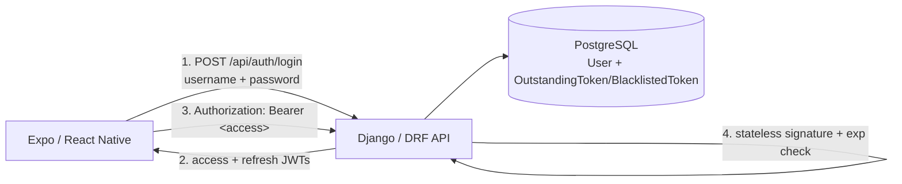
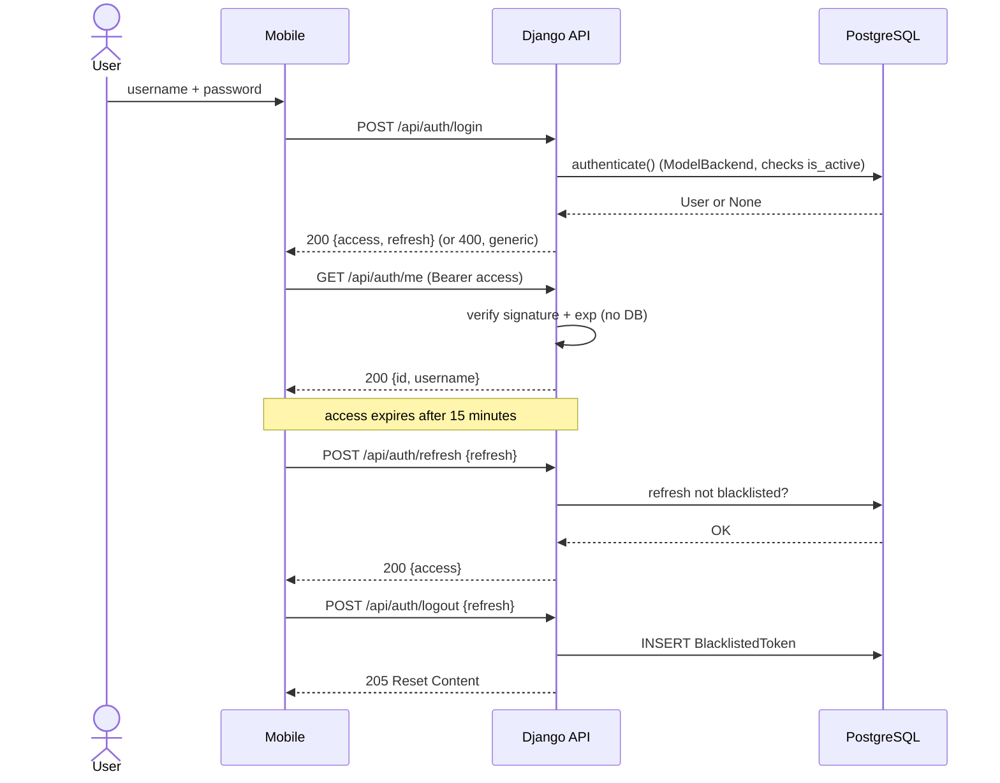
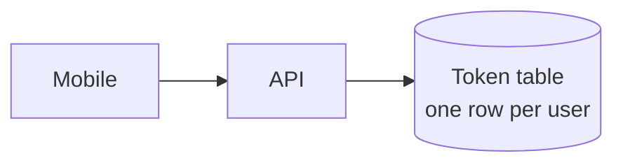
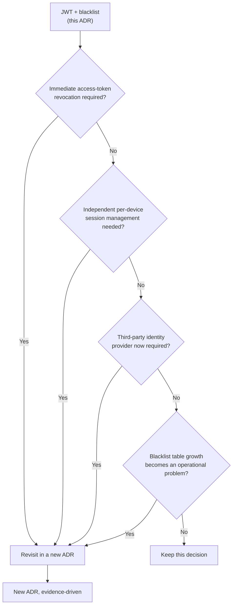
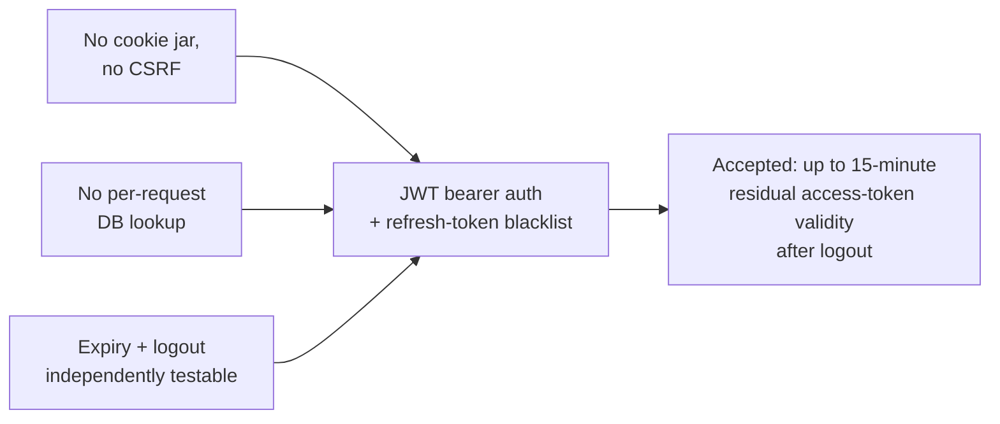

# ADR-0009 — JWT Bearer Authentication for the Mobile API

- **Status:** Accepted
- **Date:** 2026-09-16
- **Decision owners:** Pulso maintainers
- **Related:**
  - [ADR-0001 — Modular Monolith with Background Workers](0001-modular-monolith-with-workers.md)
  - [ADR-0007 — Pulse Counts Unique Users](0007-pulse-counts-unique-users.md) — identity prerequisite, not identity verification or Pulse implementation

## Context

Issue #1 established a custom Django `User` model (`AUTH_USER_MODEL =
"accounts.User"`) with no product-profile fields, deferring the mobile API
authentication mechanism explicitly to this issue. Until now,
`REST_FRAMEWORK["DEFAULT_AUTHENTICATION_CLASSES"]` was empty: no request
could ever be recognized as authenticated, and `DEFAULT_PERMISSION_CLASSES`
was `IsAuthenticated`, so every future endpoint was closed by default.

Pulso's only client today, and the one this decision is made for, is the
Expo/React Native mobile application (root README, ADR-0001). A React
Native app:

- has no browser-managed cookie jar as a first-class primitive the way a
  web app does;
- talks to the API over plain HTTP requests, typically through a
  hand-rolled or generated client, not a form submission;
- needs to stay signed in across app restarts without re-prompting for a
  password every time;
- benefits from a credential whose validity can be checked without a
  database round trip on every single request, given the API also serves
  Celery-adjacent, potentially latency-sensitive traffic (ADR-0005).

The Foundation plan (`not_shared/planning/v0.1.0-foundation-issues.md`,
FND-06) frames this explicitly: *"Evaluate relevant session and token/JWT
alternatives and record a new ADR if the tradeoffs warrant one. No
mechanism is selected by this plan."* This ADR is that evaluation.

Out of scope for this decision: registration, password recovery, social
login, multi-factor authentication and the mobile login UI itself (all
explicitly deferred by issue #6's scope).

---

## Decision

Pulso's mobile API uses **stateless JWT bearer authentication**, via
[`djangorestframework-simplejwt`](https://django-rest-framework-simplejwt.readthedocs.io/),
with the library's **token blacklist app** enabled for logout.



A successful login returns two tokens:

| Token | Lifetime | Carried as | Verified by |
| --- | --- | --- | --- |
| `access` | 15 minutes | `Authorization: Bearer <access>` header | Signature + `exp` claim only — no DB lookup per request |
| `refresh` | 14 days | Request body at `/api/auth/refresh` or `/api/auth/logout` | Signature + `exp`, plus an `OutstandingToken`/`BlacklistedToken` DB check |

`ROTATE_REFRESH_TOKENS` is **off**: a refresh token is reused for the
refresh token's own lifetime rather than rotated on every use. Logout
explicitly blacklists the presented refresh token; there is no implicit
rotation-triggered blacklisting to reason about.

---

## Endpoints

| Method | Path | Auth required | Purpose |
| --- | --- | --- | --- |
| `POST` | `/api/auth/login` | None (`AllowAny`) | Exchange username/password for `{access, refresh}` |
| `POST` | `/api/auth/refresh` | None — the refresh token itself is the credential | Exchange a valid, non-blacklisted refresh token for a new `access` token |
| `POST` | `/api/auth/logout` | None — the refresh token itself is the credential | Blacklist a refresh token |
| `GET` | `/api/auth/me` | `Authorization: Bearer <access>` | Return the caller's own `{id, username}` |

`/api/auth/refresh` and `/api/auth/logout` deliberately do **not** require
an `Authorization` header: possessing the refresh token is itself
sufficient authority, the same trust model every bearer-token scheme
already relies on for the access token. Requiring a *separate*,
possibly-already-expired access token to log out would be strictly worse
UX for no additional security, since the refresh token alone can already
mint new access tokens.

See the [Authentication section of backend/README.md](../../backend/README.md#authentication)
for the exact request/response bodies and executable `curl` examples.

---

## Credential lifecycle



### Mobile credential lifecycle (Phase 3)

The server-side JWT decision above is unchanged. The native client stores only
the refresh token in platform secure storage; the access token is memory-only.
The web build stores both in memory and requires sign-in after reload—there is
no `localStorage` fallback. Passwords are never persisted.

Cold start loads a refresh token, obtains an access token, then calls
`/api/auth/me` before exposing protected queries. Concurrent 401 responses
share one refresh operation; a request is replayed at most once and only while
its captured session epoch is still current. A terminal refresh rejection
clears credentials. Connectivity/5xx is retryable and does not misclassify a
stored refresh token as invalid.

Logout attempts server revocation, then always clears local credentials,
account-scoped caches and queued reading interactions even if the network call
fails. The documented residual access-token validity still applies. Tokens
must never appear in URLs, public Expo environment variables, query keys,
logs, diagnostic payloads, or persistent server-state caches. Detailed mobile
session orchestration remains owned by issue #45.

### Logout and residual validity

Logout blacklists the **refresh token** in PostgreSQL
(`OutstandingToken`/`BlacklistedToken`, from `token_blacklist`). It does
**not** retroactively invalidate an already-issued **access** token: access
tokens are verified purely by signature and `exp`, with no per-request
database lookup, by design — that statelessness is the entire reason to
prefer JWTs over a DB-backed session token for this API.

The recorded, tested contract is therefore:

```text
after logout:
    the presented refresh token can never mint a new access token again
    an access token issued before logout keeps working until its own,
    independent 15-minute expiry, then stops working like any expired
    access token
```

This is a **documented residual-validity window of up to 15 minutes**, not
an oversight: the alternative (checking every access token against a
revocation list on every request) reintroduces the per-request DB lookup
this decision exists to avoid, for a foundation-scoped API with no
sensitive product data yet. `tests/test_authentication.py`'s
`test_logout_does_not_revoke_an_already_issued_unexpired_access_token`
exercises exactly this. If a future domain requires immediate, unconditional
revocation (e.g. a compromised-device response), that requirement should be
evaluated against this ADR's evolution criteria below rather than assumed.

---

## Security protections

- **No account enumeration:** `authenticate()` (Django's `ModelBackend`)
  returns `None` alike for an unknown username, a wrong password and an
  inactive account (it checks `user_can_authenticate`, i.e. `is_active`).
  `LoginSerializer` raises one generic `"Invalid credentials."` message for
  all three, verified by
  `test_login_with_unknown_username_is_rejected_with_the_same_generic_error`
  and `test_login_rejects_inactive_accounts_with_the_same_generic_error`
  asserting byte-identical response bodies.
- **Passwords never serialized:** `CurrentUserSerializer` only exposes
  `id`/`username`; the login/logout/refresh responses contain only JWTs.
  Tested by asserting the hashed password string never appears in any
  response body.
- **No CSRF exposure:** these endpoints use `authentication_classes = []`
  (login/logout) or DRF's global `JWTAuthentication` (current-user), never
  `SessionAuthentication`, so Django's CSRF middleware — which only
  enforces tokens for session-cookie-authenticated unsafe requests — never
  applies here. `test_login_and_logout_require_no_csrf_token` exercises
  `Client(enforce_csrf_checks=True)` against both endpoints to prove it,
  rather than merely asserting the absence of `SessionAuthentication` in
  settings.
- **Token type confusion rejected:** an access token cannot be used at
  `/api/auth/refresh` and a refresh token cannot authenticate a request —
  `simplejwt` embeds a `token_type` claim and each view/authenticator
  checks it. Tested explicitly.
- **Blacklisting a token touches no domain state:** logout only ever
  writes to `token_blacklist`'s own tables; `User` rows are untouched
  (mirrors ADR-0005's "Redis/task-result metadata is not authoritative
  domain storage" posture, applied here to token bookkeeping instead).

---

## Alternatives considered

### Alternative A — DRF `TokenAuthentication` (`rest_framework.authtoken`)

Django REST Framework's built-in single opaque token per user, stored in
its own DB table, sent as `Authorization: Token <key>`.



#### Advantages

- built into DRF, no extra dependency;
- trivially simple mental model — one token, one DB row, one lookup.

#### Reasons for rejection

- no expiry concept at all: a token is valid forever until explicitly
  deleted, which fails this issue's explicit acceptance criterion of
  "objectively testable credential expiry ... behavior";
- exactly one token per user: logging in again reuses or must explicitly
  regenerate the same token, which is awkward for a mobile app that may
  reasonably want independent per-install sessions later;
- every authenticated request is a DB lookup, which this ADR's context
  section identifies as worth avoiding for a Celery-adjacent API.

### Alternative B — Session/cookie authentication

Django's built-in session framework, with DRF's `SessionAuthentication`.

#### Advantages

- built into Django, extremely well understood;
- server-side session data can be revoked instantly and centrally.

#### Reasons for rejection

- requires CSRF protection on every unsafe-method request and a cookie
  jar that a React Native client does not manage the way a browser does;
  issue #6 itself frames CSRF as conditional ("if cookie/session
  authentication is selected"), signaling it is the non-default path;
  - every authenticated request is a session-store lookup — the same DB
  round-trip cost this ADR avoids;
- mixes naturally with the Django admin's own session cookies in a way
  that is easy to get wrong for a separate mobile API surface.

### Alternative C — JWT without a blacklist (fully stateless, no logout)

Use `simplejwt` for access/refresh tokens but skip `token_blacklist`
entirely; "logout" would mean only "the client discards its tokens."

#### Advantages

- zero extra DB tables, one dependency instead of two apps;
- perfectly stateless — no logout endpoint has any effect the client
  couldn't already achieve by deleting its local tokens.

#### Reasons for rejection

- issue #6 explicitly requires testable "logout ... semantics" and
  "credential lifecycle"; a logout endpoint that does nothing server-side
  cannot satisfy "logout and subsequent credential reuse behave exactly as
  the recorded contract specifies" as a meaningfully testable contract —
  a stolen refresh token would remain valid for its full 14-day lifetime
  regardless of a client-side "logout";
- the blacklist app is small, first-party (maintained alongside
  `simplejwt` itself) and only touches its own tables, not a bespoke
  revocation mechanism.

### Alternative D — Third-party/social OAuth2 (e.g. "Sign in with Google")

#### Advantages

- offloads credential storage and verification to a third party;
- familiar login UX for many users.

#### Reasons for rejection

- issue #6 explicitly excludes "social providers";
- conflicts with the free-first, no-third-party-account-required local
  development posture already established for this project (ADR-0001,
  ADR-0005) — a contributor should be able to run and test the full stack,
  auth included, without registering with an external identity provider.

---

## Consequences

### Positive

- no per-request database lookup to authenticate an ordinary API call —
  only login, refresh and logout touch the database for auth purposes;
- expiry and revocation are both natively supported and independently
  testable without waiting on a real clock (`AccessToken.set_exp`, refresh
  blacklisting);
- a natural fit for a mobile client: no cookie jar, no CSRF handling, a
  token pair that survives app restarts when persisted by the client;
- `simplejwt` is a maintained, widely used DRF extension with direct
  Django 5.2 support, not a bespoke implementation of token verification;
- the same mechanism scales to future first-party clients without change.

### Negative

- two additional dependencies (`djangorestframework-simplejwt`, its
  `pyjwt` dependency) and one additional installed app
  (`token_blacklist`), with its own migrations;
- a compromised, unexpired access token cannot be immediately revoked —
  the documented up-to-15-minute residual-validity window above;
- clients must implement refresh-token handling (catching a 401 on an
  expired access token, calling `/api/auth/refresh`, retrying); this is
  standard JWT client behavior but is not "free" the way cookie-based
  session renewal is;
- two token strings to store securely on-device instead of one opaque
  session cookie the platform manages.

---

## Risks

### Access-token compromise within its lifetime

Risk: a leaked, unexpired access token remains usable until it expires,
regardless of logout.

Mitigation: the 15-minute lifetime bounds this window tightly by design;
see "Logout and residual validity" above. A shorter lifetime trades this
window for more frequent refresh traffic — the current value is a
starting point, not fixed by this ADR (see Non-goals).

### Refresh-token storage on the client

Risk: the mobile app must store the refresh token (14-day lifetime)
somewhere a compromised device could read it.

Mitigation: Phase 3 requires secure native platform storage for the refresh
token, memory-only access tokens, and memory-only web credentials. Issue #45
implements and tests the adapters and failure behavior.

### Token blacklist table growth

Risk: `OutstandingToken`/`BlacklistedToken` rows accumulate indefinitely
with no cleanup scheduled yet.

Mitigation: `simplejwt` ships a `flushexpiredtokens` management command
for exactly this; scheduling it (e.g. via the optional Celery Beat
infrastructure from issue #4) is deferred until real usage data justifies
it — out of scope for this Foundation-stage decision.

---

## Architectural invariants

This ADR establishes the following rules:

```text
JWTs are bearer credentials, not domain identity.

User.id remains the authoritative identifier; a token's "sub"/user_id
claim references it, never replaces it.

Access tokens are verified statelessly; only refresh-token validity is
looked up in the database.

Logout blacklists a refresh token; it does not retroactively invalidate
an already-issued access token.

Passwords are never returned in any authentication response.

Login failure reasons (unknown user, wrong password, inactive account)
are indistinguishable from the client's point of view.

Cookie/session authentication is not used for the API; CSRF protection
is therefore not part of this contract.
```

---

## Evolution criteria



Reconsider this decision only when one of the above is demonstrated by
real usage, not anticipated speculatively.

---

## Non-goals

This ADR does not define:

- registration, password recovery or account provisioning UI (issue #6
  explicitly excludes these; local provisioning uses Django management
  tooling, documented in backend/README.md);
- multi-factor authentication;
- per-device/session tracking beyond one refresh token per login call;
- provider-specific details of the mobile secure-storage adapter (the lifecycle
  and security boundary are defined above; implementation belongs to #45);
- final access/refresh token lifetimes for production (15 minutes / 14
  days are this Foundation stage's starting values, adjustable without a
  new ADR as long as the stateless-access/DB-checked-refresh split holds);
- rate limiting or brute-force login protection;
- authorization/permission scopes beyond Django's existing
  `is_active`/`is_staff`/`is_superuser` — no product roles are introduced.

---

## Decision summary

Pulso's mobile API authenticates with short-lived, statelessly-verified
JWT access tokens and longer-lived, database-checked refresh tokens
(`djangorestframework-simplejwt` + its `token_blacklist` app), rather than
DRF's built-in single opaque token, Django sessions/cookies, or a
third-party identity provider.



The fundamental rule is:

> **The refresh token is the revocable credential; the access token is a
> short-lived, unrevocable proof of a recent successful check.**
