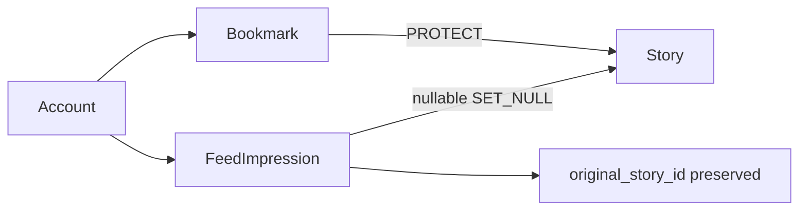

# ADR-0011 — Reading Owns Durable User References to Stories

- **Status:** Accepted
- **Date:** 2026-09-19
- **Decision owners:** Pulso maintainers
- **Related:**
  - [ADR-0001 — Modular Monolith with Background Workers](0001-modular-monolith-with-workers.md)
  - [ADR-0003 — Article != Story](0003-article-not-equal-story.md)
  - [ADR-0008 — Recommendation Personalizes Discovery, Not Truth](0008-recommend-stories-not-truth.md)

## Context

News owns shared, derived Story facts. Bookmarks and feed exposures are private
user interactions with different privacy, retention and lifecycle rules.
Putting them in News would make rebuildable factual state own user history and
would blur the boundary future Recommendation must consume explicitly.

Durable references also change Story deletion behavior. Stories are normally
archived, not deleted, but repair/rebuild work must have an explicit policy.
Bookmark and FeedImpression have different lifetimes and user expectations.

## Decision

Create Reading as a logical module inside the existing modular monolith.
Reading shares PostgreSQL and deployment with Accounts and News. It owns
Bookmark and FeedImpression persistence and calls News application interfaces
for eligibility/factual reads. News remains user-independent.

Bookmark is a durable user reference with a `PROTECT` Story foreign key. It
survives Story archival and renders an unavailable tombstone. A rebuild,
merge, split, or replacement that changes Story identity never transfers a
bookmark automatically; such a policy requires a future explicit decision.

FeedImpression is short-retention telemetry. Its Story relation uses `SET_NULL`
and stores a non-null `original_story_id` decimal identifier captured at
acceptance. A hard Story deletion therefore does not erase the audit meaning
of a retained event and does not let telemetry block cleanup.

## Alternatives considered for FeedImpression

| Policy                                | Evaluation                                                                                                                         |
| ------------------------------------- | ---------------------------------------------------------------------------------------------------------------------------------- |
| `PROTECT` for the retention lifetime  | Strong live reference, but short-lived telemetry can unexpectedly block exceptional Story cleanup; rejected                        |
| `CASCADE`                             | Simple and privacy-minimizing, but deletion silently changes retained exposure counts and loses what the client reported; rejected |
| `SET_NULL` plus preserved original ID | Keeps bounded semantic history without blocking deletion and without inventing a new Story target; selected                        |

The original ID is diagnostic identity, not a foreign key, redirect, or basis
for automatic transfer. Retention deletion still removes the whole impression.

## Consequences

- Reading owns cross-user privacy and retention behavior; News cannot write or
  rank from these records.
- Story hard deletion is blocked while any Bookmark exists. Operators/users
  remove the reference before deletion; normal archival needs no removal.
- Impression retention does not extend Story lifetime. A retained event can
  refer only to its original decimal identifier after hard deletion.
- Account deletion may cascade the account's private Reading rows.
- PostgreSQL remains authoritative; Redis is not used as reading storage.
- Saved-list composition must batch through News interfaces, not query one
  Story detail per bookmark.

## Future evolution

Story merge/split/redirect policy, user data export/erasure UX, and
Recommendation consumption require their own explicit contracts. Persistent
media or third-party media caching requires a dedicated media/object-storage
ADR before implementation.
