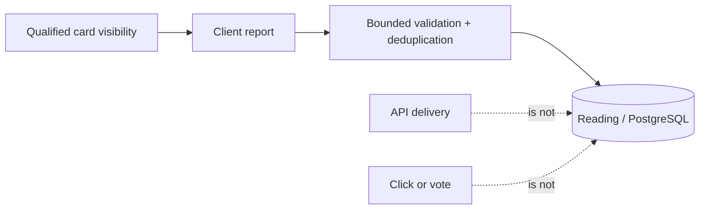

# ADR-0012 — FeedImpression Is a Qualified Client-Reported Exposure

- **Status:** Accepted
- **Date:** 2026-09-19
- **Decision owners:** Pulso maintainers
- **Related:**
  - [ADR-0007 — Pulse Counts Unique Users](0007-pulse-counts-unique-users.md)
  - [ADR-0008 — Recommendation Personalizes Discovery, Not Truth](0008-recommend-stories-not-truth.md)
  - [ADR-0011 — Reading Owns Durable User References to Stories](0011-reading-ownership-and-story-references.md)

## Context

API delivery and component mounting do not establish that a Story card was
meaningfully exposed. Conversely, collecting arbitrary analytics would exceed
Phase 3's privacy and infrastructure needs. The stored signal needs one narrow,
durable interpretation that future Recommendation cannot silently redefine.

## Decision

`FeedImpression` means:

> a client-reported qualified exposure of a Story card on HOME_FEED.

It is not API delivery, mount, click, read completion, agreement, vote,
representation, verified human attention, or a factual personalization input.
It has no effect on Opinion, Position, Perspective, Pulse, or current feed
ordering.

Qualification is versioned. Each accepted event records policy version,
account, Story/original Story ID, feed session, event ID, rendered position,
surface, client occurrence time and server receipt time. Events carry no open,
click, source-browsing, dwell, device, location, arbitrary-property, or content
payload.

Concrete thresholds and operational limits—including visibility percentage,
duration, session rules, request/batch/queue bounds, retry cadence, throttling,
timestamp tolerance and retention—are initial v1 policy proposals. Issues #43
and #51 must validate them together. Changing exposure qualification later
requires an explicit policy-version decision so old records keep their
original meaning.

Delivery is best effort. Process death may lose queued events, the client can
forge reports, and authenticated validation does not prove that the server
served or a human saw the card. Server uniqueness provides at-most-one retained
row for the chosen exposure key; stable event IDs make lost-response replay
safe. These limitations must remain visible in any future analysis.

## Consequences

- Fetching/prefetching a page never writes impressions.
- Saved/detail screens never produce HOME_FEED impressions.
- The client qualifies exposure with list visibility plus route/foreground
  lifecycle gates and deduplicates within a feed session.
- The server derives account and receipt time, validates bounded known fields,
  and reports per-event accepted/duplicate/rejected outcomes.
- Retry belongs to the future impression-delivery queue; transport and query
  retry do not multiply it.
- Retention is bounded and operator-visible. The proposed 30-day value is not
  an architectural invariant and remains subject to #43 validation.
- Future Recommendation may consume records only through an explicit Reading
  interface and may not reinterpret them as positions or verified attention.

## Validation record

Issue #43 validated the server-side proposals and kept them: 32 KiB bodies,
1–20 events per batch, positions 0–100000, occurrence at most 24 hours old or
5 minutes ahead, an advisory 60 batches/minute per account, and 30-day
retention by receipt time applied by an operator command. The evidence and
trade-offs are recorded in the
[Mobile Feed architecture](../architecture/mobile-feed.md#feedimpression-server-policy-43).
Client qualification and queue values remain owned by #51.
