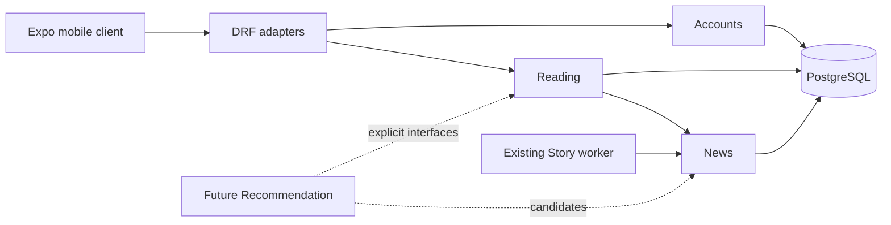

# Mobile Feed Architecture and Contract

## Status and scope

This document is the executable contract for Phase 3 (Mobile Feed). Sections
marked **contract** describe behavior owned by issues #40–#52; they are not a
claim that every behavior is already implemented. Issue #41 implements the
News-owned factual read DTOs/selectors and cursor primitives, #42/#43 the
Reading models, #44/#45 the mobile API client and sessions, #46 mobile
navigation, and #47 the authenticated feed, Story detail and source HTTP
endpoints with viewer decoration. Feed, detail, Saved and exposure screens
remain owned by #48–#51.

Phase 3 delivers authenticated factual Story reading, source navigation,
bookmarks, and qualified feed-exposure reporting. Opinion, Position,
Perspective, Pulse, Recommendation ranking, media, sharing, search, and offline
mutation queues remain future work.

## Ownership

| Boundary                | Owns                                                                                                            | Must not own                                                                                     |
| ----------------------- | --------------------------------------------------------------------------------------------------------------- | ------------------------------------------------------------------------------------------------ |
| News                    | Shared factual Story state; product read DTOs; eligibility, freshness, synthesis, citation and source selectors | Viewer state, feed ranking, reading interactions, request-time processing                        |
| Reading                 | Private Bookmark and FeedImpression state; feed composition and viewer decoration                               | Story facts, Article provenance, Opinion/Pulse behavior, recommendation                          |
| Accounts                | Identity and the existing JWT server contract                                                                   | Reading rules or factual content                                                                 |
| Mobile                  | Transport, credential hooks, server-state cache, presentation, navigation and exposure qualification            | Factual synthesis, durable authority, recommendation                                             |
| Recommendation (future) | Candidate ranking through explicit News/Reading interfaces                                                      | Rewriting shared Story facts or interpreting bookmarks/impressions as truth, votes, or positions |

Reading is a logical module in the modular monolith. PostgreSQL is authoritative;
Redis is not durable reading storage.



## Shared facts and private state

Two users reading the same database snapshot receive equal Story facts.
`viewer.bookmarked` is the only viewer field in Story card/detail payloads and
is decorated outside News. Feed session metadata never enters News synthesis.

| Shared factual state                                  | Private/account-scoped state                |
| ----------------------------------------------------- | ------------------------------------------- |
| Story identity/status/language and publication window | Bookmark existence and `saved_at`           |
| Published synthesis and ordered cited elements        | FeedImpression and feed session identifiers |
| Topics, Entities, Articles and Sources                | `viewer.bookmarked` decoration              |
| Current membership counts                             | Future recommendation signals               |

The invariants `Article != Story`, `Opinion != Perspective`, `Position !=
Perspective`, `AI != Source`, one active position per user/Story,
`Represents me != vote`, and `Recommendation != factual personalization` apply
to every endpoint and fixture.

## Wire contract

All new database `BigAutoField` product IDs are decimal JSON strings. UTC
timestamps use ISO-8601. Nullable values remain `null`; absent collections are
empty arrays. Product responses never expose vectors, signatures, matcher
evidence, provider errors, raw payloads, or full Article bodies.

### Story element

| Field         | Wire type                        | Meaning                                         |
| ------------- | -------------------------------- | ----------------------------------------------- |
| `id`          | decimal string                   | Synthesis-element ID                            |
| `kind`        | `TITLE`, `SUMMARY`, or `CONTEXT` | Persisted element kind                          |
| `position`    | nonnegative integer              | Stable order within its kind                    |
| `text`        | string                           | Bounded generated text                          |
| `article_ids` | array of decimal strings         | Ordered citations; TITLE provenance is retained |

### StoryCard

| Field                                     | Wire type / nullability            | Persisted mapping or fallback                                |
| ----------------------------------------- | ---------------------------------- | ------------------------------------------------------------ |
| `id`, `language`, `created_at`            | string                             | `Story`                                                      |
| `first_published_at`, `last_published_at` | timestamp or `null`                | `Story` publication window                                   |
| `content_state`                           | `CURRENT`, `UPDATING`, `PREPARING` | Freshness matrix below                                       |
| `synthesis_id`, `synthesized_at`          | decimal string/timestamp or `null` | Published generation; null while preparing                   |
| `title`                                   | string                             | Cited TITLE text, or neutral “Story being prepared” fallback |
| `elements`                                | ordered Story-element array        | TITLE, SUMMARY, then CONTEXT in persisted order              |
| `topics`                                  | array of `{slug,label}`            | Current stamped Topic links; may be empty                    |
| `article_count`, `source_count`           | nonnegative integers               | Published-generation counters for normal/updating cards      |
| `viewer`                                  | `{bookmarked:boolean}`             | Reading-owned decoration, separate from facts                |

### StoryDetail

StoryDetail contains the StoryCard factual fields and adds `entities`
(`{kind,display_name}`), explicitly named `current_article_count` and
`current_source_count`, `citations`, and `sources_path`. Each citation is a
SourceArticle keyed by its decimal-string Article ID. The cited set is complete
for returned elements, even when an Article is no longer a current member.
`sources_path` is a relative approved API path, never an absolute URL.

### SourceArticle

| Field                                                  | Wire type                |
| ------------------------------------------------------ | ------------------------ |
| `id`, `source.id`                                      | decimal strings          |
| `title`, `source.name`, `source.slug`                  | strings                  |
| `canonical_url`                                        | string or `null`         |
| `published_at`                                         | timestamp or `null`      |
| `first_seen_at`                                        | timestamp                |
| `byline`                                               | string or `null`         |
| `duplicate_of_id`                                      | decimal string or `null` |
| `is_current_member`                                    | boolean                  |

The canonical URL must be HTTP(S), have a host, contain no credentials or
control characters, and not use literal loopback/private/link-local addresses.
A stored URL that fails these checks is returned as `null` (#47): the
publication stays attributable by title and Source, the client shows the link
as unavailable, and one bad URL never fails a whole detail or source page.
No DNS lookup, fetch, proxy, WebView, token, or Authorization header is used
when opening a publisher URL.

### Pages

Pages are `{results, next_cursor}`; feed pages additionally carry
`ordering: "story_created_desc_v1"`. `next_cursor` is an opaque string or
`null`, never an absolute URL. There is no unbounded total count.

## Freshness and availability

| Read snapshot                                              | Feed                  | Detail/sources                                                                                                   | Saved                                    |
| ---------------------------------------------------------- | --------------------- | ---------------------------------------------------------------------------------------------------------------- | ---------------------------------------- |
| ACTIVE, live members, CURRENT, valid published generation  | Included as `CURRENT` | 200 current facts and current sources                                                                            | Normal                                   |
| ACTIVE, live members, STALE/FAILED, valid prior generation | Excluded              | 200 prior synthesis as `UPDATING`; generation citations and separately labelled current sources remain available | Updating                                 |
| ACTIVE, live members, no usable generation                 | Excluded              | 200 `PREPARING`, neutral title, no invented summary; sources available                                           | Preparing                                |
| ARCHIVED or zero live members                              | Excluded              | 410 `story_unavailable`, no obsolete facts                                                                       | Unavailable tombstone with remove action |
| Missing ID                                                 | Excluded              | 404 `story_not_found`                                                                                            | Client handles stale links               |

A usable generation is the current `StorySynthesis` with nonblank signature
matching the Story signature, a valid cited TITLE, bounded ordered elements,
and only same-signature Topic/Entity enrichment. Legacy unstamped enrichment
is omitted. `updated_at` is never presented as publication recency.

### Implemented read coherence (#41)

Generation anchoring alone is insufficient under the current schema:

| Response data | Generation-stable? | Evidence/consequence |
| --- | --- | --- |
| `StorySynthesis`, elements and citation links | Yes, retained per synthesis ID | These rows can anchor synthesis text and Article IDs |
| Story header/counters/status | No | The single Story row is updated during later refreshes |
| Topics and Entities | No | Associations are replaced in place; there is no generation history |
| Current membership | No | StoryArticle rows are reassigned/removed independently of old synthesis |
| Article title/URL/byline/revision | No | Article is revised in place; citation stores only its Article ID |
| Source name/active flag | No | Source rows are mutable; inactivity must not erase attribution |

Therefore #41 uses the approved fallback: each public factual read owns a
short PostgreSQL `REPEATABLE READ, READ ONLY` transaction, sets isolation
before its first ORM query, materializes all DTO data inside it, and returns
only after the transaction closes. Nested/caller-owned transactions are
rejected. The transaction performs no provider work, dispatch, writes, row
locks, JSON encoding, or network work. A separate-connection concurrency test
commits a complete refresh—including replaced synthesis/enrichment, mutable
Article/Source data and changed membership—while a read is paused between
queries; the reader receives the complete earlier snapshot and the writer is
not blocked.

## HTTP contract

All product endpoints require the existing bearer authentication and use no
trailing slash.

| Method/path                           | Input                                    | Success                             | Owner / implementation status           |
| ------------------------------------- | ---------------------------------------- | ----------------------------------- | --------------------------------------- |
| `GET /api/feed`                       | `cursor?`, `limit?` (20 default, 50 max) | 200 StoryCard page                  | Reading + News / implemented #47        |
| `GET /api/stories/{story_id}`         | positive decimal ID                      | 200 StoryDetail                     | News + Reading decoration / impl. #47   |
| `GET /api/stories/{story_id}/sources` | `cursor?`, `limit?`, `synthesis_id?`     | 200 SourceArticle page              | News / implemented #47                  |
| `GET /api/bookmarks`                  | `cursor?`, `limit?`                      | 200 saved page including tombstones | Reading / implemented #42               |
| `PUT /api/bookmarks/{story_id}`       | empty body                               | 200 bookmark result                 | Reading / implemented #42               |
| `DELETE /api/bookmarks/{story_id}`    | no body                                  | 204, present or absent              | Reading / implemented #42               |
| `POST /api/feed-impressions`          | `{events:[...]}`                         | 200 per-event outcomes              | Reading / implemented #43; client #51   |

Product errors are `{code,detail}` with an optional bounded `fields` object:
400 invalid input/cursor, 401 unauthorized, 404 missing, 409 changed cursor
context or idempotency conflict, 410 unavailable, 413 oversized body, 429
rate limited (with `Retry-After`), and generic 5xx. Unknown request fields and
client-supplied `user_id` are rejected. Existing authentication error bodies
remain unchanged and are normalized by the mobile transport.

### HTTP adapters (#47)

| Layer | Module | Responsibility |
| --- | --- | --- |
| Shared envelope | `backend/api/http.py` | `{code,detail,fields}` errors, `private, no-store`, 401/429 normalization, strict query and decimal-ID validation |
| News | `backend/news/serializers.py`, `news/views.py` | Explicit factual field allowlists; the user-independent source-list adapter; News read-error translation |
| Reading | `backend/reading/application/feed.py`, `reading/views.py` | Feed and detail composition: the News DTO plus one batched `viewer.bookmarked` lookup |

Only GET (and the HEAD Django derives from it) is routed; every other method
returns 405. Story IDs in paths must be positive decimal strings within
`bigint` without sign or leading zeros; anything else returns 400
`validation_error` with `fields.story_id`, never an HTML 404. `limit` outside
1–50 returns `{"limit": ["Must be between 1 and 50."]}`; tampered, expired or
cross-scope cursors return 400 `invalid_cursor`; a `synthesis_id` from another
Story returns 400 with `fields.synthesis_id`. Every response, including
errors, carries `Cache-Control: private, no-store`; there is no application
response cache. A News read failure that indicates corrupt persisted data
returns the generic 500 body.

No GET or HEAD writes a row, records a FeedImpression, calls a provider or
fetcher, or dispatches a worker task; tests replace those entry points with
failures. Citation metadata is the cited Article's **current** row read in the
same snapshot: it resolves even when the Article left the Story or is not on
the requested source page, but it is not a stored copy of the page as it was
when the synthesis was generated.

Measured full request paths, including JWT user lookup and bookmark
decoration: feed 10 SQL statements for both 1 and 50 cards (1 user lookup, 8
snapshot statements including `BEGIN`/`SET TRANSACTION`/`COMMIT`, 1 bookmark
lookup), detail 13, sources 6. The enforced budget is 15 with equal counts for
pages of 1 and 50. Reading decorates after the factual snapshot closes, so the
bookmark flag reflects the account's state at response time.

## Pagination

Feed ordering is immutable `(Story.created_at DESC, Story.id DESC)`, not
publisher recency or personalized relevance. A signed, versioned keyset cursor
carries endpoint scope, page size, a first-page upper watermark, last tuple,
and a 24-hour expiry. The watermark prevents newly inserted Stories from
appearing inside an existing chain; it does not snapshot eligibility or
content. A refresh starts a new chain.

Saved ordering is `(Bookmark.created_at DESC, Bookmark.id DESC)` and its cursor
is account-bound. Source ordering is `Article.id ASC`; its cursor is bound to
Story, current membership signature, and optional synthesis context. Context
change returns 409 `source_context_changed` so the client restarts once rather
than appending mixed pages. Cursor signatures provide integrity, not
authorization.

The #41 implementation uses `news.application.story_cursors` for the fixed
signed payload and `news.application.story_read` for feed/detail/source reads.
The feed's `(status, created_at DESC, id DESC)` index is backed by an EXPLAIN
test over 1,000 representative Story rows. Factual feed reads execute the same
bounded query count for pages of 1 and 50: 8 SQL statements including
transaction statements. The measured detail/source reads use 11/5 statements,
with enforced fixed budgets of 12/8.

## Bookmarks

Bookmark is a private, durable reference to one Story. PUT is an idempotent set
operation and preserves the original `saved_at`; DELETE is idempotent. New
saves accept ACTIVE nonempty Stories (including preparing/updating), reject an
unavailable Story with 410, and reject a missing Story with 404. An existing
bookmark survives archival and appears as a tombstone. Story rebuild, merge,
or replacement never transfers it automatically. Bookmark does not alter feed
order, facts, source counts, votes, positions, Perspectives, or Pulse.

Reading owns the write transaction. It locks the Story row before checking an
existing Bookmark or save eligibility, matching the Story-first lock order used
by News refresh. The database uniqueness constraint is the final authority for
`(user, story)`; constraint recovery occurs inside a savepoint so the enclosing
transaction remains usable. Removal takes the same Story lock and stays
available after archival.

| Relation | On account deletion | On Story deletion | Ownership consequence |
| --- | --- | --- | --- |
| `Bookmark.user` | CASCADE | — | Private state disappears with its account |
| `Bookmark.story` | — | PROTECT | Remove the Bookmark before exceptional hard deletion |

The initial Reading migration depends on the swappable account model and News
`0012_story_feed_order_index`. It adds no backfill and does not modify News,
Article, or RawArticle rows. Saved composition first reads a bounded Bookmark
page in `(created_at DESC, id DESC)` order and then asks the user-independent
News read interface for all available factual cards in one batch. Missing,
archived, or empty Stories are represented only as `{story_id, saved_at,
availability: "UNAVAILABLE"}`.

Authenticated examples (all responses carry `Cache-Control: private,
no-store`):

```http
PUT /api/bookmarks/45
Content-Type: application/json

{}

200
{"story_id":"45","bookmarked":true,"saved_at":"2026-09-19T10:10:00Z"}
```

```http
GET /api/bookmarks?limit=20

200
{"results":[{"story_id":"45","saved_at":"2026-09-19T10:10:00Z","availability":"UNAVAILABLE"}],"next_cursor":null}
```

```http
DELETE /api/bookmarks/45

204
```

## FeedImpression meaning

`FeedImpression` means **client-reported qualified Story-card exposure on
HOME_FEED**. It does not mean API delivery, mount, click, read completion,
agreement, vote, recommendation success, or verified human attention. Saved
and detail surfaces do not create it.

The initial v1 proposals—50% visibility for 1000 continuous ms, UUID feed
sessions, once per account/session/Story, batches of 1–20, 32 KiB request,
bounded position/timestamps, a 100-event memory queue, 10-minute queue TTL,
delivery cadence/retry limits, throttling, and 30-day retention—must be
validated by #43 and #51. They are policy values, not timeless principles.
Events contain only `event_id`, `story_id`, `feed_session_id`, zero-based
`position`, `surface`, `policy_version`, and `occurred_at`; account and
`received_at` are server-derived. No device fingerprint, advertising ID, GPS,
copied IP/User-Agent, publisher URL, article text, token, or arbitrary
properties are stored.

As decided by ADR-0011, impression rows preserve `original_story_id` and use a
nullable `SET_NULL` Story relation if a rare hard deletion occurs. This avoids
letting short-retention telemetry block Story cleanup while retaining the
event's originally reported identity. Bookmarks independently use `PROTECT`.

### FeedImpression server policy (#43)

Issue #43 implements acceptance in `reading/application/impressions.py` and
retention in the `reading_prune_impressions` command. It evaluated each initial
server-side proposal against bounded PostgreSQL work, data minimization,
delayed client delivery and the #51 queue, and retained all of them:

| Bound | v1 value | Why it holds |
| --- | --- | --- |
| Request body | 32 KiB, checked from `Content-Length` and the read body before decoding | A maximal valid 20-event batch (19-digit Story ID, microsecond offset timestamps) measures 5.0 KiB compact and 7.3 KiB indented; 32 KiB leaves ~4x headroom for encoders while bounding parse memory |
| Batch | 1–20 events | Equals the #51 flush threshold; the 100-event queue drains in five batches. Worst case per request is two lookups plus 20 savepoint inserts |
| Position | 0–100000 | 2,000 pages of 50 cards, far beyond a realistic session; also enforced by a database check |
| `occurred_at` | at most 24 h old, at most 5 min ahead | The #51 queue TTL is 10 min, so honest events arrive well inside 24 h even after retries and `Retry-After` waits. 5 min tolerates ordinary device clock skew; a device clock that is further off loses its events (400, terminal) rather than storing impossible times |
| Throttle | 60 batch requests/min per account | A foreground client flushes at most every 5 s (12/min) plus leave/background flushes and bounded retries; 60 leaves room for several devices and bounds one account to 1,200 inserts/min. Counters use Django's default per-process cache, so the bound is advisory, not distributed fraud or DoS protection |
| Retention | 30 days by `received_at` | Long enough for a future Recommendation evaluation window, short enough that the table stays small and no long-lived reading history accumulates |

Structural validation is all or nothing and precedes every write: the body must
be `application/json` UTF-8 without `NaN`/`Infinity`; the object has only
`events`; each event has exactly the seven fields; UUIDs are hyphenated
strings; `story_id` is a positive decimal string within `bigint`; `position`
and `policy_version` are JSON integers (booleans and strings are rejected);
`surface` is `HOME_FEED`; `occurred_at` carries a zone. Any failure returns 400
`validation_error` with bounded per-field messages (`events[i].field`); an
oversized body returns 413 `request_too_large`. `user_id`, `received_at` and
any other field are rejected, never ignored.

Accepted batches return 200 and one result per event, in input order:

```http
POST /api/feed-impressions
Content-Type: application/json

{"events":[
  {"event_id":"4f4bb18e-b0e0-4e7f-8cf8-849b7013fa63","story_id":"45","feed_session_id":"dd42a0ee-0727-4796-bd11-dba56f1c498b","position":0,"surface":"HOME_FEED","policy_version":1,"occurred_at":"2026-09-19T10:06:01Z"},
  {"event_id":"4f4bb18e-b0e0-4e7f-8cf8-849b7013fa63","story_id":"45","feed_session_id":"dd42a0ee-0727-4796-bd11-dba56f1c498b","position":0,"surface":"HOME_FEED","policy_version":1,"occurred_at":"2026-09-19T10:06:01Z"},
  {"event_id":"0b0f7c1e-3c55-4a8e-9d1f-6f1c4e0a9b21","story_id":"999","feed_session_id":"dd42a0ee-0727-4796-bd11-dba56f1c498b","position":1,"surface":"HOME_FEED","policy_version":1,"occurred_at":"2026-09-19T10:06:02Z"}
]}

200
{"results":[
  {"event_id":"4f4bb18e-b0e0-4e7f-8cf8-849b7013fa63","outcome":"accepted","code":null},
  {"event_id":"4f4bb18e-b0e0-4e7f-8cf8-849b7013fa63","outcome":"duplicate","code":null},
  {"event_id":"0b0f7c1e-3c55-4a8e-9d1f-6f1c4e0a9b21","outcome":"rejected","code":"story_not_found"}
]}
```

- `accepted`: a new row. `duplicate`: the same event ID with identical fields
  already exists (replay, lost response, in-batch repeat); nothing changes.
- `rejected` / `event_conflict`: the event ID exists with different fields, or
  another event already holds the `(account, feed session, Story)` exposure.
  The first persisted report wins; its position and times are never rewritten.
- `rejected` / `story_not_found`: no Story with that ID exists. A known ARCHIVED,
  stale or preparing Story is accepted because exposure can precede delivery;
  acceptance never writes News rows.

PostgreSQL is the deduplication authority: unique `(user, event_id)` and
`(user, feed_session_id, original_story_id)` keys, resolved inside per-event
savepoints so one conflict does not abort the batch. The exposure key uses the
non-null `original_story_id`, not the nullable relation, so a Story hard
deletion cannot make two reports of one exposure distinct. A check constraint
keeps `story` either null or equal to `original_story_id`; the original ID is
never used as a lookup, redirect or retarget. A generic 5xx (including the rare
race in which a Story is deleted mid-request) permits whole-batch retry.

Limits of client telemetry: reports are forgeable by an authenticated client,
authentication does not prove the card was served or seen, process death loses
queued events, and exactly-once end-to-end delivery is not promised. Logs carry
operation, outcome, duration and per-outcome counts only—never event, session
or Story identifiers, positions or payloads. Access logs of the web server are
outside this policy and are not application-level anonymization.

Retention is not automatic. Operators run `reading_prune_impressions`
(dry run by default) on a regular schedule of their choosing; see the
[backend runbook](../../backend/README.md#feed-impressions). Deleting an account
cascades its impressions.

## Mobile boundary and retry ownership

The native fetch stack builds approved relative API routes against one base
origin, times out after 15 seconds, supports caller cancellation, handles empty
204/205 responses, normalizes errors, and validates DTOs. Credentials are
never attached to an absolute foreign URL. Tokens never enter URLs, public
Expo variables, query keys, logs, or diagnostic payloads.

TanStack Query 5.103.1 is the implemented single server-state cache; its React
18/19 peer range covers the checkout's React 19.2.3/Expo 57 stack.
Account-scoped keys isolate all viewer-decorated payloads. React state/context
remains appropriate for session and transient UI. There is no persistent query
cache.

Retry ownership is singular: TanStack Query owns bounded read retry; the auth
session owns at most one refresh/replay; the future impression queue owns its
own delivery retry. Transport does not blindly retry POST.

Issue #44 implements this boundary in `mobile/src/api/` and
`mobile/src/server-state/`. Native fetch accepts approved relative product and
authentication paths only, normalizes transport/API failures and validates the
repository contract fixtures. Runtime failures remain visible failures; test
fixtures never become fallback UI data. Issue #45 implements session
credential persistence, single-flight refresh, epoch-guarded account isolation
and protected routing in `mobile/src/session/` (see
[mobile/README.md](../../mobile/README.md#session-and-sign-in)); its
`subscribeSessionChanges` hook is the account-change signal for exposure queue
delivery, which remains owned by #51. Issue #46 adds the Feed/Saved tab layout, the
protected Story/source routes with Feed as their back target, the external
publisher hand-off seam, and the shared accessible UI primitives
(`mobile/src/components/`, `mobile/src/theme/`).

Native Android/iOS reading behavior is the Phase 3 acceptance target. Web must
continue to compile/render, but production browser CORS and deployment are
deferred. Native refresh credentials use secure platform storage, access
tokens remain in memory, and web credentials are memory-only (ADR-0009).

## Labels and time/count meanings

- “Sources” counts distinct publisher Source IDs in the stated generation or
  current-membership scope; it never means independently verified evidence.
- “Published” is `published_at`; when absent, `first_seen_at` is labelled
  “first seen,” never silently substituted.
- “Synthesized” is generation time, not reporting time.
- “Updating” means a prior coherent synthesis is shown while current
  membership awaits refresh; “Preparing” has no usable synthesis.
- “Context” is generated CONTEXT text; Phase 3 does not promise or invent “why
  it matters,” “key points,” updates/timeline, media, or Pulse values.

## Contract fixtures and consumers

Repository fixtures live in [`../contracts/mobile-feed/`](../contracts/mobile-feed/README.md).
They cover CURRENT multi/single-source responses, missing optional fields,
UPDATING, PREPARING, unavailable/error shapes, pages, and mutation outcomes.
#41 validates News serialization against them; #42/#43 validate Reading
contracts; #44 validates mobile decoders; #47 validates HTTP adapters; #51
owns impression delivery behavior.

## Security, diagnostics, and future boundaries

Logs may carry bounded operation/error codes, durations and counts. They must
not carry credentials, synthesis/source browsing payloads, publisher URLs,
reading histories, or provider diagnostics. Client-reported telemetry is
forgeable and must not be represented as verified attention.

If a later milestone introduces application-owned images, thumbnails,
persistent third-party media caching, image proxies, uploads, or object
storage, a dedicated media/object-storage ADR must precede provider-specific
persistence or caching. Phase 3 adds none of these.
