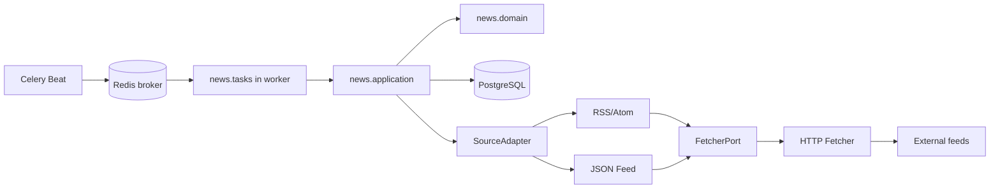
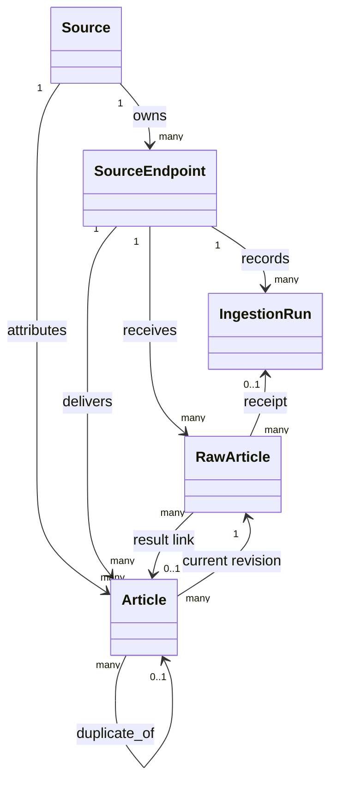
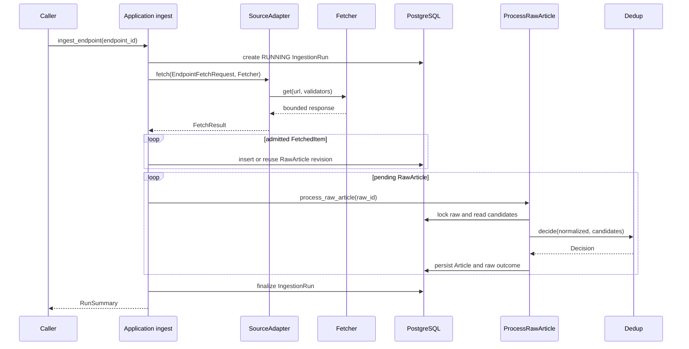
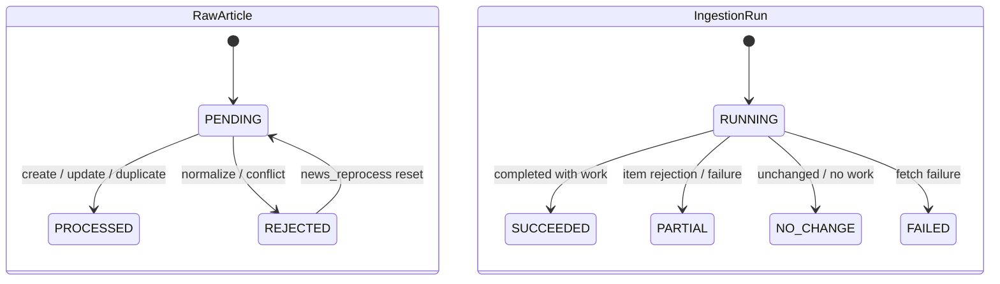
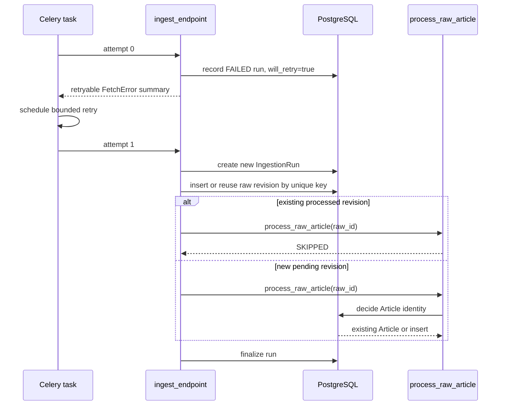
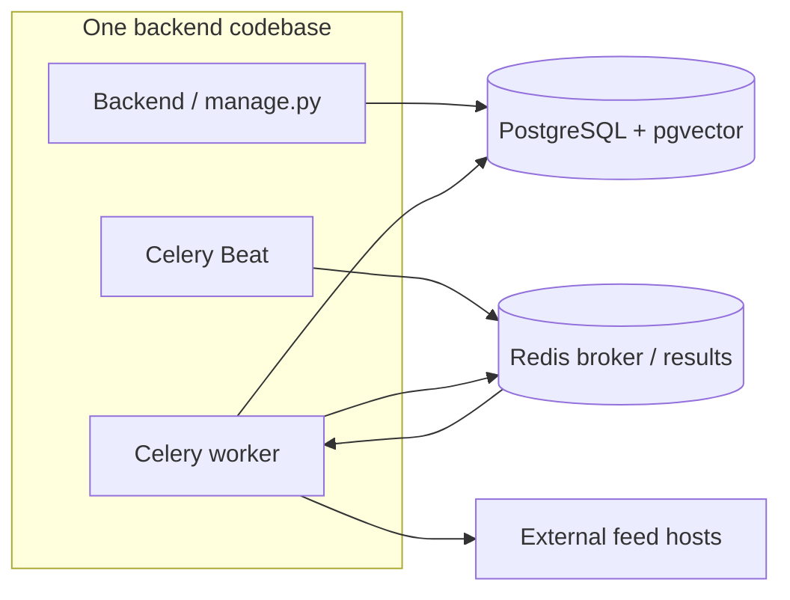

# News Core Architecture

## Purpose

News Core turns provider feed entries into durable, normalized publications: `Article` records. **Article != Story** ([ADR-0003](../adr/0003-article-not-equal-story.md)); an Article is one publication, while a future Story may group coverage of one event. **Deduplication != Story clustering** ([ADR-0010](../adr/0010-article-identity-and-deduplication.md)).

## Scope

The v0.2 implementation includes Source and SourceEndpoint modeling, RSS/Atom and JSON Feed ingestion behind an extensible adapter boundary, hardened outbound fetching, RawArticle provenance and revisions, Article normalization, URL canonicalization, content fingerprints and deterministic publication deduplication. Celery ingestion, Beat polling, PENDING reconciliation, bounded retries, structured JSON logs, run inspection and retention, operator commands, repository-owned fixtures and end-to-end tests complete the operational path.

## Non-goals

There is no Story, Article-to-Story matching, embedding, semantic near-duplicate detection, Topic, Entity, source-grounded Story summary, feed API, provider REST API adapter, recommendation, or Opinion/Perspective processing. A provider REST API could be implemented as a **future** `SourceAdapter`; the two current adapters are RSS/Atom and JSON Feed.

## Domain vocabulary

| Concept | Meaning |
| --- | --- |
| `Source` | Publisher identity; independent of any ingestion address. |
| `SourceEndpoint` | One Source-owned feed URL and adapter kind. Source != SourceEndpoint. |
| `IngestionRun` | Operational record of one fetch/intake attempt, not publication identity. |
| `RawArticle` | One received payload revision and provenance; RawArticle != Article. |
| `Article` | Normalized publication owned by a Source; Article != Story. |
| `FetchedItem` | Adapter-neutral parsed provider entry before normalization. |
| `RejectedItem` | Per-entry adapter rejection with a bounded, safe reason. |
| `FetchResult` | Adapter result with items, rejections, validators and no-change flag. |
| `SourceAdapter` | Application-owned protocol for format-specific fetch/parse behavior. |
| `FetcherPort` | Application-owned transport protocol used by adapters. |

An identity duplicate is an unchanged publication reached by Source/external ID or canonical URL. A content duplicate is a *separate* publication with sufficiently long identical normalized text. Neither means the publications describe the same event. Conversely, same-event publications may have different text and remain separate Articles.

## Component responsibilities

| Component | Responsibility |
| --- | --- |
| `news.models` | News-owned PostgreSQL state and constraints. |
| `news.application.ingest` | Run creation, adapter selection, raw intake, pending processing and run finalization. |
| `news.application.process` | Per-revision normalization, candidate lookup and dedup persistence. |
| `news.application.operations` | Stale-run query and retention rule. |
| `news.application.ports` | `SourceAdapter`, `FetcherPort` and neutral input/result contracts. |
| `news.application.registry` | Select RSS or JSON Feed adapter by persisted kind. |
| `news.domain.identity` / `urls` / `fingerprints` | Raw identity, conservative URL identity and deterministic hashes. |
| `news.domain.normalization` / `dedup` | Pure normalized input and publication decision. |
| `news.adapters.rss` / `jsonfeed` | RSS/Atom or JSON Feed parsing into neutral items. |
| `news.adapters.http` / `targets` | Bounded HTTP transport and outbound target policy. |
| `news.tasks` / `news.logging` | Thin Celery orchestration and stable ingestion log context. |
| `news.management.commands` | `manage.py` operator surface. |

## Persistence model

PostgreSQL is authoritative. The News module owns all five tables below inside the modular monolith; Redis broker and result metadata never replace domain storage. The model and News migrations define the schema.

| Table | Purpose and important fields | Keys, indexes and checks | Delete behavior |
| --- | --- | --- | --- |
| `Source` | Publisher: `slug`, `name`, `homepage_url`, `default_language`, `is_active`, timestamps. | Unique `slug`. | Referenced by endpoints and Articles with `PROTECT`. |
| `SourceEndpoint` | One feed: `source`, `kind` (`RSS` or `JSON_FEED`), `url`, `is_active`, `fetch_interval_seconds`, `adapter_config`, `etag`, `last_modified`, timestamps. RSS kind parses RSS/Atom. | Unique `url`; interval greater than zero. `save()` validates HTTP(S), allowed target and rejects secret-like config keys. | `source` uses `PROTECT`; referenced by runs, raws and Articles with `PROTECT`. |
| `IngestionRun` | Attempt: `endpoint`, `trigger`, `attempt`, `task_id`, `status`, `started_at`, `finished_at`, `http_status`, `error_kind`, `error_message`, `will_retry`, `duration_ms`; counters `items_received`, `items_rejected`, `raw_created`, `raw_changed`, `raw_unchanged`, `items_processed`, `items_failed`, `identity_duplicates`, `content_duplicates`, `raw_rejected`, `source_identity_conflicts`. | Indexes on endpoint/recent start and status/start; attempt, counters and duration nonnegative. No publication identity constraint. | Endpoint `PROTECT`; deleting finalized run sets `RawArticle.ingestion_run` to null. |
| `RawArticle` | Received revision: `endpoint`, nullable `ingestion_run`, `external_key_kind`, `external_key`, `external_id`, `url`, `payload`, `payload_hash`, nullable `supersedes`, `fetched_at`, `status`, `outcome`, `rejection_reason`, `processed_at`, nullable `article`, `created_at`. Payload is provenance, not the normalized publication. | Unique (`endpoint`, `external_key_kind`, `external_key`, `payload_hash`); indexes on identity and status/creation. | Endpoint and `supersedes` use `PROTECT`; run and article link use `SET_NULL`. |
| `Article` | One Source-attributed publication: `source`, `endpoint`, `raw_article` (current normalized revision), `external_id`, `canonical_url`, `title`, `description`, `body_text`, `byline`, `published_at`, `language`, `content_fingerprint`, nullable `duplicate_of`, `first_seen_at`, `created_at`, `updated_at`. | Globally unique nonempty `canonical_url`; unique (`source`, `external_id`) when ID nonempty; self-duplicate forbidden. Fingerprint is indexed, **not unique**. | Source, endpoint and current raw use `PROTECT`; `duplicate_of` uses `SET_NULL`. |

Same endpoint + external identity + payload hash resolves to the same RawArticle revision. A changed payload hash makes a new revision that `supersedes` the previous one; old rows are retained. `Article.raw_article` points to the currently normalized revision, while `RawArticle.article` can link historical revisions to the resulting Article.

## Ingestion lifecycle

`news.application.ingest.ingest_endpoint(endpoint_id)` loads an endpoint and Source, creates a `RUNNING` run, chooses the adapter, fetches/parses and counts adapter rejections. It admits at most 500 items, derives each external identity, bounds and hashes the stored payload, then persists RawArticle revisions **before** processing. Previously pending rows for that endpoint are processed in receipt order. The processor normalizes each row, evaluates identity/content candidates, and creates, updates, links or rejects Article state. One unexpected per-row processing exception increments `items_failed` and leaves that receipt available for later processing. The run is finalized with status, counters and duration. HTTP 304 yields `NO_CHANGE`.

## Adapter boundary

`SourceAdapter.fetch(EndpointFetchRequest, FetcherPort) -> FetchResult` lives in `news.application.ports`; no Django model crosses that interface. The request carries URL, adapter configuration and optional ETag/Last-Modified. `FetchResult` carries `FetchedItem`s, `RejectedItem`s, validators and `not_modified`. `FetcherPort.get` exposes a bounded transport response to format adapters. `RssAdapter` handles RSS and Atom; `JsonFeedAdapter` handles JSON Feed. Neither owns Article persistence. A provider REST API adapter is future work.

The HTTP Fetcher accepts HTTP/HTTPS only, checks resolved targets against a non-global/private-network refusal policy by default, revalidates redirects and rejects HTTPS downgrade. It enforces response and decoded-compression size limits, feed content types, finite timeouts and conditional requests. Network, status and rate-limit failures become sanitized `FetchError` metadata; `Retry-After` is parsed and bounded.

## Failure model

| Level | Behavior |
| --- | --- |
| Endpoint/run failure | Fetch/parse failure records `FAILED`, safe `error_kind`/HTTP status and `will_retry` when warranted and budgeted. |
| Per-item adapter/intake rejection | Counts in `items_rejected`; other valid items continue. |
| Raw normalization rejection | Retains RawArticle with `REJECTED`, reason and processing timestamp; run becomes `PARTIAL`. |
| Identity conflict | Retains rejected provenance, never reattributes the existing Article; same-Source ID/URL disagreement or another Source's URL ownership is explicit. |
| Unexpected per-row processing error | Counts `items_failed`; row remains `PENDING` for reconciliation. |

`FetchErrorKind` is exactly `NETWORK`, `TIMEOUT`, `HTTP_STATUS`, `RATE_LIMITED`, `TOO_LARGE`, `UNSUPPORTED_CONTENT`, `MALFORMED`, `BLOCKED_TARGET`, `TOO_MANY_REDIRECTS`. Transient network/timeouts, selected HTTP statuses and rate limiting may be retryable; target, content and malformed-input failures are normally final. The Fetcher determines this, rather than the Celery task guessing from a status.

RawArticle statuses are `PENDING` (durable receipt awaiting processing), `PROCESSED` (deterministic result) and `REJECTED` (retained but unusable as normal Article state). Outcomes are blank before a final result, or `ARTICLE_CREATED`, `ARTICLE_UPDATED`, `IDENTITY_DUPLICATE`, `CONTENT_DUPLICATE`, `IDENTITY_CONFLICT`, `SOURCE_IDENTITY_CONFLICT`. Normalization rejection leaves a blank outcome and sets `rejection_reason`.

IngestionRun starts `RUNNING` and finishes `SUCCEEDED`, `PARTIAL`, `NO_CHANGE` or `FAILED`. A killed worker can leave `RUNNING` stale; time-based detection reports that fact, without changing the database status automatically.

## Idempotency strategy

| Layer | Mechanism | Effect |
| --- | --- | --- |
| Fetch/run | ETag and Last-Modified; new run per attempt | A 304 avoids transfer; run history remains inspectable. |
| Raw revision | Endpoint + external key kind/value + payload hash | Re-delivery reuses the exact revision; changed payload becomes a new revision. |
| Article identity | Source/external ID and global canonical URL | Database-enforced publication identity prevents duplicate ownership. |
| Content duplicate | Eligible exact fingerprint | Preserves both Articles and links secondary via `duplicate_of`. |
| Worker redelivery | Durable raw/Article constraints and deterministic processing | Repeated IngestionRun does not imply repeated Article. |

## Deduplication strategy

[ADR-0010](../adr/0010-article-identity-and-deduplication.md) governs publication identity. The pure `decide` function checks `(source, external_id)` first, then the globally owned `canonical_url`, then an eligible exact `content_fingerprint`, then `CREATE`. Existing ID or URL with changed content updates its Article; unchanged identity and fingerprint yields `IDENTITY_DUPLICATE`. If ID and URL point to different Articles, `IDENTITY_CONFLICT` rejects the revision. Another Source's canonical URL yields `SOURCE_IDENTITY_CONFLICT`; ownership never transfers. Fingerprint matches only after both identity tiers miss. With at least 200 normalized characters and a different canonical URL, `CONTENT_DUPLICATE` creates a *second* Article linked to the earliest matching Article by (`created_at`, `pk`). Short text yields `CREATE`. Fingerprint is not a semantic similarity measure.

| URL rule | Current behavior |
| --- | --- |
| Scheme/host | Lowercase; host IDNA-encoded; remove default port only. No HTTP-to-HTTPS upgrade or `www` stripping. |
| Path/fragment | Empty path becomes `/`; other path and trailing slash preserved; fragment dropped. |
| Query | Remove maintained tracking keys (`utm_*`, `fbclid`, etc.); sort retained items by decoded key, preserving repeated-key order, blank values and raw encoding. |
| Percent escapes | Uppercase escape hex digits without decoding; reject malformed escapes. |
| Invalid input | Reject non-HTTP(S), credentials, whitespace, control characters, backslashes and malformed host/port. |

Identity duplicate != content duplicate != same event. Three publications about the same event remain three Articles until the **future** Story Engine groups them ([ADR-0003](../adr/0003-article-not-equal-story.md), [ADR-0010](../adr/0010-article-identity-and-deduplication.md)).

## Concurrency behavior

PostgreSQL uniqueness is the final authority for raw revisions, global canonical URL and nonempty Source/external ID. `process_raw_article` locks only its raw row with `select_for_update(skip_locked=True, of=("self",))`; another processor skips a locked row, and already final rows are skipped. An Article insert race rolls back its savepoint, re-reads the winning row and makes one deterministic re-decision. This is row-level coordination, not a distributed lock or global content serialization. Fingerprints are indexed but non-unique; simultaneous same-content publications are not globally serialized by that index.

## Scheduling

Beat schedules discovery; workers execute tasks; PostgreSQL remains authoritative. With `NEWS_INGESTION_ENABLED=true`, Beat enqueues `poll_due_endpoints` every `NEWS_POLL_DISPATCH_INTERVAL_SECONDS` (default 300), `reconcile_pending_raw_articles` hourly and `prune_ingestion_runs` weekly. `poll_due_endpoints` dispatches `ingest_endpoint` for active endpoints of active Sources when the latest run's start plus `fetch_interval_seconds` is due. A latest `RUNNING` younger than `NEWS_STALE_RUNNING_SECONDS` (180) blocks dispatch; an older one does not block forever once due. Dispatch happens after transaction commit.

The ingestion task allows at most **3 retries** (4 attempts), with a 150-second soft and 180-second hard limit. Retryable failures back off from 30 seconds exponentially, with up to 10% additive jitter, capped at 600 seconds; bounded `Retry-After` can reach 900 seconds. Fetcher determines retryability; application persists `will_retry` for the current run; Celery schedules the next attempt. `process_raw_article` tasks retry transient database errors. Reconciliation dispatches `PENDING` rows at least 600 seconds old, ordered by (`created_at`, `pk`) in batches of at most 1000; it never rewrites receipt provenance.

## Testing strategy

Pure domain tests cover URLs, fingerprints, normalization and decisions. Adapter tests cover RSS/Atom and JSON Feed mapping; Fetcher/security tests cover target and transport policies. Application integration and PostgreSQL concurrency tests cover revisions and identity races. The [fixture catalog](../../backend/tests/fixtures/news/README.md) drives News Core end-to-end tests; a real Celery worker smoke test covers broker delivery. Normal tests block public DNS and serve repository-owned fixtures from a loopback `127.0.0.1` HTTP server on an ephemeral port. They require no live news site. The optional network-dependent demo source fixture is for manual exploration only.

## Operational considerations

The `manage.py` operator surface is `news_source` (add/list/enable/disable by slug), `news_endpoint` (add/list/enable/disable by ID or exact URL; `--kind RSS|JSON_FEED`), `news_ingest --endpoint <id|url> [--async]`, `news_reprocess --raw <id>` (REJECTED only), `news_runs [--endpoint <id|url>] [--last N] [--stale]`, and `news_prune_runs [--days N]`. Exact examples and prerequisites are in the [backend guide](../../backend/README.md); News has no HTTP operator API.

`NEWS_FETCH_ALLOW_PRIVATE_NETWORKS=false` protects outbound targets; `NEWS_FETCH_MAX_RESPONSE_BYTES=5 MiB`, `NEWS_INGEST_MAX_ITEMS_PER_RUN=500` and `NEWS_INGEST_MAX_PAYLOAD_BYTES=256 KiB` bound intake. `NEWS_CONTENT_FINGERPRINT_MIN_CHARS=200` limits content linking. `NEWS_STALE_RUNNING_SECONDS=180` is shared by polling and run inspection. `LOG_LEVEL=INFO` controls the `pulso` JSON-lines logger tree. The formatter allowlists safe operational fields rather than serializing payloads: `source_id`, `source_slug`, `endpoint_id`, `adapter`, `run_id`, `task_id`, `attempt`, `trigger`, statuses, error kinds and counters. Source content and secrets are not copied into these records.

`news_runs --stale` identifies old `RUNNING` rows and exits nonzero when found; staleness is an operator signal, not an automatic status change. `news_prune_runs` removes finalized runs older than 30 days by default; the weekly task uses the same rule. `RUNNING` rows are not pruned. Because `RawArticle.ingestion_run` uses `SET_NULL`, run pruning leaves RawArticle provenance and Article records intact.

## Security considerations

Public upstreams are untrusted. Endpoint creation and the Fetcher accept HTTP/HTTPS, validate outbound targets and reject non-global/private addresses by default. Redirects are revalidated and HTTPS downgrade is refused. Response and decoded-compression bounds, content-type policy, timeouts and sanitized error messages constrain hostile feeds. `adapter_config` rejects secret-like keys, and logs use a safe operational-field allowlist. The test-only private-network allowance must not be enabled in deployment. DNS can change between preflight resolution and connection because IP pinning is not implemented; syntactically valid misleading or malicious content may still fit within all bounds. This transport policy does not certify factual accuracy or safety of source content.

## Evolution toward the Story Engine

The **future Story Engine** may assume Articles are normalized publications, canonical URLs are nonempty and globally unique, Source ownership is resolved, exact publication identity has been handled deterministically, separate content duplicates may be linked by `duplicate_of`, RawArticle provenance remains available, and same-event publications remain separate Articles.

It must **not** assume one Article equals one event, `duplicate_of` means same Story, different fingerprints mean different Stories, equal fingerprints imply a shared Source, multiple Articles imply independent reporting, or publication deduplication already performed semantic/event clustering. Its conceptual extension point is `Article → Story candidate/matching → Story`; possible future evidence includes text, publication time, Source, entities/topics, embeddings and duplicate links. None of that Story behavior exists in v0.2.

The Story Engine that shipped in v0.3 is documented in the [Story Engine architecture](story-engine.md). It kept this contract: its matcher uses embeddings, language, publication time and proper-name evidence from member text, and never reads `duplicate_of`, fingerprints, Source identity, Topics or Entities as event evidence.

## Relevant ADRs

| Decision | Role here |
| --- | --- |
| [ADR-0001 — Modular monolith with workers](../adr/0001-modular-monolith-with-workers.md) | One backend and logical News ownership. |
| [ADR-0002 — PostgreSQL with pgvector](../adr/0002-postgresql-pgvector.md) | Authoritative relational store; vector extension exists but News Core has no embeddings. |
| [ADR-0003 — Article != Story](../adr/0003-article-not-equal-story.md) | Publication/event boundary. |
| [ADR-0004 — AI is not a source](../adr/0004-ai-is-not-a-source.md) | Future derived synthesis cannot replace provenance. |
| [ADR-0005 — Asynchronous Celery processing](../adr/0005-asynchronous-processing-with-celery.md) | Task and broker boundary. |
| [ADR-0010 — Article identity and deduplication](../adr/0010-article-identity-and-deduplication.md) | Publication identity and conflict rules. |
