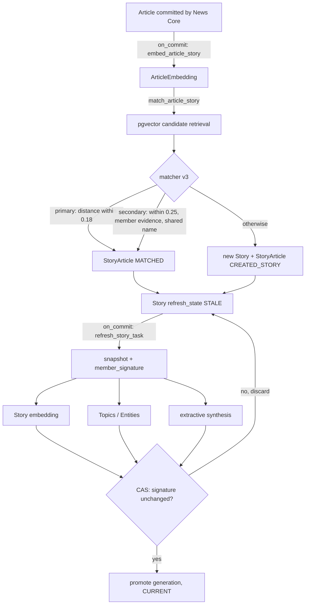
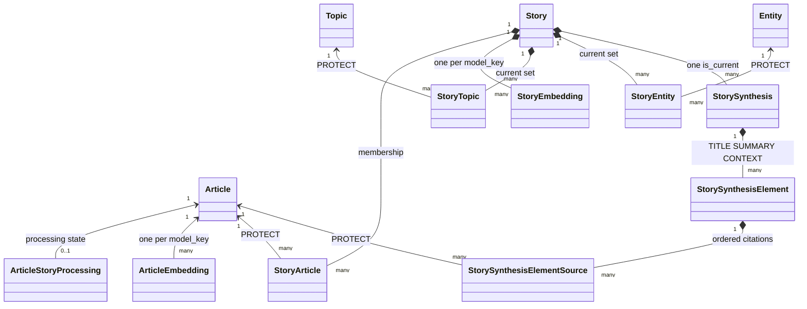
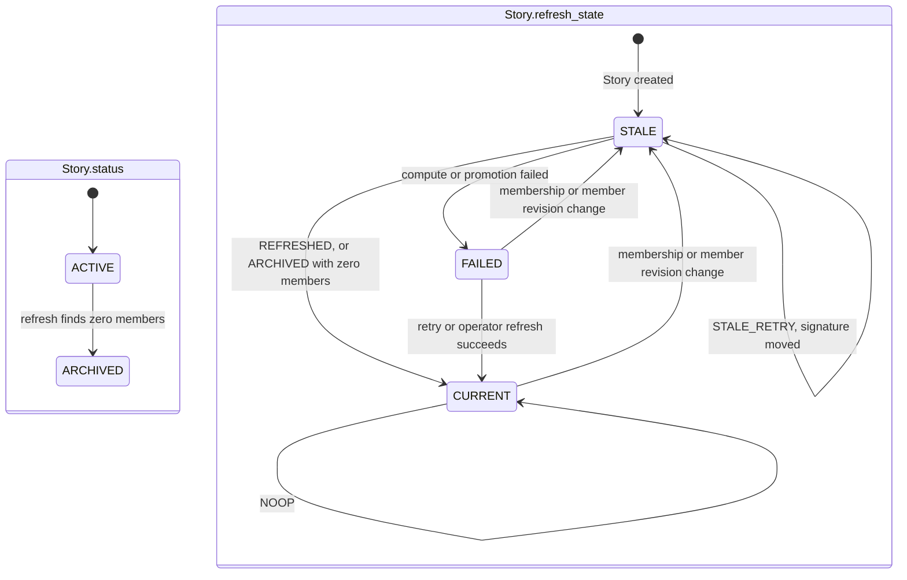

# Story Engine Architecture

## Purpose

The Story Engine turns persisted News Core `Article` records into event-level `Story` records and keeps each Story's derived state coherent with its membership:

```text
persisted Articles  →  event-level Stories  →  coherent derived Story state
```

For each committed Article it stores a semantic vector, retrieves nearby Stories with pgvector, decides deterministically whether the Article joins one of them or starts a new Story, and records that association with its evidence. Each membership or member-revision change marks the Story `STALE`; a refresh then rebuilds the Story vector, Topics, Entities, extractive synthesis and counters as one generation. Everything the Story Engine writes can be deleted and rebuilt from Articles.

Three invariants govern the module:

| Invariant | Meaning here |
| --- | --- |
| **Article != Story** ([ADR-0003](../adr/0003-article-not-equal-story.md)) | An Article is one publication from one Source. A Story is one event described by one or more Articles. Joining a Story never merges, rewrites or deletes Articles. |
| **Deduplication != Story clustering** ([ADR-0010](../adr/0010-article-identity-and-deduplication.md)) | News Core's `duplicate_of` and `content_fingerprint` describe publication identity. The matcher never reads them; same-event grouping comes only from semantic, language, time and proper-name evidence. |
| **AI != Source** ([ADR-0004](../adr/0004-ai-is-not-a-source.md)) | Embeddings, Topics, Entities and synthesis are derived. Articles remain the sources; synthesis elements cite the member Articles that contain them. |

## Scope

v0.3 (issues #24–#36) includes Story persistence (#24), a versioned embedding boundary (#25), a repository-owned evaluation corpus (#26), pgvector candidate retrieval (#27), a deterministic matcher (#28, revised by #36 and, after v0.3, by #38), Celery processing, reconciliation and reprocessing (#29), Topics and Entities (#30), source-grounded extractive synthesis (#31), coherent refresh generations (#32), structured logs and operator commands (#33), and end-to-end and quality gates (#34). All of it lives in the existing `backend/news/` module.

## Non-goals

v0.3 deliberately excludes, as future work and not as partial features:

- the mobile Story feed API and the Story detail product API;
- bookmarks and FeedImpressions;
- Opinion, Position, Perspective and Pulse;
- recommendation and personalization;
- source credibility scoring and fact checking;
- production deployment.

There is no HTTP surface for Stories: the operator surface is `manage.py`. There is no `StoryUpdate` table, no Story history or event-sourcing framework, no manual association workflow, no distributed lock and no hosted AI provider.

## Domain vocabulary

| Concept | Meaning |
| --- | --- |
| `Article` | News Core publication (`news.models.Article`). Read-only to the Story Engine. |
| `Story` | One event: lifecycle `status`, `refresh_state`, current `member_signature`, derived counters and publication window. |
| `StoryArticle` | Association of one Article with one Story: `is_primary`, `method`, `similarity`, `matcher_key`, `evidence`. |
| `ArticleEmbedding` | Vector of one Article under one embedding `model_key`. |
| `StoryEmbedding` | Unit-length mean of member Article vectors under one `model_key`. |
| `ArticleStoryProcessing` | Per-Article processing state (`PENDING`, `EMBEDDED`, `MATCHED`, `FAILED`) and the pipeline pair it applies to. |
| `Topic` / `Entity` | Shared, reusable vocabulary rows (`slug`/`label`; `kind`/`normalized_key`/`display_name`). Labels, not facts. |
| `StoryTopic` / `StoryEntity` | A Story's current Topic/Entity associations with `score`, `model_key` and `member_signature`. |
| `StorySynthesis` | One synthesis generation header: `model_key`, `member_signature`, `is_current`. No text. |
| `StorySynthesisElement` | One `TITLE`, `SUMMARY` or `CONTEXT` text of a generation, ordered by `position`. |
| `StorySynthesisElementSource` | One member Article supporting one element, ordered by `position`. |
| `model_key` | `provider:model@revision` identity of the embedding model, extractor or synthesizer that produced a row. |
| `matcher_key` | Identity of the matching policy: rule revision plus every threshold. |
| `pipeline_key` | `<embedding_model_key>\|<matcher_key>`; computed for freshness, logs and operator output, never stored. |
| `member_signature` | SHA-256 over a Story's full membership and each member's revision marker. |

Four identities are kept apart:

| Identity | Decided by | Stored as |
| --- | --- | --- |
| Publication identity | News Core deduplication (ADR-0010) | `Article`, `duplicate_of` |
| Semantic similarity | Embedding model | `ArticleEmbedding`, `StoryEmbedding`; cosine distance |
| Event identity | Matcher v3 | `StoryArticle` with `evidence` |
| Derived Story interpretation | Refresh components | Story counters, `StoryTopic`, `StoryEntity`, `StorySynthesis*` |

Similarity is one signal toward event identity, not event identity. Derived interpretation describes an event; it never decides membership.

## Component responsibilities

| Component | Responsibility |
| --- | --- |
| `news.domain.embeddings` | Bounded Article embedding input; Story vector as unit-length mean. |
| `news.domain.stories` | `StoryCandidate`, member time range gap, `member_signature`, language key. |
| `news.domain.story_matching` | Pure matcher v3: `MatchPolicy`, `decide_story_match`, `secondary_candidates`, `verify_candidate`. |
| `news.domain.event_anchors` | Capitalization-based proper-name anchors for the secondary verifier. |
| `news.domain.enrichment` | Name normalization and slugs for Topics/Entities. |
| `news.application.story_ports` | `EmbeddingProvider`, `TopicExtractor`, `EntityExtractor`, `StorySynthesizer` protocols and error types. |
| `news.application.embeddings` | Idempotent `embed_article`/`embed_articles`/`embed_story`; `compute_story_embedding` for refresh. |
| `news.application.story_candidates` | `find_candidates`: one bounded pgvector query. |
| `news.application.story_verification` | `gather_evidence`: bounded member distances and anchor counts. |
| `news.application.story_matching` | `match_article`: retrieve, decide, persist association; `MATCH_POLICY`, `MATCHER_KEY`. |
| `news.application.story_processing` | `embed_step`, `match_step`, `process_article`, `reprocess_article`, reconciliation and backlog queries. |
| `news.application.story_refresh` | `snapshot_story`, `refresh_story`, `mark_story_stale`, `refresh_candidates`. |
| `news.application.story_enrichment` | Compute and persist Topics/Entities. |
| `news.application.story_synthesis` | Compute, validate and persist synthesis generations. |
| `news.application.story_inspection` | Read models for operator commands (`recent_stories`, `story_detail`, `explain_article`). |
| `news.adapters.local_embeddings` | `LocalEmbeddingProvider` (fastembed, optional dependency group). |
| `news.adapters.deterministic_embeddings` | `DeterministicEmbeddingProvider` test double. |
| `news.adapters.rule_based_enrichment` | `RuleBasedEnrichmentExtractor`, the default extractor. |
| `news.adapters.extractive_synthesis` | `ExtractiveSynthesizer`, the default synthesizer. |
| `news.tasks` | `embed_article_story`, `match_article_story`, `reconcile_article_stories`, `refresh_story_task`. |
| `news.logging` | `story_logger`, `log_step` and the Story context fields. |
| `news.management.commands` | `news_story_process`, `news_story_reconcile`, `news_story_refresh`, `news_stories`, `news_story`, `news_story_explain`, `news_story_backlog`. |



## Persistence model

PostgreSQL is authoritative; Redis carries task messages only. All tables belong to the `news` app and are defined by `news/models.py` and migrations `0005`–`0010`. No migration contains raw SQL or data backfill. Every Story-side foreign key to `Article` uses `PROTECT`: derived rows must be removed before an Article could be, and Story-side deletion never cascades into provenance.

| Table | Purpose and important fields | Keys, indexes and checks | Delete behavior |
| --- | --- | --- | --- |
| `Story` | Event: `status` (`ACTIVE`/`ARCHIVED`), `refresh_state` (`CURRENT`/`STALE`/`FAILED`, default `STALE`), `member_signature` (blank until first refresh), `refreshed_at`, `refresh_error` (≤ 512), `article_count`, `source_count`, `first_published_at`, `last_published_at`, `language`, timestamps. | Index `news_story_status_idx` on `status`. | Cascades to `StoryArticle`, `StoryEmbedding`, `StoryTopic`, `StoryEntity`, `StorySynthesis`. Code archives Stories; it never deletes them. |
| `StoryArticle` | Association: `story`, `article`, `is_primary`, `associated_at`, `method` (`CREATED_STORY`, `MATCHED`, `MANUAL`), `similarity`, `matcher_key`, `evidence` (JSON). | Unique (`story`, `article`); partial unique (`article`) where `is_primary` (`news_storyarticle_one_primary_per_article`); index (`story`, `associated_at`); implicit index on `article`. `save()` rejects evidence over 4096 bytes or containing `title`, `body_text`, `description` or `payload` keys. | `story` `CASCADE`; `article` `PROTECT`. |
| `ArticleEmbedding` | `article`, `model_key`, `dimension`, `vector` (dimension-agnostic pgvector column), `input_chars`, `generated_at`. | Unique (`article`, `model_key`); index on `model_key`; checks: nonempty `model_key`, `dimension` 1–2000, `vector_dims(vector) = dimension`. | `article` `PROTECT`. |
| `StoryEmbedding` | `story`, `model_key`, `dimension`, `vector`, `member_count`, nullable `member_signature`, `generated_at`. | Unique (`story`, `model_key`); index on `model_key`; `member_count >= 1`; same three vector checks. | `story` `CASCADE`. |
| `ArticleStoryProcessing` | One per Article: `state`, `attempts`, `error_kind` (≤ 32), `error_message` (≤ 512), `embedding_model_key`, `matcher_key`, `updated_at`. | One-to-one `article` (unique); index (`state`, `embedding_model_key`, `matcher_key`); check: `MATCHED` requires both keys. | `article` `PROTECT`. |
| `Topic` | Shared vocabulary: `slug`, `label`, `created_at`. | Unique `slug`. | Referenced by `StoryTopic` with `PROTECT`. |
| `Entity` | Shared vocabulary: `kind` (`PERSON`, `ORGANIZATION`, `PLACE`, `OTHER`), `normalized_key`, `display_name`, `created_at`. | Unique (`kind`, `normalized_key`). | Referenced by `StoryEntity` with `PROTECT`. |
| `StoryTopic` | `story`, `topic`, `score`, `model_key`, nullable `member_signature`, `generated_at`. | Unique (`story`, `topic`); implicit index on `topic`; nonempty `model_key`; `score` in [0, 1]. | `story` `CASCADE`; `topic` `PROTECT`. |
| `StoryEntity` | `story`, `entity`, `score`, `model_key`, nullable `member_signature`, `generated_at`. | Unique (`story`, `entity`); implicit index on `entity`; nonempty `model_key`; `score` in [0, 1]. | `story` `CASCADE`; `entity` `PROTECT`. |
| `StorySynthesis` | Generation header: `story`, `model_key`, `generated_at`, `is_current`, `member_signature` (required). | Partial unique (`story`) where `is_current`; implicit index on `story`; nonempty `model_key` and `member_signature`. | `story` `CASCADE`; cascades to elements. |
| `StorySynthesisElement` | `synthesis`, `kind` (`TITLE`, `SUMMARY`, `CONTEXT`), `position`, `text`. | Unique (`synthesis`, `kind`, `position`); partial unique (`synthesis`) where `kind = TITLE`; nonempty `text`. | `synthesis` `CASCADE`; cascades to sources. |
| `StorySynthesisElementSource` | `element`, `article`, `position`. | Unique (`element`, `article`); unique (`element`, `position`); implicit index on `article`. | `element` `CASCADE`; `article` `PROTECT`. |

`member_signature` on `StoryEmbedding`, `StoryTopic` and `StoryEntity` was added nullable by migration `0010`. `NULL` marks a row written before #32 or by a standalone service call, whose membership provenance cannot be proven; refresh stamps every row it promotes. `StorySynthesis.member_signature` has been required since #31.

At most one primary `StoryArticle` per Article is a v0.3 assignment invariant, not a permanent domain rule: non-primary associations are unconstrained, so ADR-0003's many-to-many model stays representable. v0.3 writes primary associations only.



### Authority and rebuildability

| Tier | Records | Rule |
| --- | --- | --- |
| Source provenance (News Core) | `Source`, `SourceEndpoint`, `RawArticle`, `Article`; `IngestionRun` as operational history | Authoritative. The Story Engine reads Articles and never writes any of these tables. |
| Story decision state | `Story` identity, `status`, `refresh_state`; `StoryArticle` membership and evidence | Authoritative for the current grouping at any moment, and the input to every refresh. Itself a derived decision over Articles: rebuildable by reprocessing, never source provenance. |
| Derived generation | `StoryEmbedding`, `StoryTopic`, `StoryEntity`, `StorySynthesis`, `StorySynthesisElement`, `StorySynthesisElementSource`; `Story.member_signature`, `article_count`, `source_count`, `first_published_at`, `last_published_at`, `refreshed_at`, `refresh_error` | Computed from membership; rebuilt by refresh; eventually consistent with it. |
| Derived Article state | `ArticleEmbedding`, `ArticleStoryProcessing` | Rebuilt by reprocessing; deleting them loses nothing reprocessing cannot rebuild. |
| Shared vocabulary | `Topic`, `Entity` | Reusable reference rows created on demand; labels, not facts. |

v0.3 has **no `StoryUpdate` table**. The shipped model is one current coherent generation per Story, plus non-current `StorySynthesis` generations retained for inspection. Refresh replaces `StoryTopic`/`StoryEntity` sets and updates the `StoryEmbedding` row for the configured `model_key` in place; the only history kept is superseded synthesis. `refresh_state`, `is_current` and per-row signatures answer present operator questions without a history schema.

## Article → Story handoff

This section mirrors the [News Core handoff contract](news-core.md#evolution-toward-the-story-engine).

The Story Engine **assumes**:

- the Article is normalized and committed; processing is dispatched only after the News Core transaction commits;
- publication identity is settled: canonical URL is nonempty and globally unique, `(source, external_id)` is unique when present, and Source attribution is resolved;
- Source provenance and RawArticle revisions remain available and are never rewritten;
- `language` is set, and at least one of `published_at` or `first_seen_at` gives an event time (`published_at`, else `first_seen_at`);
- `Article.updated_at` advances whenever News Core applies a new revision, and is therefore the member revision marker;
- `duplicate_of` may link an exact-content republication to an earlier Article; it is publication provenance only.

The Story Engine **must not assume**:

- one Article is one event, or that an Article belongs to exactly one event forever;
- `duplicate_of` means the same Story;
- an equal `content_fingerprint` means the same event;
- a different `content_fingerprint` means a different event;
- multiple Articles imply independent reporting (syndicated copies are separate Articles with one origin);
- News Core performed any semantic or event clustering.

The implementation enforces the forbidden list structurally: `ArticleMatchSnapshot` has no fingerprint, `duplicate_of` or Source field; `gather_evidence` reads only titles, descriptions, bodies and embeddings. `test_syndicated_copy_joins_through_matching_evidence_not_duplicate_of` clears every `duplicate_of` link and obtains the same grouping.

## Embedding boundary

The application sees only `EmbeddingProvider` (`news/application/story_ports.py`): an `identity` of type `EmbeddingModel(provider, model, revision, dimension)` and `embed(texts)`. `EmbeddingModel.model_key` is `provider:model@revision`; every stored vector records its `model_key` and `dimension`, and vectors are compared only within one `model_key`. A vector is a semantic representation used as one matching signal, not an event classification.

| Provider | `model_key` | Dimension | Use |
| --- | --- | --- | --- |
| `local` (`LocalEmbeddingProvider`) | `fastembed:BAAI/bge-small-en-v1.5@52398278842e` | 384 | Configured default (`NEWS_EMBEDDING_PROVIDER = "local"`). CPU, ONNX Runtime, pinned Hugging Face revision; loads only files already on disk. |
| `deterministic` (`DeterministicEmbeddingProvider`) | `deterministic:sha256-token-hash@1` | 64 | Test settings default; SHA-256 word hashing, no model file. |
| `RecordedEmbeddingProvider` (tests only) | same as `local` | 384 | Replays the local model's recorded corpus vectors offline for matching and quality gates. |

`fastembed` lives in the optional `embeddings` dependency group, which `uv sync --locked`, CI and the Docker image do not install. Without it, or without downloaded weights, the local provider fails with a permanent `PROVIDER_FAILED`; it never downloads during embedding. The explicit one-off download is `python -m news.adapters.local_embeddings`.

**Article input** (`article_embedding_input`): title, description and body text, each whitespace-collapsed, blank parts omitted, joined by a blank line, cut to `NEWS_EMBEDDING_MAX_INPUT_CHARS = 2000` code points. Provider calls receive at most `NEWS_EMBEDDING_MAX_BATCH = 32` texts. Every returned vector is checked for count, length and finiteness, and against dimensions already stored for its `model_key`; nothing is truncated or padded.

**Story vector** (`story_vector`): the unit-length element-wise mean of member vectors, computed with `math.fsum` so member order does not matter. At Story creation it is the first member's vector. At refresh, `compute_story_embedding` re-embeds every member from the snapshot's captured text, so a stale `ArticleEmbedding` cannot hide a newer revision; `member_count` records how many members it covers. When a member is removed (#38), `withdraw_member_vector` rebuilds it at once from the remaining members' stored `ArticleEmbedding` vectors, unstamped (`member_signature` NULL), until the queued refresh replaces it; see [Reprocessing](#reprocessing).

## Candidate retrieval

`find_candidates(article_id, model_key)` (#27) returns plausible Stories nearest first. It reads only and never decides a match. One PostgreSQL statement computes pgvector cosine distance (`<=>`, 0 identical, 2 opposite) between the Article's stored vector and every `StoryEmbedding` of the same `model_key`, applies all filters, orders by (`distance`, `story_id`) and applies the limit. Vectors never reach Python.

| Setting | Value | Bound |
| --- | --- | --- |
| `NEWS_STORY_CANDIDATE_LIMIT` | `10` | Most candidates returned. |
| `NEWS_STORY_CANDIDATE_MAX_DISTANCE` | `0.5` | Largest cosine distance returned. |
| `NEWS_STORY_CANDIDATE_WINDOW_HOURS` | `168` | The Story's member publication range must overlap `[event_time − 168 h, event_time + 168 h]`. |

Filters: same `model_key`; `Story.status = ACTIVE`; same primary language subtag (`en` matches `en-GB`); at least one member. Times use `published_at`, else `first_seen_at`, for the Article and every member; `Story.created_at` and the clock are never used. An Article without a stored embedding raises `MissingArticleEmbedding`; an empty tuple always means "nothing within bounds".

**Retrieval bounds are not the match threshold.** They are recall bounds and work caps. The distance bound (0.5) is twice the largest distance the decision can accept (0.25), and the window (168 h) exceeds the decision's 48 h gap, so both only cap work. The limit of 10 caps rows and secondary verification cost. If changing a retrieval bound changes which Story an Article joins, the threshold has leaked into retrieval.

The scan is exact. pgvector's HNSW/IVFFlat indexes need a fixed dimension, which the multi-model `vector` column does not have, and would make results approximate and tie order unstable. `StoryEmbedding.model_key`, `Story.status` and the membership index support the predicates. A per-model approximate index is deferred until Story volume makes the exact scan measurably slow.

## Matching decision

`match_article(article_id)` (`news.application.story_matching`) retrieves candidates, gathers secondary evidence only when needed, calls the pure `decide_story_match` and persists the result in one transaction. The shipped policy is **matcher revision 3** (#38). Revision 1 (#28) had only the primary rule; revision 2 (#36) added the secondary verifier with one 0.25 bound for both the candidate and its nearest member; revision 3 gives the member its own, tighter bound.

**Compatibility.** A candidate is compatible when it is `ACTIVE`, shares the Article's primary language subtag, and the Article's event time is within `NEWS_STORY_MATCH_MAX_TIME_GAP_HOURS` of the candidate's member publication range `[first_member_time, last_member_time]`:

```text
Article inside the range  → gap = 0
Article before the range  → gap = first_member_time − event_time
Article after the range   → gap = event_time − last_member_time
```

Compatible candidates are ordered by (`distance`, `story_id`). Every bound is inclusive; nothing depends on randomness, the clock or insertion order.

1. **Primary rule** (`PRIMARY_DISTANCE`, reason `WITHIN_THRESHOLD`): the nearest compatible candidate is joined when its distance is at most `NEWS_STORY_MATCH_MAX_DISTANCE`. No member text is read.
2. **Secondary event verifier** (`SECONDARY_EVENT_VERIFY`, reason `VERIFIED_SAME_EVENT`): otherwise each compatible candidate with distance at most `NEWS_STORY_MATCH_SECONDARY_MAX_DISTANCE` is verified in order, and the first `ACCEPTED` one is joined. Checks run in a fixed order, each with a rejection result:
   - the Article's language is in `ANCHOR_LANGUAGES` (English only) — else `LANGUAGE_UNSUPPORTED`;
   - member evidence exists — else `NO_MEMBER_EVIDENCE`;
   - the nearest of the candidate's `NEWS_STORY_MATCH_VERIFY_MAX_MEMBERS` most recent members is itself within the member bound `NEWS_STORY_MATCH_SECONDARY_MAX_MEMBER_DISTANCE` — else `MEMBER_TOO_FAR`;
   - at least `min_anchors = 1` shared proper name — else `NO_SHARED_ANCHOR`.
3. **New Story**, reason `NO_CANDIDATES`, `NO_COMPATIBLE_CANDIDATE`, `ABOVE_THRESHOLD` (no compatible candidate within the secondary bound) or `VERIFICATION_REJECTED` (every candidate in the band failed). v0.3 still prefers splitting one event over merging two, because a merge mixes the facts of distinct events.

**Candidate distance and member evidence distance** are separate concepts (#38). The candidate bound (0.25) decides which Story vectors are worth verifying; a Story vector is a mean that drifts as members join, so a Story can sit far out in the band while one concrete member is a close report of the event (`almen-flood-03`: Story 0.238, nearest member 0.211). The member bound (0.22) decides whether that nearest member is close enough to confirm the same event. A report that only belongs to the same war, conflict or topic as a Story's member typically lands near the top of the band with a shared name or two (the two real-world false merges were 0.243 and 0.246, one shared name each); the member bound, not the name, rejects it. The member bound is validated to lie in `(0, secondary_max_distance]`.

**Re-deciding a stale assignment** (#38). When a new `matcher_key` or embedding model makes an association stale, `match_step` removes it, rebuilds the Story vector without the Article (`withdraw_member_vector`) and passes that Story to the decision as `current_story_id`. The Article stays there when rules 1–2, applied to that Story alone, still accept it (`kept_current_story = true` in the evidence); otherwise it is decided like a new Article. Without the rebuild, the Article met a vector that still averaged in its own embedding and rejoined by the primary rule (0.04–0.11), so a false merge could never be undone. Without the keep rule, re-matching one Article at a time moved a report to the nearer of two Stories of one event and stranded the first report, which is fresh under the new key and never revisited (the Almen flood chain, recall 0.846). New Articles and operator reprocessing never pass a current Story.

**Anchors** (`news.domain.event_anchors`) come from capitalization alone: a term capitalized at every occurrence in a report, and a *strong* anchor when it also appears capitalized mid-sentence in the description or body. English function words and calendar names are excluded. A name counts as shared when it is strong on one side and capitalized on the other. No named-entity model or word list is involved. Terms are publication text: only their count leaves the matching layer.

**Evidence bounds.** `gather_evidence` runs three queries, only for the candidates the primary rule leaves unresolved: at most 10 candidates × 20 most recent members × 2000 characters of bounded text. Member distances are computed in PostgreSQL.

**Excluded signals.** The matcher never reads `Topic`, `Entity`, `StoryTopic`, `StoryEntity`, `duplicate_of`, `content_fingerprint` or Source identity. Matching works when enrichment has never run.

| Setting | Value |
| --- | --- |
| `NEWS_STORY_MATCH_MAX_DISTANCE` | `0.18` |
| `NEWS_STORY_MATCH_MAX_TIME_GAP_HOURS` | `48` |
| `NEWS_STORY_MATCH_SECONDARY_MAX_DISTANCE` | `0.25` |
| `NEWS_STORY_MATCH_SECONDARY_MAX_MEMBER_DISTANCE` | `0.22` |
| `NEWS_STORY_MATCH_VERIFY_MAX_MEMBERS` | `20` |
| `min_anchors` (constant in `MATCH_POLICY`) | `1` |

All values are fixed application constants in `config/common.py`, not environment variables.

### `matcher_key`

`MatchPolicy.matcher_key` renders the policy name, rule revision and every decision-changing value:

```text
story-match-v3;max_distance=0.18;max_time_gap_hours=48.0;secondary_max_distance=0.25;secondary_max_member_distance=0.22;min_anchors=1;max_members=20
```

Earlier keys:

```text
story-match-v1;max_distance=0.18;max_time_gap_hours=48.0
story-match-v2;max_distance=0.18;max_time_gap_hours=48.0;secondary_max_distance=0.25;min_anchors=1;max_members=20
```

Every association and every `ArticleStoryProcessing` row stores the key. Processing compares (`embedding_model_key`, `matcher_key`) with the configured pair; a difference in either makes the Article stale, and reconciliation replaces the assignment once through `match_step`, without a data migration. Revision 2's key already used 113 of the original 128 characters, so migration `0011_widen_matcher_key` widens both `matcher_key` columns to `MAX_MATCHER_KEY_LENGTH = 255` (a PostgreSQL `varchar` length increase, no table rewrite). `MatchPolicy` refuses a policy whose key would not fit.

Both transitions are tested against the corpus: `test_revision_one_splits_converge_through_reconciliation_and_survive_reprocessing` (v1 → v3, splits join) and `test_revision_two_false_merges_are_undone_by_reconciliation_and_survive_reprocessing` (v2's two false merges, stamped with the literal v2 key, separate under v3). After reconciliation nothing is stale, and reprocessing every Article keeps the grouping.

### Time compatibility in revision 2

Revision 1 measured the gap to the candidate's latest member only. For chronological arrival both rules are identical. They differ during reprocessing: a Story that has grown has a newest member far from its earliest reports. Under revision 1, reprocessing the first Almen flood report (72 h before the Story's newest member) split it off the Story it had opened. Revision 2 measures to the member range, so an Article inside the range has gap zero. This does not widen the limit: the value is still 48 h, measured to the nearest range boundary.

### Threshold evidence

Every threshold is calibrated on the [synthetic regression corpus](../../backend/tests/fixtures/news/stories/README.md), embedded with `fastembed:BAAI/bge-small-en-v1.5@52398278842e`. The values are not claimed to be optimal or to transfer to production data; changing any of them changes `matcher_key` and makes existing assignments stale.

| Threshold | Corpus evidence |
| --- | --- |
| Primary 0.18 | Largest distance with zero false merges and a margin below the nearest different-event pair within the time gap: the templated Kestrel and Almen earthquake bulletins, 15 minutes apart, at 0.192. 0.19 leaves a 0.002 margin; 0.20 merges the earthquakes. Same-event reports above it (Varrow budget pair at 0.188946, reworded harbor report at 0.199 against an unrefreshed Story) are recovered by the secondary rule, not by raising 0.18. |
| Secondary candidate 0.25 | One cosine threshold cannot separate the events: same-event reports reach 0.215 (Almen flood), while different-event reports sit at 0.192 (the earthquakes) and 0.217–0.230 (the dam inquiry against the merged flood Story). Kept at 0.25 by #38: lowering it to 0.22 splits `almen-flood-03`, whose Story vector is 0.238 away while its nearest member is 0.211. |
| Member bound 0.22 (#38) | Measured over every secondary verification of the 32-Article corpus, matcher alone and with refresh. Same event: the farthest accepted nearest member is 0.2152 (`almen-flood-02`). Different events sharing a name: 0.2267 (the Tarvia drone pair), 0.2360 (the Veldora conflict pair), 0.2675 (the dam inquiry). Every bound in [0.2153, 0.2266] scores 1.000 / 1.000; 0.2152 splits the flood; 0.2267, and so the initial 0.23 hypothesis, keeps the drone merge. 0.22 is the two-decimal value in that interval: margins 0.0048 above the farthest same-event member and 0.0067 below the nearest hard negative. Revision 2 used 0.25 here. |
| 20 recent members | Work cap on secondary evidence (10 × 20 × 2000 characters); every corpus Story is smaller. |
| ≥ 1 shared name | The earthquake hard negative shares no name (`NO_SHARED_ANCHOR`); the Varrow pair shares one. The Lowmere and Varrow budget votes name different towns. Two names instead of one (with the 0.25 member bound) was measured by #38 and rejected: it splits the Varrow, harbor and flood pairs (recall 0.714 matcher alone), and different events of one war can share several names. |
| 48 h gap | Separates Calloway's reelection announcement (61 h after the budget vote, distance 0.177) from the budget Story, while keeping the harbor follow-up 47 h after the Story's latest member. 72 h merges them. |
| Retrieval 10 / 0.5 / 168 h | Recall bounds and work caps above every decision bound. The five-months-later Elsby storm is closer than 0.18 to the first storm's Story, but the 168 h window returns no candidate (`candidate_count = 0`), so time, not distance, separates it. |

## Story association semantics

One call to `match_article` writes at most one Story, one `StoryArticle` and that new Story's first `StoryEmbedding`, in one transaction, and never writes `Article`, `RawArticle`, `IngestionRun`, `Source` or `SourceEndpoint`.

| Outcome | Rows written |
| --- | --- |
| `MATCH` | Primary `StoryArticle`, `method = MATCHED`, under a row lock on the chosen Story (which must still be `ACTIVE`). |
| `CREATE_NEW_STORY` | `ACTIVE` Story with the Article's `language`, primary `StoryArticle` (`method = CREATED_STORY`), and a `StoryEmbedding` equal to the Article vector with `member_count = 1`. |

Both mark the Story `STALE` in the same transaction. `StoryArticle.Method.MANUAL` is defined in the enum for a future manual workflow; no v0.3 service or command writes it.

`similarity` is cosine similarity to the chosen Story vector, `1 − distance`, whichever rule accepted the match, and `NULL` for `CREATED_STORY`. It is not a verifier score. `matcher_key` records the policy. `evidence` holds identifiers, enums and numbers only: `reason`, `rule` (`null` on create), `kept_current_story` (#38), the deciding `distance`, `candidate_count`, the nearest five `candidates` (`story_id`, `distance`), up to five secondary `verification` entries (`story_id`, `distance`, `result`, `member_distance`, `members_checked`, `shared_anchors`), `max_distance`, `secondary_max_distance`, `secondary_max_member_distance` (#38), `max_time_gap_hours` and `embedding_model_key`. Publication text, including anchor names, is never stored.

## Story refresh lifecycle

`refresh_story(story_id, reason=...)` (`news.application.story_refresh`, #32) produces one coherent generation in four phases:

```text
SNAPSHOT   → COMPUTE   → COMPARE-AND-SWAP   → ATOMIC PROMOTION
```

1. **Snapshot** (`snapshot_story`): one short read-only transaction captures every member's id, `updated_at`, Source, title, description, body and event time, plus the `member_signature`, exact article and source counts and publication window, as an immutable `StoryRefreshSnapshot`. A Story already `CURRENT` with the same signature, a `StoryEmbedding` and a current synthesis returns `NOOP` here.
2. **Compute**: `compute_story_embedding`, `compute_story_enrichment` and `compute_story_synthesis` run with no transaction open and no Story lock. They read only the snapshot and write nothing. Component input bounds apply after the snapshot.
3. **Compare-and-swap**: one transaction takes `select_for_update` on the Story row and recomputes the live signature. If it differs, the whole computed result is discarded, the Story stays `STALE` and a follow-up refresh (reason `signature_changed`) is queued after commit: outcome `STALE_RETRY`. If another worker has already promoted this signature, the outcome is `NOOP`.
4. **Promotion**: in the same transaction, update or create the `StoryEmbedding` for the model, replace `StoryTopic`/`StoryEntity`, demote the previous current `StorySynthesis` and write the new one, then set `member_signature`, `article_count`, `source_count`, the publication window, `refresh_state = CURRENT`, `refreshed_at` and a blank `refresh_error`.

Readers see the old coherent generation or the new one, never a mixture. Enrichment associations are replaced; the previous `StorySynthesis` stays with `is_current = False`; the `StoryEmbedding` row for the configured `model_key` is updated in place, and rows for other models are left alone.

### `member_signature`

`news.domain.stories.member_signature` sorts every current member's (`article_id`, `Article.updated_at`) pair by id, renders each as `<id>:<UTC ISO-8601 updated_at>` on its own line, and hashes the text with SHA-256. It identifies one membership and revision generation: adding, removing or revising a member changes it, and it is identical in every process. It always covers the **full** membership. Enrichment and synthesis may read a bounded subset (20 members each); that bound never redefines the signature.

### Refresh state and Story status

`Story.status` is the lifecycle (`ACTIVE`, `ARCHIVED`); `Story.refresh_state` says whether derived state matches membership (`CURRENT`, `STALE`, `FAILED`). `ARCHIVED` is a status, never a refresh state.

| Trigger | Result |
| --- | --- |
| Story created | `ACTIVE`, `STALE` (default). |
| Association added (`membership_added`) or removed (`membership_removed`) | `STALE`, `refresh_error` cleared, in the membership transaction. A removal also rebuilds the Story vector from the remaining members (`withdraw_member_vector`, #38), locking the Story row before its vectors, the order promotion locks in. |
| News Core applies a new Article revision (`article_revised`) | Every Story containing the Article becomes `STALE` in the revision transaction. |
| Successful promotion | `CURRENT`; outcome `REFRESHED`. |
| Compute or promotion failure for the current signature | `FAILED`, `refresh_error = "<step>:<error kind>"`, previous generation kept. |
| Signature changed during compute | Result discarded; `STALE`; follow-up queued; outcome `STALE_RETRY`. |
| Failure of an old snapshot after membership moved | CAS check wins: `STALE_RETRY`, never `FAILED` over newer `STALE` state. |
| Zero members at refresh | `ARCHIVED` status, `CURRENT` refresh state; outcome `ARCHIVED`. |

`mark_story_stale` must run inside the membership or revision transaction. When `NEWS_STORY_PROCESSING_ENABLED` is true, a named `transaction.on_commit(..., robust=True)` callback queues `refresh_story_task(story_id, reason)`; a rolled-back transaction queues nothing. `FAILURE_STEPS` are `story_embedding`, `story_enrichment`, `story_synthesis` and `refresh_promotion`.



### Zero-member Stories

Reprocessing or reassignment can remove a Story's last association. The Story is not deleted: its id stays stable for diagnostics. Refresh skips all compute, rechecks the empty signature under the Story lock, and if still empty sets `status = ARCHIVED`, `refresh_state = CURRENT`, `article_count = 0`, `source_count = 0` and clears both publication dates. Previous derived rows remain for inspection. Candidate retrieval excludes archived and memberless Stories, and matching refuses an `ARCHIVED` Story under its row lock, so no v0.3 path reactivates one.

## Topics and Entities

`compute_story_enrichment` and `persist_story_enrichment` (#30) describe a Story with shared `Topic` and `Entity` vocabulary rows and per-Story `StoryTopic`/`StoryEntity` associations.

- **Input:** only the snapshot's members, in publication order, at most `NEWS_STORY_ENRICHMENT_MAX_ARTICLES = 20` Articles and `NEWS_STORY_ENRICHMENT_MAX_CHARS_PER_ARTICLE = 4000` characters each, built with the #25 input rule. No other Story or external source is consulted.
- **Output bounds:** `NEWS_STORY_MAX_TOPICS = 8`, `NEWS_STORY_MAX_ENTITIES = 20`; scores in [0, 1]; output is validated before any write.
- **Default extractor:** `RuleBasedEnrichmentExtractor`, `model_key` `rules:capitalized-phrases-keywords@1`, deterministic and offline. Entities are capitalized phrases classified by title and organization/place words; Topics are content words shared by most members; scores are the share of members mentioning the item. Other extractors plug into `TopicExtractor`/`EntityExtractor`; none is installed.
- **Normalization:** casefolding, punctuation and whitespace collapse, ASCII slug. This merges trivial variants only; there is no entity resolution.
- **One current set per Story:** the (`story`, `topic`) and (`story`, `entity`) uniqueness allows one association set; each refresh deletes and recreates it with the winning `member_signature`, whatever `model_key` produced the previous one. `Topic` and `Entity` rows are shared, reused and never deleted by refresh.

Topics and Entities are machine readings of source text, not facts, and carry no description, claim, truth flag, external identifier or Source. They do not participate in matching.

## Source-grounded synthesis

`compute_story_synthesis` and `persist_story_synthesis` (#31) give a Story a title, summary and context built only from its members.

| Model | Content |
| --- | --- |
| `StorySynthesis` | Generation header: `model_key`, `member_signature`, `generated_at`, `is_current`. No text. At most one current generation per Story. |
| `StorySynthesisElement` | Element `kind` (`TITLE`, `SUMMARY`, `CONTEXT`), `position` and `text`; exactly one `TITLE` per generation. Read order is (`TITLE`, `SUMMARY`, `CONTEXT`; `position`). |
| `StorySynthesisElementSource` | The member Articles supporting one element, in `position` order. |

**Input:** at most `NEWS_STORY_SYNTHESIS_MAX_ARTICLES = 20` members in publication order, each with its title and at most `NEWS_STORY_SYNTHESIS_MAX_CHARS_PER_ARTICLE = 4000` characters of body (or description) text.

**Default synthesizer:** `ExtractiveSynthesizer`, `model_key` `extractive:lead-sentences@1` — extractive, deterministic and offline. It copies the earliest usable member title, each member's first complete sentence (at most 3 `SUMMARY` elements) and further sentences (at most 4 `CONTEXT` elements). It never writes new prose. Every element cites each member whose text contains exactly that sentence, so a syndicated copy supports the same element as its origin.

**Disagreement:** a figure-bearing sentence is contested when another member's sentence about the same point carries different figures. Contested sentences and titles are omitted rather than choosing a side. Detection covers figures written in digits; a dispute expressed only in number words is not detected.

**Validation:** exactly one `TITLE`, nonempty texts, at least one supporting Article per element, and every supporting Article a member of the snapshot. Invalid output raises `SynthesisError` and the previous current generation stays in place.

**Impersonal:** `synthesize_story` and the synthesis port take no user, account, session, interest, ranking, Opinion, Position or Perspective. The same Story state yields the same synthesis for every reader ([ADR-0008](../adr/0008-recommend-stories-not-truth.md)).

### AI/source boundary

Sources support the information; the system organizes, relates and summarizes it. Generated synthesis is not source provenance: `StorySynthesis` has no Source link and is never a publication. `StorySynthesisElementSource` keeps element-level Article support, so "which Articles support this element?" is one query and each citation leads back to an Article, its Source and its RawArticle provenance. The Story Engine does not fact-check source claims: an extractive element is what a member Article stated, not a verified fact.

## Celery orchestration

Tasks are thin adapters ([ADR-0005](../adr/0005-asynchronous-processing-with-celery.md)): they take identifiers only, call one application function and translate its verdict into Celery scheduling. Delivery is at least once (`CELERY_TASK_ACKS_LATE`, `CELERY_TASK_REJECT_ON_WORKER_LOST`). Redis is transport; PostgreSQL holds all state.

| Task | Responsibility | Options |
| --- | --- | --- |
| `news.tasks.embed_article_story(article_id)` | `embed_step`; on `EMBEDDED`, queues `match_article_story`. | `bind=True`, `max_retries=3`, soft/hard 120/150 s |
| `news.tasks.match_article_story(article_id)` | `match_step`. | `bind=True`, `max_retries=3`, soft/hard 30/60 s |
| `news.tasks.reconcile_article_stories()` | Selects and claims a bounded batch, dispatches `embed_article_story` after commit. | no retry, soft/hard 60/90 s |
| `news.tasks.refresh_story_task(story_id, reason=...)` | `refresh_story`. | `bind=True`, `max_retries=3`, soft/hard 180/210 s |

Retries use the ingestion backoff: `30 · 2^n` seconds plus up to 10% additive jitter, capped at 600 s.

**Dispatch.** `news.application.process` queues `embed_article_story` with a robust `transaction.on_commit` callback when an Article is created or updated. A broker failure is logged by Django and never reaches ingestion. Refresh dispatch uses the same pattern. Both are gated by `NEWS_STORY_PROCESSING_ENABLED` (environment, default `false`, fixed `false` in test settings).

**Reconciliation.** With the flag on, Beat entry `news-story-reconcile` runs `reconcile_article_stories` every `NEWS_STORY_RECONCILE_INTERVAL_SECONDS = 900`. It selects, in article-id order and at most `NEWS_STORY_RECONCILE_BATCH = 200`, Articles with no processing row, and rows older than `NEWS_STORY_RECONCILE_AFTER_SECONDS = 600` that are stale, stuck in `PENDING`/`EMBEDDED`, `MATCHED` without a primary association, or `FAILED` with fewer than `NEWS_STORY_PROCESSING_MAX_ATTEMPTS = 6` failed executions. Selected rows are claimed (created `PENDING` or touched) before dispatch. There is no Beat sweep for Story refresh: a `STALE` or `FAILED` Story whose dispatch was lost is refreshed by its next membership change or by an operator sweep.

## Failure and retry model

`ArticleStoryProcessing.attempts` counts failed executions for the recorded pipeline pair. "Task retry" is Celery's bounded retry; "reconciliation" is the Beat sweep, which re-dispatches `FAILED` rows below the attempt cap regardless of kind.

| Failure | Class | Retry | State left behind | Detection | Recovery |
| --- | --- | --- | --- | --- | --- |
| Embedding provider timeout or connection error (`PROVIDER_UNAVAILABLE`) | Transient | Task: up to 3, backoff. Then reconciliation below 6 attempts. | `FAILED`, `error_kind`, `attempts`; no embedding. | `news_story_backlog --failed`; `article_embedding` step failed. | Automatic; or `news_story_process --article X`. |
| Missing optional group or weights, invalid input/output, dimension mismatch (`PROVIDER_FAILED`, `INVALID_INPUT`, `INVALID_OUTPUT`, `DIMENSION_MISMATCH`, `INVALID_MODEL`) | Permanent | No task retry; reconciliation below 6 attempts. | `FAILED`; nothing truncated or stored. | Backlog `FAILED`, `failed_step=article_embedding`. | Fix configuration; `news_story_process --article X --reprocess`. |
| Database error during a step (`DATABASE_UNAVAILABLE`) | Transient | Task retry; if even the failure cannot be recorded, the task retries on `OperationalError`. | `FAILED` when recordable; matching transaction rolled back. | Backlog; step log. | Automatic. |
| Chosen Story archived before the association write | Transient | Re-decided once inside `match_article` with fresh candidates; a second occurrence is `STORY_NO_LONGER_ACTIVE`, task-retried. | No association on failure. | Backlog `failed_step=story_matching`. | Automatic. |
| No embedding at match time (`MISSING_EMBEDDING`) | Permanent | No task retry; reconciliation below 6 attempts. | `FAILED`. | Backlog `failed_step=story_matching`. | Reprocess. |
| Unexpected exception (`UNEXPECTED`) | Terminal for the task | Recorded with exception class only, re-raised; reconciliation below 6 attempts. | `FAILED`. | Backlog; step log with `exception_class`. | Investigate, then reprocess. |
| Attempt cap reached | Terminal | Reconciliation stops. | `FAILED` stays visible; `retries_exhausted=yes` in `news_story_explain`. | `news_story_backlog --failed` exits 1. | Operator reprocess; a pipeline-pair change also resets eligibility. |
| Refresh embedding failure | Transient if provider unavailable, else permanent | `refresh_story_task` up to 3 for transient. | `FAILED`, `story_embedding:<kind>`; previous generation kept. | `news_stories --failed` exits 1. | Operator refresh, or next membership change. |
| Enrichment failure (`NO_MEMBERS`, `EXTRACTOR_FAILED`, `INVALID_OUTPUT`) | Permanent | None. | `FAILED`, `story_enrichment:<kind>`; previous generation kept. | `news_stories --failed`; `News Story enrichment failed`. | Operator refresh after fix. |
| Synthesis failure (`NO_MEMBERS`, `SYNTHESIZER_FAILED`, `INVALID_OUTPUT`) | Permanent | None. | `FAILED`, `story_synthesis:<kind>`; previous generation kept. | `news_stories --failed`; `News Story synthesis failed`. | Operator refresh after fix. |
| Promotion transaction failure | Transient for database errors | Task retry for `OperationalError`. | `FAILED`, `refresh_promotion:<kind>`; nothing partially promoted. | `news_stories --failed`. | Automatic or operator refresh. |
| Signature changed during compute | Expected race | Follow-up refresh queued after commit. | `STALE`; outcome `STALE_RETRY`. | `story_refresh` log. | Automatic when processing is enabled; otherwise `news_story_refresh --stale-failed`. |
| Broker unavailable at dispatch | Transient | Robust callback logs the failure; the committing transaction stands. | Article without processing row; Story `STALE`. | Backlog `MISSING`; `news_stories --stale`. | Article reconciliation; Stories by operator sweep. |
| Task redelivery | Expected | Idempotent replay. | Unchanged. | — | None needed. |
| Operator reprocessing | Deliberate | — | Derived rows rebuilt; emptied Stories `STALE`, then `ARCHIVED` by refresh. | Command output. | — |

Story processing is derived work: none of these failures changes an `IngestionRun`, its counters, a `RawArticle` outcome or an Article.

## Idempotency

| Layer | Mechanism | Effect |
| --- | --- | --- |
| Article embedding | Unique (`article`, `model_key`); insert in a savepoint, re-read on conflict | Replays return the existing vector. |
| Processing state | One-to-one `ArticleStoryProcessing`; `embed_step`/`match_step` return early when fresh under the configured pair | Redelivered messages are no-ops. |
| Primary association | Partial unique (`article`) where `is_primary`; `match_article` short-circuits on an existing primary row | One primary Story per Article; a replay logs `ALREADY_ASSIGNED`. |
| Stale replacement | Association `matcher_key` and `evidence.embedding_model_key` compared with the configured pair | A stale association is replaced once, in the matching transaction. |
| Story embedding | Unique (`story`, `model_key`) | One vector per Story and model. |
| Enrichment | Unique (`story`, `topic`) and (`story`, `entity`); set replaced in one transaction | No duplicate associations. |
| Synthesis | Partial unique (`story`) where `is_current` | One current generation per Story. |
| Refresh | `CURRENT` + same `member_signature` + complete derived rows → read-only `NOOP` | Redelivered refresh writes nothing. |

`test_redelivered_task_messages_end_in_the_single_delivery_state` delivers every Story task message twice over the whole corpus and asserts the same grouping, derived state and row counts as single delivery, with no duplicate rows and unchanged provenance. `test_a_second_full_pass_creates_nothing` repeats the full pipeline with the same result.

## Concurrency

PostgreSQL row locks and uniqueness are the only coordination. There is no Redis lock and no global or distributed event lock.

| Situation | Mechanism | Outcome and evidence |
| --- | --- | --- |
| One Article processed twice at once | `match_step` holds `select_for_update` on the processing row; the primary-association constraint arbitrates the insert | Exactly one association (`test_same_article_matched_concurrently_gets_exactly_one_association`). |
| Two same-event Articles, no Story yet | None: both retrieve an empty candidate set before either writes | **Two Stories are created**, both `NO_CANDIDATES`. Reprocessing one Article later converges them into one active Story and archives the emptied one (`test_two_same_event_articles_processed_concurrently_create_two_stories`). |
| Match versus archive | Matching locks the chosen Story and requires `ACTIVE`; archiving rechecks the signature under the same lock | An association committed first changes the signature, so the archive is discarded; an archive committed first makes the match re-decide (`test_story_archived_after_retrieval_is_rejected_under_its_lock`). |
| Two workers refresh one Story | Compute runs unlocked; promotion takes the Story lock and rechecks the signature | Outcomes are `REFRESHED` and/or `NOOP`; one `StoryEmbedding`, one current synthesis, all signatures equal (`test_concurrent_refreshes_converge`). |
| Membership changes mid-refresh | Snapshot A computes; membership becomes B; CAS rejects A | `STALE_RETRY`, nothing of A promoted; the follow-up refresh builds B (`test_refresh_computing_while_an_association_commits_is_discarded_then_redone`). |
| Old failure versus newer membership | `_failure` rechecks the signature under the lock | The Story stays `STALE`, not `FAILED` (`test_failed_old_snapshot_cannot_replace_new_stale_state`). |
| Article revision | `Article.updated_at` changes the signature; News Core marks member Stories `STALE` in the revision transaction | The next refresh re-embeds members from current text. The refresh side is tested by `test_refresh_promotes_one_generation_counts_revisions_and_redelivery`; the News Core hook that calls `mark_story_stale` is verified in `news/application/process.py`, not by a dedicated test. |

The concurrent-first-Article duplicate is an accepted v0.3 limitation, not a hidden race: without a Story to lock, serializing it would need a global lock across all events.

## Reprocessing

| Operation | Entry point | Rebuilds | Never writes |
| --- | --- | --- | --- |
| Article reprocessing | `reprocess_article(article_id)`; `news_story_process --article X --reprocess`; `news_story_explain --article X --reprocess` | Deletes the Article's embeddings, primary association and processing row, rebuilds the old Story's vector without it and marks that Story `STALE`, then embeds and matches again as a new Article. | `Source`, `SourceEndpoint`, `RawArticle`, `Article`, `IngestionRun` |
| Pipeline-pair change | Reconciliation after a new `model_key` or `matcher_key` | Re-embeds under the new model, replaces the stale association: the old Story's vector is rebuilt without the Article, which stays in that Story while the current policy still accepts it (see [Matching decision](#matching-decision)). | Same |
| Story refresh | `refresh_story(story_id)`; `news_story_refresh`; `news_story --story Y --refresh`; `news_stories --failed --refresh` | Story vector, Topics, Entities, synthesis, counters and window. | Same, plus `StoryArticle` |

An Article revision alone does not re-embed or re-match that Article: its `ArticleEmbedding` and association from the earlier revision remain until reprocessing or a pipeline change. The revision does mark its Stories `STALE`, and refresh embeds every member from the current text.

`test_operator_reprocessing_of_every_article_keeps_the_grouping_and_provenance` reprocesses all 32 corpus Articles in publication order: the 16 active groups are preserved, all five News Core provenance tables are unchanged, and **4 archived empty historical Stories** remain (the four single-Article events leave their original Story when reprocessed). Archived ids are diagnostics, not active event clusters; retrieval excludes them. `test_rebuilding_all_derived_state_reproduces_the_grouping_and_keeps_provenance` deletes every Story-side row and rebuilds identical derived state.

## Testing and evaluation

The default suite runs offline against real PostgreSQL/pgvector with a DNS guard that blocks public hostnames.

| Layer | Files |
| --- | --- |
| Pure rules | `test_story_matching_decision.py`, `test_story_models.py` |
| Services | `test_story_candidates.py`, `test_story_matching.py`, `test_story_matching_concurrency.py`, `test_story_processing.py`, `test_story_refresh.py`, `test_story_enrichment.py`, `test_story_synthesis.py`, `test_story_logging.py`, `test_story_operator_commands.py` |
| Corpus and metrics | `test_story_corpus.py`, `test_story_metrics.py`, `story_corpus.py`, `story_metrics.py`, `recorded_embeddings.py` |
| Matcher alone on the corpus (#28, #36, #38) | `test_story_matching_corpus.py` |
| Full pipeline (#34) | `test_story_engine_end_to_end.py`, `test_story_quality.py`, driven by `story_pipeline.py` |
| Real worker (opt-in `celery_smoke`) | `test_story_celery_smoke.py` |
| Live local model (opt-in `local_embedding`) | recording check in `test_story_matching_corpus.py` |

The [evaluation corpus](../../backend/tests/fixtures/news/stories/README.md) is repository-owned and synthetic: **32 Articles, 16 expected events, 21 same-event pairs**, fictional places and publishers, fixed publication offsets from an anchor date. Twelve scenarios cover different Sources, different wording, same topic, same entities, later reporting, a months-later lookalike, a syndicated copy, templated lookalikes, unrelated events, story drift and, since #38, two events of one war sharing its actors (`same_conflict_different_event`) or its weapon and geography (`same_war_technology_different_event`). The #38 records are synthetic equivalents of two false merges found in a real-world smoke test; no publication text is copied. The default suite replays the local model's recorded vectors (`RecordedEmbeddingProvider`), because the hashing double cannot express corpus semantics; the opt-in `local_embedding` run checks the recording against the live model.

### Quality history

All figures are pairwise measurements on the **synthetic regression corpus, not production accuracy**.

| Measurement | Corpus | Precision | Recall | False-merge pairs | False-split pairs | Unassigned | Stories |
| --- | --- | --- | --- | --- | --- | --- | --- |
| Matcher v1 (#28), matcher alone | 26 | 1.000 | 0.632 (12/19) | 0 | 7 | 0 | — |
| Pre-#36 full pipeline (v1 + refresh) | 26 | 1.000 | 0.789 (15/19) | 0 | 4 | 0 | 15 |
| Matcher v2 (#36), matcher alone | 26 | 1.000 | 1.000 (19/19) | 0 | 0 | 0 | 12 |
| v0.3 full pipeline, matcher v2 (#34) | 26 | 1.000 | 1.000 (19/19) | 0 | 0 | 0 | 12 |
| Matcher v2, matcher alone | 32 | 0.870 | 0.952 (20/21) | 3 | 1 | 0 | 15 |
| Full pipeline, matcher v2 | 32 | 0.840 | 1.000 (21/21) | 4 | 0 | 0 | 14 |
| **Matcher v3 (#38), matcher alone** | 32 | 1.000 | 1.000 (21/21) | 0 | 0 | 0 | 16 |
| **Full pipeline, matcher v3** | 32 | 1.000 | 1.000 (21/21) | 0 | 0 | 0 | 16 |
| Full pipeline v3, then every Article reprocessed | 32 | 1.000 | 1.000 | 0 | 0 | 0 | 16 active, 4 archived |

Every row except the v3 ones is historical, recorded in test docstrings and the corpus README. The two matcher v2 rows on the 32-Article corpus were measured with the #38 hard negatives added and v2 unchanged: v2 merged both, reproducing the smoke-test failure before the matcher changed. `test_story_matching_corpus.py` enforces the v3 matcher-alone row and `test_story_quality.py` the full-pipeline row, both with no tolerance: any new merge or split fails with fixture ids, labels and Story ids.

Revision 1 deliberately preferred false splits to false merges: the Varrow pair, a reworded harbor report and the daily Almen flood reports each started their own Story. Revision 2 added the bounded secondary verifier, which joins them while the earthquake lookalike, the dam inquiry and the months-later storm stay separate. Revision 3 keeps all of that and rejects the two same-war hard negatives by member evidence (`MEMBER_TOO_FAR`, one shared name each). Its only other effect on the corpus is the reason recorded for `lowmere-budget-01`, which is still rejected, now `MEMBER_TOO_FAR` (0.2206) instead of `NO_SHARED_ANCHOR`, because the member check runs first.

**Real-world check (#38).** A local smoke dataset of BBC World, Guardian and Al Jazeera English Articles, matched by v2, was cloned and reconciled under v3 (the dataset is not committed). The Canada/EU proposal coverage stayed one Story (the Guardian report kept its Story; three more BBC reports of the proposal joined it). The Yemen collapse-inquiry / strike-accusation pair and the Latvia drone-readiness / Kyiv-bound officials pair each became two Stories, both rejected as `MEMBER_TOO_FAR` at 0.243111 and 0.245669.

### Known limitations of revision 3

- **Thin, synthetic margins.** The member bound sits 0.0048 above the farthest same-event member and 0.0067 below the nearest hard negative in the corpus. Real same-event coverage between 0.22 and 0.25 whose nearest member is also above 0.22 will now start its own Story; v0.3 prefers that split to a merge, and it converges only if a later report bridges the two.
- **Distance still carries the decision.** Anchors are a necessary condition, not evidence of the same event: one war's different events share its country, actors and weapons. Two events of one war that are reported in closer wording than the corpus's hard negatives (member below 0.22) will still merge. Separating them needs a signal the matcher does not have (event type, action or date expressions), not another threshold.
- **Primary rule unchanged.** Below 0.18 no member or name is checked. In the smoke dataset a flash-flood report and a regional weather round-up joined at 0.1785 by the primary rule; #38 does not address primary-rule precision.
- **Anchors are English-only** and capitalization-based, as in revision 2.
- **Reconciliation is one Article at a time.** The keep rule prevents stranding a report between two Stories of one event, but reconciliation is still greedy; it is tested on the corpus transitions, not proven for every membership shape.

## Observability and operator commands

Structured JSON-lines records go to the `pulso.news.stories` logger (tasks to `pulso.news.tasks`) through `story_logger(**context)`. Explanations come from what was recorded at decision time — `StoryArticle.evidence`, `ArticleStoryProcessing` and the Story's refresh columns — never from rerunning retrieval. There is no metrics platform and no HTTP operator API.

**Context** (`STORY_CONTEXT_FIELDS`), bound only when known: `article_id`, `story_id`, `model_key`, `task_id`, `attempt`, `trigger` (`TASK`, or `RETRY` on a retry; absent on synchronous operator calls).

Each step emits one `News Story step completed` (INFO) or `News Story step failed` (WARNING) record with `step` and monotonic `duration_ms`:

| `step` | Fields when known |
| --- | --- |
| `article_embedding` | `state`, `attempts`, `error_kind`, `pipeline_key` |
| `candidate_retrieval` | `candidate_count` |
| `matching_decision` | `decision`, `match_reason`, `match_rule`, `chosen_story_id`, `distance`, `threshold` (the primary threshold), `candidate_count` |
| `story_association` | `outcome` (`MATCHED`, `CREATED_STORY`, `ALREADY_ASSIGNED`), `story_id`, `matcher_key` |
| `story_matching` | `state`, `attempts`, `error_kind`, `story_id` |
| `story_embedding` | `model_key`, `member_count` |
| `topic_extraction` / `entity_extraction` | `model_key`, `topic_count` / `entity_count` |
| `story_synthesis` | `model_key`, `element_count`, `synthesis_source_count`, `input_article_count` |
| `story_refresh` | `outcome`, `refresh_state` (absent on `NOOP`), `refresh_reason`, `member_count`, `article_count`, `source_count`, `failed_step`, `error_kind` |

**Logging boundary.** `config/logging.py` emits only fields in `SAFE_FIELDS`; any other `extra` key is dropped whole, not truncated. The allowlist excludes `title`, `description`, `body_text`, raw `payload`, synthesis text, prompts, provider responses, vectors, credentials and authorization headers; `test_story_logging.py` asserts that those and related names (`text`, `summary`, `embedding`, `secret`, `error_message`, among others) are dropped. Anchor names and evidence text are never logged; only counts. Two limits apply: the `message` string is whatever a call site passes (Story call sites use fixed messages), and the allowlist also contains ingestion fields such as `canonical_url` used by News Core conflict records. The guarantee is the allowlist, not a general absence of sensitive data.

### Operator runbook

From `backend/`, prefix each command with `uv run --locked --env-file .env python manage.py`. Listings are ordered in SQL and bounded to 1–1000. Commands are read-only unless an action flag is given. Output shows identifiers, states, keys, canonical URLs and titles; never body text, descriptions, payloads or synthesis text.

| Operator question | Command |
| --- | --- |
| Which Stories were recently processed, and in what state? | `news_stories --last 20` (newest first; counters, refresh state, failed step, synthesis `model_key`) |
| Which Stories are stale or failed? | `news_stories --stale`; `news_stories --failed` (exits 1 if any) |
| What is in Story Y? | `news_story --story Y` (lifecycle, counters, members with Source, URL, title, method and recorded distance, Topics, Entities, synthesis element citations); `--members N` to widen, default 100 |
| Why did Article X join Story Y? | `news_story_explain --article X` (`decision=MATCH`, `match_rule`, `chosen_story_id`, deciding `distance`, thresholds, recorded candidates and verifications) |
| Why did Article X start a new Story? | `news_story_explain --article X` (`decision=CREATE_NEW_STORY` with `NO_CANDIDATES`, `NO_COMPATIBLE_CANDIDATE`, `ABOVE_THRESHOLD` or `VERIFICATION_REJECTED`, plus each verification `result`) |
| Which Articles are pending or failed? | `news_story_backlog` (`MISSING`, `PENDING`, `EMBEDDED`, `FAILED`, `UNASSIGNED`, `STALE`; exits 1 on failures); `--pending` or `--failed`, `--limit N` (default 50) |
| How do I process Article X now? | `news_story_process --article X` (synchronous); `--async` to queue `embed_article_story` |
| How do I reprocess Article X? | `news_story_process --article X --reprocess` or `news_story_explain --article X --reprocess` |
| How do I process the backlog? | `news_story_backlog --pending --limit 50 --process`; `news_story_reconcile --limit 50` (reconciliation selection, synchronous) or `news_story_reconcile --async` |
| How do I refresh Story Y? | `news_story_refresh --story Y` (`--async` to queue); `news_story --story Y --refresh` |
| How do I refresh every stale or failed Story? | `news_story_refresh --stale-failed --limit 100` (`--async` to queue); `news_stories --failed --refresh` |

When `NEWS_STORY_PROCESSING_ENABLED` is off, synchronous processing marks Stories `STALE` without queuing a refresh; follow it with `news_story_refresh --stale-failed`. Exact examples are in the [backend guide](../../backend/README.md#story-observability).

## Security and privacy considerations

Boundaries enforced in v0.3:

| Boundary | Bound |
| --- | --- |
| Embedding input | 2000 characters per Article, 32 texts per provider call. |
| Candidate retrieval | 10 Stories, distance ≤ 0.5, ±168 h; one SQL statement. |
| Secondary verification | Only unresolved candidates; 20 most recent members each; 2000 characters per member; three queries. |
| Enrichment input/output | 20 Articles × 4000 characters; 8 Topics, 20 Entities. |
| Synthesis input/output | 20 Articles × 4000 characters; 1 title, 3 summary, 4 context elements. |
| Reconciliation | 200 Articles per sweep; 6 failed executions per pipeline pair. |
| Operator listings | 1–1000 rows. |
| Association evidence | 4096 bytes; publication-text keys rejected. |
| Stored error text | `error_message` and `refresh_error` 512 characters; kinds and exception classes, never inputs or provider output. |
| Structured logs | `SAFE_FIELDS` allowlist; no title, description, body, payload or synthesis text. |

Outbound transmission: the default path sends no source content anywhere. The local embedding model runs in-process on the CPU and only loads files on disk; weights are fetched from Hugging Face only by the explicit, one-off `python -m news.adapters.local_embeddings` step. The rule-based extractor and extractive synthesizer run in-process. There is no hosted AI or model API, and no provider takes credentials. Any future external synthesizer must make sending source text an explicit opt-in.

Limits. v0.3 does **not** certify source factual accuracy, perform fact checking, score source credibility, certify the truth of derived synthesis, or provide a production threat model or production deployment security. Extractive synthesis repeats what member Articles stated; contested-figure omission covers digits only. Operator commands print titles and canonical URLs to the operator's terminal. Hostile but well-formed source text can still influence vectors, anchors, Topics and Entities within all bounds.

## Implementation against the milestone plan

The milestone was planned as issues #24–#35. Where the shipped behavior differs, it was driven by corpus measurement:

| Plan | Shipped | Why |
| --- | --- | --- |
| #28: one deterministic decision over distance, time and language, thresholds chosen from the corpus | Matcher revision 2 (#36, added to the milestone): primary distance rule plus a bounded secondary verifier | On the corpus no single cosine threshold separates same-event reports (up to 0.215) from lookalikes (0.192) with zero merges; revision 1 left 7 false-split pairs. |
| Time proximity to the candidate's member window | Revision 1 measured to the latest member; revision 2 measures to the member range | Reprocessing an early report against a grown Story split it off under revision 1. |
| Concurrent first reports: either lock or accept duplicates and converge | Accept duplicates; reprocessing converges them | A global event lock would serialize all first reports; the duplicate is bounded and repairable. |
| After v0.3, #38: secondary verification against real-world hard negatives | Matcher revision 3: a separate 0.22 member bound; on a stale reassignment the old Story's vector is rebuilt without the Article, which stays while the policy still accepts it; `matcher_key` columns widened to 255 | A smoke test merged two events of one war twice through the secondary verifier; the corpus reproduces both under v2. Reconciliation could not undo a merge because the Article met its own contribution in the Story vector. |

Decisions the plan already made and the implementation kept: Topics and Entities are not matcher inputs; one current enrichment set per Story; snapshot/compute/compare-and-swap refresh with no provider work under a lock; no `StoryUpdate` table; no Redis lock; retained non-current synthesis generations; element-level Article provenance for synthesis; `ARCHIVED` rather than deleted zero-member Stories.

## Relevant ADRs

| Decision | Role here |
| --- | --- |
| [ADR-0001 — Modular monolith with workers](../adr/0001-modular-monolith-with-workers.md) | Story Engine is part of the `news` module; heavy work runs in the shared worker. |
| [ADR-0002 — PostgreSQL with pgvector](../adr/0002-postgresql-pgvector.md) | Vectors and exact cosine retrieval live beside relational state. |
| [ADR-0003 — Article != Story](../adr/0003-article-not-equal-story.md) | Publication/event boundary; many-to-many association kept representable. |
| [ADR-0004 — AI is not a source](../adr/0004-ai-is-not-a-source.md) | Embeddings, Topics, Entities and synthesis are derived; synthesis cites Articles. |
| [ADR-0005 — Asynchronous Celery processing](../adr/0005-asynchronous-processing-with-celery.md) | Identifier payloads, after-commit dispatch, idempotent at-least-once tasks. |
| [ADR-0008 — Recommend Stories, not truth](../adr/0008-recommend-stories-not-truth.md) | Story state and synthesis are impersonal and identical for every reader. |
| [ADR-0010 — Article identity and deduplication](../adr/0010-article-identity-and-deduplication.md) | Publication identity is not event identity; `duplicate_of` is never a matching signal. |

v0.3 adds no ADR.

## Evolution toward Mobile Feed and the Opinion Engine

**Mobile Feed** (Phase 3) can consume the Story as its event-level object: `ACTIVE` Stories with `CURRENT` refresh state, counters, publication window, current synthesis with element citations, Topics, Entities and member Articles with Source attribution. The feed and Story detail APIs, bookmarks and FeedImpressions do not exist yet. A reader of a `STALE` or `FAILED` Story sees its previous coherent generation.

**Opinion Engine** must preserve the separation this module keeps: Story facts and source-backed context ≠ human Opinion ≠ derived Perspective ([ADR-0006](../adr/0006-opinion-not-equal-perspective.md)). Opinions will reference Stories; they must not write Story membership, synthesis or source evidence.

**Recommendation Engine** may rank which Stories a user discovers, but must not change what a Story says ([ADR-0008](../adr/0008-recommend-stories-not-truth.md)). Story synthesis is already impersonal by construction.

None of these modules is implemented in v0.3.
