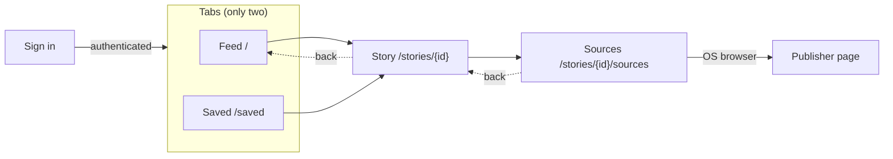
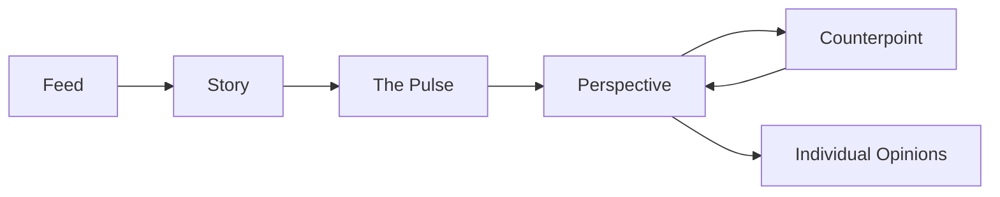
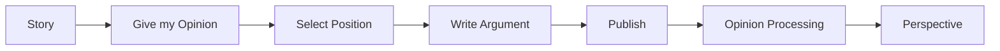
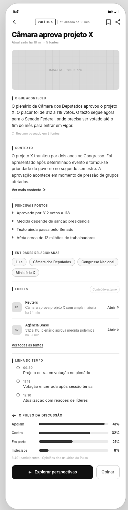
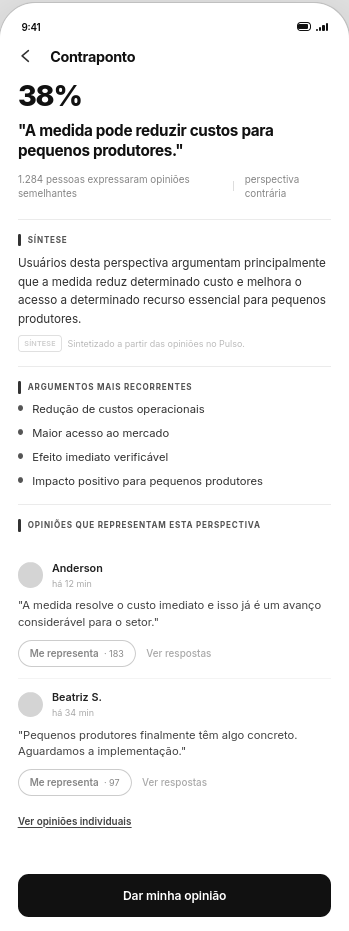
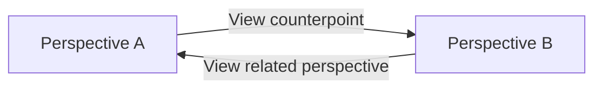
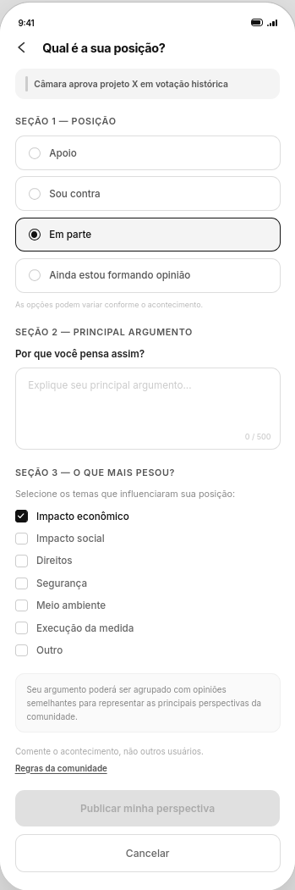
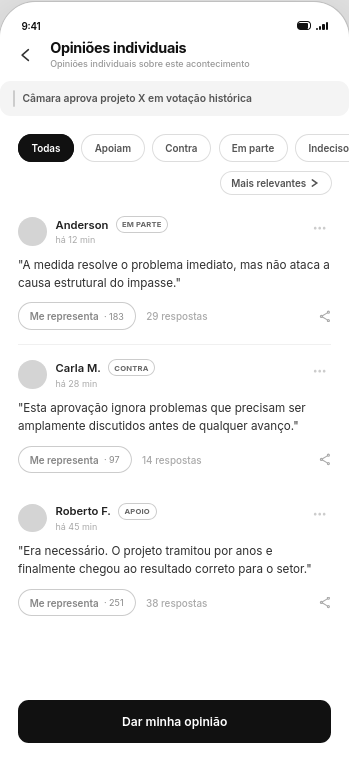
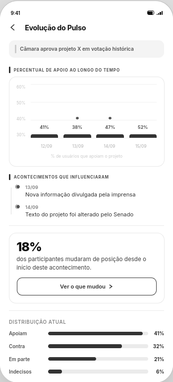
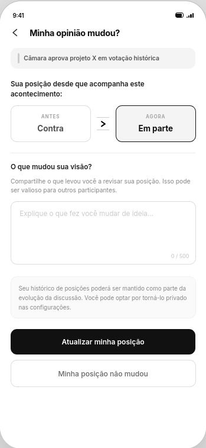

# Pulso UX

This directory documents the main user experience, navigation model and early wireframes for Pulso.

The wireframes are intentionally low-fidelity. Their purpose is to validate product structure, information hierarchy and interaction flows before visual design and implementation.

> Pulso is not designed as a news feed with a traditional comment section.
>
> The experience moves from a multi-source `Story` to a structured view of public discussion through positions, Perspectives, arguments and counterpoints.

---

## Experience model

The primary content unit in Pulso is a `Story`.

A Story represents an event consolidated from one or more source Articles.

The main experience connects two layers:

```text
NEWS
Story
Facts
Context
Sources

        ↓

PUBLIC DISCUSSION
Pulse
Perspectives
Arguments
Counterpoints
Opinions
```

The factual layer comes first.

Community discussion is presented as a separate layer derived from user participation.

This distinction is reflected throughout the interface.

Related architectural decisions:

- [ADR-0003 — Article != Story](../adr/0003-article-not-equal-story.md)
- [ADR-0004 — AI Is Not a Source of Truth](../adr/0004-ai-is-not-a-source.md)
- [ADR-0006 — Opinion != Perspective](../adr/0006-opinion-not-equal-perspective.md)
- [ADR-0007 — Pulse Counts Unique Users](../adr/0007-pulse-counts-unique-users.md)
- [ADR-0008 — Recommendation Personalizes Discovery, Not Truth](../adr/0008-recommend-stories-not-truth.md)
- [Mobile Feed architecture and contract](../architecture/mobile-feed.md)

## Phase 3 support boundary

The wireframes below preserve the broader product vision; they are not a list
of controls to fake in Phase 3. Mobile Feed supports authenticated Feed and
Saved navigation, Story detail, source lists, external publisher navigation,
bookmark/save/remove, loading/empty/error/preparing/updating/unavailable
states, pull-to-refresh and bounded pagination. Feed order is the same factual
order for every account in this phase.

Phase 3 omits Pulse percentages and participant counts, Opinion and
`Represents me` actions, Perspectives/counterpoints, search/Explore/Profile
tabs, sharing, media/images/source logos, audio, event timelines, “key points,”
and invented “why it matters” content. Empty placeholders for these later
features must not ship. The supported detail label is “Context”; synthesis and
publication/first-seen times remain explicitly distinct.

### Phase 3 route and state map

Issue #46 fixed the navigation shell and #48–#51 implemented every route
below; the [Phase 3 acceptance record](../acceptance/phase-3-mobile-feed.md)
states which behavior was verified natively.



| Screen  | States (owning issue)                                                                     |
| ------- | ----------------------------------------------------------------------------------------- |
| Feed    | loading, first-load error, refresh error, empty, page-footer error, restart after cap (#48) |
| Story   | loading, error, current, updating, preparing, unavailable, invalid link (#49; invalid link #46) |
| Sources | loading, error, page, context changed, link unavailable (#49)                             |
| Saved   | loading, empty (also after removing the last row), first-load error, refresh error, page-footer error, expired list, normal, preparing/updating, unavailable tombstone with remove (#50) |
| Bookmark action (Feed, Story, Saved) | save/remove, busy while a write for that Story is pending, not saved/removed with retry, unconfirmed with retry of the same action, unavailable/not found (#50) |
| Any     | signed out → sign-in with validated return; unknown path → not found (#45/#46)            |

A cold deep link to a Story or its sources, including one resumed after
sign-in, has Feed beneath it, so back returns to Feed. Opening a publisher
leaves the in-app route unchanged. See the
[mobile README](../../mobile/README.md#navigation-and-reading-ui) for Android
back, iOS stack behavior and the component conventions.

Source count means distinct publisher identities in the stated scope. It does
not mean independent verification. A one-source Story is valid, and missing
byline, publication time, Topic, Summary or Context has an explicit absence
state rather than fabricated copy.

---

## Main navigation

The central exploration flow is:



Opinion publication forms a parallel flow:



The UI does not require Perspective processing to finish before the user's Opinion is considered published.

---

# Wireframes

## 1. Feed


### Purpose

Allow the user to quickly understand an event while making it clear that the Story:

- represents an event rather than a single publication;
- is supported by multiple sources;
- has an associated structured public discussion;
- can be explored in more detail;
- accepts user participation.

### Information hierarchy

The Story card should prioritize:

1. topic and recency;
2. Story title;
3. what happened;
4. why it matters;
5. source count and access to sources;
6. compact Pulse preview;
7. actions.

The feed is vertically navigated and uses `Story` as its primary unit.

For Phase 3, items 4, 6 and social participation in item 7 are future vision.
Cards show only persisted title, synthesis Summary/Context preview, Topics,
publication timing, source/article counts and bookmark state. No media box,
Pulse preview, recommendation explanation or social action is simulated.

### Main actions

- open Story;
- view sources;
- open the Pulse;
- give an Opinion;
- bookmark;
- share.

Phase 3 implements open Story, view sources and bookmark. Pulse, Opinion and
share controls remain absent until their owning phases.

### Related decisions

- [ADR-0003 — Article != Story](../adr/0003-article-not-equal-story.md)
- [ADR-0008 — Recommendation Personalizes Discovery, Not Truth](../adr/0008-recommend-stories-not-truth.md)

---

## 2. Story Details



### Purpose

Provide deeper understanding of an event before asking the user to engage with community discussion.

### Information hierarchy

The factual layer should appear before the social layer.

Typical content includes:

- title;
- what happened;
- context;
- key points;
- related entities;
- sources;
- Story updates when available;
- entry point to the Pulse.

Phase 3 implements persisted title, synthesis label/time, ordered Summary and
Context, related Topics/Entities, citations and current source publications.
“Key points,” Story updates/timeline and the Pulse entry point shown in the
vision are later-phase controls and do not receive placeholders.

Stale disclosure (#49): an Updating Story keeps its earlier synthesis visible
under a notice naming the synthesis time, with its citations and the current
sources listed separately; a Preparing Story shows no summary but its current
sources. Each summary passage names the publishers it cites, and publications
open on the publisher's own site in the system browser. The mobile
[README](../../mobile/README.md#story-details-and-sources) records the full
hierarchy and source-opening rules.

### UX rules

- factual content comes before community opinion;
- original sources remain accessible;
- `Explore Perspectives` is the primary social exploration action;
- `Give my Opinion` remains easy to access;
- AI-assisted synthesis must not be presented as an original source.

### Related decisions

- [ADR-0003 — Article != Story](../adr/0003-article-not-equal-story.md)
- [ADR-0004 — AI Is Not a Source of Truth](../adr/0004-ai-is-not-a-source.md)

---

## 3. The Pulse


### Purpose

Provide a structured overview of how participating Pulso users are currently positioning themselves around a Story.

This is one of the central screens of the product.

### Main elements

The screen may include:

- position distribution;
- participant count;
- main Perspectives;
- recurring arguments;
- relevant counterpoints;
- major areas of disagreement;
- access to individual Opinions;
- action to publish or update an Opinion.

Example position model:

```text
SUPPORT
OPPOSE
PARTIAL
UNDECIDED
```

### Distribution rule

Percentages represent participating Pulso users who declared a position.

They do not represent the general population.

The interface must communicate this clearly.

Recommended disclosure:

> Opinions from Pulso users. These figures do not constitute a public opinion poll.

### Counting semantics

The Pulse represents:

```text
one user
+
one current active position
+
one Story
```

Replies, Perspective memberships and `Represents me` interactions do not create additional weight in the distribution.

### Related decision

- [ADR-0007 — Pulse Counts Unique Users](../adr/0007-pulse-counts-unique-users.md)

---

## 4. Perspective Details


### Purpose

Allow the user to understand one recurring viewpoint identified inside the discussion.

A Perspective is not a comment.

It is a system-derived representation of semantically related Opinions.

### Main elements

A Perspective may expose:

- title;
- synthesized explanation;
- number of related Opinions;
- recurring arguments;
- representative individual Opinions;
- relevant counterpoint;
- `Represents me` action.

### UX rules

System-generated Perspective synthesis must be clearly identifiable as synthesis.

It must never appear as if a specific user wrote the generated summary.

Individual Opinions remain accessible so users can inspect the contributions behind the Perspective.

### Related decisions

- [ADR-0004 — AI Is Not a Source of Truth](../adr/0004-ai-is-not-a-source.md)
- [ADR-0006 — Opinion != Perspective](../adr/0006-opinion-not-equal-perspective.md)

---

## 5. Counterpoint



### Purpose

Make disagreement and qualification a normal part of navigating the discussion.

A user exploring an argument should be able to access a relevant Perspective that:

- challenges it;
- qualifies it;
- responds to it;
- introduces an important conflicting consideration.

### Navigation

Counterpoint relationships should support navigation in both directions.



The goal is not to artificially force balance between every possible view.

The goal is to prevent relevant disagreement from becoming structurally invisible.

### Related decisions

- [ADR-0006 — Opinion != Perspective](../adr/0006-opinion-not-equal-perspective.md)
- [ADR-0008 — Recommendation Personalizes Discovery, Not Truth](../adr/0008-recommend-stories-not-truth.md)

---

## 6. Give My Opinion



### Purpose

Capture a user's current position and main reasoning in a structured form.

### Main interaction

The user:

1. selects a position;
2. writes their main argument;
3. optionally selects contributing factors when available;
4. publishes the Opinion.

Initial position options are:

```text
SUPPORT
OPPOSE
PARTIAL
UNDECIDED
```

The exact labels and optional factors may vary according to the Story when justified by the product experience.

### User expectation

The interface should explain that the argument may be semantically grouped with similar Opinions.

Suggested explanation:

> Your argument may be grouped with similar opinions to help represent the main Perspectives in the community.

Publishing creates an individual Opinion.

The system may later associate that Opinion with an existing Perspective or derive a new Perspective.

### Related decisions

- [ADR-0005 — Asynchronous Processing with Celery](../adr/0005-asynchronous-processing-with-celery.md)
- [ADR-0006 — Opinion != Perspective](../adr/0006-opinion-not-equal-perspective.md)
- [ADR-0007 — Pulse Counts Unique Users](../adr/0007-pulse-counts-unique-users.md)

---

## 7. Individual Opinions



### Purpose

Preserve access to what individual people actually wrote.

Individual Opinions remain important, but they are a deeper layer than Perspectives in the primary discussion experience.

### Main elements

An Opinion may expose:

- author;
- publication time;
- declared position;
- original argument;
- `Represents me`;
- replies;
- share action.

### Interaction model

Pulso avoids using a generic `Like` as the primary social signal.

`Represents me` has a more specific meaning:

> This argument adequately represents my view on this point.

It measures representativeness, not popularity.

It does not create an additional position in the Pulse.

### Related decisions

- [ADR-0006 — Opinion != Perspective](../adr/0006-opinion-not-equal-perspective.md)
- [ADR-0007 — Pulse Counts Unique Users](../adr/0007-pulse-counts-unique-users.md)

---

# Future / Post-MVP UX

The domain is designed to retain enough information for opinion evolution, but the following screens are not part of the primary MVP UI.

They remain documented as product direction and validation material.

---

## 8. Pulse Evolution



### Purpose

Show how the aggregate discussion changes over time.

Possible information includes:

- historical position distribution;
- meaningful changes in support or opposition;
- percentage of participants who changed position;
- relevant Story updates near significant changes.

Conceptually:

```text
Story evolves
     ↓
new information appears
     ↓
users reconsider positions
     ↓
Pulse distribution changes
```

Correlation between a Story update and a change in the Pulse must not automatically be presented as causation.

### Related decision

- [ADR-0007 — Pulse Counts Unique Users](../adr/0007-pulse-counts-unique-users.md)

---

## 9. Position Change



### Purpose

Allow users to update their current position without necessarily erasing their previous position from historical data.

Example:

```text
Before:
OPPOSE

Now:
PARTIAL

What changed your view?
[________________________]
```

Only the current active position contributes to the current Pulse.

Previous positions may support future personal and collective evolution features.

### Privacy note

Whether a user's position history becomes publicly visible is intentionally undecided and requires a separate privacy/product decision.

### Related decision

- [ADR-0007 — Pulse Counts Unique Users](../adr/0007-pulse-counts-unique-users.md)

---

# Core UX principles

## Facts before discussion

Users should be able to understand the event and inspect its sources before engaging with public opinion.

```text
Story
  ↓
Facts and context
  ↓
Sources
  ↓
Pulse
```

---

## Sources remain accessible

Pulso can summarize and organize information, but the original source material must remain reachable from the Story experience.

See:

- [ADR-0004 — AI Is Not a Source of Truth](../adr/0004-ai-is-not-a-source.md)

---

## Perspectives before comment volume

The social experience is organized around recurring Perspectives rather than an endless chronological comment list.

```text
Story
  ↓
Pulse
  ↓
Perspectives
  ↓
Arguments / Counterpoints
  ↓
Individual Opinions
```

Individual Opinions remain available for transparency and nuance.

---

## Synthesis must be identifiable

The UI must distinguish:

```text
publisher content
user-authored content
system-generated synthesis
```

A Story summary or Perspective summary must not be presented as direct human authorship when it is system-generated.

---

## Representation is not popularity

`Represents me` replaces a generic Like as the primary signal for argument identification.

It means:

```text
this argument represents my view
```

not:

```text
I like this content
```

and not:

```text
add another vote to this position
```

---

## Disagreement remains discoverable

Relevant counterpoints should be part of normal navigation.

The product should help users understand both arguments close to their current view and arguments that meaningfully challenge it.

---

## Personalization does not change the Story

Feed ranking may vary between users.

The underlying Story does not.

```text
User A feed ≠ User B feed

but

Story X for User A = Story X for User B
```

Shared Story facts, sources, Pulse distribution and Perspective state are not rewritten according to user preference.

See:

- [ADR-0008 — Recommendation Personalizes Discovery, Not Truth](../adr/0008-recommend-stories-not-truth.md)

---

# MVP coverage

The primary MVP UX includes:

| Experience | MVP |
| --- | :---: |
| Feed | ✅ |
| Story Details | ✅ |
| Source access | ✅ |
| Pulse distribution | ✅ |
| Perspective exploration | ✅ |
| Counterpoint exploration | ✅ |
| Publish Opinion | ✅ |
| `Represents me` | ✅ |
| Individual Opinions | ✅ |
| Replies | ✅ |
| Bookmark | ✅ |
| Pulse Evolution UI | Later |
| Position History UI | Later |

The data model may support some later experiences before their dedicated UI is implemented.

Phase 3 implements Feed, Story Details, Source access and Bookmark (Saved).
The remaining MVP experiences belong to later phases and have no UI yet.

---

# Wireframe status

These wireframes represent the current product hypothesis.

They are expected to evolve as implementation exposes constraints and usability testing provides evidence.

They should be treated as:

```text
product documentation
+
interaction specification
+
implementation reference
```

and not as final visual design.

Visual language, spacing, typography, component styling and animation remain implementation/design decisions.

---

## Files

```text
docs/ux/
├── README.md
└── wireframes/
    ├── 01-feed.png
    ├── 02-story-details.png
    ├── 03-pulse.png
    ├── 04-perspective.png
    ├── 05-counterpoint.png
    ├── 06-publish-opinion.png
    ├── 07-individual-opinions.png
    ├── 08-pulse-evolution.png
    └── 09-position-change.png
```

---

## Related documentation

- [Architecture](../architecture/)
- [Architecture Decision Records](../adr/)
- [ADR-0003 — Article != Story](../adr/0003-article-not-equal-story.md)
- [ADR-0004 — AI Is Not a Source of Truth](../adr/0004-ai-is-not-a-source.md)
- [ADR-0006 — Opinion != Perspective](../adr/0006-opinion-not-equal-perspective.md)
- [ADR-0007 — Pulse Counts Unique Users](../adr/0007-pulse-counts-unique-users.md)
- [ADR-0008 — Recommendation Personalizes Discovery, Not Truth](../adr/0008-recommend-stories-not-truth.md)
