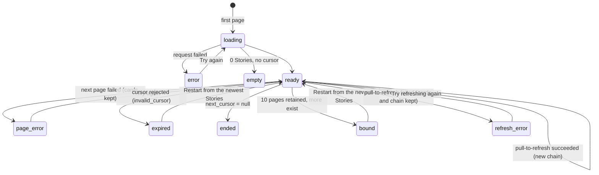
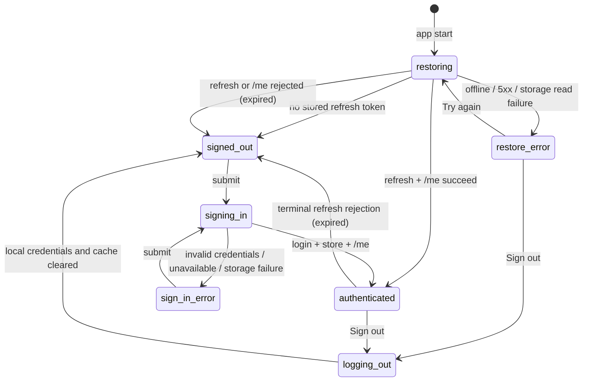

# Mobile bootstrap

> Setting up the whole project (backend + mobile) for the first time? Start
> at [`docs/development.md`](../docs/development.md) instead; come back here
> for mobile-specific depth.

An Expo/TypeScript application shell for Pulso's React Native mobile app. The
reproducible bootstrap now includes the Phase 3 transport, DTO-decoding and
server-state boundary, sign-in and account-isolated sessions, the Feed/Saved
navigation with shared accessible UI primitives, and the paginated Story Feed
read from the real `GET /api/feed` endpoint. There is no fake runtime dataset. See the [root README](../README.md) for the product this
shell will eventually host, and
[docs/architecture/module-boundaries.md](../docs/architecture/module-boundaries.md)
for backend module ownership.

## Runtime and dependencies

Use Node **24.20.0** (`.nvmrc`) and npm (bundled with Node; this project was
set up with npm **11.19.0**). Node 24 is the current LTS line. `nvm` reads
`.nvmrc` directly; other version managers (volta, fnm, mise) either read the
same file or accept it as `.node-version` via a symlink/config of your own.

`package.json` declares dependencies; `package-lock.json` records exact
resolved versions and is the single committed lockfile — install with `npm ci`
(or `npm install`, which also respects the lockfile when it is already
present and consistent) rather than a different package manager, so
everyone resolves the same dependency tree.

From the repository root:

```bash
cd mobile
nvm install    # or: nvm use, if you already have 24.20.0
npm ci
npx expo-doctor
```

`expo-doctor` runs Expo's own project health checks (SDK/peer-dependency
consistency, config validity); it must report no issues on a clean install.

## Starting the app

```bash
npx expo start
```

This starts the Metro bundler and prints a QR code plus keyboard shortcuts.
No paid build service, Expo account or EAS project is required for this —
Expo Go (a free app from the Play Store / App Store) loads the JS bundle
directly over the local network or an emulator/simulator's loopback network.

| Target                       | Command                                   | Requirement                                                      |
| ---------------------------- | ----------------------------------------- | ---------------------------------------------------------------- |
| Android (emulator or device) | `npx expo start --android` (or press `a`) | Android Studio emulator, or the Expo Go app on a physical device |
| iOS simulator                | `npx expo start --ios`                    | macOS with Xcode                                                 |
| Web                          | `npx expo start --web`                    | Nothing extra; runs in a browser                                 |

Signed out, the app renders without a running backend and makes no product
request. Signed in, the Feed calls the configured backend; without one it shows
its "Feed unavailable" state with a retry action. It does not print the
configured origin or use contract fixtures as runtime fallback content. To see
real Stories, run the backend (see [`docs/development.md`](../docs/development.md)),
provision an account, sign in, and let the Story worker publish ready Stories.

See "Quality and testing" below for the full set of checks (lint, format,
typecheck, tests) and how to run them without any interactive prompts.

### A note on `npm audit`

A clean `npm ci` currently reports moderate-severity advisories
(`decode-uri-component`, `uuid`) several layers deep inside Expo's own CLI/
config-plugin toolchain (`@expo/cli` → `@expo/config-plugins` → `xcode`/
`query-string`). These affect local build tooling, not the shipped app
bundle, and `npm audit fix --force`'s suggested fix is to downgrade to a
years-old `expo`/`expo-router` release — a regression, not a fix. Re-check
with `npx expo-doctor` and `npm audit` after any dependency bump rather than
force-applying this.

## API base URL

The backend URL is public client configuration, not a secret: it is read
from `process.env.EXPO_PUBLIC_API_BASE_URL` (`src/config/env.ts`). Expo/
Metro inline every `EXPO_PUBLIC_`-prefixed variable into the JS bundle at
build time — treat any value behind that prefix as visible to anyone who
has the app, the same way a URL baked into a mobile binary always is; never
put a credential behind it.

Copy the example and edit it — no source change is needed to point the app
at a different backend:

```bash
cp mobile/.env.example mobile/.env
```

| Running on                               | `EXPO_PUBLIC_API_BASE_URL`        | Why                                                                                                                                                                                                                                                                                                          |
| ---------------------------------------- | --------------------------------- | ------------------------------------------------------------------------------------------------------------------------------------------------------------------------------------------------------------------------------------------------------------------------------------------------------------ |
| Web (`expo start --web`)                 | `http://localhost:8000` (default) | Browser and backend share the host's network namespace                                                                                                                                                                                                                                                       |
| Android **emulator**                     | `http://10.0.2.2:8000`            | The emulator's own loopback alias for the host machine; `localhost` inside the emulator means the emulator itself, not your machine                                                                                                                                                                          |
| iOS **simulator**                        | `http://localhost:8000`           | The simulator shares the host's network namespace, unlike the Android emulator                                                                                                                                                                                                                               |
| Physical device (either OS), via Expo Go | `http://<host-LAN-IP>:8000`       | The device is a separate machine on the network; it cannot resolve `localhost` as your development machine. The backend's Compose setup only publishes to `127.0.0.1` (backend/README.md) — reconfigure that publish to your LAN interface, or use `expo start --tunnel`, to reach it from a physical device |

If unset, `src/config/env.ts` falls back to `http://localhost:8000` (the web/
default case) so the shell still renders with no `.env` file at all.

## Project structure

```text
src/
  api/                fetch transport, normalized errors, DTO decoders, API helpers and provider
  app/                expo-router file-based routes; only thin screens/layouts here
    _layout.tsx       root layout (QueryClientProvider, SessionProvider, safe area, Stack)
    sign-in.tsx       sign-in / restore-error route; resumes a validated pending route
    +not-found.tsx    recoverable state for unknown paths
    (app)/            protected product routes; rendered only for an identified account
      _layout.tsx     session guard + reading stack (initial route: the tabs)
      (tabs)/         the only two tabs
        _layout.tsx   Feed and Saved
        index.tsx     Feed (#48)
        saved.tsx     Saved (route target for #50)
        __tests__/    route tests — see note below
      stories/[storyId]/
        index.tsx     Story details (#49)
        sources.tsx   Story sources (#49)
  components/         shared reading primitives: text, button, status states, source row, screen
  config/
    env.ts            public, build-time-inlined configuration (API base URL)
  features/           feature screens rendered by the routes (feed, bookmarks, stories)
    feed/             Feed query/chain, Story card, visibility seam (#48)
    stories/          Story detail and source screens, their queries and labels (#49)
  navigation/         tab bar, stack, route parsing/hrefs and the external publisher seam
  server-state/       TanStack Query client, account-scoped keys and retry policy
  session/            credential storage, session controller, provider and session UI
  test-utils/         test-only helpers and wire-shaped builders (outside src/app and __tests__)
  theme/              semantic color, spacing, type and touch-target tokens
assets/               app icon and splash images
```

## Navigation and reading UI

Issue #46 establishes navigation and UI primitives; #48 fills the Feed (see
[Story Feed](#story-feed)) and #49 the Story and source screens (see
[Story details and sources](#story-details-and-sources)). The Saved route is
still a **route target** that states plainly that its content is not available
in this build until #50 replaces its body. No Story, source or bookmark
content is fabricated, and there are no Pulse, Opinion, profile, explore,
search, audio or sharing affordances.

| Path                    | Screen                  | Access                   | Back                                  |
| ----------------------- | ----------------------- | ------------------------ | ------------------------------------- |
| `/sign-in`              | Sign-in / restore error | Signed out               | —                                     |
| `/`                     | Feed tab                | Authenticated            | Leaves the app (Android)              |
| `/saved`                | Saved tab               | Authenticated            | Feed tab (`backBehavior: firstRoute`) |
| `/stories/{id}`         | Story                   | Authenticated; resumable | Previous screen, else Feed            |
| `/stories/{id}/sources` | Story sources           | Authenticated; resumable | Story if opened from it, else Feed    |
| anything else           | Not found               | Anyone                   | “Go to Feed” action                   |

- **Protection.** All reading routes live in `(app)/`, whose layout renders
  them only for an authenticated session (#45). A signed-out deep link is
  remembered only if it matches `/stories/{id}` or `/stories/{id}/sources`;
  external, encoded or malformed targets are dropped and sign-in lands on Feed.
- **Cold back.** `(app)/_layout.tsx` sets `initialRouteName: "(tabs)"` and
  sign-in resumes with `withAnchor`, so a Story opened from a cold deep link or
  after sign-in always has Feed beneath it.
- **Android back** is the stack's `goBack`: Story/source screens pop, Saved
  returns to Feed, and Feed leaves the app. **iOS** uses the native stack
  header back button and edge-swipe gesture on Story/source screens; the tab
  bar has no back history. Both are covered by `src/navigation/__tests__/`.
- **Invalid IDs** (`/stories/abc`, zero, beyond `bigint`) render “This Story
  link is not valid.” with a “Go to Feed” action instead of throwing or
  redirecting.
- **Publisher pages** open through `openPublisherUrl`
  (`src/navigation/external.ts`), which hands a safe HTTP(S) URL to the
  operating system. The in-app route stack is not changed, so returning to
  Pulso resumes the same screen. No WebView, proxy or Authorization header is
  involved (see [Opening a publication](#opening-a-publication)).
- **Sign out** is in the header of both tabs, next to the signed-in username.

### Component conventions

Screens compose `src/components/` and read colors from `useTheme()` in
`src/theme/`; there is no UI framework. Primitives express reading states and
contain no domain rules (for example, `SourceRow` receives already formatted
strings; #49 decides “Published” vs “First seen”).

- **Text** (`AppText`) always scales with the platform text size and never
  truncates; titles and headings are announced as headers. Publication strings
  are passed as children, so they render as plain text.
- **Buttons** are at least 44×44, wrap their label at large text, expose
  disabled/busy states, and draw a visible focus ring for keyboard/web focus.
  Variants differ by fill, outline or underline, never by color alone.
- **Status**: `LoadingState` (labelled progress), `ErrorState` (alert text plus
  retry/exit actions), `EmptyState` (success with nothing to show) and
  `StatusLabel` (a worded status such as “Updating”).
- **Layout**: `Screen` applies safe-area edges, scrolls so every control stays
  reachable with large text on small screens, and wraps its header action below
  the title. The tab bar grows with the text size instead of clipping labels,
  and the selected tab shows an indicator bar in addition to its color.
- **Theme**: light and dark palettes follow the system setting; every text pair
  meets 4.5:1 and borders/focus meet 3:1 (asserted in
  `src/theme/__tests__/tokens.test.ts`). Stack transitions are disabled when
  the platform's reduce-motion setting is on.
- **Sign-in keyboard**: the form scrolls above the keyboard, “next” on the
  username moves to the password, and “go” on the password submits.

Manual screen-reader and large-text checks on native targets are recorded in
#52.

## Story Feed

The Feed tab (`src/features/feed/`) lists ready Stories from `GET /api/feed`
for the signed-in account. One Story is one card, however many Articles
support it.

### Card hierarchy

Only persisted factual fields are shown, as plain text, in this order:

1. Topics (labels, omitted when the Story has none);
2. the Story title;
3. the first Summary element and, under a "Context" label, the first Context
   element — each omitted when absent, never replaced with filler;
4. "Latest publication …" from the Story's publication window, or
   "Publication time not available" (Story creation time is never shown as a
   publication time);
5. the published generation's counts, "1 source · 1 article" /
   "2 sources · 3 articles" — distinct publishers, never called verified,
   independent or confirmed;
6. worded labels for "Saved" (the viewer's bookmark) and a non-current state.

Pressing the card opens `/stories/{id}`; "View sources" opens
`/stories/{id}/sources`. There is no media box, image placeholder, Pulse
preview, like count, recommendation reason, "why it matters" or timeline.

### Pagination, refresh and the page bound



- **One cursor chain.** The Feed is one account-scoped TanStack infinite query
  (`queryKeys.feed(accountId)`); pages follow `next_cursor` exactly and are
  never re-sorted on the device. Cards are keyed by Story ID, and a Story ID
  repeated by a later or retried page keeps its first slot.
- **Load more** runs from the list's end-reached event. A synchronous guard
  plus `fetchNextPage({ cancelRefetch: false })` turn repeated or simultaneous
  events into one request. A failed page shows a footer retry and does not
  re-fire on further scrolling.
- **Pull-to-refresh** fetches a new first page. Only when it succeeds are any
  in-flight old-chain page requests cancelled (TanStack reverts them, so they
  can never append) and the cache replaced by that single page. A failed
  refresh keeps every card and the old chain, and shows a targeted retry.
- **Automatic refetch** triggers (mount, focus, reconnect) are off: a new chain
  would reorder cards beneath the reader. A refetch that still happens (for
  example an invalidation) re-walks the chain coherently, keeps the cards on
  failure and is not treated as an explicit refresh.
- **Page bound.** At most ten pages are retained (`MAX_FEED_PAGES`). At the
  bound the footer offers "Restart from the newest Stories", which is an
  explicit refresh; pages are never dropped from the middle of the chain.
- **Position.** The Feed stays mounted beneath Story/source screens, so back
  navigation returns to the same list and scroll offset without refetching.

**Ordering and refresh limitations.** Order is the server's immutable
`story_created_desc_v1` (Story creation, newest first), the same for every
account; it is not publication recency or relevance. A cursor chain does not
show Stories created after its first page until the reader refreshes, and a
cursor expires after 24 hours; the next page then reports that the Feed
expired and offers the same restart instead of a retry that cannot succeed. Cards are not updated in place between refreshes.

### Visibility seam

`FeedScreen` accepts an optional, stable `onVisibilityChange` callback. When
present, cell layouts and the scroll viewport feed `FeedVisibilityTracker`
(`visibility.ts`), which reports `{storyId, position, share}` for laid-out
cards: `position` is the zero-based absolute rendered position, and `share`
is visible height divided by the smaller of card and viewport height (so a
card taller than the screen counts as fully visible when it fills it).
Fetching, page receipt, mounting and rendering report nothing, and #48 sends no
FeedImpression; qualification and delivery belong to #51.

## Story details and sources

`/stories/{id}` reads `GET /api/stories/{id}` and `/stories/{id}/sources`
reads the same detail (for its synthesis context and citations) plus
`GET /api/stories/{id}/sources`. Both are account-scoped queries; the screens
own no synthesis logic and render only returned fields, as plain text.

### Factual hierarchy

1. A state notice when not CURRENT (below);
2. Topics as labels, then the Story title;
3. "Summary generated by Pulso from the cited publications · {time}" — the
   synthesis is labelled as system-generated with its generation time, never
   as a publisher or a reporting time;
4. the title's citations and the Story's latest publication time, if any;
5. **Summary** (every SUMMARY element in order, or "This Story has no summary
   text.") and **Context** (CONTEXT elements; the section is omitted when
   there are none), each element followed by its citations;
6. **Mentioned**: Entities as "Organization: …" labels (omitted when empty);
7. **Sources**: "This summary cites N articles from M sources" (the
   generation's counts), "Current sources: …" (current membership, stated
   separately), the link note, and "View current sources".

There is no timeline, key-points section, "why it matters", media, Pulse,
Opinion or recommendation explanation. Topics and Entities are labels, not
positions or Perspectives.

| `content_state` / status | Shown                                                                                                                                                                                                                             |
| ------------------------ | --------------------------------------------------------------------------------------------------------------------------------------------------------------------------------------------------------------------------------- |
| CURRENT                  | The hierarchy above                                                                                                                                                                                                               |
| UPDATING                 | "Updating" label and a notice that newer reporting is being processed and the summary was generated at `{synthesized_at}` from the publications it cites; the earlier synthesis, its citations and current sources stay available |
| PREPARING                | "Preparing" label and notice; no summary, synthesis time or generation count; current sources available (the source list is requested without a synthesis context)                                                                |
| 404 `story_not_found`    | "Story not found" with Go back / Go to Feed                                                                                                                                                                                       |
| 410 `story_unavailable`  | "Story unavailable" with Go back / Go to Feed; no obsolete facts                                                                                                                                                                  |
| Other failure            | "Story unavailable right now" with Try again / Go back                                                                                                                                                                            |

### Provenance

Every TITLE, SUMMARY and CONTEXT element shows "Cited: {publishers}" at once
and expands to its cited publications. Citations come from the detail's
`citations` map, so they resolve without loading any source page, including
Articles beyond the first source page and Articles that have left the Story;
those are marked "No longer among this Story's current sources". A
publication row shows the publisher, the Article title as source text, "By
{byline}" only when present, and "Published {time}" — or, without a
publication time, "First seen by Pulso {time} · publication time not
provided".

### Source list

The source screen lists current-member publications page by page in server
order (`Article.id` ascending), one row per Article, so several Articles from
the same publisher stay separate rows. Prior-generation citations that are not
current members appear above the list under "Cited earlier, no longer
current". A `null` `canonical_url` keeps the row attributed with "Link
unavailable".

A 409 `source_context_changed` on a later page discards every loaded page and
restarts from the first page once, with a notice that the list was reloaded.
If the context changes again before the reader acts, automatic restarts stop
and the footer offers "Reload sources"; pages from different contexts are
never merged and there is no retry loop. Other page failures keep the loaded
rows with a footer retry.

### Opening a publication

"Open publication (external site)" calls `openPublisherUrl`, which re-applies
the decoder's rule (`src/api/urlSafety.ts`: absolute HTTP(S) with a host, no
credentials, whitespace or control characters, no literal
loopback/private/link-local/unspecified or IPv4-mapped address) and hands only
the URL string to the operating system browser. There is no WebView, backend
proxy, header, token or image fetch. The result category is shown instead of
logged: a rejected link says it cannot be opened safely, and a failed hand-off
says so with the same button as retry. Links open the publication's current
address; Pulso keeps no copy of earlier versions. The route stack is
untouched, so returning resumes the same Story or source list with its loaded
pages.

### Manual checks on native targets

Automated tests replace `Linking.openURL`. On each available Android emulator/
device and iOS simulator, with the backend running and a ready Story:

1. Open a Story from the Feed, expand a citation and press "Open publication
   (external site)": the system browser (not an in-app view) shows the
   publisher page.
2. Return with Android back or the iOS app switcher: the same Story screen and
   expanded citation are shown; back then returns to the Feed at its position.
3. Open "View current sources", load a second page, open a publication and
   return: both pages are still listed.
4. With no browser able to handle the link (e.g. an emulator without one), the
   row shows "The publication could not be opened on this device."

## API and server-state boundary

`src/api/transport.ts` is the only general HTTP transport. It uses native
`fetch`, accepts approved relative `/api/*` paths, joins them to a validated
origin, applies a 15-second timeout, propagates caller cancellation, handles
empty 204/205 responses and normalizes timeout/network/abort/HTTP/JSON/DTO
failures as `ApiError`. It performs no generic retry. Absolute/foreign paths
are rejected before an Authorization header can reach `fetch`.

Credential hooks expose only access-token lookup, session epoch and one 401
refresh/replay operation, implemented by the session controller (below).
Tokens do not enter URLs, query keys, public Expo variables, diagnostics or
persistent query storage. An authenticated response that returns after its
captured session epoch ended fails as `stale_session` and never reaches a
decoder or cache.

`src/api/decoders.ts` validates the repository contracts in
`../docs/contracts/mobile-feed/`; BigAutoField IDs remain decimal strings and
timestamps/nulls remain their wire values. Invalid server data becomes a
controlled `malformed_dto` failure—there is no fixture or invented-data
fallback. Source navigation additionally rejects non-HTTP(S), credentialed and
literal local/private destinations; a `null` `canonical_url` (a link the server
withheld as unsafe) decodes as an attributable publication without a link.

`@tanstack/react-query` 5.103.1 is the sole server-state cache. Its package
metadata supports React 18/19, including this checkout's React 19.2.3. Every
viewer-decorated query key starts with the decimal-string account ID; identity
change cancels/removes that account prefix. Read queries own at most two
retries for network/timeout, 429 or 5xx failures. Transport owns none; auth owns
one replay; the future FeedImpression queue owns delivery retry. Mutations do
not retry by default, while bookmark features may opt into the exported
single retry for idempotent writes. Feed data is bounded to ten in-memory
pages and no query cache is persisted.

## Session and sign-in

Accounts are provisioned locally (there is no registration); see
[backend local account provisioning](../backend/README.md#local-account-provisioning).
The server contract is [ADR-0009](../docs/adr/0009-jwt-mobile-authentication.md):
15-minute access tokens, 14-day non-rotating refresh tokens, blacklisting
logout.

`src/session/controller.ts` owns the whole lifecycle; React reads it through
`SessionProvider`/`useSession` (no Redux/Zustand). `src/session/runtime.ts`
wires one transport to one controller, so product and auth requests share the
same access token, epoch and refresh.



| Credential    | Native (iOS/Android)                             | Web          |
| ------------- | ------------------------------------------------ | ------------ |
| Refresh token | `expo-secure-store` (`pulso.session.refresh.v1`) | Memory only  |
| Access token  | Memory only                                      | Memory only  |
| Password      | Never stored; cleared from the form on submit    | Never stored |

There is no `AsyncStorage`/`localStorage` fallback: a SecureStore read, write
or delete failure becomes an explicit, retryable state (`credential_*_failed`)
instead of an insecure fallback or an endless spinner. **Web limitation:** a
browser reload loses the session and requires sign-in.

- **Cold restore** reads the refresh token, refreshes, then calls `/me` before
  any protected screen renders. Offline or 5xx keeps the stored token and shows
  a retryable restore screen; a 400/401 refresh (invalid, expired or
  blacklisted) clears it and returns to sign-in.
- **Refresh** is single-flight per session epoch: parallel 401s share one
  `/api/auth/refresh`, each request replays at most once, and a 401 for a token
  that was already replaced reuses the newer token. A repeated 401 after the
  replay is returned to the caller; query retry ignores 401, so there is no
  login loop.
- **Epochs.** Every sign-in, restore, expiry and logout starts a new epoch,
  clears the in-memory tokens and cancels/removes the previous account's query
  prefix before the next account's screens render. Late login, refresh or
  query completions from an older epoch are discarded (`stale_session`); tokens
  from a login superseded mid-flight are revoked best-effort and never stored.
  `subscribeSessionChanges` publishes `{epoch, accountId}` (never credentials)
  for account-scoped delivery such as the future exposure queue.
- **Logout** attempts `/api/auth/logout` and always clears the stored refresh
  token, memory tokens and account cache, even if the network call fails. The
  sign-in screen then states that access issued earlier can stay valid for up
  to 15 minutes, and — if the server could not confirm revocation — that the
  removed refresh credential stays valid until its own expiry. A failed
  SecureStore delete is reported with a retry action.
- **Return routes.** A signed-out deep link is remembered only if it matches a
  validated in-app pattern (`/stories/{id}` or `/stories/{id}/sources`); a
  deliberate logout never carries its screen over to the next account.

Session diagnostics are limited to the state/error codes above; usernames,
passwords and tokens are never logged.

`src/app` is intentionally the only place route files live, matching
`expo-router`'s file-based routing convention: adding a new screen means
adding a file here, ready for future navigation without restructuring.
`expo-router` scans every file under `src/app` as a candidate route except
inside a `__tests__` directory (or files starting with `.`) — a `*.test.tsx`
placed directly in `src/app` becomes a real, navigable, exported route
(e.g. `index.test.tsx` shipping as `/index.test`), not just a Jest file.
Discovered via `npx expo export --platform web` during issue #10's
fresh-checkout walkthrough; keep any future `src/app/**` test alongside
its screen but inside a `__tests__` folder, never a bare sibling file.
Metro's default exclusion list blocks `__tests__` directories, and
`src/navigation/__tests__/route-files.test.ts` fails if a test or non-route
helper appears elsewhere in `src/app`. Verify discovery with:

```bash
npx expo export --platform web --output-dir /tmp/pulso-web
# "Static routes" must list only /, /saved, /sign-in, /stories/[storyId],
# /stories/[storyId]/sources, +not-found and _sitemap (plus their group aliases).
```

## Quality and testing

`npm ci` installs every tool below; none require a running backend, an
emulator/simulator, or network access beyond the initial install.

```bash
npm run lint          # ESLint (eslint-config-expo)
npm run format:check  # Prettier, check only
npm run typecheck     # tsc --noEmit
npm run test:ci       # Jest, non-interactive
```

All four exit non-zero on failure and print machine-readable output;
they are this issue's validation gate and the commands CI should reuse.
`npm run format` (no `:check`) applies Prettier's fixes in place.

### Linting and formatting

ESLint uses Expo's own flat config (`eslint-config-expo`), with
`eslint-config-prettier` layered on top so ESLint never fights Prettier
over formatting — ESLint owns code-quality rules, Prettier owns layout.
`.prettierrc.json` only overrides `printWidth` (100, matching the
backend's Ruff `line-length`); everything else is Prettier's default.

### Tests

Jest uses the `jest-expo` preset (jsdom-free, React Native-aware
transforms) with `@testing-library/react-native` for component rendering.
All tests run fully offline. In addition to shell/environment coverage, API
tests exercise origin/path safety, timeout/cancellation, empty responses,
normalized failures and 401 replay; decoder tests consume the repository JSON
contracts; server-state tests prove account isolation, retry ownership and the
page cap. Session tests drive the real transport against a scripted fake of
the auth endpoints (restore, parallel 401, repeated 401, terminal and transient
refresh failures, logout failures, storage failures and account-switch races),
and render the sign-in screen and protected routing with
`expo-router/testing-library`. Navigation tests mount the real route modules
(`src/test-utils/readingApp.tsx`) to cover the two tabs, return routes, cold
and Android back, invalid IDs, not-found and publisher hand-off; component and
theme tests cover roles, states, touch targets, focus, wrapping and contrast.

Story tests (`src/features/stories/__tests__/`) cover CURRENT, UPDATING,
PREPARING, 404/410 and retry, synthesis labels and times, element citations
without paging, prior-generation citations, repeated publishers, withheld
links, optional byline/date/Context/Entities, source pagination, one 409
restart and the explicit reload after a second change, browser failure, the
URL-only hand-off and context preservation on return. Feed tests
(`src/features/feed/__tests__/`) drive the real route tree against
a scripted `/api/feed` to cover card content and missing fields, first
load/error/empty, next page/end, repeated end-reached, page and refresh
failures, stale page responses after refresh, duplicate IDs, the page bound
and restart, navigation IDs, position on return, account isolation, and that
no image or FeedImpression request exists; hook tests cover simultaneous
load-more calls and refresh generations.

The original bootstrap tests still verify:

- `src/app/(app)/(tabs)/__tests__/index.test.tsx` renders the signed-in Feed
  from the feed endpoint and its sign-out action.
  `@testing-library/react-native`'s `render` is asynchronous (`await
render(...)`) as of v14; a call site that forgets `await` fails with a
  clear "`render` function has not been called" error rather than a silent
  false pass, which is exactly how this was caught while writing the test.
- `src/config/env.test.ts` re-evaluates `src/config/env.ts` with
  `EXPO_PUBLIC_API_BASE_URL` unset and set (via `jest.resetModules()` +
  `require`, since the module reads `process.env` once at import time),
  asserting both the documented `localhost:8000` fallback and that an
  explicit value is honored — the "public-configuration validation
  coverage" scope item.

`npm test` runs Jest in local/watch mode (interactive); `npm run test:ci`
(`jest --ci --watchAll=false --passWithNoTests`) is the non-interactive
form for scripts and CI — it terminates on its own regardless of terminal
type, per this issue's "CI test mode terminates without watch mode or
interactive input" acceptance criterion.

### Proving failures are caught

Not part of the committed suite — this is what was actually run once to
confirm the tooling fails loudly, the same way `not_shared/validation/`
records for the backend:

```bash
# A deliberate type error:
echo 'const n: number = "not a number"; export default n;' > src/config/_probe.ts
npm run typecheck   # exits 2
rm src/config/_probe.ts

# A deliberate failing assertion:
printf 'test("x", () => { expect(true).toBe(false); });' > src/config/_probe.test.ts
npx jest _probe     # exits 1
rm src/config/_probe.test.ts
```
